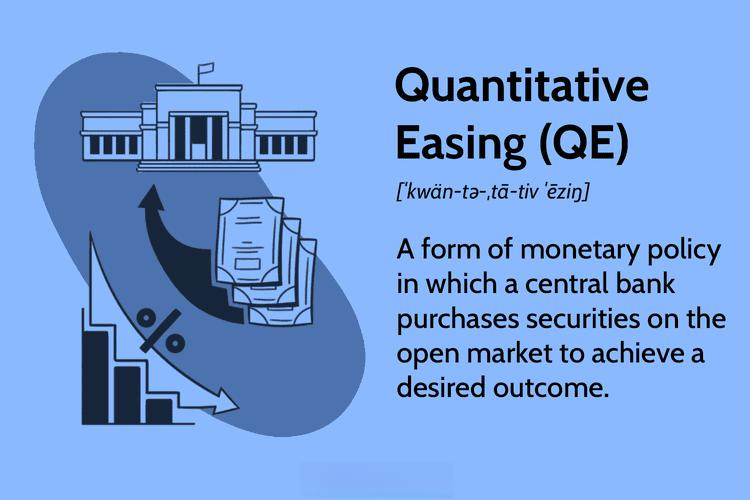

The complex landscape of modern finance is significantly shaped by the interplay of hyperinflation, monetary policy, quantitative easing (QE), and algorithmic trading. These elements collectively contribute to the dynamics of global markets and economic strategies, especially during periods of uncertainty. Hyperinflation represents an extreme condition of economic instability, marked by an exponential increase in prices and a subsequent loss of currency value, while monetary policy, within the arsenal of central banks, strives to maintain economic equilibrium and prevent such crises. 

Monetary policy is primarily executed through interest rate adjustments and regulatory measures that control the money supply. Notably, quantitative easing emerges as an innovative strategy within this sphere, employed by central banks to stimulate economic growth by purchasing government securities. This practice aims to augment liquidity and promote lending during economic downturns without triggering uncontrolled inflationary trends. Although QE has been acknowledged for its stabilizing effects during the Great Recession, concerns about its potential to induce hyperinflation persist among critics.

Algorithmic trading, another cornerstone of modern finance, leverages advanced computational algorithms to execute trades at unprecedented speeds, capitalizing on market inefficiencies. This technological advancement poses a new dimension to market operations, influencing volatility and liquidity. The rapid implementation of algorithmic decisions raises questions about its role during financial instability and whether it might exacerbate conditions like hyperinflation.

Understanding the interplay between these financial mechanisms is crucial for investors, policymakers, and stakeholders aiming to navigate the intricate web of today's economy. This article will explore the interconnectedness of hyperinflation, monetary policy, QE, and algorithmic trading, shedding light on how these forces shape economic outcomes. The exploration of these subjects will provide insights into maintaining stability and fostering resilience in volatile financial landscapes.

## Table of Contents

## Understanding Hyperinflation

Hyperinflation represents an extreme form of inflation where the price levels of goods and services rise uncontrollably, often by more than 50% per month. This rare but devastating economic phenomenon can lead to the erasure of a currency's worth, triggering severe economic and social consequences. 

Historically, some of the most severe instances of hyperinflation have occurred in Weimar Germany, Zimbabwe, and Argentina. The hyperinflation in Weimar Germany, which peaked in the early 1920s, saw prices doubling approximately every few days. This was largely triggered by the country's reparations payments following World War I, coupled with an inability to align government revenue with spending, leading to excessive money printing to cover deficits. In Zimbabwe, hyperinflation became pronounced in the late 2000s due to land reform policies, economic mismanagement, and political instability, ultimately eroding the currency's value to near nonexistence. Argentina's episodes of hyperinflation, notably during the late 1980s, were fueled by chronic fiscal deficits, foreign debt burdens, and a lack of credible monetary anchors. 

Hyperinflation typically results from a collapse of confidence in the economy and its currency. This loss of trust can stem from several factors, including aggressive monetary expansion, fiscal irresponsibility, external debt pressures, and political instability. As confidence wanes, the demand for the local currency diminishes, leading to its rapid devaluation. Without intervention, a vicious cycle ensues: as prices rise, money loses its purchasing power, prompting further reductions in confidence and leading to even more currency issuance to meet escalating costs. 

Inflation and hyperinflation are distinct in scale and impact. Inflation refers to a gradual increase in prices, usually linked to economic growth and monetary policy adjustments. In contrast, hyperinflation represents an extraordinary breakdown in financial stability and economic function. For example, while an annual inflation rate might typically linger around 2-3% in stable economies, hyperinflation can see monthly inflation rates exceeding 50%, leading to the rapid erosion of savings and wealth.

Understanding the journey to hyperinflation involves recognizing warning signs: persistent fiscal deficits, unchecked currency creation, and the erosion of institutional trust. It's crucial to monitor these indicators to prevent the economic turmoil that hyperinflation can unleash, which historically has resulted in widespread poverty, loss of savings, and economic stagnation.

## Monetary Policy's Role in Preventing Hyperinflation

Monetary policy serves as a pivotal mechanism through which governments regulate economic activity and stabilize price levels to prevent hyperinflation. At the heart of monetary policy are central banks, such as the Federal Reserve in the United States, which leverage a variety of tools to manage the money supply and ensure economic stability. Two primary instruments include [interest rate](/wiki/interest-rate-trading-strategies) adjustments and reserve requirements.

Interest rate adjustments involve manipulating the cost of borrowing money. By raising interest rates, central banks can dampen economic activity by making loans more expensive, thereby reducing consumption and investment. Conversely, lowering interest rates encourages borrowing, stimulates spending, and can prevent deflation. Effective management of interest rates helps to maintain inflation within a targeted range, thereby preventing the extreme price surges characteristic of hyperinflation.

Reserve requirements dictate the minimum amount of reserves a bank must hold as a proportion of customer deposits. By adjusting these requirements, central banks can control the amount of money banks can lend. Lowering reserve requirements releases more money into the economy, while increasing them reduces the money supply, combatting excessive inflation.

During the Great Recession, traditional monetary policies proved insufficient, necessitating the adoption of unconventional measures such as quantitative easing (QE). QE involves large-scale purchases of government securities or other financial assets by central banks to inject [liquidity](/wiki/liquidity-risk-premium) directly into the economy. This strategy lowers long-term interest rates, encourages lending, and boosts investment and consumption without triggering hyperinflation.

While concerns persist that increasing the money supply through QE might induce hyperinflation, this has not occurred in developed economies. This is partly because QE has been carefully calibrated and transparently communicated to manage expectations and maintain trust in the currency. Additionally, the slack in economic capacity during periods of recession absorbs the surfeit of money, tempering inflationary pressures.

The effective execution of monetary policy, therefore, requires a delicate balance. Central banks must judiciously assess economic conditions and employ their tools to mitigate inflation without stifling growth. By maintaining this equilibrium, monetary policy plays a crucial role in safeguarding economic stability and preventing the catastrophic consequences of hyperinflation. Understanding this balance is essential for policy makers, investors, and stakeholders aiming to navigate the complexities of modern economics.

## Quantitative Easing: A Double-Edged Sword

Quantitative easing (QE) is an unconventional monetary policy employed by central banks to stimulate the national economy when standard monetary policies prove ineffective. Typically, this involves central banks purchasing longer-term securities from the open market to increase the money supply, thereby lowering interest rates and encouraging increased lending and investment. The core objective of QE is to invigorate economic activity during times of recession or when inflation is persistently low.

Historically, QE has been used during severe financial crises, most notably during the 2008 financial crisis and the subsequent Great Recession. Central banks, such as the Federal Reserve in the United States, the European Central Bank, and the Bank of Japan, embarked on large-scale asset purchase programs as a means to counteract the downturns. These programs generally targeted government bonds and mortgage-backed securities, increasing their prices and effectively reducing yields. 

Critics of QE often argue that creating money on a substantial scale could ultimately lead to hyperinflation by significantly increasing the amount of money circulating in the economy. However, this outcome has not been universally observed, particularly in developed economies that have implemented QE measures. The absence of hyperinflation can be attributed to several factors, including the liquidity trap, where despite the increase in funds, the economy does not fully respond with commensurate increases in spending or lending. This behavior was evident in the aftermath of the financial crisis when banks and consumers remained cautious despite the influx of cash.

The mechanics of QE reveal further insight into its effects. By purchasing securities, central banks inject liquidity directly into the banking system, expanding banks' reserves. These increased reserves aim to lower the interest rates for loans, making borrowing cheaper for businesses and individuals, which theoretically should fuel consumption and investment. However, simply increasing bank reserves does not necessarily translate to more lending if banks are unwilling to lend or if consumers are unwilling to borrow due to prevailing economic uncertainties.

Moreover, QE has sometimes been described as a double-edged sword. While it has successfully prevented deflationary spirals and supported economic recovery in times of crisis, there are potential risks involved. Long-term reliance on QE could distort financial markets by inflating asset prices, potentially leading to financial bubbles. Furthermore, unwinding such massive stimulus measures without disrupting financial markets remains a pertinent challenge for policymakers.

In summary, quantitative easing has played a crucial role in stabilizing economies during periods of significant distress and low inflation. Although concerns about hyperinflation exist, they have not materialized in most cases due to complex interactions within the economy, including factors like liquidity traps and cautious financial behavior. As economies gradually recover, central banks continuously evaluate the timing and methods for withdrawing QE measures to prevent adverse effects on the broader financial system.

## The Role of Algorithmic Trading in Today's Economy

Algorithmic trading uses sophisticated computer programs to execute trades based on predefined instructions, achieving high speeds and precision that surpass human capabilities. These algorithms can quickly evaluate numerous variables, responding to market conditions in milliseconds, thereby capitalizing on fleeting opportunities. The primary advantage of [algorithmic trading](/wiki/algorithmic-trading) lies in its ability to exploit market inefficiencies more rapidly than traditional traders, enabling participants to benefit from small price discrepancies across various markets.

Over the past few decades, algorithmic trading has gained traction, becoming a dominant force in global financial markets. This rise can largely be attributed to advancements in technology, the availability of vast amounts of market data, and the increasing complexity of financial instruments. The impact of algorithmic trading is significant, particularly regarding market liquidity and [volatility](/wiki/volatility-trading-strategies). By continuously adjusting positions, algorithmic traders can enhance liquidity, thus narrowing bid-ask spreads and reducing transaction costs for all market participants. However, during times of economic uncertainty, these systems might contribute to erratic price movements, amplifying volatility.

This high-speed trading mechanism is not without risks, especially during periods of economic instability such as hyperinflation. In such scenarios, the automated nature of algorithmic trading could exacerbate financial instability. The rapid execution of trades may lead to flash crashes—sudden, deep, and often quickly recovered market declines—triggered by a cascade of algorithmic transactions. Indeed, understanding these potential risks is vital as markets become more dependent on technology. 

The reliance on algorithms also raises concerns about systemic risk. The interconnectivity of algorithmic systems means that failures can propagate through the financial network, causing widespread disruptions. Risk management protocols and regulatory oversight are essential to mitigate such impacts, ensuring that the integration of technology continues to support rather than destabilize financial markets.

Thus, algorithmic trading, despite its advantages, introduces complexities into the trading environment. It is crucial for market participants and regulators to understand the influence of technology on trading practices. By doing so, they can navigate contemporary financial markets more effectively, balancing the benefits of enhanced efficiency and liquidity with the challenges of heightened volatility and systemic risk. This understanding is essential for maintaining market stability and fostering resilience in the face of unpredictable economic conditions.

## Conclusion

The intricate relationship between hyperinflation, monetary policy, quantitative easing, and algorithmic trading highlights the complexity inherent in modern financial systems. Each component, while functioning independently, interacts in ways that significantly influence global economic stability and investor confidence. For instance, the fear of hyperinflation can dictate monetary policy decisions, which in turn may lead to the implementation of quantitative easing to counteract deflationary pressures. This intertwining often necessitates a careful balance to avert economic instability.

Participants in the financial landscape, from individual investors to policymakers, must maintain heightened awareness of these dynamics. Economic policy decisions can have immediate and far-reaching impacts, altering interest rates or the availability of capital, which algorithmic trading systems may rapidly exploit. Understanding these interactions is essential for navigating the unpredictable terrain of financial markets and preventing economic crises.

Dissecting these elements provides crucial insights into preparing for potential challenges. For example, awareness of how quantitative easing can both stabilize and destabilize an economy, depending on how it is implemented and perceived, can guide more informed decision-making. Similarly, understanding how algorithmic trading can affect market volatility can aid in crafting strategies to mitigate such impacts during periods of economic stress.

As the financial world continues to evolve with technological advancements and globalization, grasping the intricacies of these concepts remains critical to fostering economic resilience and growth. This evolving understanding not only aids in crafting robust economic policies but also empowers investors to make strategic decisions. The intricate balancing act presented by these financial components will likely remain a cornerstone of new economic strategies and theories in the years to come.

## References & Further Reading

[1]: Bernanke, B. S. (2020). ["The New Tools of Monetary Policy."](https://www.aeaweb.org/articles?id=10.1257/aer.110.4.943) American Economic Review, 110(4), 943-983.

[2]: ["The Lords of Finance: The Bankers Who Broke the World"](https://www.amazon.com/Lords-Finance-Bankers-Broke-World/dp/0143116800) by Liaquat Ahamed

[3]: Eggertsson, G. B., & Woodford, M. (2003). ["The Zero Bound on Interest Rates and Optimal Monetary Policy."](https://www.jstor.org/stable/1209148) Brookings Papers on Economic Activity, 2003(1), 139-211.

[4]: Hanke, S. H., & Krus, N. (2013). ["World Hyperinflations."](https://www.cato.org/working-paper/world-hyperinflations) Cato Working Paper.

[5]: ["Flash Boys: A Wall Street Revolt"](https://en.wikipedia.org/wiki/Flash_Boys) by Michael Lewis