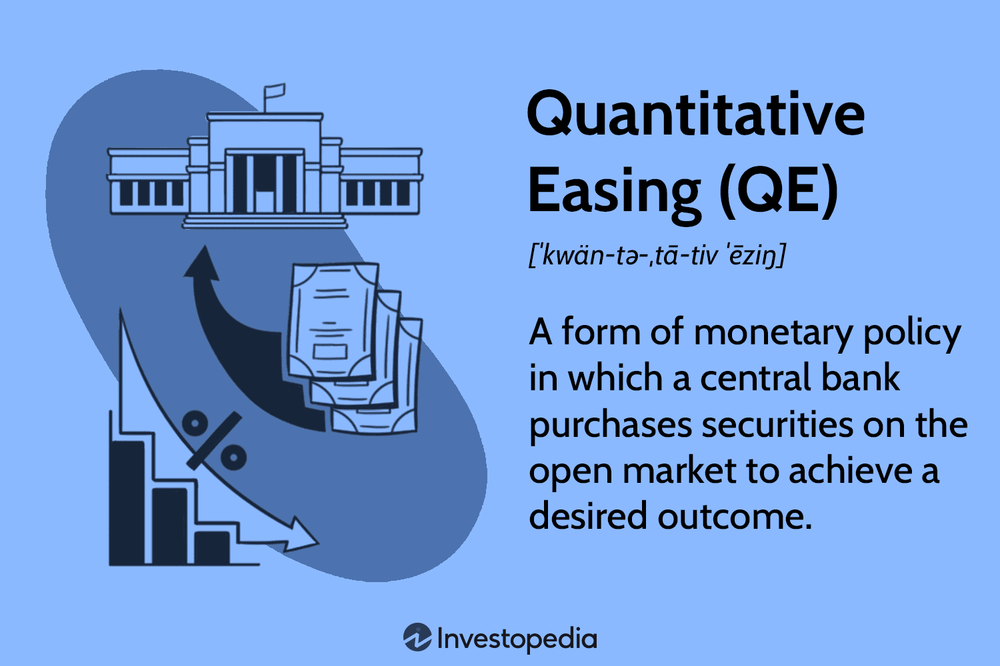

Central banking plays a crucial role in the regulation and supervision of a country's monetary system, serving as the central authority typically embodied by a central bank. This institution is responsible for maintaining economic stability and fostering trust in the nation's financial system. One of the primary tools utilized by central banks in fulfilling this role is monetary policy, which involves strategic actions designed to manage the economy through the control of interest rates and the money supply. By adjusting these levers, central banks aim to influence inflation, employment, and overall economic growth.

Following the 2008 financial crisis, quantitative easing (QE) has emerged as a prominent monetary policy tool. QE is implemented to stimulate economic activity, particularly when traditional monetary policy tools such as interest rate adjustments become ineffective, notably during periods when rates approach zero. The essence of QE involves the large-scale purchase of financial assets by central banks, which injects liquidity into the economy, thereby encouraging lending and investment. This approach has been used by various central banks worldwide to support economic recovery and foster growth under challenging economic conditions.



In parallel with these developments in monetary policy, the advent of technology has spurred significant changes in financial markets through algorithmic trading, often referred to as algo trading. By leveraging sophisticated algorithms, this form of trading automates processes that were traditionally executed by human traders, allowing for trades to be conducted at speeds and frequencies far beyond human capabilities. Algo trading exploits market inefficiencies and enhances liquidity, profoundly transforming how modern financial markets operate. As a technology-driven component of financial markets, it interacts dynamically with monetary policy initiatives like QE, further influencing market behavior and economic outcomes.

## Table of Contents

## Understanding Central Banking

Central banks are instrumental entities designed to uphold economic stability via the implementation and management of monetary policy. Their fundamental responsibilities include regulating the currency supply, establishing interest rates, and overseeing the financial system to avert systemic crises. By wielding these powers, central banks are able to fulfil their key mandates, which encompass the control of inflation, management of unemployment rates, and maintenance of a stable financial environment.

The regulation of currency supply is a primary concern for central banks, as it directly influences inflation rates. By adjusting the volume of money in circulation, central banks can exert control over inflation. This is typically accomplished through monetary policy instruments such as open market operations, reserve requirements, and the discount rate. For instance, increasing the money supply can help combat deflation, whereas reducing it can address issues of hyperinflation.

Interest rates, another critical tool at the disposal of central banks, serve as a lever to modulate economic activity. By setting the benchmark interest rates, central banks influence lending and borrowing behaviors within the economy. Lowering interest rates generally stimulates economic activity by making borrowing cheaper, thus encouraging investment and consumption. Conversely, raising interest rates tends to slow down an overheating economy by discouraging excessive borrowing.

Central banks also serve a crucial role in safeguarding the financial system's stability. This involves monitoring and regulating financial institutions to ensure they operate soundly and within the boundaries of prudent risk management. Through regulatory oversight, central banks aim to prevent financial crises that could arise from the collapse of major financial institutions or from systemic risks within the financial market.

In addition to these functions, central banks often act as the lender of last resort, providing emergency funding to banks in distress to ensure they can meet their short-term obligations. This function is vital for preventing bank runs and maintaining public confidence in the financial system.

Ultimately, the actions of central banks are geared towards achieving broader economic objectives, including price stability, full employment, and sustainable economic growth. By skillfully managing monetary tools and regulatory frameworks, central banks strive to create an environment conducive to economic prosperity and resilience against shocks.

## The Role of Monetary Policy

Monetary policy is a critical instrument employed by central banks to adjust a nation's money supply and interest rates with the aim of achieving key macroeconomic objectives. These objectives typically include targeting inflation, stabilizing the currency, and reaching employment goals. The tools central banks use to [carry](/wiki/carry-trading) out monetary policy are varied, but among the most prominent are open market operations, reserve requirements, and the discount rate.

Open market operations involve the buying and selling of government securities in the open market. When a central bank purchases securities, it injects [liquidity](/wiki/liquidity-risk-premium) into the economy, increasing the money supply and typically lowering interest rates. Conversely, selling securities absorbs liquidity, decreases the money supply, and tends to increase interest rates. This mechanism is crucial for short-term [interest rate](/wiki/interest-rate-trading-strategies) management and can influence the broader economic environment.

Reserve requirements refer to the mandated amount of funds that banks must hold in reserve against their deposits. By adjusting these requirements, central banks can directly influence the lending capacity of commercial banks. A lower reserve requirement allows banks to lend more, expanding the money supply, while a higher reserve requirement restricts lending, thereby contracting the money supply. This tool is less frequently used in modern monetary policy due to its direct impact on banks' operations and the potential for abrupt economic effects.

The discount rate is the interest rate charged to commercial banks and other depository institutions for short-term loans they obtain from the central bank’s lending facility. Altering the discount rate influences the cost of borrowing for banks, which in turn affects the rates they offer to consumers and businesses. A lower discount rate may encourage borrowing and investment, leading to economic expansion, while a higher rate could have the opposite effect, cooling off an overheated economy.

These tools are used in various combinations depending on the economic conditions and policy goals. During periods of economic stagnation or recession, central banks might lower interest rates and expand the money supply to stimulate growth. Conversely, to combat high inflation or an overheating economy, they may increase rates and restrict the money supply.

Monetary policy must be carefully calibrated as it plays a pivotal role in guiding a nation's economic performance. Its efficacy depends on timely and precise adjustments to the monetary environment, making it a crucial area of focus for central bankers worldwide.

## The Mechanism of Quantitative Easing

Quantitative easing (QE) is a non-traditional monetary policy tool employed by central banks when conventional methods, such as adjusting interest rates, prove ineffective, particularly in environments with near-zero interest rates. The primary objective of QE is to inject liquidity into the financial system and stimulate economic activity by purchasing large amounts of financial assets. This process is aimed at lowering interest rates and encouraging lending and investment.

### Mechanism of Quantitative Easing

1. **Asset Purchase Strategy**: Central banks initiate QE by buying long-term securities, such as government bonds, from the open market. This action effectively increases the monetary base and reduces the supply of securities, pushing up their prices and thereby lowering long-term interest rates. The correlation between bond prices and yields is represented by the formula:
$$
   \text{Yield} = \frac{\text{Coupon Payment}}{\text{Current Bond Price}}

$$

   As the central bank purchases bonds, the increase in price causes the yield, or interest rate, to fall, thus encouraging borrowing and spending.

2. **Enhanced Liquidity**: By acquiring securities, central banks significantly boost the reserves of the banking system. This liquidity infusion aims to encourage banks to extend more credit to businesses and consumers. Ideally, increased lending translates into higher spending and investment, propelling economic growth.

3. **Interest Rate Impact**: The central bank's asset purchases primarily affect long-term interest rates by signaling a commitment to maintaining low rates for an extended period. Lower long-term rates reduce the cost of borrowing for businesses and consumers, facilitating capital expenditure and consumer spending. This is essential when short-term rates are at or near zero (a liquidity trap), making further traditional rate cuts impossible.

4. **Economic Growth**: By fostering lower interest rates and increased money supply, QE stimulates aggregate demand, aiming to revitalize economic growth. In theory, as funds circulate more freely in the economy, it should lead to higher investment levels, employment, and ultimately, a rise in GDP. 

5. **Theoretical Underpinnings**: QE operates on the theoretical basis that by swelling the financial system with liquidity, central banks can alter expectations of future monetary conditions, influence consumption and investment decisions, and steer the economy towards desired macroeconomic outcomes. It often operates under the principles of the quantity theory of money, where $MV = PQ$, suggesting that an increase in money supply (M) can lead directly to an increase in economic output (Q), assuming velocity of money (V) and price levels (P) remain stable.

6. **Challenges and Limitations**: While QE aims to bolster economic activity, its efficacy can be tempered by factors such as market saturation, diminishing returns on subsequent rounds of easing, and potential asset bubbles due to prolonged low borrowing costs. Moreover, it can lead to currency depreciation, influencing trade balances.

In conclusion, quantitative easing serves as a potent monetary policy instrument intended to mitigate the adverse effects of economic downturns by strategically manipulating long-term interest rates. By injecting liquidity into the financial system through large-scale asset purchases, central banks like the Federal Reserve, the European Central Bank, and the Bank of Japan have sought to stimulate growth and stabilize their economies during periods when traditional policy tools are constrained.

## Case Studies: Quantitative Easing in Practice

### Case Studies: Quantitative Easing in Practice

**United States**

In response to the financial crisis of 2008, the United States Federal Reserve initiated multiple rounds of Quantitative Easing (QE) to mitigate economic instability and revitalize growth. The first round, QE1, commenced in November 2008, focusing on purchasing mortgage-backed securities and Treasury notes to enhance liquidity in the financial system. This was followed by QE2 in November 2010, aiming to buy longer-term Treasury securities to lower long-term interest rates. The culmination of these efforts occurred in September 2012 with QE3, an open-ended program to purchase $40 billion in mortgage-backed securities monthly. These measures effectively lowered unemployment rates and improved stock market performance but sparked debates over potential inflation and asset bubbles. 

**Japan**

The Bank of Japan (BOJ) implemented QE in response to long-standing deflationary pressures and stagnant economic growth. Starting in the early 2000s, with a renewed vigor from 2013 under the policy known as "Abenomics," the BOJ’s efforts sought to overcome deflation. The central bank aggressively expanded the monetary base, targeting various asset classes including government bonds and exchange-traded funds (ETFs). However, despite these extensive measures, outcomes have been mixed. While inflation rates saw a moderate increase, the Japanese economy has struggled to achieve strong, sustainable growth, raising questions about the long-term efficacy of QE in overcoming entrenched economic malaise.

**Europe**

The European Central Bank (ECB) embarked on its QE program in March 2015, driven by the need to combat deflationary risks and stimulate the Eurozone’s sluggish recovery following the sovereign debt crisis. By purchasing government bonds and later corporate securities, the ECB aimed to reduce borrowing costs and increase investment across member states. QE in the Eurozone contributed to lower interest rates and helped avert deflation. Nonetheless, disparities in economic performance among member countries persisted, and critics argue that QE has prolonged structural issues within the Eurozone, including divergent economic policies and fiscal challenges. 

Overall, these case studies highlight the varied application and outcomes of QE, illustrating its role as a significant, albeit complex, tool in monetary policy arsenals worldwide.

## Algorithmic Trading: The Intersection of Technology and Finance

Algorithmic trading, often referred to as algo trading, leverages sophisticated computer algorithms to automate the execution of trading orders at speeds and frequencies far beyond the reach of human capability. This technology-driven approach analyzes a multitude of real-time market factors, employing mathematical models and intricate data analytics to capitalize on market inefficiencies. For instance, algorithms can quickly identify [arbitrage](/wiki/arbitrage) opportunities—where a security is priced differently in two markets—and execute trades to exploit the price differential before the gap closes. This rapid execution is not possible manually due to time constraints and human limitations.

The impact of [algorithmic trading](/wiki/algorithmic-trading) on market liquidity is significant. By increasing the [volume](/wiki/volume-trading-strategy) and speed of trades, algo trading enhances market depth and tightens bid-ask spreads, thereby reducing transaction costs for all market participants. According to a report by the European Securities and Markets Authority (ESMA), algorithmic trading was shown to contribute positively to market liquidity, especially in liquid markets. However, the prevalence of algorithmic trading also raises concerns about potential market instability, most notably illustrated by events like the 2010 "Flash Crash," where discrepancies in algorithmic trades contributed to dramatic, sudden market declines.

Quantitative easing (QE), a monetary policy tool used by central banks to stimulate the economy, interacts with algorithmic trading in complex ways. During QE, central banks purchase significant amounts of financial assets, thereby increasing money supply and lowering interest rates. This activity affects asset prices and market [volatility](/wiki/volatility-trading-strategies), all of which are conducive to the opportunities exploited by algorithmic trading systems. The increased market activity driven by QE can enhance the efficiency of algorithms designed to parse large volumes of data and execute trades, thereby magnifying their impact on financial markets.

Algorithmic trading strategies are often optimized to respond to the liquidity conditions created by QE. For instance, a common strategy is [statistical arbitrage](/wiki/statistical-arbitrage), which uses statistical methods and algorithmic systems to identify pricing inefficiencies across various asset classes impacted by central bank asset purchases. Python libraries such as NumPy and Pandas are frequently used to code these strategies, analyzing historical data to predict future price movements.

```python
import numpy as np
import pandas as pd

# Sample code for a basic moving average crossover strategy
data = pd.read_csv('market_data.csv')

# Short and long term moving averages
short_window = 40
long_window = 100

# Compute the moving averages
data['short_mavg'] = data['Close'].rolling(window=short_window, min_periods=1).mean()
data['long_mavg'] = data['Close'].rolling(window=long_window, min_periods=1).mean()

# Generate signals
data['signal'] = 0.0
data['signal'][short_window:] = np.where(data['short_mavg'][short_window:] > data['long_mavg'][short_window:], 1.0, 0.0)

# Generate trading orders
data['positions'] = data['signal'].diff()

print(data.tail())
```

In exploring the interplay between QE and algorithmic trading, it is crucial to consider the regulatory landscape. Regulators seek to balance the benefits of increased liquidity and efficiency with the need to safeguard against systemic risks and market abuse. As algorithmic trading technology evolves, it demands continual adaptation of regulatory frameworks to ensure stability and integrity within financial markets.

In conclusion, algorithmic trading signifies a pivotal advancement in the interaction between technology and finance, deeply influenced by monetary policies like QE. As both domains continue to evolve, the symbiosis of algorithmic trading systems and central banking initiatives will shape future financial landscapes.

## Challenges and Criticisms of QE and Algo Trading

Quantitative easing (QE) and algorithmic trading (algo trading) present several challenges and criticisms despite their significance in modern financial markets. Quantitative easing, while employed to stimulate economies, can lead to inflationary pressures if not carefully managed. The primary concern is that by increasing the money supply, QE could devalue currency and subsequently raise the prices of goods and services, resulting in economic imbalance. This inflation can diminish the purchasing power of consumers, potentially leading to societal inequalities if wage growth does not keep pace with rising prices.

Algorithmic trading, on the other hand, is scrutinized for its role in increasing market volatility and contributing to phenomena such as "flash crashes". These crashes occur when rapid, automated trading leads to significant price drops within short timeframes. The 2010 Flash Crash, where the Dow Jones Industrial Average plunged about 1,000 points within minutes, exemplifies the potential risks associated with unmoderated algo trading. The use of highly sophisticated algorithms allows for rapid execution of trades, but it can also exacerbate market fluctuations, presenting risks not only to traders but also to broader economic stability.

The regulatory landscape presents additional challenges in managing both QE and algo trading. Ensuring sufficient oversight to mitigate systemic risks is pivotal. In the context of QE, central banks must balance economic stimulation with the potential for creating asset bubbles, where investment prices inflate beyond sustainable levels. Improperly managed QE can lead to allocation distortions within the economy, influencing investment decisions based on artificially low interest rates instead of genuine economic indicators.

For algo trading, regulation focuses on maintaining market integrity. Increasing transparency, implementing circuit breakers to halt trading during excessive volatility, and imposing stricter controls on algorithmic strategies are areas where regulation aims to stabilize financial markets. Regulatory bodies face the complex task of fostering innovation in trading technologies while safeguarding against undue market disruptions and maintaining fair trading practices.

The intersection of QE and algo trading also raises concerns about systemic risks, as the interactions between these mechanisms can intensify potential market disruptions. Understanding and mitigating these interconnected risks are crucial for sustainable economic growth and maintaining financial market stability.

## Future Prospects of Monetary Policy and Trading

Central banks around the world are undertaking rigorous analyses of the long-term impacts of quantitative easing (QE), particularly concerning post-pandemic economic recovery. The COVID-19 pandemic necessitated unprecedented monetary policy interventions, leading to extensive QE measures. These have spurred concerns regarding potential inflationary pressures and market distortions, but have also offset severe contractions in economic activity. As economies navigate through recovery phases, there is a pressing need to understand how QE has altered the fundamental dynamics of financial markets and its implications for future monetary policy.

Simultaneously, algorithmic trading is evolving rapidly, driven by advancements in [artificial intelligence](/wiki/ai-artificial-intelligence) (AI) and [machine learning](/wiki/machine-learning). These technologies are revolutionizing trading by enhancing decision-making processes through big data analysis and predictive modeling. Algorithmic trading offers significant opportunities for efficiency and precision in transactions, but also introduces complexities and risks, particularly concerning market volatility and fairness. Algorithms can exploit micro-fluctuations in the market, contributing to liquidity but also posing challenges such as the potential for 'flash crashes'.

The future of central banking policies is likely to be increasingly intertwined with the progression of financial technologies. As central banks assess the efficacy and implications of QE, considerations must be made regarding how these policy tools intersect with an ecosystem of rapidly advancing financial technologies. The adoption of blockchain for digital currencies, the increased use of AI for regulatory compliance, and the potential integration of decentralized finance (DeFi) offer both promising innovations and formidable regulatory challenges. Central banks may need to develop new frameworks and oversight mechanisms to accommodate and regulate these technologies while ensuring financial stability and protecting consumer interests.

In summary, while QE and algorithmic trading continue to shape the global financial landscape, their evolving nature requires central banks and financial institutions to adapt. Balancing the opportunities provided by technological innovations with the imperative of financial stability will be crucial for future monetary policy. Research and strategic adaptation are essential to harness the benefits of these advancements while mitigating associated risks.

## Conclusion

Central banking and monetary policy serve as vital components in maintaining economic stability and fostering growth by regulating the nation's monetary framework. These frameworks utilize a range of tools, such as interest rates and money supply controls, to achieve targets like inflation stabilization and employment optimization. The utilization of quantitative easing (QE) and algorithmic trading exemplifies the dynamic and evolving nature of financial markets and related policy interventions.

Quantitative easing has become a significant policy instrument, particularly when traditional monetary levers are inadequate, such as during periods of very low interest rates. By injecting liquidity into the financial system through large-scale purchases of financial assets, QE aims to stimulate economic activity, though it carries risks like potential inflationary pressures if not adeptly managed.

Algorithmic trading, on the other hand, harnesses technology to execute trades with precision and speed, contributing to increased market liquidity and the potential exploitation of inefficiencies. However, it also faces criticism for contributing to market volatility, such as seen in phenomena like 'flash crashes'.

As the financial environment continues to transform, it is crucial to pursue ongoing research and develop adaptive strategies in central banking and financial technologies. The aftermath of the COVID-19 pandemic presents an opportunity to reassess the long-term impacts of QE and explore the integration of advancements in AI and machine learning within algo trading.

The interplay between central banking policies and financial technologies will shape the future trajectory of economic stability and growth. Addressing evolving challenges and leveraging innovative approaches is essential to maximize economic benefits and ensure robust financial systems.

## References & Further Reading

[1]: Bernanke, B. S. (2009). ["The Crisis and the Policy Response."](https://www.federalreserve.gov/newsevents/speech/bernanke20090113a.htm) Speech at the Stamp Lecture, London School of Economics, London, England.

[2]: Gagnon, J., Raskin, M., Remache, J., & Sack, B. (2011). ["The Financial Market Effects of the Federal Reserve's Large-Scale Asset Purchases."](https://www.ijcb.org/journal/ijcb11q1a1.pdf) International Journal of Central Banking, 7(1), 3-43.

[3]: Fawley, B. W., & Neely, C. J. (2013). ["Four Stories of Quantitative Easing."](https://www.researchgate.net/publication/256406322_Fawley_Neely_--_Four_Stories_of_QE_2013) Federal Reserve Bank of St. Louis Review.

[4]: Hendershott, T., Jones, C. M., & Menkveld, A. J. (2011). ["Does Algorithmic Trading Improve Liquidity?"](https://onlinelibrary.wiley.com/doi/full/10.1111/j.1540-6261.2010.01624.x) The Review of Financial Studies, 24(3), 1506-1544.

[5]: Nakaso, H. (2013). ["Bank of Japan's Quantitative and Qualitative Monetary Easing Measures."](https://www.boj.or.jp/en/mopo/mpmdeci/mpr_2013/k130404a.pdf) Bank of Japan.

[6]: ECB (2015). ["ECB announces expanded asset purchase programme."](https://www.ecb.europa.eu/press/pr/date/2015/html/pr150122_1.en.html) European Central Bank Press Release.

[7]: Johnson, B. (2010). ["Algorithmic Trading & DMA: An Introduction to Direct Access Trading Strategies."](https://www.amazon.com/Algorithmic-Trading-DMA-introduction-strategies/dp/0956399207) 4Myeloma Press.

[8]: Carney, M. (2013). ["The Spectre of Monetarism."](https://www.bankofengland.co.uk/speech/2016/the-spectre-of-monetarism) Speech given by Mark Carney, Governor of the Bank of England.