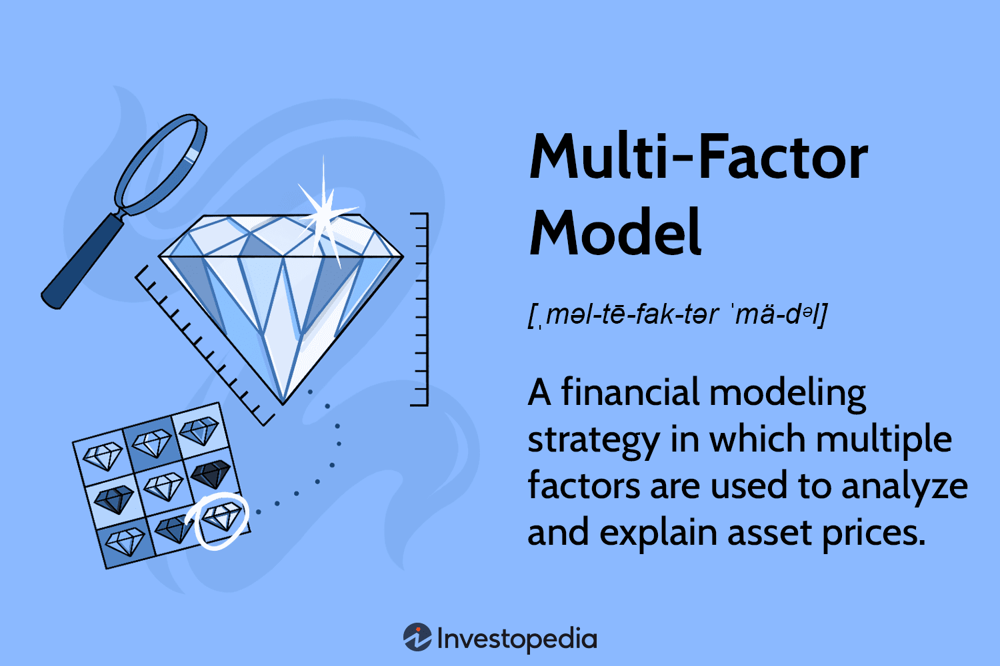

## Table of Contents

## What is a quantitative factor model?

A quantitative factor model is a way to understand and predict how investments, like stocks or bonds, might perform. It uses numbers and math to look at different things, called factors, that can affect how well an investment does. These factors could be things like how big a company is, how fast it's growing, or how much risk it has. By studying these factors, the model can help investors make smarter choices about where to put their money.

These models are really useful because they take a lot of the guesswork out of investing. Instead of just hoping an investment will do well, investors can use the model to see which factors are most important for success. This helps them pick investments that are more likely to give them good returns. Plus, because the model uses numbers and math, it can be tested and improved over time, making it even better at predicting how investments will perform.

## How do quantitative factor models differ from traditional investment strategies?

Quantitative factor models and traditional investment strategies are different in how they pick investments. Traditional strategies often rely on a person's experience and gut feeling. For example, an investor might choose a stock because they believe in the company's future or because they've had success with similar companies before. These strategies can be influenced by emotions and personal biases, and they might not always use hard data to make decisions.

On the other hand, quantitative factor models use math and numbers to make investment choices. They look at specific factors, like a company's size or how much it's growing, and use these to predict how well an investment might do. This approach takes out a lot of the guesswork and personal feelings that can affect traditional strategies. Instead of relying on someone's opinion, quantitative models use data to make more objective decisions.

Because of these differences, quantitative factor models can be more consistent and easier to test and improve over time. Traditional strategies might work well for some people but not for others, depending on their experience and intuition. But with quantitative models, everyone can use the same data-driven approach, which can lead to more reliable results across different investors.

## What are the key components of a quantitative factor model?

A quantitative factor model has several key parts that work together to help pick investments. The first part is the factors themselves. These are the things that the model looks at to predict how well an investment will do. Factors can be things like how big a company is, how fast it's growing, or how much risk it has. The model uses math to figure out which factors are most important and how they affect the investment's performance.

The second part is the data. To use the factors, the model needs a lot of numbers about different investments. This data comes from places like financial reports, stock prices, and economic indicators. The model takes all this data and turns it into numbers that it can use to make predictions. Good data is really important because if the data is wrong or missing, the model's predictions won't be accurate.

The last part is the math and algorithms. These are the rules that the model follows to use the factors and data to make predictions. The algorithms can be simple or very complex, but they all do the same thing: take the data and factors, and use them to figure out which investments are likely to do well. Over time, the model can be tested and improved to make its predictions even better.

## Can you explain the difference between single-factor and multi-factor models?

A single-factor model is a simpler type of quantitative factor model that looks at just one thing, or factor, to predict how well an investment might do. For example, it might only look at how big a company is, or how fast it's growing. By focusing on just one factor, these models are easier to understand and use, but they might miss out on other important things that could affect the investment's performance. Single-factor models are good when that one factor is really important and can explain a lot about how the investment will do.

On the other hand, a multi-factor model is more complex because it looks at several different factors at the same time. Instead of just looking at a company's size, it might also consider how fast it's growing, how much risk it has, and other things. By using multiple factors, these models can give a more complete picture of what might affect the investment's performance. This can lead to better predictions, but it also makes the model more complicated to build and use. Multi-factor models are useful when many different things can influence how well an investment does.

## What are some common factors used in quantitative models?

Common factors used in quantitative models include things like a company's size, how fast it's growing, and how much risk it has. The size of a company, often measured by its market value, can tell us how stable it might be. Bigger companies are usually more stable but might not grow as fast as smaller ones. Growth is another important factor, looking at things like how much a company's earnings or sales are increasing. Fast-growing companies might be riskier but could offer bigger returns. Risk, often measured by how much a stock's price goes up and down, helps investors understand how safe or dangerous an investment might be.

Other common factors include value, which looks at whether a stock is cheap or expensive compared to its earnings or other measures, and momentum, which looks at how a stock's price has been moving recently. Stocks that have been going up might keep going up, while those going down might keep falling. Another factor is quality, which looks at how well a company is run and how strong its finances are. Companies with good quality might be safer investments. All these factors help investors pick stocks that match what they're looking for, whether it's safety, growth, or something else.

## How are factors selected and validated in a quantitative factor model?

Factors are chosen for a quantitative factor model by looking at what has worked well in the past and what makes sense for the kind of investments being made. For example, if someone is investing in big companies, they might pick factors like size and stability. If they're looking at smaller, growing companies, they might choose factors like growth and risk. Researchers and investors often start by looking at a lot of different factors and then use math to see which ones are most important. They might look at data from many years to see how well each factor predicts how an investment will do.

Once the factors are picked, they need to be tested to make sure they work well. This is called validation. To validate a factor, researchers use data from the past to see if the factor could have predicted how well investments did back then. They might split the data into two parts: one part to build the model and another part to test it. If the factor works well on both parts of the data, it's more likely to be useful in the future. Sometimes, they also check the factor against new data as it comes in to make sure it's still working. This helps make sure the model is using the best factors to predict how investments will do.

## What statistical methods are used to construct and test quantitative factor models?

To build and test quantitative factor models, people use different statistical methods. One common method is regression analysis, which helps figure out how much each factor affects an investment's performance. By looking at a lot of data, regression can show which factors are most important and how they work together. Another method is factor analysis, which helps group similar factors together and see which ones are the most useful. This can make the model simpler and easier to understand. People also use time-series analysis to see how factors change over time and how that affects investments.

To test these models, people often use something called backtesting. This means they use old data to see if the model would have worked well in the past. If the model does well on old data, it might also work well in the future. They might also use cross-validation, which means splitting the data into different parts and testing the model on each part. This helps make sure the model isn't just working well by chance. Another way to test models is with out-of-sample testing, where they use new data that the model hasn't seen before. This helps make sure the model can work well with new information, not just the data it was built on.

## How do you measure the performance of a quantitative factor model?

To measure how well a quantitative factor model is doing, you look at how much money it makes compared to how much risk it takes. One way to do this is by checking the model's returns, which is how much money it makes over time. You can compare these returns to a benchmark, like a stock market index, to see if the model is doing better or worse than the market. Another way is to look at risk-adjusted returns, like the Sharpe Ratio, which tells you how much extra return you're getting for each bit of extra risk you're taking. If the Sharpe Ratio is high, the model is doing a good job of making money without taking too much risk.

Another important thing to look at is how consistent the model's performance is. You can do this by checking things like the information ratio, which shows how well the model's predictions match up with what actually happens. A high information ratio means the model is good at picking winners and losers. You also want to make sure the model doesn't just work well by chance, so you can use statistical tests to see if its performance is really better than random. By looking at all these things together, you can get a good idea of how well the quantitative factor model is working and whether it's a good tool for making investment decisions.

## What are the challenges and limitations of using quantitative factor models in investment?

Using quantitative factor models in investing can be tricky because they depend a lot on the data they use. If the data is wrong or missing, the model's predictions won't be accurate. Also, the world of investing changes all the time, so factors that worked well in the past might not work as well in the future. This means the models need to be updated and checked often to make sure they're still useful. Another challenge is that these models can be very complex, which makes them hard to understand and explain to others. If people don't understand how the model works, they might not trust it or use it correctly.

Another limitation is that quantitative factor models can miss out on important things that can't be measured with numbers. For example, they might not pick up on big news events or changes in how people feel about the market. These things can have a big impact on investments, but they're hard to put into a model. Also, because these models use math and numbers, they can sometimes make mistakes that a person might catch. For instance, a model might suggest buying a stock just because it fits certain numbers, but a person might know that the company is having problems that the model doesn't see. So, while quantitative factor models can be very helpful, they're not perfect and should be used carefully.

## How can quantitative factor models be integrated with other investment approaches?

Quantitative factor models can be mixed with other ways of picking investments to make better choices. For example, someone might use a quantitative model to find stocks that look good based on numbers, like how fast a company is growing or how much risk it has. Then, they could also use their own experience and gut feelings to check if those stocks make sense for other reasons, like the company's future plans or what's happening in the world. By combining the model's predictions with their own knowledge, the investor can make more complete decisions that take into account both numbers and real-world factors.

Another way to use quantitative factor models with other approaches is by using them alongside more traditional methods, like looking at a company's financial reports or talking to its leaders. An investor might start with the model to narrow down a list of possible investments, then do more research on each one. This can help them find investments that not only look good on paper but also seem strong based on other information. By using the model as a starting point and then adding other kinds of analysis, investors can get a fuller picture of where to put their money.

## What advanced techniques can enhance the predictive power of quantitative factor models?

To make quantitative factor models better at predicting how investments will do, people can use machine learning. Machine learning is a way of using computers to find patterns in data that might be hard for people to see. For example, a machine learning model can look at a lot of different factors at once and figure out which ones are most important and how they work together. This can help the model make better predictions than if it just looked at each factor by itself. Another cool thing about machine learning is that it can learn from new data over time, so the model keeps getting better as it sees more information.

Another advanced technique is called ensemble methods. This means using a bunch of different models together to make a better prediction. Instead of relying on just one model, an ensemble method combines the predictions from many models. This can help because different models might be good at different things, so by putting them together, you can get a more accurate prediction. For example, one model might be really good at predicting how a stock will do based on how big the company is, while another model might be good at looking at how fast the company is growing. By using both models together, you can get a better overall prediction of how the stock will perform.

## How do regulatory and ethical considerations impact the development and use of quantitative factor models?

When people make and use quantitative factor models, they have to think about rules and doing the right thing. There are laws and rules from places like the government or financial groups that say how these models should be used. For example, there might be rules about being fair to everyone and not using secret information. If someone doesn't follow these rules, they could get in big trouble. So, it's important for people making the models to know these rules and make sure their models follow them. This can make it harder to build the models because they have to be careful to stay within the rules.

Ethical issues are also important when working with quantitative factor models. These models use a lot of data about people and companies, and it's important to use this data in a way that is fair and respects people's privacy. For example, the models shouldn't be used to hurt people or make decisions that aren't fair. People making the models need to think about how their work might affect others and try to do the right thing. This means being open about how the models work and making sure they don't cause harm. Balancing the power of these models with doing the right thing can be a big challenge, but it's really important.

## What are quantitative factor models?

Quantitative factor models are statistical tools designed to predict asset returns by analyzing a range of quantifiable factors. These models function by leveraging historical data and deploying complex algorithms to assess both market opportunities and associated risks effectively. The underlying premise of these models is to decompose asset returns into components that are attributable to numerous factors, each representing unique sources of risk and return.

Commonly utilized factors include value metrics, momentum indicators, and size decompositions. Value metrics often examine asset pricing relative to intrinsic fundamental measures, such as the book-to-market ratio, representing the firm's book value divided by its market value. Momentum indicators evaluate the rate of change in asset prices, which can provide insight into potential trends and ideal entry or exit points. For instance, a simple momentum factor might involve the computation of returns over the past twelve months, excluding the most recent month, as such:

$$
\text{Momentum}_{t} = P_{t-1} - P_{t-12}
$$

where $P_{t-1}$ and $P_{t-12}$ represent prices at the end of the most recent month and rolling twelve months prior, respectively.

Size decomposition considers the influence of firm size on returns, with empirical evidence suggesting that smaller firms often yield higher potential returns. This understanding is typically operationalized through metrics like market capitalization.

The utilization of [factor](/wiki/factor-investing) models fine-tunes trading decisions by clarifying the diverse drivers of asset returns. These models deliver insights into the risks linked with specific investments, enabling traders and investors to optimize their strategies and manage portfolios more effectively. Ultimately, quantitative factor models contribute to a systematic framework for translating historical patterns and statistical relationships into actionable trading insights.

## References & Further Reading

[1]: ["The Econometrics of Financial Markets"](https://www.amazon.com/Econometrics-Financial-Markets-John-Campbell/dp/0691043019) by John Y. Campbell, Andrew W. Lo, and A. Craig MacKinlay

[2]: ["Quantitative Equity Portfolio Management: An Active Approach to Portfolio Construction and Management"](https://www.amazon.com/Quantitative-Equity-Portfolio-Management-Construction/dp/0071459391) by Ludwig B. Chincarini and Daehwan Kim

[3]: Ang, Andrew. (2014). ["Asset Management: A Systematic Approach to Factor Investing"](https://www.amazon.com/Asset-Management-Systematic-Investing-Association/dp/0199959323) Oxford University Press.

[4]: Fama, E. F., & French, K. R. (1993). ["Common risk factors in the returns on stocks and bonds."](https://www.sciencedirect.com/science/article/pii/0304405X93900235) Journal of Financial Economics, 33(1), 3-56.

[5]: Harvey, C. R., Liu, Y., & Zhu, H. (2016). ["...and the Cross-Section of Expected Returns."](https://academic.oup.com/rfs/article/29/1/5/1843824) The Review of Financial Studies, 29(1), 5-68.