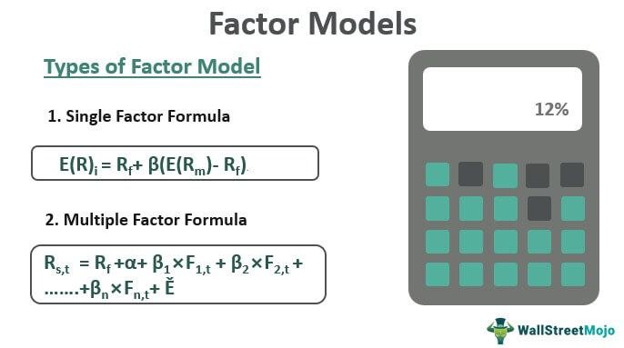

Quantitative factor models are pivotal in algorithmic trading, bridging the gap between sophisticated mathematical frameworks and practical financial strategies. These models have revolutionized trading, providing automated and refined processes that enhance the potential for significant investment returns. By employing advanced statistical tools, quantitative models enable traders to execute systematic approaches grounded in data-driven insights. This shift towards quantitative strategies reflects the dynamic nature of financial markets, where data accuracy and processing speed are crucial.

The core contribution of quantitative factor models lies in their ability to streamline and optimize trading strategies. They achieve this by analyzing vast datasets to identify patterns and trends that inform decision-making processes. Such models invariably enhance precision and efficiency in trading activities, allowing for informed strategic decisions devoid of emotional bias. This methodical approach ensures that traders harness the full potential of mathematical precision to achieve a competitive advantage in the marketplace.



Understanding how to employ these models is paramount for traders aiming to stay ahead in an increasingly competitive environment. As markets evolve, so do the models, necessitating continuous adaptation to maintain efficacy. This article seeks to illustrate the integral role quantitative factor models play in transforming raw data into actionable insights, ultimately serving as a catalyst for achieving superior trading outcomes.

## Table of Contents

## What Are Quantitative Factor Models?

Quantitative factor models are statistical tools designed to predict asset returns by analyzing a range of quantifiable factors. These models function by leveraging historical data and deploying complex algorithms to assess both market opportunities and associated risks effectively. The underlying premise of these models is to decompose asset returns into components that are attributable to numerous factors, each representing unique sources of risk and return.

Commonly utilized factors include value metrics, momentum indicators, and size decompositions. Value metrics often examine asset pricing relative to intrinsic fundamental measures, such as the book-to-market ratio, representing the firm's book value divided by its market value. Momentum indicators evaluate the rate of change in asset prices, which can provide insight into potential trends and ideal entry or exit points. For instance, a simple momentum factor might involve the computation of returns over the past twelve months, excluding the most recent month, as such:

$$
\text{Momentum}_{t} = P_{t-1} - P_{t-12}
$$

where $P_{t-1}$ and $P_{t-12}$ represent prices at the end of the most recent month and rolling twelve months prior, respectively.

Size decomposition considers the influence of firm size on returns, with empirical evidence suggesting that smaller firms often yield higher potential returns. This understanding is typically operationalized through metrics like market capitalization.

The utilization of [factor](/wiki/factor-investing) models fine-tunes trading decisions by clarifying the diverse drivers of asset returns. These models deliver insights into the risks linked with specific investments, enabling traders and investors to optimize their strategies and manage portfolios more effectively. Ultimately, quantitative factor models contribute to a systematic framework for translating historical patterns and statistical relationships into actionable trading insights.

## Types of Factors in Quantitative Models

Quantitative factor models utilize various types of factors to explain and predict asset returns. These factors are designed to capture different characteristics of financial assets and can be categorized into value factors, [momentum](/wiki/momentum) factors, size factors, and quality factors.

Value factors assess the intrinsic worth of an asset by comparing its current market price to fundamental financial metrics. A commonly used metric is the book-to-market ratio, which is the ratio of a company's book value to its market value. High book-to-market ratios can indicate undervalued stocks according to value investing principles. Value factors aim to identify assets that are priced lower relative to their fundamentals, suggesting potential for price corrections.

Momentum factors focus on the rate at which an asset's price changes over time. The basic premise is that assets which have recently performed well will continue to do so in the short term. Momentum can be quantified using indicators like moving averages or relative strength index (RSI). By identifying trends through these indicators, traders can pinpoint potential entry and [exit](/wiki/exit-strategy) points for trades based on the asset's historical performance.

Size factors examine the impact of a company's market capitalization on its performance. Generally, smaller companies, or those with lower market capitalization, are believed to offer higher returns, albeit with greater risk, than larger companies. This small-cap premium is a well-documented phenomenon in financial markets. Investors incorporating size factors typically exploit the higher growth potential associated with smaller firms.

Quality factors evaluate the financial health and operational efficiency of a company. These factors might include metrics such as earnings stability, profit margins, and debt levels. Companies with strong quality metrics are often seen as more reliable investments, as they are perceived to be better managed and financially stable. Quality factors help investors identify companies that not only have solid operational metrics but also show potential for sustained profitable performance.

By integrating these factors, quantitative models can provide a multi-faceted view of the market, enhancing the precision of investment strategies and optimizing portfolio selection based on systematic, data-driven insights.

## Application in Algorithmic Trading

Algorithmic trading employs quantitative factor models to automate trading decisions and efficiently manage substantial volumes of data. By leveraging these models, trading processes are streamlined through the generation of trading signals determined by specific, well-defined criteria. This approach significantly enhances both the speed and accuracy of decision-making. 

Quantitative factor models provide a robust framework for [backtesting](/wiki/backtesting) trading strategies, enabling practitioners to utilize historical data to predict potential outcomes. This process allows for the refinement of trading systems, granting traders the ability to test hypotheses and optimize strategies prior to real-world application. The backtesting process involves simulating a strategy's performance on past market data, utilizing metrics such as $\text{Sharpe Ratio} = \frac{E[R_p - R_f]}{\sigma_p}$ to assess risk-adjusted returns, where $E[R_p]$ is the expected portfolio return, $R_f$ is the risk-free rate, and $\sigma_p$ is the standard deviation of the portfolio's excess return.

The integration of [artificial intelligence](/wiki/ai-artificial-intelligence) (AI) and [machine learning](/wiki/machine-learning) with factor models further enhances the predictive power and adaptability of trading systems in volatile markets. AI algorithms, such as support vector machines or neural networks, learn from vast datasets to identify complex patterns and relationships that may not be immediately apparent through traditional analysis. Machine learning models can dynamically adjust to evolving market conditions, providing traders with a competitive edge in rapidly changing environments. Python libraries such as TensorFlow or Scikit-learn facilitate the implementation of such algorithms, with code snippets often resembling:

```python
from sklearn.ensemble import RandomForestRegressor

# Example of training a model on historical data
model = RandomForestRegressor(n_estimators=100, max_depth=5)
model.fit(historical_features, historical_returns)

# Generating trading signals from new data
predicted_returns = model.predict(new_data_features)
```

This blend of quantitative factor models, AI, and machine learning offers algorithmic traders the tools necessary to navigate and capitalize on market opportunities with precision and efficiency.

## Benefits of Using Quantitative Factor Models

Quantitative factor models offer significant advantages in the field of [algorithmic trading](/wiki/algorithmic-trading) by facilitating data-driven decision-making processes. These models reduce the emotional biases that often accompany manual trading, as they rely on quantifiable data and systematic methodologies. By employing mathematical and algorithmic approaches, traders can transcend subjective judgment and enhance the precision of their trading strategies.

The systematic nature of quantitative factor models ensures consistent performance through disciplined execution. These models are designed to adhere strictly to predefined criteria, thus facilitating strategic adaptability. As market conditions change, models can be recalibrated to maintain alignment with evolving market dynamics. This capability allows traders to handle changes with strategic agility, thereby ensuring sustained performance.

Quantitative factor models also play a critical role in risk management. By identifying and assessing potential vulnerabilities within a portfolio, these models enable traders to mitigate risks effectively. Techniques such as Value at Risk (VaR) and stress testing are often incorporated to understand potential losses and prepare for adverse market events. Consequently, quantitative models help maintain portfolio integrity by systematically identifying risk factors and implementing timely adjustments.

Moreover, the ability of these models to capture a wide array of market opportunities promotes enhanced market coverage and better portfolio diversification. By analyzing multiple factors concurrently, such as value, momentum, and quality, traders can identify diverse investment avenues that might otherwise be overlooked in a more traditional analysis. This comprehensive approach reduces reliance on a limited set of market conditions and enhances the resilience of investment strategies.

In summary, the use of quantitative factor models in algorithmic trading offers numerous benefits, including data-driven accuracy, strategic consistency, robust risk management, and diversified market engagement. These capabilities collectively align to optimize trading performance and support the achievement of long-term investment goals.

## Challenges and Limitations

Quantitative factor models, while instrumental in algorithmic trading, face several challenges and limitations that traders and analysts must navigate. Firstly, the deployment of these models necessitates significant computational resources and substantial investment in infrastructure. High-performance computing systems are often required to process vast quantities of data quickly and efficiently, ensuring timely execution of trades and accurate model assessments. Moreover, the dependency on historical data introduces model risk, as past performance is not always a reliable predictor of future market behavior. Economic regimes shift, and factors that were once lucrative may lose their predictive power over time.

The sophistication of algorithmic trading systems introduces the need for skilled personnel who possess expertise in programming, finance, and data analysis. These professionals must be adept in languages such as Python and C++, as well as in leveraging frameworks like TensorFlow for advanced data handling and analysis. For instance, a simple linear regression model in Python may be executed as follows:

```python
import numpy as np
from sklearn.linear_model import LinearRegression

# Sample data
X = np.array([[1, 2], [2, 3], [3, 4], [4, 5]])
y = np.array([1, 2, 3, 4])

# Creating a linear regression model
model = LinearRegression()

# Fitting the model
model.fit(X, y)

# Making a prediction
prediction = model.predict(np.array([[5, 6]]))
```

Adaptive learning within these models is crucial, as financial markets are dynamic and ever-evolving. Without continual refinement and updating, models risk experiencing diminishing returns. This necessitates ongoing research and development efforts to ensure that models remain relevant and effective in identifying and capitalizing on market opportunities.

The limitations outlined above underscore the importance of maintenance and continuous improvement in the implementation of quantitative factor models. By addressing these challenges, traders can better harness the potential of these models to optimize their algorithmic trading strategies.

## Conclusion

Quantitative factor models are a cornerstone of modern trading strategies, transforming raw data into actionable insights. Their application in algorithmic trading enables the extraction of meaningful patterns and correlations from vast datasets, thus guiding investment decisions with high precision. For those engaged in algorithmic trading, mastering these models is vital to maintaining a competitive advantage and achieving sustained profitability. They allow for the automation of trading strategies, reducing human error and improving execution efficiency.

Continual advancements in technology and analytics promise to amplify the applications and significance of quantitative factor models in future trading landscapes. As computational power increases and data analytics tools become more sophisticated, the ability to process and interpret larger volumes of data will further enhance model accuracy and predictive capability. The integration of artificial intelligence (AI) and machine learning with quantitative models is expected to enrich their adaptability, enabling traders to better navigate volatile market conditions.

Success in this field requires ongoing learning and strategic adaptation. Traders must remain committed to leveraging mathematical precision in trading pursuits, continuously refining models to reflect changing market conditions. This commitment involves not only staying abreast of technological advancements but also developing a deep understanding of the mathematical and statistical foundations underlying these models. Through diligent practice and a dedication to innovation, traders can effectively harness the power of quantitative factor models to optimize their strategies and maximize returns.

## References & Further Reading

[1]: ["The Econometrics of Financial Markets"](https://www.amazon.com/Econometrics-Financial-Markets-John-Campbell/dp/0691043019) by John Y. Campbell, Andrew W. Lo, and A. Craig MacKinlay

[2]: ["Quantitative Equity Portfolio Management: An Active Approach to Portfolio Construction and Management"](https://www.amazon.com/Quantitative-Equity-Portfolio-Management-Construction/dp/0071459391) by Ludwig B. Chincarini and Daehwan Kim

[3]: Ang, Andrew. (2014). ["Asset Management: A Systematic Approach to Factor Investing"](https://www.amazon.com/Asset-Management-Systematic-Investing-Association/dp/0199959323) Oxford University Press.

[4]: Fama, E. F., & French, K. R. (1993). ["Common risk factors in the returns on stocks and bonds."](https://www.sciencedirect.com/science/article/pii/0304405X93900235) Journal of Financial Economics, 33(1), 3-56.

[5]: Harvey, C. R., Liu, Y., & Zhu, H. (2016). ["...and the Cross-Section of Expected Returns."](https://academic.oup.com/rfs/article/29/1/5/1843824) The Review of Financial Studies, 29(1), 5-68.