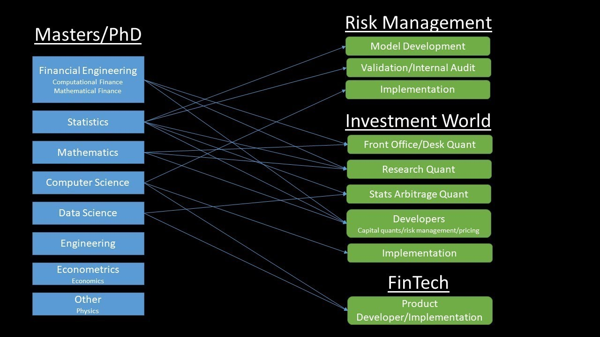

Quantitative finance, at its core, is the application of mathematical models and computational techniques to understand and solve problems in finance. It involves the use of quantitative analysis to predict market behaviors, identify investment opportunities, and manage risk. This discipline combines the intricacies of finance with the precision of mathematics and the innovation of computer science, making it a unique and dynamic field.

The role of quantitative finance in the financial industry has grown exponentially in recent years. It has become integral in areas such as risk management, algorithmic trading, asset pricing, and portfolio management. The growing complexity of financial markets and products, coupled with advancements in technology and data analytics, has spurred this increase in significance. Quantitative finance professionals, known as 'quants,' utilize their skills in mathematics, statistics, and programming to create models that can process and analyze vast amounts of data, predict market trends, and inform financial decisions.

This reliance on quantitative finance has been further propelled by the digital transformation of the financial sector. The rise of high-frequency trading, the integration of artificial intelligence and machine learning in financial decision-making, and the need for sophisticated risk management strategies in an increasingly interconnected global economy have all underscored the importance of quantitative skills. As markets evolve and new financial instruments and technologies emerge, the demand for professionals with quantitative finance expertise continues to surge. This trend underscores the field's vital role in shaping the future of the financial industry, making it an exciting and rewarding career path for those with a penchant for numbers and a passion for finance.

## Table of Contents

## Career Path in Quantitative Finance

A career in quantitative finance offers a journey through a landscape where finance, mathematics, and technology intersect. The career progression in this field typically starts with entry-level positions such as a Quantitative Analyst, advancing through to senior roles like Quantitative Portfolio Manager or Head of Quantitative Research. Early stages of the career often involve rigorous data analysis, model development, and implementation of strategies, while senior positions focus more on strategy oversight, risk management, and key decision-making.

Professionals in quantitative finance can find opportunities across various sectors within the financial industry, each offering unique challenges and rewards:

- **Investment Banking:** Quants in investment banking work on pricing complex financial products, risk management, and developing algorithmic trading strategies. They play a pivotal role in derivatives trading, structured products, and M&A advisory.
- **Asset Management and Hedge Funds:** In these sectors, quantitative finance professionals develop sophisticated models to manage and allocate funds across various asset classes. They use quantitative techniques to optimize portfolio performance and manage risk, focusing on long-term investment strategies as well as high-frequency trading.
- **Risk Management:** This sector involves identifying, analyzing, and mitigating risks for financial institutions. Quants here develop models to predict market movements and assess potential risks, contributing to the stability of financial systems.
- **Fintech and Startups:** The burgeoning fintech sector offers exciting opportunities for quants to apply their skills in innovative ways, from developing new financial tools and platforms to leveraging big data and machine learning in financial decision-making.
- **Insurance and Actuarial Science:** Quantitative finance professionals in insurance companies and actuarial firms use their skills to price insurance products, manage risk, and analyze large datasets to predict future events.
- **Regulatory Bodies and Central Banks:** Quants can also work with regulatory agencies and central banks, focusing on macroeconomic modeling, financial stability analysis, and the development of monetary and regulatory policies.
- **Academia and Research:** For those inclined towards research, academia offers a path to explore theoretical aspects of quantitative finance, often combining teaching with research on complex financial models and methods.

Each of these sectors requires a blend of specialized skills and knowledge, and professionals often choose their path based on their interests, skill sets, and the kind of challenges they seek in their career. The diversity of roles within quantitative finance not only provides a broad spectrum of career opportunities but also contributes to the dynamic and ever-evolving nature of the field.

## Educational Background and Qualifications

Embarking on a career in quantitative finance typically requires a strong foundation in quantitative disciplines. Essential educational qualifications often include a bachelor's degree in fields such as finance, mathematics, [statistics](/wiki/bayesian-statistics), engineering, or physics. These disciplines provide the analytical framework and mathematical proficiency crucial for tackling complex financial problems.

Advanced degrees play a significant role in this field. A **Master's degree**, especially in quantitative finance, financial engineering, or a related quantitative field, can significantly enhance a candidate's understanding of complex financial theories and computational methods. These programs usually offer a blend of theoretical knowledge and practical skills, covering areas like derivative pricing, risk management, and [algorithmic trading](/wiki/algorithmic-trading).

A **Ph.D.** can be particularly advantageous for roles that require deep technical expertise or research. Specializations in areas like stochastic calculus, econometrics, machine learning, or data science are highly valued. Ph.D. holders are often sought after for high-level positions in research and model development, where they can leverage their extensive knowledge to create sophisticated financial models and strategies.

Moreover, specializations in programming languages such as Python, R, or C++ are increasingly essential. The ability to code is fundamental in today's quantitative finance landscape, as it enables professionals to build and implement their models effectively. Courses or certifications in [machine learning](/wiki/machine-learning), data analysis, and statistical methods are also beneficial, given the increasing reliance on these techniques in financial decision-making.

## Key Roles and Job Titles

### Quantitative Analyst

The role of a Quantitative Analyst, commonly referred to as a "Quant," is central in quantitative finance. A Quantitative Analyst applies mathematical and statistical methods to financial and risk management problems. They develop and implement complex models used to make decisions about risk management, investments, pricing, and more, typically within investment banks, [hedge fund](/wiki/hedge-fund-trading-strategies)s, or asset management firms.

Responsibilities of a Quantitative Analyst often include:

1. **Model Development:** Designing and creating mathematical models for pricing, risk management, and other financial strategies.
2. **Data Analysis:** Analyzing large datasets to identify trends, forecast market movements, and provide insights for investment decisions.
3. **Strategy Testing:** Back-testing trading strategies to ensure they are viable and effective in different market conditions.
4. **Risk Management:** Assessing and managing the financial risks associated with investments and trading activities.

Quants must stay abreast of new mathematical techniques and advancements in financial theory. They often work closely with traders to develop automated trading algorithms, or with risk managers to mitigate potential losses in investment portfolios.

Expectations for a Quantitative Analyst include:

- **Technical Expertise:** Strong skills in mathematics, statistics, and computer programming (often in languages like Python, R, or C++).
- **Analytical Thinking:** The ability to think critically and analytically about complex financial systems and data.
- **Innovation:** The capacity to innovate and develop new models and strategies to adapt to changing market conditions.
- **Communication Skills:** Effective communication of complex quantitative concepts to stakeholders who may not have a quantitative background.

The role of a Quantitative Analyst is not only intellectually demanding but also critical to the financial strategy and risk management of their organization. This position serves as a foundational step in a career in quantitative finance, offering exposure to a variety of financial instruments and markets, and providing a solid base for further career advancement in the field.

### Quantitative Portfolio Manager

The role of a Quantitative Portfolio Manager is pivotal in the spheres of asset management firms and hedge funds. This position involves applying quantitative techniques to manage and optimize portfolios, aiming to maximize returns while minimizing risk. The quantitative portfolio manager stands at the intersection of finance, mathematics, and technology, using sophisticated statistical models to make informed investment decisions.

Key responsibilities of a Quantitative Portfolio Manager include:

1. **Portfolio Construction and Management:** Utilizing quantitative models to design investment strategies and construct portfolios. This involves identifying suitable assets, determining optimal asset allocation, and continuously adjusting the portfolio in response to market changes or new data.
2. **Risk Management:** Implementing advanced techniques to measure and manage risk. This includes stress-testing portfolios under various scenarios and ensuring that the level of risk taken aligns with the investment strategy and client expectations.
3. **Research and Model Development:** Continuously researching and developing new models or refining existing ones. This process involves back-testing models with historical data to validate their effectiveness.
4. **Performance Analysis:** Regularly evaluating the performance of investment strategies. This involves comparing returns against benchmarks, analyzing performance attribution, and making adjustments to strategies as needed.
5. **Client Interaction:** In some roles, particularly in asset management firms, quantitative portfolio managers may also be involved in client interactions, explaining investment strategies and performance to clients.

Expectations for a Quantitative Portfolio Manager include:

- **Advanced Quantitative Skills:** A deep understanding of quantitative methods and the ability to develop complex financial models.
- **Market Knowledge:** A solid grasp of financial markets, investment products, and the economic factors that influence them.
- **Decision Making:** The ability to make informed decisions based on quantitative analysis, often under time pressure.
- **Leadership and Communication:** Skills to lead a team of analysts and effectively communicate complex quantitative concepts to non-technical stakeholders, including clients.

The role of a Quantitative Portfolio Manager is crucial for firms that rely on sophisticated mathematical models to drive investment strategies. It is a role that commands a high level of expertise in quantitative finance, and it offers the opportunity to significantly impact the financial success of the firm and its clients.

### Trading

In the field of quantitative finance, trading roles, particularly those related to algorithmic and high-frequency trading ([HFT](/wiki/high-frequency-trading-strategies)), stand out for their dynamic and technologically advanced nature. These roles focus on developing and implementing computer-driven trading strategies that execute orders based on predefined criteria at speeds and [volume](/wiki/volume-trading-strategy)s beyond human capability.

**Algorithmic Trading**

Algorithmic traders use mathematical models to make transaction decisions. These models are based on quantitative analysis of market data and can be designed for various strategies like [arbitrage](/wiki/arbitrage), [market making](/wiki/market-making), or [trend following](/wiki/trend-following). The key responsibilities in this role include:

1. **Developing Trading Algorithms:** Creating models that predict market movements and execute trades automatically. This involves extensive data analysis, statistical modeling, and back-testing to ensure the strategies are effective and robust.
2. **Market Analysis:** Constantly analyzing market conditions to adjust and improve trading algorithms. This includes understanding market dynamics and how they affect trading strategies.
3. **Risk Management:** Monitoring and managing the risk associated with automated trades, ensuring that the strategies adhere to set risk parameters.

**High-Frequency Trading (HFT)**

High-frequency trading is a subset of algorithmic trading where strategies are executed at extremely high speeds, often in milliseconds or microseconds. HFT traders develop algorithms that take advantage of small price discrepancies in the market over very short time frames. Responsibilities in HFT include:

1. **Developing High-Speed Algorithms:** Building and refining algorithms that can process and act on market data extremely quickly. Speed is a crucial factor, and HFT algorithms are designed to execute trades faster than competitors.
2. **Infrastructure Development:** Working on the technological infrastructure that enables high-speed trading. This includes advanced computer systems, high-speed network connections, and co-location services.
3. **Latency Minimization:** Continuously working to reduce the time delay (latency) in trading systems. Even microseconds of improvement can be a significant competitive advantage in HFT.

Professionals in algorithmic and high-frequency trading are expected to have a deep understanding of financial markets, strong quantitative and programming skills (commonly in languages like Python, C++, and Java), and the ability to work in a fast-paced, high-stress environment. They must be adept at problem-solving, quick decision-making, and continuous learning to adapt to ever-evolving market conditions. These roles are integral in today’s financial landscape, offering a challenging yet rewarding career path for those interested in the intersection of finance and technology.

### Risk Management

In the dynamic arena of quantitative finance, risk management is a critical function where quants play a vital role. Quants in risk management are responsible for identifying, analyzing, and mitigating financial risks that an organization faces. Their work is pivotal in safeguarding the financial health and stability of institutions, especially in today’s complex and fast-paced financial markets.

The key tasks of quants in risk management include:

1. **Risk Identification and Analysis:** Quants use statistical models to identify potential risks in investment portfolios or financial products. This involves analyzing market trends, historical data, and economic indicators to forecast potential risk factors.
2. **Modeling Financial Risks:** They develop and implement mathematical models to quantify various types of risks, such as market risk, credit risk, operational risk, and liquidity risk. These models are designed to predict how different scenarios or market conditions could impact financial assets or the organization's overall financial health.
3. **Stress Testing and Scenario Analysis:** Quants conduct stress tests and scenario analyses to evaluate how extreme market events or changes in economic conditions could affect portfolios and institutions. This helps in understanding the resilience of financial strategies under adverse conditions.
4. **Risk Mitigation Strategies:** Based on their analyses, quants devise strategies to mitigate identified risks. This can involve recommending changes in asset allocation, suggesting the use of derivatives for hedging, or proposing adjustments to investment strategies.
5. **Regulatory Compliance:** They ensure that risk management practices comply with relevant regulatory frameworks and standards. Quants stay updated with regulatory changes and advise on compliance-related issues.
6. **Reporting and Communication:** Quants prepare detailed risk reports and communicate their findings to management, stakeholders, or regulatory bodies. They translate complex quantitative data into understandable insights for decision-making.

The role of a quant in risk management is not only to protect against potential losses but also to enable informed decision-making that balances risk with return. Their expertise is crucial in navigating the uncertainties of the financial world, making risk management an indispensable part of quantitative finance.

### Structuring

In quantitative finance, the role of structuring revolves around the design and development of complex financial products. Professionals in this area, often referred to as 'Structurers', blend their deep understanding of financial markets with advanced quantitative skills to create customized solutions that meet specific investment objectives or risk management needs.

Responsibilities and activities include:

1. **Designing Financial Products:** Structurers create innovative financial products such as derivatives, structured notes, and bespoke investment solutions. They must understand the client's needs and market opportunities to design products that offer desired returns, risk profiles, or hedging capabilities.
2. **Quantitative Modeling:** A significant part of structuring involves developing and implementing mathematical models to price these complex products accurately. This requires proficiency in financial mathematics, including options pricing and risk modeling.
3. **Market Analysis:** Structurers constantly analyze market trends and economic conditions to identify new opportunities for product development. This analysis helps in adapting existing products to evolving market environments or in creating entirely new financial instruments.
4. **Risk Assessment:** Evaluating the risks associated with new products is crucial. This involves scenario analysis, stress testing, and ensuring that the products comply with regulatory requirements and internal risk limits.
5. **Collaboration with Multiple Teams:** Structuring roles often require collaboration with trading, sales, and risk management teams. Structurers must articulate the features and risks of the products to these teams to ensure the products are managed effectively post-launch.
6. **Regulatory Compliance:** They ensure that all products are compliant with relevant laws and regulations, which is increasingly important given the complex regulatory landscape in finance.

Structuring roles in quantitative finance are at the forefront of financial innovation, requiring a unique blend of quantitative prowess, market insight, and creative problem-solving. These roles are crucial in developing financial solutions that can navigate complex market dynamics, thereby playing a significant role in the broader financial landscape.

## Skills and Tools Required

Success in quantitative finance hinges on a blend of technical, analytical, and soft skills. Each skill set plays a crucial role in navigating the complexities of this field.

#### Technical Skills

**Programming:** Proficiency in programming languages is fundamental. Python is widely used for its versatility and ease of use in data analysis, while R is preferred for statistical analysis and data visualization. C++ is often utilized for high-performance computing tasks. Familiarity with these languages is essential for tasks ranging from data processing to model development.

**Statistical Analysis:** A strong grasp of statistics is crucial for understanding and interpreting data. This includes knowledge of probability distributions, hypothesis testing, regression analysis, and time series analysis.

**Machine Learning:** With the growing prominence of AI in finance, skills in machine learning are increasingly valuable. This includes understanding algorithms for supervised and unsupervised learning, neural networks, and natural language processing, particularly their application in predicting market trends and risk modeling.

#### Analytical Skills

**Mathematical Proficiency:** Advanced mathematics, particularly in areas like calculus, linear algebra, and differential equations, is foundational. These skills are critical for developing and understanding complex financial models and algorithms.

**Problem-Solving:** The ability to tackle complex problems and devise effective solutions is crucial. This often involves breaking down complex concepts into manageable parts and applying logical reasoning to solve them.

**Data Analysis:** Competence in handling and analyzing large datasets to extract insights is essential. This includes skills in data cleaning, manipulation, and interpretation.

#### Soft Skills

**Communication:** The ability to articulate complex quantitative concepts clearly and effectively to non-technical stakeholders, including clients, management, and team members, is vital.

**Teamwork:** Collaborative skills are essential, as quants often work in multidisciplinary teams. The ability to work effectively with others, including those from different backgrounds and with different skill sets, is crucial.

**Adaptability:** The financial world is dynamic, with rapid changes in markets and technologies. Adaptability and the willingness to continually learn and apply new techniques and tools are key to staying relevant in the field.

In summary, a career in quantitative finance demands a diverse skill set. While technical and analytical skills form the backbone of a quant's expertise, soft skills are equally important in ensuring effective communication and collaboration within teams and with clients. Balancing these skills is key to a successful career in this challenging and rewarding field.

## Industry Trends and Emerging Areas

The landscape of quantitative finance is continually evolving, shaped by technological advancements and shifts in the global financial environment. Two of the most significant current trends are the rise of machine learning and [artificial intelligence](/wiki/ai-artificial-intelligence) (AI), which are profoundly influencing career paths in this sector.

**Machine Learning and AI:** The integration of machine learning and AI into quantitative finance is revolutionizing how financial data is analyzed and processed. These technologies enable the development of more sophisticated predictive models, enhancing decision-making in trading, risk management, and investment strategy. Quants are increasingly required to possess skills in these areas, as they allow for more efficient processing of large datasets and the extraction of complex patterns and insights that were previously inaccessible.

**Algorithmic and High-Frequency Trading:** The use of algorithms in trading has been a significant trend for several years and continues to dominate. These algorithms are now more complex and capable, driven by advancements in computing power and machine learning techniques. High-frequency trading, where trades are made in fractions of a second, is a particularly notable area within algorithmic trading.

**Blockchain and Cryptocurrencies:** The emergence of blockchain technology and cryptocurrencies has opened new avenues in quantitative finance. This includes the development of new trading strategies, risk assessment models, and exploring the implications of decentralized finance (DeFi).

**Regulatory Technology (RegTech):** With increasing regulatory scrutiny in financial markets, there's a growing demand for quantitative approaches to compliance and risk management. This involves the development of models that can predict and manage regulatory risks, as well as report and monitor compliance in real-time.

The field of quantitative finance is in a state of dynamic evolution, driven by technological innovation and changing market conditions. Staying abreast of these trends and developments will be crucial for anyone looking to build a successful career in this exciting and challenging field.

## Navigating the Job Market

### Finding Opportunities

Navigating the job market in quantitative finance can be a challenging yet rewarding journey. With the right strategies, aspiring quants can uncover numerous opportunities in this dynamic field. Here are some effective tips for finding job openings:

- **Networking:** Building a strong professional network is crucial. Attend industry conferences, seminars, and workshops to connect with professionals in the field. Joining relevant online forums and groups on platforms like LinkedIn can also provide valuable networking opportunities and insights into the industry.
- **Utilize Job Boards:** Many companies post job openings on popular job boards. Apart from general job search websites, look for sites that specialize in finance or quantitative roles. Websites like eFinancialCareers, QuantFinanceJobs, and [Risk.net](http://risk.net/) often list opportunities in quantitative finance.
- **Recruitment Agencies:** Specialized recruitment agencies can be a valuable resource. Agencies that focus on finance and technology roles are more likely to have listings for quantitative positions. These agencies can also provide guidance and help tailor your resume to suit the roles you’re applying for.
- **Company Websites:** Regularly check the career sections of company websites, especially those known for quantitative finance roles like investment banks, hedge funds, asset management firms, and fintech companies.
- **Alumni Networks:** Leverage alumni networks from your university or previous workplaces. Alumni often share job opportunities and can provide referrals which can be instrumental in securing an interview.
- **Professional Associations:** Joining associations like the CFA Institute or the International Association for Quantitative Finance can provide access to exclusive job listings and networking events.
- **Social Media and Online Platforms:** Platforms like LinkedIn are not only great for networking but also for discovering job opportunities. Many recruiters actively search LinkedIn for potential candidates, so ensure your profile is up-to-date and reflects your skills and experiences in quantitative finance.
- **Internships and Co-op Programs:** If you’re still studying or are a recent graduate, internships or co-op programs can be a great way to get your foot in the door. These opportunities can often lead to full-time positions.
- **Stay Informed and Be Proactive:** Keep abreast of industry trends and companies making waves in quantitative finance. Reach out proactively to potential employers with a tailored resume and cover letter, even if they have not advertised a specific role.
- **Follow Thought Leaders and Influencers:** Engage with content from thought leaders in quantitative finance on social media or their personal blogs. This not only keeps you informed but can also open up opportunities for engagement and networking.

Remember, finding the right opportunity in quantitative finance often requires a combination of the right skills, timing, and networking. Being proactive and persistent in your job search, while continuously building your skillset, will significantly increase your chances of landing a desirable role in this competitive field.

### Building a Portfolio

Creating a strong portfolio is a critical step for anyone aiming to establish a career in quantitative finance. A well-crafted portfolio demonstrates your skills, knowledge, and experience to potential employers or clients. Here are some key steps and considerations in building an effective portfolio:

- **Select Relevant Projects:** Choose projects that showcase your skills in quantitative analysis, programming, and financial modeling. These could include academic projects, personal finance projects, or any relevant work experience tasks.
- **Detail Your Role and Contributions:** Clearly articulate your specific contributions to each project. Highlight any innovative solutions you developed, problems you solved, and the impact of your work.
- **Showcase Technical Skills:** Include examples that demonstrate your proficiency with essential tools and programming languages such as Python, R, or C++. This could be through coding samples, statistical analyses, or model development.
- **Incorporate Variety:** Display a range of skills and experiences. If you’ve worked on different types of projects such as risk management, algorithmic trading strategies, or financial product structuring, include these to show your versatility.
- **Explain the Process:** Detail the methodologies and processes you used in your projects. This includes how you approached the problem, the analysis conducted, and the reasoning behind the methods used.
- **Quantify Results:** Wherever possible, quantify the results of your projects. This could be in terms of financial impact, efficiency improvements, or risk reduction achieved.
- **Use Visuals and Summaries:** Enhance your portfolio with visual aids like graphs, models, or charts that make complex data understandable. Summaries or abstracts of each project can help provide a quick overview.
- **Keep It Updated:** Regularly update your portfolio with new projects and experiences. This keeps it current and demonstrates your continuous learning and growth in the field.
- **Make It Accessible:** Consider creating an online portfolio or a digital document that can be easily shared. Websites or platforms like GitHub for code, or LinkedIn for professional experiences, can be effective.
- **Protect Confidential Information:** Be mindful of confidentiality and proprietary information, especially for projects done in a professional setting. Always anonymize data and do not disclose sensitive information.

A strong portfolio not only showcases your quantitative finance skills but also demonstrates your ability to apply these skills in practical scenarios. It serves as a tangible proof of your capabilities, making you a more attractive candidate in the competitive field of quantitative finance.

## Interview Preparation

Preparing for interviews in quantitative finance requires a blend of technical knowledge, problem-solving skills, and effective communication. Here are some essential tips to help you excel in these interviews:

- [ ]  **Understand the Role:** Before the interview, research the specific role you are applying for. Understand the key responsibilities and how they align with your skills and experiences. This will enable you to tailor your responses to show that you are a good fit for the position.
- [ ]  **Brush Up on Technical Skills:** Be prepared to answer questions on statistical analysis, programming, and financial modeling. Review key concepts related to the role, such as risk management principles, algorithm development, or financial product structuring, depending on the job description.
- [ ]  **Practice Programming Skills:** For roles that require programming, you might be asked to write code during the interview. Make sure you are comfortable coding in relevant languages like Python, R, or C++. Practice by solving problems on platforms like LeetCode or HackerRank.
- [ ]  **Prepare for Behavioral Questions:** Behavioral questions are designed to assess how you've handled situations in the past. Use the STAR method (Situation, Task, Action, Result) to structure your responses. Be ready to discuss experiences that demonstrate your problem-solving, teamwork, and leadership skills.
- [ ]  **Expect Case Studies and Technical Tests:** Many quantitative finance interviews include case studies or technical questions to test your analytical and problem-solving abilities. Practice solving case studies and be ready to walk through your thought process during the interview.
- [ ]  **Stay Current with Industry Trends:** Be informed about current trends in quantitative finance, such as the impact of machine learning or recent developments in algorithmic trading. Showing your knowledge of the industry indicates your passion and commitment to the field.
- [ ]  **Prepare Questions for the Interviewer:** Asking insightful questions about the role, team, or company shows your interest and engagement. It’s also an opportunity to determine if the role aligns with your career goals.
- [ ]  **Demonstrate Soft Skills:** Quantitative roles require more than just technical expertise. Show that you can communicate complex ideas clearly and work effectively in a team.
- [ ]  **Mock Interviews:** Practice with mock interviews, either with mentors, friends, or through professional services. This helps in getting comfortable with the interview format and receiving feedback on your performance.
- [ ]  **Review Your Portfolio:** If you have a portfolio of projects or research, be prepared to discuss it. Highlight key projects that demonstrate relevant skills for the role.

Remember, interviews for quantitative finance roles are designed to assess both your technical capabilities and your fit within the team and organization. Thorough preparation, coupled with a clear and confident presentation of your skills and experiences, will help you stand out as a strong candidate.

## Professional Development and Growth

In the ever-evolving field of quantitative finance, continuous professional development and education are vital for career advancement and staying competitive. Here are key areas for ongoing learning and certifications that can augment a career in this dynamic domain:

### Continued Learning

**Stay Informed About Industry Developments:** Keeping abreast of the latest trends, technologies, and regulatory changes in the financial industry is crucial. This can be achieved through industry journals, news websites, webinars, and conferences.

**Advanced Learning in Specialized Areas:** Pursuing advanced learning in areas such as machine learning, blockchain technology, or advanced statistical methods can provide a competitive edge. Online platforms like Coursera, edX, and Udemy offer courses in these specialized fields.

**Participation in Workshops and Seminars:** Regular participation in workshops and seminars helps in networking with peers and learning from industry experts. These events are often platforms for discussing the latest research and innovations in quantitative finance.

**Engagement in Research and Publication:** Actively engaging in research and contributing to academic journals or industry publications can be a significant part of professional development, enhancing both knowledge and reputation in the field.

### Certification and Courses

**Chartered Financial Analyst (CFA):** The CFA credential is highly regarded in the finance industry. It covers a broad range of topics in finance, investment, and portfolio management, and is particularly beneficial for those looking to advance in asset management and investment analysis.

**Financial Risk Manager (FRM):** The FRM certification is essential for those specializing in risk management. It covers topics such as market risk, credit risk, operational risk, and risk management in investments.

**Certificate in Quantitative Finance (CQF):** Specifically designed for professionals in quantitative finance, the CQF program offers practical knowledge in quantitative analysis, financial mathematics, and programming.

**Programming and Data Analysis Certifications:** Certifications in programming languages (Python, R, C++) and data analysis are crucial for quants. They demonstrate proficiency in the technical skills that are fundamental to the role.

**Machine Learning and AI Courses:** With the growing impact of AI and machine learning in finance, courses in these areas are becoming increasingly important. They provide insights into how these technologies are transforming financial strategies and risk management.

**Professional Development Programs in Universities:** Many top universities offer executive education or professional development programs specifically tailored for finance professionals. These programs can be beneficial for learning the latest academic research and practical applications in quantitative finance.

Engaging in ongoing education and obtaining relevant certifications are integral to career progression in quantitative finance. They not only enhance knowledge and skills but also signal a commitment to professional excellence and adaptability in a field characterized by rapid change and innovation.

## Conclusion

Embarking on a career in quantitative finance is a journey through a field where finance, mathematics, and technology converge. This guide has aimed to chart a path for those aspiring to enter or progress in this dynamic and intellectually challenging sector.

Key takeaways include the understanding that quantitative finance is a diverse field with a range of opportunities across various sectors like asset management, risk management, trading, and structuring complex financial products. The importance of a strong educational foundation in fields such as finance, mathematics, and statistics is paramount, often supplemented by advanced degrees and specializations in areas like machine learning and AI, which are reshaping the industry.

A career in quantitative finance demands a unique blend of technical and soft skills. Proficiency in programming languages like Python, R, and C++, coupled with strong analytical and mathematical skills, forms the backbone of a quant's expertise. Soft skills like effective communication and teamwork are equally important in ensuring success in this field.

Staying abreast of industry trends such as the integration of machine learning and the emergence of blockchain technology is crucial. Continuous learning and professional development through certifications and [course](/wiki/best-algorithmic-trading-courses)s are not only recommended but necessary in an industry characterized by rapid change and innovation.

For those navigating the job market, building a strong portfolio, leveraging networking, and preparing thoroughly for interviews are key steps towards securing opportunities. The assessment processes in quantitative finance are rigorous, often involving technical tests and case studies to evaluate a candidate's proficiency.

As you chart your path in this field, remember that your journey in quantitative finance is not just about building a career; it's about fostering a mindset of continuous learning, innovation, and adaptation. Embrace the challenges and opportunities it presents, and you may find yourself not just succeeding, but also shaping the future of finance.

## References & Further Reading

- ["The Concepts and Practice of Mathematical Finance"](https://www.amazon.com/Concepts-Practice-Mathematical-Finance-Mathematics/dp/0521514088) by Mark S. Joshi: An excellent resource for understanding the mathematical concepts used in financial engineering.
- ["Quantitative Finance For Dummies"](https://www.amazon.com/Quantitative-Finance-Dummies-Steve-DPhil/dp/1118769465) by Steve Bell: A great starting point for beginners, offering a clear introduction to the basics of quantitative finance.
- ["Paul Wilmott Introduces Quantitative Finance"](https://www.amazon.com/Paul-Wilmott-Introduces-Quantitative-Finance/dp/0470319585) by Paul Wilmott: A comprehensive guide that covers a wide range of topics essential for anyone in the field.
- ["Options, Futures, and Other Derivatives"](https://www.amazon.com/Options-Futures-Other-Derivatives-9th/dp/0133456315) by John C. Hull: A key text for understanding complex financial products and risk management techniques.
- ["Machine Learning for Asset Managers"](https://www.amazon.com/Machine-Learning-Managers-Elements-Quantitative/dp/1108792898) by Marcos López de Prado: This book offers insights into the application of machine learning in asset management.