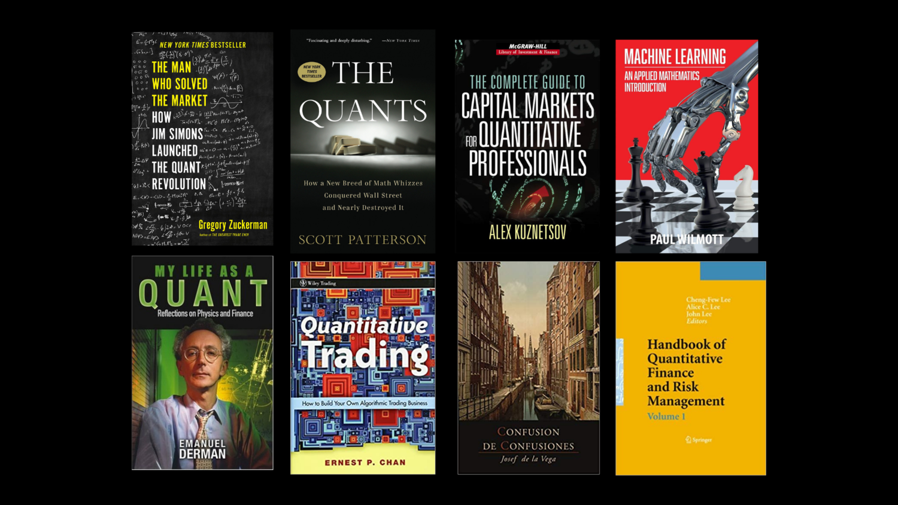

## Table of Contents

## What is quantitative finance and why is it important?

Quantitative finance, often called "quant finance," is a field that uses math and computer skills to solve money-related problems. It helps people and companies make smart choices about things like investing, trading, and managing risks. People who work in quant finance, called quants, use numbers and data to predict how markets will move and to find the best ways to make money or avoid losing it.

This field is important because it makes financial decisions more accurate and less risky. By using math and computers, quants can find patterns and trends that might be hard to see otherwise. This helps banks, investment firms, and other businesses make better choices about where to put their money. As a result, quant finance helps the whole economy work better and can lead to more stable and profitable financial markets.

## What are the basic mathematical concepts needed for quantitative finance?

To understand quantitative finance, you need to know some basic math concepts. One important concept is probability, which helps you figure out how likely something is to happen. This is crucial for predicting how markets might move or how risky an investment could be. Another key idea is statistics, which involves collecting and analyzing data to make sense of it. You use statistics to look at past market data and make guesses about the future. Calculus is also important because it helps you understand how things change over time, which is useful for figuring out how the value of investments might grow or shrink.

Linear algebra is another math concept you need to know. It deals with vectors and matrices, which are useful for handling lots of data at once. In quant finance, linear algebra helps you solve complex problems and model financial systems. Finally, understanding optimization techniques is key because they help you find the best solutions to problems. For example, you might use optimization to figure out the best way to invest your money to get the highest return with the least risk. These math concepts form the foundation of the tools and methods used in quantitative finance.

## How can one start learning programming for quantitative finance?

To start learning programming for quantitative finance, you should begin with a language like Python. Python is popular in this field because it's easy to learn and has lots of tools that are useful for finance work. Start by learning the basics of Python, like how to write simple programs, work with numbers, and use loops and functions. There are many free online courses and tutorials that can help you get started. Once you feel comfortable with the basics, you can move on to learning libraries like NumPy and pandas, which are used a lot in quantitative finance for handling data and doing math.

After getting a good grasp of Python and its libraries, you should start practicing with real financial data. You can find datasets online or use APIs from financial websites to get stock prices and other information. Try writing programs that analyze this data, like calculating returns or making simple predictions. This hands-on practice will help you understand how to apply your programming skills to real-world finance problems. As you get better, you can explore more advanced topics like [machine learning](/wiki/machine-learning) with libraries like scikit-learn, which can help you build more complex models for financial analysis.

Remember, learning to program for quantitative finance takes time and practice. Don't be discouraged if things seem hard at first. Keep working on small projects, and gradually take on more challenging tasks. Joining online communities or forums can also be helpful, as you can learn from others and get advice on your projects. With persistence and practice, you'll become proficient in using programming to tackle problems in quantitative finance.

## What are the key financial instruments and markets a beginner should understand?

To start understanding quantitative finance, a beginner should know about stocks and bonds. Stocks are pieces of ownership in a company. When you buy a stock, you own a little bit of that company and can make money if the company does well. Bonds are like loans you give to a company or government. They pay you back with interest over time. Both stocks and bonds are traded on stock markets, like the New York Stock Exchange. These markets are places where people buy and sell these financial instruments. Understanding how stocks and bonds work and how they are traded is a good first step in learning about finance.

Another important thing to learn about is derivatives. Derivatives are financial contracts that get their value from something else, like the price of a stock or a commodity like oil. Common types of derivatives are options and futures. Options give you the right to buy or sell something at a set price in the future, while futures are agreements to buy or sell something at a set price on a specific date. These instruments are traded on special markets called derivatives markets. Learning about derivatives can help you understand more complex financial strategies and how to manage risk.

Lastly, it's helpful to know about foreign exchange markets, often called [forex](/wiki/forex-system) markets. These markets are where different currencies are traded. If you want to buy a currency from another country, you do it on the forex market. Understanding how currency values change and how they affect international trade and investments is important in finance. By learning about these key financial instruments and markets, a beginner can build a solid foundation in quantitative finance.

## What are some fundamental statistical models used in quantitative finance?

In quantitative finance, one of the most basic statistical models is the linear regression model. This model helps you understand how one thing, like a stock price, might depend on other things, like the overall market or economic indicators. It's like trying to see if there's a straight line that can show how these things are related. By using linear regression, you can predict future stock prices based on what you know about the market. It's a simple but powerful tool that helps you make sense of lots of data and find patterns that might not be easy to see otherwise.

Another important model is the time series model, which is used to look at data that changes over time, like daily stock prices. One common type of time series model is the ARIMA model, which stands for AutoRegressive Integrated Moving Average. This model looks at past data to predict future values, taking into account trends and seasonal patterns. It's really useful for forecasting because it can handle the ups and downs that you see in financial markets. By using time series models, you can make better guesses about where prices might go next and plan your investments more carefully.

Lastly, the Black-Scholes model is a key model for pricing options, which are a type of derivative. This model uses math to figure out what an option should be worth based on things like the price of the underlying stock, how much the stock price might move, and how long until the option expires. It's a bit more complex, but it's really important for anyone working with options because it helps them make smart decisions about buying and selling them. Understanding these models can give you a solid foundation in quantitative finance and help you make better financial decisions.

## How do risk management principles apply in quantitative finance?

Risk management is a big part of quantitative finance. It's all about figuring out how much risk you're taking when you invest or trade. Quants use math and computer models to measure risk and try to keep it at a level that's okay for them. They look at things like how much the price of a stock might go up or down, and they use tools like Value at Risk (VaR) to predict the worst-case scenario for how much money they might lose. By understanding and managing risk, quants can make smarter choices and avoid big losses.

One way quants manage risk is by spreading it out, which is called diversification. Instead of putting all their money into one stock or investment, they spread it across many different ones. This way, if one investment does badly, it won't hurt their whole portfolio too much. Quants also use something called hedging to reduce risk. Hedging is like buying insurance for your investments. For example, they might use options or futures to protect against big price swings. By using these risk management principles, quants can make their investments safer and more likely to be successful in the long run.

## What advanced mathematical techniques are used in quantitative finance?

In quantitative finance, people use some really advanced math to solve complex problems. One of these techniques is called stochastic calculus. It's a way to deal with things that change randomly over time, like stock prices. Stochastic calculus helps quants figure out how to price things like options and manage risk in a world where nothing is certain. It's pretty complicated, but it's super important for understanding how markets work and making good financial decisions.

Another advanced technique is Monte Carlo simulation. This method uses random numbers to run lots of different scenarios and see what might happen in the future. For example, quants might use Monte Carlo simulations to predict how a portfolio of investments could perform under different conditions. It's like playing out thousands of possible futures to get a better idea of what could happen. This technique is really useful for risk management and making decisions when there's a lot of uncertainty.

Lastly, quants often use machine learning, which is a type of [artificial intelligence](/wiki/ai-artificial-intelligence). Machine learning helps them find patterns in big sets of data that would be hard to see otherwise. For instance, they might use it to predict stock prices or spot trading opportunities. Machine learning can handle a lot of information and learn from it, making it a powerful tool for making smarter financial decisions. These advanced math techniques help quants do their jobs better and make the financial world more predictable and manageable.

## How can one develop and backtest trading strategies?

To develop a trading strategy, you start by deciding what you want to achieve. Are you looking to make money quickly or over a long time? Once you have your goal, you can think about what rules to follow. For example, you might decide to buy a stock when its price goes above a certain level and sell it when it goes below another level. You can also use math and computer models to help you come up with these rules. After you have your strategy, you need to test it to see if it works. This is where [backtesting](/wiki/backtesting) comes in.

Backtesting is when you use old data to see how your trading strategy would have done in the past. You can get this data from places like stock market websites or financial databases. Then, you use a computer program to run your strategy on this data and see how it would have performed. If your strategy made money in the past, that's a good sign, but it's not a guarantee it will work in the future. You might need to adjust your strategy based on what you learn from backtesting. It's a bit like practicing before playing a real game, helping you get better and more confident in your approach.

## What are the latest trends in algorithmic trading and high-frequency trading?

In [algorithmic trading](/wiki/algorithmic-trading) and high-frequency trading, one big trend is using artificial intelligence (AI) and machine learning more. These technologies help traders make better decisions by finding patterns in huge amounts of data that humans might miss. For example, AI can look at news, social media, and other information to predict how stock prices might change. This makes trading faster and more accurate. Also, more traders are using cloud computing to run their algorithms. This means they can use powerful computers without having to buy them, making it easier and cheaper to trade.

Another trend is the focus on regulation and transparency. Governments and financial watchdogs are making new rules to make sure trading is fair and safe. This means traders have to be more careful about how they use algorithms and report what they're doing. At the same time, there's a push for more transparency, so everyone can see how trades are happening. This helps keep the market honest and can prevent bad behavior. As these trends continue, algorithmic and high-frequency trading will keep changing to be smarter, faster, and more responsible.

## How do machine learning and artificial intelligence impact quantitative finance?

Machine learning and artificial intelligence are making big changes in quantitative finance. They help quants analyze huge amounts of data quickly and find patterns that are hard to see. For example, AI can look at news, social media, and other information to predict how stock prices might change. This makes trading decisions faster and more accurate. Also, machine learning can learn from past trades to improve strategies over time, making them better at making money and managing risk.

Another way AI impacts quantitative finance is by automating tasks that used to take a lot of time. For instance, AI can handle routine tasks like data cleaning and model testing, freeing up quants to focus on more important work. This automation can make the whole process of trading more efficient. As AI and machine learning keep getting better, they will continue to change how quants work, making financial markets smarter and more responsive to new information.

## What are the ethical considerations and regulatory frameworks in quantitative finance?

In quantitative finance, it's important to think about ethics and follow the rules. One big ethical issue is making sure that trading is fair and doesn't hurt other people. Sometimes, people use complex math and computers to make trades very quickly, which can give them an advantage over others. This can be seen as unfair, especially if it leads to big losses for other investors. Quants need to be careful and honest about what they're doing, and they should think about how their actions affect the whole market.

There are also rules that quants need to follow. Governments and financial watchdogs make these rules to keep the market safe and fair. For example, there are rules about how to use algorithms and what information needs to be shared with others. These rules help prevent bad behavior and make sure everyone has a fair chance. As quant finance keeps growing and changing, the rules might change too, so it's important for quants to stay up to date and make sure they're doing things the right way.

## How can one stay updated with the latest research and advancements in quantitative finance?

To stay updated with the latest research and advancements in quantitative finance, you can start by reading financial journals and academic papers. Journals like the Journal of Financial Economics, the Journal of Financial and Quantitative Analysis, and the Quantitative Finance journal often have new research and studies. You can access these through university libraries or online databases like JSTOR or SSRN. Also, many universities and research institutions share their latest findings on their websites, so it's a good idea to follow those that focus on finance and economics.

Another way to keep up with the field is by joining professional organizations and attending conferences. Groups like the International Association of Financial Engineers (IAFE) and the Quantitative Finance Association (QFA) offer resources, webinars, and networking opportunities. Conferences and workshops are great places to learn about new techniques and meet other people who are working on similar problems. You can also follow blogs and newsletters from experts in the field, like the Wilmott blog or the Quantopian blog, which often discuss the latest trends and technologies in quantitative finance. By staying active in these communities, you'll be able to keep up with the fast-changing world of quant finance.

## What books are available on Risk Management and Psychological Aspects?

'The Psychology of Trading' by Brett N. Steenbarger is a crucial work for traders aiming to enhance their understanding of emotional and psychological influences on their trading behavior. This book provides a detailed exploration of the psychological aspects that can significantly affect decision-making and performance in trading activities. Steenbarger investigates into common emotional pitfalls, such as fear and greed, and offers practical strategies to overcome these challenges. The book underscores the importance of self-awareness and emotional regulation, promoting a mindset that supports effective decision-making and risk-taking. Through case studies and psychological insights, readers learn to cultivate the mental resilience required for successful trading in volatile markets.

On the risk management front, 'Value at Risk: The New Benchmark for Managing Financial Risk' by Philippe Jorion is an essential resource for understanding financial risks associated with trading. Jorion's book introduces the Value at Risk (VaR) methodology, a statistical approach that quantifies the potential financial loss in a portfolio over a specified period, given normal market conditions. VaR is expressed as:

$$
\text{VaR} = \mu + z \times \sigma
$$

where $\mu$ is the expected return, $z$ is the z-score corresponding to the desired confidence level, and $\sigma$ is the standard deviation of portfolio returns. Jorion provides comprehensive insights into implementing VaR, discussing its strengths and limitations, and how it can be integrated into a broader risk management framework. This book is invaluable for traders seeking to understand and manage the inherent risks in their portfolios.

Both [books](/wiki/algo-trading-books) are critical as they provide frameworks for recognizing and mitigating the psychological and financial risks inherent in trading. By integrating the insights from Steenbarger and Jorion, traders can develop a more holistic approach to risk management, balancing the quantitative assessment of risk with an understanding of human factors. This dual perspective on risk is fundamental to achieving sustained success in the highly competitive world of algorithmic trading. Understanding these dimensions not only enhances trading strategies but also builds the psychological fortitude needed to navigate fluctuating financial markets.

## References & Further Reading

[1]: Bell, S. ["Quantitative Finance for Dummies"](https://www.amazon.com/Quantitative-Finance-Dummies-Steve-DPhil/dp/1118769465) by Steve Bell

[2]: Hull, J. C. ["Options, Futures, and Other Derivatives"](https://www-2.rotman.utoronto.ca/~hull/ofod/index.html) by John C. Hull

[3]: Chan, E. P. ["Algorithmic Trading: Winning Strategies and Their Rationale"](https://github.com/ftvision/quant_trading_echan_book) by Ernest P. Chan

[4]: Chan, E. P. ["Quantitative Trading: How to Build Your Own Algorithmic Trading Business"](https://github.com/ftvision/quant_trading_echan_book) by Ernest P. Chan

[5]: Hilpisch, Y. ["Python for Finance"](https://books.google.com/books/about/Python_for_Finance.html?id=2qd9DwAAQBAJ) by Yves Hilpisch

[6]: López de Prado, M. ["Machine Learning for Asset Managers"](https://www.cambridge.org/core/elements/machine-learning-for-asset-managers/6D9211305EA2E425D33A9F38D0AE3545) by Marcos López de Prado

[7]: Steenbarger, B. N. ["The Psychology of Trading"](https://www.amazon.com/Psychology-Trading-Techniques-Minding-Markets/dp/0471267619) by Brett N. Steenbarger

[8]: Jorion, P. ["Value at Risk: The New Benchmark for Managing Financial Risk"](https://books.google.com/books/about/Value_at_Risk_3rd_Ed.html?id=nnblKhI7KP8C) by Philippe Jorion