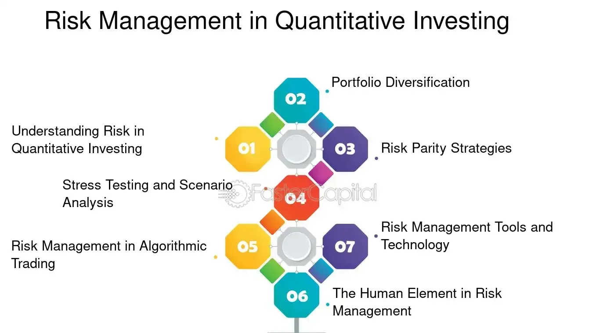

## Table of Contents

## What are quantitative funds and how do they differ from traditional funds?

Quantitative funds, often called quant funds, are a type of investment fund that uses mathematical models and computer algorithms to make investment decisions. Instead of relying on human judgment and traditional research, these funds use data and numbers to pick stocks, bonds, or other assets. The idea is to remove human emotions and biases from the investment process, aiming for more consistent and predictable results.

Traditional funds, on the other hand, are managed by human fund managers who use their experience, market knowledge, and research to choose investments. These managers often look at company reports, economic trends, and other qualitative factors to make their decisions. The main difference between quant funds and traditional funds is the approach: quant funds rely on data-driven models, while traditional funds depend more on human analysis and intuition. Both types of funds aim to grow investors' money, but they go about it in different ways.

## How do quantitative funds use algorithms and data analysis in their operations?

Quantitative funds use algorithms and data analysis to make smart investment choices. They collect a lot of data from different places, like stock prices, company financials, and even news articles. Then, they use computers to look at this data and find patterns or trends that might not be easy for people to see. These patterns help the funds decide which stocks or other investments to buy or sell. The algorithms are like recipes that tell the computer what to do with the data, and they can be very complicated, using math and statistics to make predictions.

The main goal of using algorithms and data analysis is to make better and faster decisions than a human could. For example, a quant fund might use an algorithm to figure out if a stock is likely to go up or down based on past data. If the algorithm says the stock will go up, the fund might buy it. If it says the stock will go down, the fund might sell it or avoid buying it. This process happens quickly and can be done for many stocks at the same time, which is something a human would find hard to do. By using data and algorithms, quant funds try to take the guesswork out of investing and make choices based on numbers and facts.

## What are the common strategies employed by quantitative funds?

Quantitative funds use different strategies to make money. One common strategy is called statistical arbitrage. This means they look for small differences in prices of similar stocks or other assets. They buy the cheaper one and sell the more expensive one, hoping to make a profit when the prices get back to normal. Another strategy is called factor investing. This is when they pick stocks based on certain characteristics, like how big the company is or how much it grows. They believe these characteristics can help predict which stocks will do well.

Another strategy is called trend following. This is when the fund looks at past price movements to guess where prices might go next. If a stock has been going up, they might buy it, thinking it will keep going up. If it's been going down, they might sell it or avoid buying it. Lastly, there's risk parity. This strategy tries to balance the risk in the fund by putting money into different types of investments. The idea is to spread out the risk so that if one investment does badly, the others might do well and balance it out. These strategies help quant funds make decisions without relying on human emotions.

## How is performance measured in quantitative funds?

Performance in quantitative funds is measured by looking at how much money the fund makes or loses over time. The most common way to do this is by calculating the fund's return. This is usually shown as a percentage and tells you how much the value of the fund has gone up or down. For example, if a fund starts with $100 and grows to $110, the return is 10%. People also look at the fund's performance compared to a benchmark, like a stock market index. If the fund does better than the benchmark, it's seen as doing well.

Another important measure is risk. Quantitative funds use something called risk-adjusted return to see how much return they get for the amount of risk they take. A common way to measure this is with the Sharpe ratio. This ratio looks at the fund's return and subtracts the risk-free rate (like what you'd get from a safe investment like a government bond) and then divides by the fund's volatility (how much the fund's value goes up and down). A higher Sharpe ratio means the fund is doing a good job of making money without taking too much risk. By looking at both return and risk, people can get a good idea of how well a quantitative fund is performing.

## What are the key performance indicators (KPIs) for quantitative funds?

The main way to measure how well a quantitative fund is doing is by looking at its return. Return is how much money the fund makes or loses over time, shown as a percentage. If a fund starts with $100 and grows to $110, the return is 10%. People also compare the fund's return to a benchmark, like a stock market index. If the fund does better than the benchmark, it's seen as doing well. This helps investors see if the fund is making money and if it's doing better than just following the market.

Another important thing to look at is risk. Quantitative funds use something called risk-adjusted return to see how much return they get for the amount of risk they take. A common way to measure this is with the Sharpe ratio. This ratio looks at the fund's return, subtracts the risk-free rate (like what you'd get from a safe investment like a government bond), and then divides by the fund's volatility (how much the fund's value goes up and down). A higher Sharpe ratio means the fund is doing a good job of making money without taking too much risk. By looking at both return and risk, people can get a good idea of how well a quantitative fund is performing.

## Can you explain the risk management techniques used in quantitative funds?

Quantitative funds use different ways to manage risk. One way is by using something called stop-loss orders. This means they set a rule to sell a stock if it goes down to a certain price. This helps them avoid losing too much money on one investment. Another way is called diversification. This is when they spread their money across many different types of investments, like stocks, bonds, and other things. By doing this, if one investment does badly, the others might do well and balance it out.

Another important technique is called risk parity. This is when the fund tries to balance the risk in the fund by putting money into different types of investments based on how risky they are. The idea is to make sure the risk is spread out evenly. They also use something called value at risk (VaR). This helps them guess the most they could lose in a certain time, like a day or a week. By knowing this, they can make better decisions about how much risk to take. These techniques help quantitative funds try to make money while keeping the risk under control.

## What are the typical sources of data used by quantitative funds?

Quantitative funds use a lot of different data to make their investment choices. They look at stock prices and trading volumes from stock markets. They also use financial reports from companies, which tell them about the company's earnings, debts, and other important numbers. Economic data, like unemployment rates and inflation numbers, is another big source. They even use news articles and social media posts to see what people are saying about different companies and the economy.

Sometimes, they use special data that might not be easy to get, like satellite images to see how busy a company's parking lot is, or credit card data to see how much people are spending. All this data helps them find patterns and make predictions about which investments might do well. By using so many different types of data, quantitative funds try to make the best choices possible.

## How do quantitative funds handle market volatility and economic cycles?

Quantitative funds use special ways to deal with market ups and downs and changes in the economy. They use math models and computer programs to look at lots of data and find patterns. This helps them guess what might happen next in the market. When the market gets bumpy, they might use something called stop-loss orders. This means they set a rule to sell a stock if it goes down to a certain price. This helps them not lose too much money on one investment. They also spread their money across many different types of investments, like stocks, bonds, and other things. This way, if one investment does badly, the others might do well and balance it out.

Another way they handle market changes is by using something called risk parity. This means they try to balance the risk in the fund by putting money into different types of investments based on how risky they are. They also use a tool called value at risk (VaR) to guess the most they could lose in a certain time, like a day or a week. By knowing this, they can make better decisions about how much risk to take. All these methods help quantitative funds try to make money even when the market is going up and down or the economy is changing.

## What are the potential pitfalls and limitations of quantitative fund strategies?

One big problem with quantitative funds is that they rely a lot on math and computers. If the data they use is wrong or not complete, their predictions can be off. Also, the models they use might not work well if the market changes in a way they didn't expect. For example, if there's a big event like a financial crisis, the models might not be able to handle it because they were built using data from normal times. This can lead to big losses if the fund keeps following the model without changing it.

Another issue is that many quantitative funds use similar strategies and data. This can lead to a problem called "crowding," where lots of funds are buying and selling the same things at the same time. If something goes wrong, like a sudden drop in the market, all these funds might try to sell at once, making the drop even worse. Also, because these funds use computers to make quick trades, they can sometimes cause the market to move in ways that are hard to predict. This can make the market more volatile and risky for everyone.

## How do regulatory environments affect the operation of quantitative funds?

Regulatory environments can have a big impact on how quantitative funds work. Different countries have different rules about what these funds can and can't do. For example, some places might have strict rules about how much risk a fund can take or what kinds of investments they can make. These rules are there to protect investors and keep the market fair, but they can also make it harder for quant funds to use their strategies. If a fund can't use certain data or make certain trades because of the rules, it might not be able to make as much money as it could otherwise.

Also, regulators often want to know a lot about how quant funds make their decisions. They might ask for detailed reports on the models and algorithms the funds use. This can be a lot of work for the funds, and it might slow them down. Sometimes, the rules change, and funds have to quickly change their strategies to follow the new rules. This can be tricky and might lead to mistakes. Overall, while regulations are important for keeping things safe and fair, they can also make it harder for quantitative funds to do their best work.

## What advanced technologies are being integrated into quantitative funds to enhance performance?

Quantitative funds are using new technologies like artificial intelligence (AI) and machine learning to get better at picking investments. AI helps these funds look at huge amounts of data quickly and find patterns that people might miss. Machine learning lets the funds learn from past data and get better over time. This means they can make smarter choices about which stocks to buy or sell. Some funds also use something called natural language processing to read news articles and social media posts. This helps them understand what people are saying about different companies and the economy, which can be useful for making investment decisions.

Another technology that's becoming more common is called big data analytics. This lets quant funds use even more data than before, like satellite images or credit card spending data. By looking at all this information, they can get a better picture of what's happening in the market. Also, some funds are using blockchain technology to make their trading faster and more secure. Blockchain can help them keep track of their trades and make sure everything is done correctly. All these new technologies help quantitative funds try to make more money for their investors by making better and faster decisions.

## How can investors evaluate the historical performance and future potential of quantitative funds?

Investors can look at the past performance of quantitative funds by checking their returns over time. They can see how much money the fund made or lost in different years and compare it to a benchmark, like a stock market index. If the fund did better than the benchmark, it's a good sign. They can also look at the fund's risk-adjusted return, which shows how much return the fund got for the amount of risk it took. A common way to measure this is with the Sharpe ratio. A higher Sharpe ratio means the fund did a good job of making money without taking too much risk. By looking at these numbers, investors can get a good idea of how well the fund has done in the past.

To guess how well a quantitative fund might do in the future, investors need to think about the fund's strategy and the people running it. They should check if the fund's strategy makes sense and if it has worked well in the past. They can also look at the team behind the fund to see if they have a good track record and know a lot about using data and computers to pick investments. It's also important to think about how the fund might handle different market conditions, like when the market goes up and down a lot or when the economy changes. By putting all this information together, investors can make a better guess about whether the fund will do well in the future.

## References & Further Reading

[1]: Bergstra, J., Bardenet, R., Bengio, Y., & Kégl, B. (2011). ["Algorithms for Hyper-Parameter Optimization."](https://dl.acm.org/doi/10.5555/2986459.2986743) Advances in Neural Information Processing Systems 24.

[2]: ["Advances in Financial Machine Learning"](https://www.amazon.com/Advances-Financial-Machine-Learning-Marcos/dp/1119482089) by Marcos Lopez de Prado.

[3]: ["Evidence-Based Technical Analysis: Applying the Scientific Method and Statistical Inference to Trading Signals"](https://www.amazon.com/Evidence-Based-Technical-Analysis-Scientific-Statistical/dp/0470008741) by David Aronson.

[4]: ["Machine Learning for Algorithmic Trading"](https://github.com/stefan-jansen/machine-learning-for-trading) by Stefan Jansen.

[5]: ["Quantitative Trading: How to Build Your Own Algorithmic Trading Business"](https://github.com/LucindaYa/quant-resources/blob/master/Quantitative%20Trading%20How%20to%20Build%20Your%20Own%20Algorithmic%20Trading%20Business.pdf) by Ernest P. Chan.