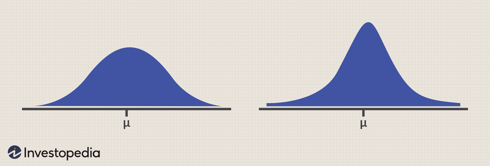

Investment in quantitative funds and algorithmic trading has surged in recent years, reflecting a broader trend towards data-driven investment strategies. Quantitative funds, or quant funds, rely on sophisticated mathematical models to analyze vast amounts of data, making investment decisions that are less subject to human bias and error. These funds use algorithms to systematically buy and sell financial instruments, often executing trades at a speed and volume that would be impossible for human traders to match.

The unique aspect of quant funds lies in their reliance on quantitative analysis rather than traditional forms of qualitative judgment. Unlike conventional funds managed by individuals or teams making decisions based on economic indicators and expert insights, quant funds utilize advanced statistical methods and computational power to predict market movements. This shift has been facilitated by the growth in data availability and improvements in computing technology, allowing for more precise modeling and forecasting.



Algorithmic trading, a core component of quantitative investing, employs algorithms to parse market data, identify trading opportunities, and execute trades at speeds unattainable by human traders. The precision and speed of algorithmic trading can enhance market efficiency and liquidity but also introduce new risks. High-frequency trading, a subset of algorithmic trading, executes a large number of orders at very high speeds, capitalizing on the smallest price discrepancies, which requires robust technical infrastructure.

Investors engaging with quant funds and algorithmic trading must understand the associated risks and rewards. While these strategies offer the potential for high returns, they also carry risks such as market volatility, model errors, and systemic failures, as seen in past events like the Flash Crash of 2010. Assessing these risks is crucial for investors aiming to leverage the power of data-driven models in the rapidly evolving financial landscape.

In summary, quantitative funds and algorithmic trading are reshaping modern investment approaches, offering innovative methods for capitalizing on market opportunities. However, investors must consider the potential risks and develop a deep understanding of these strategies to effectively harness their capabilities. With careful consideration and robust risk management, quant funds and algorithmic trading can be valuable tools in an investor's portfolio.

## Table of Contents

## Understanding Quantitative Funds

Quantitative funds are investment vehicles that leverage sophisticated mathematical models to make investment decisions, differentiating themselves from traditional funds that primarily rely on human judgment. The core principle of quantitative funds is to utilize quantitative analysis, which involves the use of statistical models, algorithms, and large datasets to predict price movements and identify investment opportunities.

The origins of quantitative funds can be traced back to the mid-20th century when pioneering work in financial economics and advanced computing techniques began to converge. The development of the Efficient Market Hypothesis (EMH) and Modern Portfolio Theory (MPT) laid the groundwork for quantitative investing. The introduction of computers in financial markets during the 1970s and 1980s marked the beginning of algorithm-driven trading strategies. Firms like Renaissance Technologies, founded in 1982, were among the early adopters who used quantitative approaches to consistently generate high returns.

Initially, quantitative funds were considered niche due to the specialized knowledge and computational resources required to implement complex models. They gained popularity as advancements in data availability and financial technology provided more tools and data to refine these models. The widespread adoption of the internet in the 1990s and the subsequent explosion of data availability allowed quantitative funds to process an enormous [volume](/wiki/volume-trading-strategy) of data, leading to more accurate and reliable models.

Quantitative funds have significantly influenced the broader investment landscape by demonstrating that consistent returns can be achieved through systematic methods rather than solely relying on discretionary decision-making. These funds often employ various strategies, from high-frequency trading, which exploits short-term market disparities, to long-term trend-following and risk parity strategies that aim to balance risk more effectively across different asset classes.

The reliance on complex algorithms means quantitative funds continuously evolve. The introduction of [machine learning](/wiki/machine-learning) techniques and [artificial intelligence](/wiki/ai-artificial-intelligence) has further enabled these funds to identify subtle patterns in financial data that were previously undetectable. This adaptability allows quant funds to thrive in different market environments, contributing to their transition from a niche to a mainstream investment strategy.

In summary, quantitative funds stand out for their systematic, data-driven approach to investing, utilizing mathematical models and computational tools to optimize investment decisions. Their evolution from niche products to essential components of modern investment portfolios underscores their transformative impact on financial markets.

## Performance of Quantitative Funds

Quantitative funds have historically exhibited robust performance, bolstered by their data-driven investment strategies. These funds leverage complex mathematical models and vast data sets to guide investment decisions, often outperforming traditional investment approaches due to their systematic and emotionless strategies. Nevertheless, since 2016, quantitative funds have encountered challenges that have led to periods of underperformance.

### Historical Performance Metrics

Historically, quantitative funds have been successful in capturing market inefficiencies through various strategies, such as statistical [arbitrage](/wiki/arbitrage) and [momentum](/wiki/momentum) trading. During the early 2000s, quant funds experienced significant success, buoyed by the increase in computational power and data availability, which allowed for more sophisticated models. A key metric used to assess the performance of quantitative funds is the Sharpe Ratio, which measures risk-adjusted return. Many quant funds have demonstrated high Sharpe Ratios, indicating superior risk management and consistent returns relative to the level of risk undertaken.

### Key Periods of Success and Challenges

The success of quantitative funds can be highlighted in certain key periods. For instance, during the global financial crisis of 2007-2008, some quant funds managed to deliver positive returns by betting against conventional market trends using algorithmic insight. Similarly, the fast-paced market environment of the early 2010s proved conducive to quant strategies as markets were highly liquid and data-rich.

However, post-2016, quant funds faced several headwinds. Market conditions became increasingly unpredictable, partly due to geopolitical uncertainties, shifts in monetary policy, and increased market competition. The proliferation of machine learning and artificial intelligence meant that edge gained from traditional quant methods diminished as many funds adopted similar strategies. Additionally, anomalies that quant models historically exploited became less frequent or disappeared entirely as markets evolved.

### Impact of Market Conditions

Quantitative fund performance is highly sensitive to market conditions. These funds thrive in environments with clear trends and high [liquidity](/wiki/liquidity-risk-premium), which allow their algorithms to capitalize on predictable patterns. Conversely, in volatile or sideways-moving markets, quant strategies can struggle. The diminishing return environment post-2016 was characterized by low [volatility](/wiki/volatility-trading-strategies) and frequent market corrections, which challenged quant funds reliant on trend-following strategies.

Furthermore, regulatory changes and increased scrutiny post-2008 crisis imposed additional operational constraints on quantitative funds. This period also saw an increased emphasis on risk management, leading many funds to adopt more conservative positions, which may have contributed to underperformance in bull market phases.

### Recent Trends and Adaptations

Despite these challenges, some quant funds have begun to adapt by integrating advanced technologies such as machine learning that offer predictive analytics capabilities and adaptive model learning. These enhancements promise to refine strategy execution and potentially recapture lost performance edge.

In conclusion, while the allure of quantitative funds remains strong due to their potential for high returns and risk management capabilities, understanding the dynamic nature of market conditions and continuous adaptation of strategies is essential for maintaining their performance edge. Quant funds must stay ahead of the ever-changing investment landscape, leveraging innovation to navigate the complexities of modern markets effectively.

## Algorithmic Trading in Quant Funds

Algorithmic trading is a cornerstone of quantitative funds, leveraging sophisticated algorithms to execute trades with high speed and volume. This capability is critical in today's fast-paced financial markets, where fractions of a second can significantly influence trading outcomes. 

Algorithmic strategies are crafted through a combination of advanced mathematics, financial theory, and computer science. These algorithms are designed to identify patterns or inefficiencies within market data, enabling traders to capitalize on them through automated processes. A fundamental aspect of [algorithmic trading](/wiki/algorithmic-trading) involves the reliance on high-frequency trading ([HFT](/wiki/high-frequency-trading-strategies)), which allows for the rapid execution of trades, often in milliseconds. HFT firms deploy complex infrastructure, including co-location with exchanges, to minimize latency in trade execution, gaining competitive edges.

Several common strategies underpin algorithmic trading within quantitative funds:

1. **Statistical Arbitrage**: This strategy identifies price discrepancies between related financial instruments. For instance, if two historically correlated stocks show divergence in price, an arbitrageur might simultaneously buy the underpriced stock and sell the overpriced one, expecting convergence. Mathematically, practitioners often use the Johansen cointegration test to identify pairs or ensembles of assets that exhibit a statistically significant relationship.

   In Python, one could implement a basic cointegration test using:
   ```python
   from statsmodels.tsa.stattools import coint

   # Simulated data for two price series
   series_1 = ...
   series_2 = ...

   # Perform cointegration test
   coint_t, p_value, _ = coint(series_1, series_2)

   if p_value < 0.05:
       print("The series are cointegrated.")
   ```

2. **Mean Reversion**: This assumes that asset prices will revert to their historical average over time. For example, if a stock price deviates significantly from its historical mean, a mean reversion strategy might involve buying the stock with the expectation that it will return to its average price. This can be quantitatively modeled using Bollinger Bands, which provide upper and lower thresholds around a moving average.

3. **Momentum Trading**: This strategy capitalizes on the continuation of existing market trends. The core premise is that stocks showing upward price momentum are likely to continue rising, while those with downward momentum will likely continue falling. Momentum can be quantitatively assessed using indicators like the Moving Average Convergence Divergence (MACD) or the Relative Strength Index (RSI).

Crafting algorithmic trading strategies demands a robust technical infrastructure. This includes data feeds, order management systems, and risk management platforms that operate seamlessly. Developers frequently employ languages like Python for [backtesting](/wiki/backtesting) strategies due to its extensive libraries and ease of use, and C++ for live execution owing to its execution speed and performance efficiency.

Algorithmic trading within quantitative funds thus represents a fusion of technology, mathematics, and strategic sophistication, enabling investors to exploit market dynamics with precision and speed.

## Risk Assessment of Algo Trading and Quant Funds

Both quantitative funds and algorithmic trading involve significant risks that can impact investment outcomes. These risks are categorized into market, model, operational, and regulatory risks, each requiring careful management.

### Market Risk

Market risk refers to the potential for losses due to movements in market prices. Quant funds and algorithmic trading strategies often leverage large data sets to predict market trends, but they remain susceptible to unforeseen economic events or market conditions, such as financial crises or sudden geopolitical developments. Market risk is an inherent part of trading and can lead to substantial financial losses if not effectively hedged.

### Model Risk

Model risk arises from the potential for inaccuracies or errors in the mathematical models used to make trading decisions. Quantitative funds rely heavily on these models to analyze data and forecast market movements. An incorrect model can result in poor investment decisions and financial losses. This risk was notably illustrated in the Long-Term Capital Management (LTCM) collapse in 1998. LTCM used sophisticated mathematical models that significantly underestimated the likelihood of multiple adverse market movements occurring simultaneously, leading to catastrophic losses and the eventual bailout by other financial institutions. This event underscores the importance of regularly testing and validating models to ensure their accuracy and reliability.

### Operational Risk

Operational risk stems from the technical infrastructure and processes that support algo trading. Risks include software bugs, hardware failures, and network issues that can interrupt trading activities. Moreover, human errors in coding or deploying algorithms can lead to unintended market positions. Establishing robust operational protocols and infrastructure is critical to mitigate these risks. Regular audits, maintaining fail-safe mechanisms, and employing redundancy systems are strategies to reduce operational risk.

### Regulatory Risk

Regulatory risk involves exposure to changes in laws and regulations that govern trading activities. Algorithmic trading strategies are subject to rules set by financial authorities to ensure market fairness and stability. Compliance failures can result in legal penalties, financial losses, and reputational damage. As such, monitoring regulatory developments and maintaining compliance with existing regulations is essential for quant funds and trading firms.

### Risk Management Techniques

Effective risk management is crucial for the success of quantitative funds and algorithmic trading strategies. Several techniques are commonly utilized:

- **Diversification:** Distributing investments across various instruments and markets reduces exposure to any single source of risk. Diverse portfolios can mitigate the impact of adverse movements in individual market segments.

- **Risk Control:** Implementing stop-loss orders and other risk control measures can limit potential losses. These mechanisms provide a safety net against market volatility.

- **Regulation and Compliance:** Staying informed about regulatory changes and incorporating compliance checks into trading systems helps in avoiding legal issues. Automated compliance solutions can ensure that trading activities conform to regulatory standards.

In conclusion, while quantitative funds and algorithmic trading present considerable risks, thorough risk assessment and management practices can mitigate these challenges, potentially leading to successful investment outcomes.

## The Future of Algorithmic Trading and Quant Funds

As technology and data continue to advance, quantitative funds and algorithmic trading are poised for significant transformation. The integration of machine learning (ML) and artificial intelligence (AI) stands out as a major trend expected to redefine quant strategies. These technologies allow for the development of more adaptive algorithms capable of learning from vast datasets without explicit instructions. Traditional algorithms often rely on predefined rules; however, ML models learn from data patterns, making them more efficient in handling complex, non-linear relationships prevalent in financial markets.

### Machine Learning and Artificial Intelligence

Machine learning models like neural networks and [reinforcement learning](/wiki/reinforcement-learning) are increasingly used in quantitative strategies. Neural networks are particularly effective in pattern recognition tasks, such as predicting stock price movements or volatility estimation. Reinforcement learning, on the other hand, can be used to create algorithms that make sequence-based trading decisions by maximizing expected returns over time. These models learn optimal actions through a trial-and-error approach, adjusting their strategies based on market dynamics. A simple Python code to demonstrate reinforcement learning in trading could look like this:

```python
import numpy as np

class TradingAgent:
    def __init__(self, state_size, action_size):
        self.state_size = state_size
        self.action_size = action_size
        self.q_table = np.zeros((state_size, action_size))

    def choose_action(self, state, epsilon):
        if np.random.rand() <= epsilon:
            return np.random.choice(self.action_size)  # Explore action space
        return np.argmax(self.q_table[state])  # Exploit learned values

    def learn(self, state, action, reward, next_state, alpha, gamma):
        q_predict = self.q_table[state, action]
        q_target = reward + gamma * np.max(self.q_table[next_state])
        self.q_table[state, action] += alpha * (q_target - q_predict)

# Example usage
agent = TradingAgent(state_size=10, action_size=3)
```

### Potential Trends and Innovations

1. **Big Data Analytics**: As financial markets produce enormous quantities of data, the ability to process and analyze big data efficiently allows quantitative funds to identify subtle market inefficiencies. Natural language processing (NLP) is helping funds analyze unstructured data from news articles and social media, enhancing sentiment analysis.

2. **Increased Use of Alternative Data**: Beyond price and volume data, quant funds are leveraging alternative data sources such as satellite imagery, weather forecasts, and web traffic statistics to gain additional insights into market trends. This could lead to more diversified and informed investment strategies.

3. **Quantum Computing**: Although still in its infancy, quantum computing promises to exponentially increase data processing capabilities. This could revolutionize optimization processes in portfolio management and risk assessment, enabling real-time solutions to complex financial models.

4. **Enhanced Risk Management Techniques**: Innovations in AI are likely to create more sophisticated risk management frameworks. Algorithms could become better at predicting and mitigating financial risks, customizing strategies based on fluctuating market conditions.

### Recommendations for Investors

To capitalize on these trends, investors should focus on a few key strategies:

- **Embrace Continuous Learning**: Keeping abreast of technological advancements and understanding new financial models is crucial. Investors should seek out educational resources and training in ML and AI to understand how these tools can be applied in investment strategies.

- **Diversify Technological Exposure**: Allocate resources to a mix of traditional and cutting-edge quant strategies to balance potential high-reward opportunities with established methodologies. Diversification can mitigate the risks associated with rapidly evolving technologies.

- **Collaborate with Technology Experts**: Partnering with data scientists and tech experts can enhance the development and implementation of advanced trading algorithms. Leveraging their expertise ensures that trading strategies are well-grounded in the latest technology developments.

- **Focus on Robust Infrastructure**: As algorithmic trading becomes more complex, ensuring a robust and secure technical infrastructure is essential. This involves investments in high-performance computing systems and cybersecurity measures to protect trading operations.

By aligning investment strategies with these technological advancements, investors are well-positioned to benefit from the evolving landscape of quantitative investing and algorithmic trading. As these technologies mature, they will offer unprecedented opportunities for innovation and efficiency in the market.

## Conclusion

Quantitative funds and algorithmic trading have emerged as pivotal components of modern investment strategies, presenting significant opportunities for investors. These approaches offer the potential for high returns by leveraging advanced mathematical models and data-driven techniques. However, with these opportunities come considerable risks that investors must prudently evaluate.

A comprehensive understanding of both the benefits and risks associated with quantitative funds is crucial for investors. These funds, while potentially profitable, expose investors to various risks such as model risk, market risk, and operational challenges. The collapse of Long-Term Capital Management is a notable example of how model inaccuracies and market anomalies can result in substantial losses, underscoring the need for meticulous risk assessment and management.

To successfully harness the potential of quantitative funds and algorithmic trading, investors should undertake a thorough evaluation of their risk tolerance. This involves identifying the maximum level of loss they are willing to endure and aligning their investment strategy accordingly. Employing robust risk management practices, such as diversification, stress testing, and real-time monitoring, is essential in mitigating potential downsides.

Quantitative investing requires ongoing analysis and adaptation to the evolving financial landscape. Investors need to stay informed about innovations such as machine learning and artificial intelligence, which are continuously reshaping quant strategies. By strategically integrating these advancements, investors can enhance the effectiveness of their algorithmic trading endeavors.

In conclusion, quantitative funds and algorithmic trading represent powerful tools within the modern investment toolkit. They offer promising opportunities for those willing to engage with their complexities and inherent risks. With strategic planning, careful risk management, and an openness to technological advances, investors can position themselves to benefit from the continued evolution and potential rewards of data-driven investment strategies.

## References & Further Reading

[1]: Bergstra, J., Bardenet, R., Bengio, Y., & Kégl, B. (2011). ["Algorithms for Hyper-Parameter Optimization."](https://dl.acm.org/doi/10.5555/2986459.2986743) Advances in Neural Information Processing Systems 24.

[2]: ["Advances in Financial Machine Learning"](https://www.amazon.com/Advances-Financial-Machine-Learning-Marcos/dp/1119482089) by Marcos Lopez de Prado.

[3]: ["Evidence-Based Technical Analysis: Applying the Scientific Method and Statistical Inference to Trading Signals"](https://www.amazon.com/Evidence-Based-Technical-Analysis-Scientific-Statistical/dp/0470008741) by David Aronson.

[4]: ["Machine Learning for Algorithmic Trading"](https://github.com/stefan-jansen/machine-learning-for-trading) by Stefan Jansen.

[5]: ["Quantitative Trading: How to Build Your Own Algorithmic Trading Business"](https://github.com/LucindaYa/quant-resources/blob/master/Quantitative%20Trading%20How%20to%20Build%20Your%20Own%20Algorithmic%20Trading%20Business.pdf) by Ernest P. Chan.