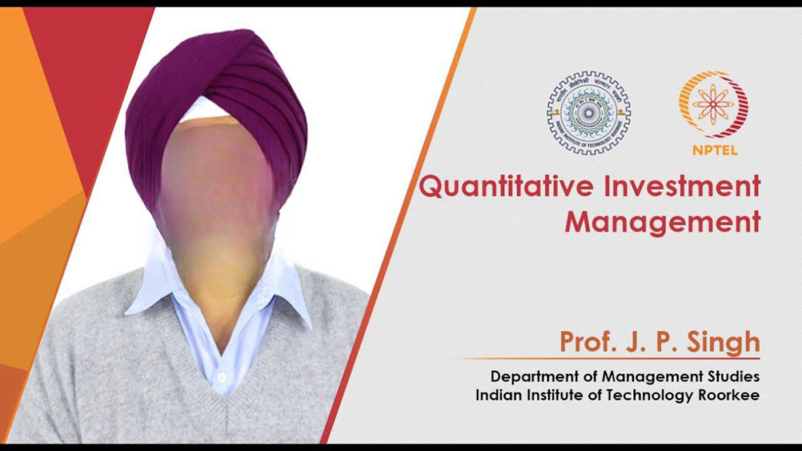

Quantitative investment management and algorithmic trading have revolutionized the landscape of financial markets by leveraging mathematical models, statistical analysis, and computational power to drive investment decisions and automate trading processes. Quantitative investment management refers to the use of quantitative models to analyze and manage investment portfolios. These models employ statistical and mathematical techniques to identify market patterns, optimize asset allocation, and enhance returns. Algorithmic trading, or algo trading, involves the use of computer algorithms to execute trades based on predefined criteria, enabling rapid and efficient transaction processing without human intervention.

Quantitative approaches have gained significant importance in modern financial markets due to their ability to process large volumes of data, minimize human biases, and execute trades with precision. They allow investors to analyze complex patterns and relationships within market data, resulting in more informed decision-making and strategies that can adapt swiftly to changing market conditions.

Algorithmic trading has a rich history that dates back to the 1970s when financial institutions began adopting computer-assisted trading systems. Michael Goodkin's development of the first quantitative trading strategy, known as "Quant," marked a significant turning point in the adoption of technology-driven trading methodologies. The evolution of algorithmic trading accelerated with advances in technology and the internet, enabling real-time data analysis and execution. High-frequency trading (HFT), a subset of algorithmic trading, emerged in the late 1990s, characterized by the use of powerful computers to execute trades within milliseconds, capitalizing on fleeting market opportunities.

The purpose of this article is to provide a comprehensive exploration of quantitative investment management and algorithmic trading. It will delve into the foundational concepts, essential tools and technologies, potential benefits, and inherent risks associated with this innovative approach to finance. The article will also touch upon future trends and challenges that may shape the industry moving forward.

Key concepts in quantitative investment management and algorithmic trading include the formulation of trading strategies based on data-driven insights, reliance on statistical and mathematical models, and the importance of backtesting algorithms to validate their effectiveness. The benefits of these approaches are manifold, including increased efficiency in trade execution, consistency in strategy application, and the potential for superior returns through sophisticated and adaptive techniques.

In conclusion, the integration of quantitative methodologies and algorithmic trading has fundamentally transformed financial markets. As technology continues to evolve, these approaches are expected to further expand their influence, offering both opportunities and challenges for investors and market participants in the pursuit of investment success.

## Table of Contents

## The Basics of Algorithmic Trading

Algorithmic trading, often referred to as algo trading, is the use of computer programs and systems to execute financial market transactions at speeds and frequencies that are impossible for human traders. By utilizing a predefined set of rules based on time, price, [volume](/wiki/volume-trading-strategy), or any other quantitative model, [algorithmic trading](/wiki/algorithmic-trading) enables traders to enhance their market strategies while minimizing manual intervention.

### Core Components of an Algorithmic Trading System

An algorithmic trading system comprises several critical components:

1. **Data Acquisition and Management:** This component involves gathering and cleaning market data necessary for creating and executing trading strategies. Real-time and historical data on prices, volumes, and other market conditions must be accurately captured and stored.

2. **Strategy Formulation:** Involves formulating rules or criteria under which trades will be executed. Strategies can range from simple moving averages to complex statistical arbitrage or machine learning models.

3. **Backtesting Engine:** Evaluating the viability of a trading strategy by testing it against historical market data. This component measures the performance and risk, helping traders refine and optimize their strategies before deploying them in live markets.

4. **Execution Module:** This part manages the actual sending of buy and sell orders to the market exchanges. It includes risk management checks and integrates with brokerage systems to place orders efficiently.

5. **Monitoring and Risk Management:** Continuously supervises the trading system's performance and market conditions to ensure optimal functioning and compliance with the risk parameters.

### Types of Trading Strategies Used in Algo Trading

Algorithmic trading strategies vary widely. Some of the commonly employed methods include:

- **Trend-Following Strategies:** Rely on moving averages and other technical indicators to identify price momentum.

- **Mean Reversion Strategies:** Assume that prices will eventually return to their historical averages and capitalize on any deviations from these averages.

- **Arbitrage Opportunities:** Exploit price differentials of similar financial instruments across different markets or exchanges.

- **Market Making:** Involves the simultaneous placement of buy and sell limit orders to capitalize on the bid-ask spread.

- **Machine Learning-Based Strategies:** Use advanced data analytics and pattern recognition to adapt to changing market conditions.

### Key Terms and Jargon Explained

Understanding algo trading requires familiarity with specific terms:

- **Latency:** The time delay between the initiation and execution of a trade. Lower latency allows for faster trade execution.

- **Slippage:** The difference between the expected price of a trade and the price at which the trade is executed.

- **Execution Risk:** The risk that an order does not get executed at desired prices due to fluctuations in market prices.

- **Order Types:** Refers to different instructions a trader can give a broker, such as market orders, limit orders, or stop-loss orders.

- **Bid-Ask Spread:** The difference between the lowest price a seller is willing to accept and the highest price a buyer is willing to pay.

### Examples of Common Algorithms Used in Financial Markets

- **VWAP (Volume Weighted Average Price):** Used to execute orders in line with the volume distribution of the market, thereby minimizing market impact.

- **TWAP (Time Weighted Average Price):** Attempts to execute orders evenly over a specified time frame to reduce potential market impact.

- **Pair Trading:** Looks for correlated securities that have diverged from their typical correlation patterns, aiming for convergence.

- **Iceberg Orders:** Splits a large order into smaller chunks to hide the actual order size and minimize impact on market prices.

These examples demonstrate the foundational concepts of algorithmic trading and how they are applied in modern financial markets. By automating the trading process, algorithmic trading reduces human errors, optimizes performance, and scales trading across diverse markets and conditions.

## How Quantitative Investment Management Works

Quantitative investment management involves the strategic use of mathematical and statistical models to inform financial decision-making, typically in an automated or semi-automated manner. This approach leverages extensive data analysis to identify profitable opportunities, manage risks, and enhance returns across various asset classes.

Quantitative approaches vary widely but share a foundational reliance on sophisticated data analytics. These methods utilize vast datasets, including market prices, economic indicators, and possibly [alternative data](/wiki/best-alternative-data) sources like social media analytics or satellite imagery. Through systematic analysis, quantitative managers can uncover patterns that are often imperceptible to the human eye, giving them a competitive edge in rapidly analyzing and trading financial instruments.

Statistical models and mathematical theories underpin these quantitative methods. For instance, models might use regression analysis to forecast asset price movements, incorporate mean-variance optimization to balance risk and return, or employ [factor](/wiki/factor-investing) models to evaluate how various risks impact an asset's performance. Machine learning techniques, such as support vector machines or neural networks, have also gained prominence, allowing algorithms to dynamically adapt to changing market conditions.

Signal generation is a critical component of quantitative investment management. It involves the creation of trading signals derived from processed data inputs. These signals suggest buying or selling actions based on pre-defined conditions. For instance, a moving average crossover strategy might generate a buy signal when a short-term moving average crosses above a long-term moving average. Model validation follows signal generation, where models are rigorously backtested using historical data to assess their predictive power and robustness. Validation ensures the model's theoretical performance aligns with real-world results, minimizing overfitting and enhancing reliability.

Discussion of successful quantitative strategies often highlights the achievements of pioneering quantitative hedge funds like Renaissance Technologies, known for their Medallion Fund. This fund has reportedly achieved staggering annual returns by utilizing complex mathematical models and analyses. Another example is AQR Capital Management, which integrates quantitative techniques with insights from economic theory to guide its investments strategy.

Overall, quantitative investment management is characterized by its systematic nature, reliance on data, and integration of advanced statistical techniques. These strategies are pivotal in processing and interpreting large volumes of data, which, combined with robust modeling practices, create sophisticated decision-making frameworks that can adapt to diverse market conditions.

## Tools and Technologies in Algo Trading

Algorithmic trading, a pivotal component of modern financial markets, leverages technology to execute orders based on pre-defined strategies. At the core of this advanced trading domain are various tools and technologies crucial for quantitative managers. These technologies are essential to streamline trading activities, enhance decision-making, and maintain competitiveness in the market.

### Software and Platforms Used by Quantitative Managers

Quantitative managers utilize comprehensive software platforms tailored to meet the demands of algorithmic trading. These platforms facilitate the development, testing, and execution of trading strategies. A popular choice is MetaTrader, which allows for extensive [backtesting](/wiki/backtesting) with historical data and real-time execution. Other professional platforms include TradeStation, [Interactive Brokers](/wiki/interactive-brokers-api) with its API, and Bloomberg Terminal, known for their robustness in data analysis and trading capabilities. These tools integrate features like financial data feeds, statistical analysis, and real-time market monitoring, serving as a backbone for executing quantitative models efficiently.

### Importance of High-Frequency Trading Systems

High-frequency trading ([HFT](/wiki/high-frequency-trading-strategies)) systems are integral in executing a large number of orders at extremely fast speeds, often in milliseconds or microseconds. These systems capitalize on small price discrepancies to generate profits, thus necessitating a technological infrastructure that supports rapid information processing and order execution. Firms engaged in HFT invest heavily in low-latency networks and colocated data centers to shave off microseconds from their trading times, giving them an edge in markets where the speed of execution is a critical factor.

### Role of Big Data and Machine Learning in Algorithmic Trading

Big data and [machine learning](/wiki/machine-learning) technologies have become indispensable in processing and analyzing the massive volumes of data generated in financial markets. These methods ensure that quantitative managers can uncover hidden patterns and predictive signals that traditional analysis might miss. Tools such as Python libraries like Pandas and Scikit-learn, coupled with big data platforms like Apache Hadoop, enable the processing of diverse datasets. Machine learning models, including regression analysis, decision trees, and neural networks, are implemented to identify trends and automate decision-making processes.

### The Impact of AI and Automation Technologies

Artificial intelligence and automation play a transformative role in enhancing the efficiency and sophistication of algorithmic trading systems. AI-driven algorithms can learn from historical data, adapt to changing market conditions, and make autonomous trading decisions with little human intervention. For instance, [reinforcement learning](/wiki/reinforcement-learning)—a subset of AI—enables systems to optimize trading strategies based on feedback from market outcomes. Moreover, natural language processing (NLP) allows systems to analyze news sentiment and make informed trading decisions based on text data.

### Trends and Advancements in Trading Technology

The trading technology landscape is continuously evolving, marked by significant trends and advancements. Quantum computing is on the horizon, promising unparalleled computational power that could revolutionize optimization problems in trading. Blockchain technology is also gaining traction, enabling faster and more secure transaction settlements. Meanwhile, the adoption of edge computing is reducing latency by processing data closer to its source. These technological advancements are expected to further integrate with algorithmic trading systems, offering enhanced capabilities to meet the ever-growing demands of financial markets.

In summary, the arsenal of tools and technologies in algorithmic trading comprises sophisticated software, HFT systems, big data analytics, AI, and cutting-edge technological advancements. Together, these components are vital for crafting effective quantitative strategies and maintaining a competitive edge in the dynamic landscape of financial markets.

## Benefits of Quantitative Investment Management

Quantitative investment management has become a cornerstone of modern finance, offering several advantages over traditional investment methods. One of the primary benefits is increased efficiency and reduced human error. Algorithms execute trades at high speeds with precision, effectively limiting the influence of emotions and individual biases that can adversely impact decision-making. Consequently, this rational approach helps maintain a level of discipline often unattainable through manual trading.

This method leverages powerful data analysis capabilities to parse vast amounts of financial data quickly and accurately. Quantitative models can identify patterns and correlations that may not be readily apparent to human analysts, leading to more informed and objective investment decisions. By processing extensive datasets, these strategies can quickly react to market developments, offering a competitive edge.

Consistency and discipline are fundamental to quantitative investment strategies. Predefined rules and models govern trading decisions, ensuring uniformity across various market conditions. This systematic approach is vital for maintaining strategic focus and adhering to long-term investment goals, avoiding the pitfalls of spontaneous or emotional trading decisions.

Quantitative investment management also holds the potential for higher returns through innovative strategies. By employing sophisticated techniques such as statistical [arbitrage](/wiki/arbitrage), machine learning, and high-frequency trading, quantitative managers can exploit market inefficiencies and achieve superior performance. This innovation allows for the development of unique strategies that differentiate funds in a competitive market.

Numerous examples exist of successful funds utilizing quantitative methods. Renaissance Technologies, for example, is heralded for its Medallion Fund, which consistently generates high returns through its proprietary quantitative models. Similarly, the AQR Capital Management fund employs quantitative techniques to manage billions of dollars in assets, demonstrating the scalability and effectiveness of these methods across global financial markets. These successful implementations illustrate the power and potential of quantitative investment management in delivering substantial benefits within the financial sector.

## Risks and Challenges in Algo Trading

Algorithmic trading, particularly high-frequency trading (HFT), involves considerable risks and challenges that market participants must navigate carefully. 

**Understanding the Risks Associated with High-Frequency Trading**

High-frequency trading utilizes powerful computers to execute large numbers of orders at extremely high speeds. This speed can lead to systemic risks such as "flash crashes," when rapid sell-offs temporarily wipe trillions off the market. Notably, the Flash Crash of May 6, 2010, exemplified these vulnerabilities, where the Dow Jones Industrial Average dropped nearly 1,000 points within minutes. The rise of HFT also raises fairness issues, as only firms with the latest technology and algorithms can compete at these speeds, potentially disadvantaging traditional investors.

**Challenges in Developing and Maintaining Robust Algorithms**

Developing algorithms that consistently yield profits is complex, with challenges stemming from data accuracy, model overfitting, and real-time decision-making under uncertainty. Overfitting occurs when a model is tailored too closely to historical data, failing to predict future market conditions effectively. Continuous testing, often through backtesting on historical data sets, is crucial to ensure reliability. Moreover, financial markets are dynamic, requiring constant algorithm adjustments and improvements.

**Regulatory Concerns and Compliance Issues**

The rapid advancement of algorithmic trading has outpaced regulatory frameworks, leading to oversight challenges. Regulators, such as the U.S. Securities and Exchange Commission (SEC) and the Commodity Futures Trading Commission (CFTC), have introduced initiatives like the Consolidated Audit Trail to monitor market activities more effectively. Firms must ensure compliance with these regulations, which requires comprehensive internal controls and reporting systems to account for their trades' speed and complexity.

**Dealing with Market Unpredictability and Black Swan Events**

Market unpredictability poses significant risks, especially unpredictable events, known as black swan events, which can severely disrupt trading strategies. For instance, the COVID-19 pandemic was a black swan event that led to unprecedented market [volatility](/wiki/volatility-trading-strategies). Algorithms must be robust enough to handle such extreme situations or have built-in mechanisms to shut down automatically to avoid significant losses when they detect market conditions outside of their designed parameters.

**Risk Management Strategies for Algo Traders**

Risk management is pivotal in algorithmic trading. Strategies include diversification to spread risk across various asset classes and geographies. Additionally, position limits can be utilized to control the maximum exposure per trade or portfolio, thereby limiting potential losses. Stop-loss orders can also automatically halt trading to prevent excessive losses in volatile situations. Furthermore, continuous monitoring of algorithms through an integrated risk management framework helps in identifying potential malfunction points, ensuring rapid response in case of anomalies.

Collectively, while algorithmic trading presents opportunities for increased efficiency and potential profits, its inherent risks necessitate sophisticated strategies and vigilance among traders and regulatory bodies alike.

## Future Trends in Quantitative Investment

Quantitative investment strategies are continually evolving as new technologies and methodologies are developed. These advancements are reshaping the landscape of algorithmic trading, offering both fresh opportunities and complex challenges.

### Emerging Technologies and Their Impact on Algo Trading

Recent technological progress has significantly influenced algorithmic trading. High-frequency trading (HFT), which involves executing a large number of orders at extremely rapid speeds, continues to grow with advancements in computing power. Quantum computing, still in its nascent stages, promises to dramatically enhance computation speeds, allowing for the solving of complex problems in real-time.

Machine learning and [artificial intelligence](/wiki/ai-artificial-intelligence) are central to modern quantitative strategies. These technologies facilitate the analysis of vast datasets, enabling more accurate predictions and sophisticated trading algorithms. For instance, neural networks and natural language processing methods can interpret unstructured data, such as news articles and social media, to gauge market sentiment and enhance decision-making.

### The Growing Role of ESG Factors in Quantitative Analysis

Environmental, Social, and Governance ([ESG](/wiki/esg-investing)) factors are gaining prominence in quantitative analysis as investors increasingly consider sustainability alongside financial returns. ESG data is being integrated into algorithms to evaluate companies not just on traditional metrics but also on their ethical practices and environmental impact. This integration presents both a challenge and an opportunity, as the data is often inconsistent and difficult to quantify. However, developments in data collection and standardization are improving the reliability of ESG metrics.

### Predictions for the Future of the Industry

The future of quantitative investment is likely to be characterized by greater integration of diverse data sources. Advanced data analytics will facilitate more holistic investment models that account for financial, social, and geopolitical variables. Moreover, decentralized finance (DeFi) technologies could lead to more democratized investment landscapes, reducing barriers to market entry and allowing for more widespread participation in asset trading.

Another significant trend is the development of hybrid strategies that combine human intuition with machine efficiency. This approach seeks to leverage the strengths of both human judgment and algorithmic precision, potentially leading to more robust investment decisions.

### Potential Challenges and Opportunities Ahead

While the potential of quantitative investment management is vast, several challenges may impede progress. Data privacy concerns and regulatory changes present significant hurdles. As governments impose stricter data protection laws, accessing the necessary data for algorithmic trading may become more difficult. Additionally, the need for compliance with an evolving regulatory framework can impose constraints on trading strategies.

Market volatility and black swan events remain perennial challenges for algorithmic traders, as extreme scenarios can disrupt even the most sophisticated models. Developing algorithms that can adapt to unexpected market conditions is critical.

Conversely, these challenges also present opportunities. Those who can navigate regulatory landscapes, enhance algorithm resilience, and integrate cutting-edge technologies will likely gain competitive advantages in the evolving market.

The intertwining of technology and finance is creating a dynamic environment for quantitative investment. As these factors continue to develop, those in the industry must remain adaptable and forward-thinking to capitalize on emerging trends and address forthcoming challenges.

## Conclusion

Quantitative investment management and algorithmic trading have transformed the landscape of financial markets by leveraging mathematical models, data analysis, and technology. At their core, these approaches bring a level of precision and discipline to investment strategies that are difficult to achieve through traditional methods. By automating the investment process, quantitative methods reduce human biases and errors, enhancing the overall efficiency of trading operations. The use of statistical models allows for the processing and interpretation of vast amounts of data, providing insights that drive informed decision-making.

The benefits of quantitative investment management are manifold. Algorithmic trading systems can swiftly analyze and react to real-time market data, ensuring that investments are optimized according to predefined strategies. This capability not only ensures consistency but also offers the potential for higher returns through innovative and sophisticated strategies. Successful funds utilizing quantitative methods have often outpaced those relying solely on human judgement, showcasing the tangible advantages of these technological innovations.

However, the risks associated with algorithmic trading must not be underestimated. High-frequency trading, while beneficial, introduces significant risks, such as market manipulation and instability. The complexity of developing robust algorithms also poses challenges, as does navigating the regulatory landscape that governs such trading activities. Moreover, the unpredictability of financial markets, including rare black swan events, requires continuous adaptation and risk management to safeguard investments.

Looking ahead, the future of algorithmic trading and quantitative investment is promising but complex. With advancements in artificial intelligence and machine learning, trading strategies are becoming increasingly sophisticated, adapting to new market conditions with greater speed and accuracy. Emerging technologies, such as quantum computing, have the potential to further revolutionize the field by enabling the processing of even larger datasets at unprecedented speeds.

Despite these advancements, the industry faces challenges, including the integration of environmental, social, and governance (ESG) factors into quantitative models and the ongoing need for robust risk management frameworks. As the landscape of quantitative investment continues to evolve, further research and exploration are essential to harness the full potential of these innovative strategies.

In conclusion, quantitative investment management represents a pivotal innovation in modern finance, driven by the convergence of technology and mathematical insights. While the benefits are considerable, understanding and mitigating the inherent risks is crucial. As algorithmic trading continues to evolve, embracing these advancements will be key to unlocking future opportunities, making continuous learning and adaptation vital for both practitioners and researchers in the field.

## References & Further Reading

[1]: Chan, E. P. (2008). ["Quantitative Trading: How to Build Your Own Algorithmic Trading Business."](https://github.com/ftvision/quant_trading_echan_book) Wiley.

[2]: Aronson, D. R. (2007). ["Evidence-Based Technical Analysis: Applying the Scientific Method and Statistical Inference to Trading Signals."](https://onlinelibrary.wiley.com/doi/book/10.1002/9781118268315) Wiley.

[3]: Lopez de Prado, M. (2018). ["Advances in Financial Machine Learning."](https://www.amazon.com/Advances-Financial-Machine-Learning-Marcos/dp/1119482089) Wiley.

[4]: Jansen, S. (2018). ["Machine Learning for Algorithmic Trading."](https://github.com/stefan-jansen/machine-learning-for-trading) Packt Publishing.

[5]: Aldridge, I. (2013). ["High-Frequency Trading: A Practical Guide to Algorithmic Strategies and Trading Systems."](https://www.amazon.com/High-Frequency-Trading-Practical-Algorithmic-Strategies/dp/1118343506) Wiley.

[6]: Bücher, A., & Vetter, M. (2013). ["A Brief Introduction to High-Frequency Trading."](https://www.jstor.org/stable/pdf/23566867.pdf) arXiv preprint arXiv:1307.0778.