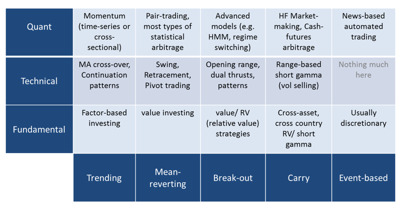

## Table of Contents

## What is quantitative investment, and how does it differ from traditional investment strategies?

Quantitative investment, often called "quant" investing, is a method where investors use math and computer programs to make decisions about buying and selling stocks or other financial assets. Instead of relying on gut feelings or personal opinions, quant investors use data and formulas to guide their choices. They might look at lots of numbers, like past prices or company financial reports, to find patterns and make predictions about what might happen in the future.

Traditional investment strategies, on the other hand, often rely more on a person's judgment and experience. Investors using these methods might read news articles, listen to expert opinions, or visit companies to get a feel for how they are doing. They might also focus on understanding the business and its management team. While traditional investors do use some data, their decisions are often more influenced by their own analysis and intuition rather than strict mathematical models.

The main difference between the two is the approach to decision-making. Quant investing is more systematic and less influenced by human emotions or biases because it relies heavily on algorithms and data analysis. Traditional investing, while it can be systematic, often leaves more room for personal judgment and can be swayed by emotions or market sentiment. Both methods have their strengths and can be successful, but they attract different types of investors based on their comfort with numbers and technology versus human insight.

## What are the basic principles behind quantitative investment strategies?

Quantitative investment strategies are based on using numbers and math to make decisions about buying and selling investments. Instead of guessing or following their feelings, quant investors use data to find patterns and make predictions. They collect lots of information, like stock prices from the past, company earnings, and economic indicators. Then, they use computers and math formulas to analyze this data and decide which investments might do well in the future. The key idea is to take the emotion out of investing and rely on hard data and logic.

Another important principle of quant investing is backtesting. This means using historical data to see how a strategy would have worked in the past. If a strategy did well in the past, quant investors might think it could work well in the future too. But they know that past success doesn't guarantee future results, so they keep testing and refining their strategies. They also use risk management techniques to protect their investments. This means setting rules to limit losses and make sure their portfolios stay balanced. By sticking to these principles, quant investors try to make more consistent and less emotional decisions than traditional investors.

## Can you explain the role of data in quantitative investment strategies?

Data is super important in quantitative investment strategies. It's like the fuel that makes the whole thing work. Quant investors gather all sorts of numbers, like stock prices, how much money companies are making, and even things like how the economy is doing. They use this data to spot patterns and make guesses about what might happen next. Without good data, quant investors wouldn't be able to make their math models work, and their strategies would fall apart.

Once they have the data, quant investors use computers to crunch the numbers and find out what it all means. They might look at how stocks have moved in the past to see if they can predict what will happen next. They also use data to test their ideas, a process called backtesting. This means they check if their strategies would have worked well in the past. By relying on data, quant investors try to take the guesswork out of investing and make decisions based on facts and numbers instead of feelings or opinions.

## What are some common quantitative models used in investment strategies?

One common quantitative model is the factor model. This model looks at different things, called factors, that can affect how well a stock does. Things like how big a company is, how much it's growing, or even how risky it is can be factors. By studying these factors, investors can pick stocks that match what they're looking for. For example, if they want to invest in companies that are growing fast, they might look for stocks with high growth factors.

Another popular model is the momentum model. This one is all about following trends. If a stock's price has been going up, the momentum model says it might keep going up for a while. So, investors using this model might buy stocks that have been doing well recently, hoping they'll keep doing well. It's kind of like jumping on a moving train and hoping it keeps going in the same direction.

A third model is the arbitrage model. This one tries to find small differences in prices between different places or times. For example, if a stock is cheaper on one exchange than another, an investor might buy it on the cheaper exchange and sell it on the more expensive one to make a profit. It's all about spotting these little differences and taking advantage of them before they go away.

## How do quantitative investors use statistical methods to make investment decisions?

Quantitative investors use statistical methods to find patterns in lots of data and make smart guesses about what might happen in the future. They look at things like how stock prices have moved in the past, how much money companies are making, and even bigger things like how the whole economy is doing. They use math tools like regression analysis to see how different things are connected. For example, they might find out that when a company's earnings go up, its stock price usually goes up too. By understanding these connections, they can pick stocks that they think will do well based on the numbers.

They also use something called statistical arbitrage to find small differences in prices that they can take advantage of. This means they might buy a stock on one market where it's cheaper and sell it on another market where it's more expensive, making a profit from the difference. Another important thing they do is called risk management. They use statistics to figure out how risky their investments are and set rules to limit their losses. This way, they can protect their money while still trying to make more of it. By using these statistical methods, quantitative investors try to make decisions that are based on hard data instead of feelings or guesses.

## What are the advantages of using quantitative investment strategies over qualitative ones?

One big advantage of using quantitative investment strategies is that they take the emotion out of investing. Instead of making decisions based on feelings or what other people are saying, quant investors use numbers and math to guide their choices. This can help them avoid making bad decisions just because they're feeling scared or excited about a stock. It also means they can stick to a plan and not get swayed by what's happening in the market at the moment. By relying on data, quant investors can make more consistent decisions and maybe even find opportunities that other people might miss.

Another advantage is that quant strategies can handle a lot of information really quickly. Computers can look at tons of data from the past and find patterns that would take a person a long time to see. This means quant investors can test their ideas and see how they would have worked before they even start investing real money. They can also keep an eye on lots of different stocks and markets at the same time, which can help them find the best opportunities. Plus, because everything is based on numbers, it's easier to check if their strategies are working and make changes if they need to.

## What are the risks and limitations associated with quantitative investment strategies?

One big risk with quantitative investment strategies is that they depend a lot on data and math models. If the data is wrong or not complete, the models can make bad guesses about what will happen next. This means that quant investors can lose money if their models don't work the way they thought they would. Also, the markets can change in ways that the models can't predict. For example, if there's a big surprise like a financial crisis, the models might not be able to handle it because they're based on what happened in the past, not what might happen in the future.

Another limitation is that quant strategies can be really complex and hard to understand. Even the people who make the models might not fully get why they work or don't work. This can make it tough to explain to others what's going on with the investments. Plus, because so many people are using similar models, if everyone starts buying or selling the same things at the same time, it can cause big swings in the market. This is called a "crowded trade," and it can lead to a lot of losses if everyone tries to get out at once.

## How can one start implementing a basic quantitative investment strategy?

To start implementing a basic quantitative investment strategy, you first need to gather data. This means collecting information about stocks, like their past prices, how much money the companies are making, and other things that might affect their value. You can find this data from financial websites, stock market databases, or even from the companies themselves. Once you have the data, you'll need a computer and some software to help you analyze it. There are many tools out there, like Excel or more advanced programs like Python, that can help you crunch the numbers and find patterns.

After you have your data and tools ready, you can start building your strategy. A simple way to begin is by using a factor model, which looks at different things that can affect a stock's performance, like how big the company is or how fast it's growing. You can use this model to pick stocks that match what you're looking for. For example, if you want to invest in companies that are growing fast, you might look for stocks with high growth factors. It's also a good idea to test your strategy with past data, a process called backtesting, to see how it would have worked before you start investing real money. Remember, even though you're using numbers and math, there's still risk involved, so always keep an eye on your investments and be ready to make changes if things aren't working out.

## What advanced techniques can be used to enhance quantitative investment strategies?

One advanced technique to enhance quantitative investment strategies is machine learning. This is like teaching a computer to learn from data and make better predictions over time. Instead of just using set formulas, machine learning can find new patterns and adjust to changes in the market. For example, it can look at tons of information, like news articles or social media posts, to see how people feel about a company and use that to guess how its stock might do. This can help quant investors find new ways to pick stocks and make their strategies even better.

Another technique is using high-frequency trading. This means using computers to buy and sell stocks really fast, sometimes in just a few seconds. High-frequency trading can take advantage of small changes in prices that happen all the time. By doing this, investors can make lots of small profits that add up. It's a bit like playing a fast-paced game where you need to react quickly to what's happening. But it can be risky because things can change so fast, and it needs a lot of computer power and special software to work well.

## How do machine learning and artificial intelligence impact quantitative investment strategies?

Machine learning and artificial intelligence have a big impact on quantitative investment strategies. They help investors by making it easier to find patterns in lots of data. Instead of just using set formulas, machine learning can learn from the data and make better guesses about what might happen next. For example, it can look at things like news articles or social media posts to see how people feel about a company and use that to predict how its stock might do. This can help investors find new ways to pick stocks and make their strategies even better. By using machine learning, quant investors can keep up with changes in the market and make smarter decisions.

Another way machine learning and AI help is by making it possible to do high-frequency trading. This means using computers to buy and sell stocks really fast, sometimes in just a few seconds. High-frequency trading can take advantage of small changes in prices that happen all the time. By doing this, investors can make lots of small profits that add up. It's a bit like playing a fast-paced game where you need to react quickly to what's happening. But it can be risky because things can change so fast, and it needs a lot of computer power and special software to work well. Overall, machine learning and AI make quantitative investment strategies more powerful and flexible.

## What are some case studies of successful quantitative investment strategies?

One famous case of a successful quantitative investment strategy is the story of Renaissance Technologies and their Medallion Fund. This fund, started by Jim Simons, a former math professor, used complex math and computer models to make investment decisions. They looked at tons of data, like stock prices and other financial information, to find patterns that other people missed. The Medallion Fund did really well, making huge profits year after year. It's a great example of how using numbers and computers can help investors beat the market.

Another case is the success of Two Sigma Investments. This company uses data and machine learning to make investment decisions. They look at all sorts of information, from stock prices to weather data, to find opportunities that others might not see. Two Sigma's strategies have worked well, helping them grow into a big player in the investment world. Their success shows how using advanced technology and lots of data can lead to good results in investing.

## How can one evaluate the performance of a quantitative investment strategy?

To evaluate the performance of a quantitative investment strategy, you need to look at how well it's doing over time. One way to do this is by checking the returns, which means seeing how much money the strategy is making. You can compare these returns to a benchmark, like a stock market index, to see if the strategy is doing better or worse than the market as a whole. Another important thing to look at is the risk, which is how much the strategy's returns go up and down. You can use something called the Sharpe ratio to see if the strategy is giving you good returns for the amount of risk you're taking.

It's also a good idea to see how the strategy does in different situations. This means looking at how it performs during good times and bad times in the market. You can use backtesting to see how the strategy would have done in the past, but remember that past results don't guarantee future success. It's also helpful to keep an eye on things like how often you're buying and selling, and the costs of doing that, because these can eat into your profits. By looking at all these things, you can get a good idea of how well your quantitative investment strategy is working and if you need to make any changes.

## What is the History and Evolution of Quantitative Investing?

Quantitative investing traces its origins to the post-World War II period, when the intersection of mathematics and finance began to shape investment strategies. This era marked the advent of crucial financial theories and models that laid the groundwork for quantitative analysis in investing.

One of the pivotal milestones in the history of quantitative investing is the development of Modern Portfolio Theory (MPT) by Harry Markowitz in 1952. MPT introduced the concept of diversification to manage risk and maximize return for a given level of risk. The mathematical formulation of MPT is grounded in the optimization of portfolio variance, represented by the equation:

$$

\min \sigma_p^2 = \sum_{i=1}^{n} \sum_{j=1}^{n} w_i w_j \sigma_{ij} 
$$

where $\sigma_p^2$ is the portfolio variance, $w_i$ and $w_j$ are the asset weights, and $\sigma_{ij}$ is the covariance between assets $i$ and $j$.

Following MPT, the introduction of the Capital Asset Pricing Model (CAPM) by William Sharpe in 1964 further revolutionized investment approaches. CAPM provided a framework to determine a theoretically appropriate required rate of return of an asset, taking into account its risk relative to the market. The CAPM formula is expressed as:

$$

E(R_i) = R_f + \beta_i (E(R_m) - R_f)
$$

where $E(R_i)$ is the expected return of the investment, $R_f$ is the risk-free rate, $\beta_i$ represents the asset's sensitivity to market movements, and $E(R_m)$ is the expected return of the market.

The evolution of computing power during the 1960s and 1970s significantly augmented the development of advanced financial algorithms, enabling more rigorous quantitative analyses and strategies. This period witnessed the proliferation of computers and data processing technology that allowed investors to model financial processes with greater precision.

In the 1980s and 1990s, the success of hedge funds employing quantitative methods underscored the potential of data-driven investing. These funds, notably firms like Renaissance Technologies founded by Jim Simons, leveraged complex mathematical models and computational techniques to harness market inefficiencies, resulting in notable financial successes.

Despite their contributions to finance, quantitative strategies have not been impervious to criticism. Critics have suggested that certain financial crises, such as the 2008 Global Financial Crisis, were exacerbated by the failure of quantitative models that failed to account for extreme market conditions. This has led to a demand for more resilient and comprehensive models capable of withstanding unpredictable market dynamics and scenarios.

In conclusion, the history of quantitative investing is marked by significant advancements in finance theory, computational techniques, and practical application, which together have profoundly transformed modern investment practices. As quantitative investing continues to evolve, it remains an area of both great promise and significant challenge within the financial industry.

## What are the types of quantitative investment strategies?

Quantitative investment strategies are essential tools in modern finance, utilizing mathematical models and statistical analysis to optimize investment decisions. These strategies aim to exploit market inefficiencies and enhance returns.

Statistical arbitrage is a prominent strategy that exploits pricing inefficiencies across securities. By using advanced statistical models, these strategies identify and trade pairs or groups of stocks whose performance tends to revert to a mean relationship. The goal is to make profits from temporary deviations from this equilibrium. This method requires substantial computational power and a deep understanding of statistical methods, such as mean-reversion models and co-integration tests.

Factor investing targets specific drivers of returns, known as "factors". Common factors include value, size, and [momentum](/wiki/momentum). For instance, the value [factor](/wiki/factor-investing) focuses on stocks that are undervalued according to financial ratios like the price-to-earnings ratio. Conversely, momentum investing seeks stocks that have shown an upward price trend over a certain period. These factors are grounded in financial theory and have been extensively documented in academic literature, driving a vast portion of asset management strategies.

Risk-parity is another influential strategy, aiming to allocate risk rather than capital. Traditional portfolios might be capital-weighted, leading to undesired risk concentrations. Risk-parity allocations adjust asset weights such that each asset contributes equally to the overall portfolio risk. This equal risk contribution often involves using leverage for lower-risk assets to achieve the desired balance. The methodology can often be expressed as:

$$
w_i = \frac{\frac{1}{\sigma_i}}{\sum_{j=1}^{n}\frac{1}{\sigma_j}}
$$

Where $w_i$ is the weight of asset i in the portfolio, and $\sigma_i$ is the standard deviation of the returns of asset i.

Machine learning and AI have become increasingly instrumental in quantitative finance. These technologies process large datasets to identify complex patterns and predictive signals that traditional models might overlook. Techniques such as natural language processing (NLP) analyze unstructured text data like news articles or earnings call transcripts to gauge market sentiment or predict asset [volatility](/wiki/volatility-trading-strategies). Meanwhile, algorithms such as neural networks and support vector machines (SVMs) are employed to model financial time series data, enhance price prediction, and inform trading strategies.

Each quantitative strategy possesses unique risk profiles and is suited to different market conditions. Statistical arbitrage may thrive in markets with significant inefficiencies, while factor investing benefits from the prolonged occurrence of specific economic cycles. Risk-parity is often favored for diversification during volatile markets, and [machine learning](/wiki/machine-learning) models continuously adapt to new data, potentially offering a competitive edge in dynamic environments. Understanding these strategies' intricacies and appropriate applications is crucial for investors looking to leverage quantitative methods effectively in their portfolios.

## References & Further Reading

[1]: Markowitz, H. (1952). ["Portfolio Selection."](https://onlinelibrary.wiley.com/doi/abs/10.1111/j.1540-6261.1952.tb01525.x) The Journal of Finance, 7(1), 77-91.

[2]: Sharpe, W. F. (1964). ["Capital Asset Prices: A Theory of Market Equilibrium under Conditions of Risk."](https://onlinelibrary.wiley.com/doi/full/10.1111/j.1540-6261.1964.tb02865.x) The Journal of Finance, 19(3), 425-442.

[3]: Lopez de Prado, M. (2018). ["Advances in Financial Machine Learning."](https://www.amazon.com/Advances-Financial-Machine-Learning-Marcos/dp/1119482089) Wiley.

[4]: Simons, J. [Renaissance Technologies: The Making of the Quants.](https://www.morningstar.com/news/marketwatch/20240510644/how-jim-simons-pioneered-quantitative-trading-and-transformed-wall-street) The New Yorker.

[5]: Chan, E. P. (2009). ["Quantitative Trading: How to Build Your Own Algorithmic Trading Business."](https://github.com/ftvision/quant_trading_echan_book) Wiley.

[6]: Jansen, S. (2020). ["Machine Learning for Algorithmic Trading."](https://github.com/stefan-jansen/machine-learning-for-trading) Packt Publishing.

[7]: Aronson, D. R. (2006). ["Evidence-Based Technical Analysis: Applying the Scientific Method and Statistical Inference to Trading Signals."](https://www.amazon.com/Evidence-Based-Technical-Analysis-Scientific-Statistical/dp/0470008741) Wiley.