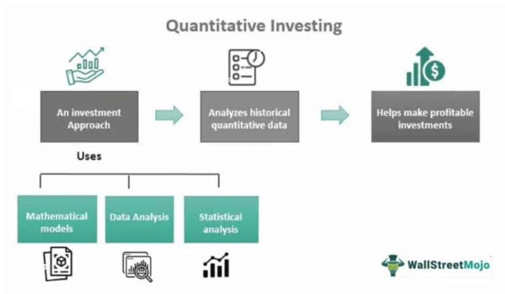

Algorithmic trading and quantitative finance have fundamentally transformed modern financial markets by introducing precision and efficiency in investment strategies. These advanced methodologies rely on mathematical models, rigorous statistical analysis, and significant computing power to optimize trading processes, identify market opportunities, and execute transactions at speeds and volumes that are beyond human capabilities.

At the core of algorithmic trading is the use of computer programs that automatically execute trades when specified conditions are met. This automation minimizes the emotional biases inherent in human decision-making, allowing for more consistent and rational investment actions. Quantitative finance, similarly, applies mathematical techniques to evaluate financial instruments and manage financial risks, offering a structured approach to investment decisions.



By leveraging large volumes of market data, algorithmic trading systems can identify trends, exploit market inefficiencies, and even predict future price movements. This capability is augmented by complex algorithms such as statistical arbitrage, trend-following strategies, and even machine learning models that enable adaptive and predictive analytics. For example, a trend-following algorithm might employ moving averages to determine entry and exit points, while statistical models could be used to identify mean reversion opportunities in stock prices.

The integration of sophisticated technical infrastructure, including high-speed network connections and reliable data feeds, is essential for the successful implementation of these strategies. As technology has evolved, access to algorithmic trading and quantitative finance tools has broadened, allowing a diverse range of market participants to engage in systematic and data-driven trading.

This article will explore the various strategies, technological requirements, and implications of automated trading, providing readers with a comprehensive understanding of how algorithmic trading and quantitative finance are shaping modern investment practices. The discussion will include the numerous advantages, such as the ability to backtest strategies under different scenarios, as well as the challenges posed, including model risk and regulatory considerations. With continued advancements in technology, these tools are poised to have an even greater impact on financial markets, offering new opportunities for innovation and efficiency in investment management.

## Table of Contents

## History and Evolution of Quantitative Investing

Quantitative investing traces its origins to the post-World War II period, when the intersection of mathematics and finance began to shape investment strategies. This era marked the advent of crucial financial theories and models that laid the groundwork for quantitative analysis in investing.

One of the pivotal milestones in the history of quantitative investing is the development of Modern Portfolio Theory (MPT) by Harry Markowitz in 1952. MPT introduced the concept of diversification to manage risk and maximize return for a given level of risk. The mathematical formulation of MPT is grounded in the optimization of portfolio variance, represented by the equation:

$$

\min \sigma_p^2 = \sum_{i=1}^{n} \sum_{j=1}^{n} w_i w_j \sigma_{ij} 
$$

where $\sigma_p^2$ is the portfolio variance, $w_i$ and $w_j$ are the asset weights, and $\sigma_{ij}$ is the covariance between assets $i$ and $j$.

Following MPT, the introduction of the Capital Asset Pricing Model (CAPM) by William Sharpe in 1964 further revolutionized investment approaches. CAPM provided a framework to determine a theoretically appropriate required rate of return of an asset, taking into account its risk relative to the market. The CAPM formula is expressed as:

$$

E(R_i) = R_f + \beta_i (E(R_m) - R_f)
$$

where $E(R_i)$ is the expected return of the investment, $R_f$ is the risk-free rate, $\beta_i$ represents the asset's sensitivity to market movements, and $E(R_m)$ is the expected return of the market.

The evolution of computing power during the 1960s and 1970s significantly augmented the development of advanced financial algorithms, enabling more rigorous quantitative analyses and strategies. This period witnessed the proliferation of computers and data processing technology that allowed investors to model financial processes with greater precision.

In the 1980s and 1990s, the success of hedge funds employing quantitative methods underscored the potential of data-driven investing. These funds, notably firms like Renaissance Technologies founded by Jim Simons, leveraged complex mathematical models and computational techniques to harness market inefficiencies, resulting in notable financial successes.

Despite their contributions to finance, quantitative strategies have not been impervious to criticism. Critics have suggested that certain financial crises, such as the 2008 Global Financial Crisis, were exacerbated by the failure of quantitative models that failed to account for extreme market conditions. This has led to a demand for more resilient and comprehensive models capable of withstanding unpredictable market dynamics and scenarios.

In conclusion, the history of quantitative investing is marked by significant advancements in finance theory, computational techniques, and practical application, which together have profoundly transformed modern investment practices. As quantitative investing continues to evolve, it remains an area of both great promise and significant challenge within the financial industry.

## Fundamentals of Algorithmic Trading

Algorithmic trading utilizes computer programs to execute trades based on predefined criteria, such as timing, price, or [volume](/wiki/volume-trading-strategy). These trades are often executed at speeds and frequencies impossible for a human trader, allowing for the potential exploitation of short-lived market opportunities. By employing algorithms, the impact of human emotions on trading decisions is significantly reduced, contributing to enhanced market [liquidity](/wiki/liquidity-risk-premium) and efficiency.

Three common strategies implemented in [algorithmic trading](/wiki/algorithmic-trading) are trend-following, statistical [arbitrage](/wiki/arbitrage), and mean reversion. Trend-following strategies involve identifying and capitalizing on market movements by following existing price trends. For example, when a stock price is trending upward, the algorithm may execute buy orders in anticipation of continued growth. Conversely, when a downward trend is identified, the algorithm may sell or short-sell the asset.

Statistical arbitrage relies on mathematical models to identify and profit from pricing inefficiencies between related financial instruments. This strategy typically involves executing a high volume of trades with the expectation that small pricing discrepancies will yield profitable outcomes when aggregated over time. A typical [statistical arbitrage](/wiki/statistical-arbitrage) model might use statistical methods like co-integration to predict the relationships between asset prices and make informed trading decisions.

Mean reversion strategies are based on the hypothesis that asset prices and returns eventually revert to their long-term mean or average level. Algorithms employing this strategy are programmed to buy securities when prices are low and sell when prices are high, relative to a historical average.

To effectively implement algorithmic trading, a comprehensive understanding of market conditions and robust technical infrastructure is necessary. Essential components include fast network connections and reliable data feeds, which enable the real-time analysis of market data and the swift execution of trades. These elements ensure that algorithms have access to the most current information and can make timely trading decisions.

As technology progresses, algorithmic trading becomes increasingly accessible, allowing a broader range of investors and institutions to partake in this form of trading. Despite its accessibility, substantial expertise is required to develop, test, and maintain the algorithms used in trading. Factors such as market dynamics, technological resources, and regulatory requirements must be carefully considered to ensure the successful implementation of algorithmic trading strategies.

## Types of Quantitative Investment Strategies

Quantitative investment strategies are essential tools in modern finance, utilizing mathematical models and statistical analysis to optimize investment decisions. These strategies aim to exploit market inefficiencies and enhance returns.

Statistical arbitrage is a prominent strategy that exploits pricing inefficiencies across securities. By using advanced statistical models, these strategies identify and trade pairs or groups of stocks whose performance tends to revert to a mean relationship. The goal is to make profits from temporary deviations from this equilibrium. This method requires substantial computational power and a deep understanding of statistical methods, such as mean-reversion models and co-integration tests.

Factor investing targets specific drivers of returns, known as "factors". Common factors include value, size, and [momentum](/wiki/momentum). For instance, the value [factor](/wiki/factor-investing) focuses on stocks that are undervalued according to financial ratios like the price-to-earnings ratio. Conversely, momentum investing seeks stocks that have shown an upward price trend over a certain period. These factors are grounded in financial theory and have been extensively documented in academic literature, driving a vast portion of asset management strategies.

Risk-parity is another influential strategy, aiming to allocate risk rather than capital. Traditional portfolios might be capital-weighted, leading to undesired risk concentrations. Risk-parity allocations adjust asset weights such that each asset contributes equally to the overall portfolio risk. This equal risk contribution often involves using leverage for lower-risk assets to achieve the desired balance. The methodology can often be expressed as:

$$
w_i = \frac{\frac{1}{\sigma_i}}{\sum_{j=1}^{n}\frac{1}{\sigma_j}}
$$

Where $w_i$ is the weight of asset i in the portfolio, and $\sigma_i$ is the standard deviation of the returns of asset i.

Machine learning and AI have become increasingly instrumental in quantitative finance. These technologies process large datasets to identify complex patterns and predictive signals that traditional models might overlook. Techniques such as natural language processing (NLP) analyze unstructured text data like news articles or earnings call transcripts to gauge market sentiment or predict asset [volatility](/wiki/volatility-trading-strategies). Meanwhile, algorithms such as neural networks and support vector machines (SVMs) are employed to model financial time series data, enhance price prediction, and inform trading strategies.

Each quantitative strategy possesses unique risk profiles and is suited to different market conditions. Statistical arbitrage may thrive in markets with significant inefficiencies, while factor investing benefits from the prolonged occurrence of specific economic cycles. Risk-parity is often favored for diversification during volatile markets, and [machine learning](/wiki/machine-learning) models continuously adapt to new data, potentially offering a competitive edge in dynamic environments. Understanding these strategies' intricacies and appropriate applications is crucial for investors looking to leverage quantitative methods effectively in their portfolios.

## Advantages and Challenges of Algorithmic and Quantitative Strategies

Algorithmic and quantitative strategies in finance offer a variety of advantages that have made them increasingly popular among institutional and individual investors. One of the primary benefits is the systematic nature of trading. Algorithmic systems eliminate the randomness that can arise from human emotions, ensuring decisions are made based on predefined criteria, thereby reducing biases and improving consistency. This approach can help in executing large orders more efficiently by dividing them into smaller parts to avoid market impact. Additionally, one of the strongest features of these strategies is the ability to backtest. Backtesting involves applying a trading strategy to historical data to verify its effectiveness before deploying it in live markets, thereby identifying potential weaknesses and optimizing parameters.

Despite these compelling advantages, several challenges must be addressed. One of the most critical is model risk, which arises when models are based on assumptions that fail to hold in different market conditions, leading to significant financial losses. Furthermore, data quality issues can compromise the accuracy of quantitative strategies. Inaccurate or incomplete data can result in incorrect conclusions and suboptimal trading decisions. Alongside data quality, the high computational complexity required can be a hurdle. Processing vast amounts of data with complex algorithms demands sophisticated hardware and significant computing resources, which can be costly and technically challenging to maintain.

Markets may become excessively volatile due to algorithmic trading. Instances such as flash crashes illustrate how automated systems can exacerbate market movements. A flash crash occurs when a rapid and deep decline in security prices is quickly recovered. It's often triggered by high-frequency trading algorithms that react to market signals faster than human traders. Regulatory oversight is another significant challenge, as authorities impose restrictions to ensure fair trading practices and market stability. Compliance with these regulations can add layers of complexity and cost to the implementation of algorithmic strategies.

Despite these challenges, the potential for high returns and efficient management continues to attract investors to algorithmic and quantitative strategies. The systematic, data-driven approach can uncover opportunities often missed by traditional analysis. As technology progresses and data availability increases, these strategies are likely to become even more sophisticated, offering greater potential for success. However, for sustained success, practitioners need to stay vigilant about these challenges and adopt robust risk management practices to mitigate them.

## Future Trends and Developments

The integration of Artificial Intelligence (AI) and Machine Learning (ML) within algorithmic trading is an evolving trend with significant potential to reshape financial markets. These technologies are revolutionizing data processing, enabling traders to handle vast datasets with improved efficiency and speed. Machine learning algorithms can identify subtle patterns and correlations in data that are often imperceptible to human analysts, thereby enhancing predictive analytics.

AI and ML models excel in predictive tasks such as price forecasting, risk assessment, and automated trading decisions. For example, advanced ML techniques like [deep learning](/wiki/deep-learning) have been employed to refine trading strategies by learning from historical data to predict future price movements. A typical application involves using neural networks to model complex relationships within financial datasets. Here's a simple example of using Python libraries such as TensorFlow or PyTorch for a predictive model:

```python
import tensorflow as tf
from tensorflow.keras.models import Sequential
from tensorflow.keras.layers import Dense, LSTM, Dropout

# Define a Sequential model
model = Sequential()
model.add(LSTM(units=50, return_sequences=True, input_shape=(X_train.shape[1], X_train.shape[2])))
model.add(Dropout(0.2))
model.add(LSTM(units=50, return_sequences=False))
model.add(Dropout(0.2))
model.add(Dense(units=1))  # Prediction of a single value

model.compile(optimizer='adam', loss='mean_squared_error')
model.fit(X_train, y_train, epochs=100, batch_size=32)
```

As these AI-driven methods become more sophisticated, ethical and regulatory challenges increase in complexity. Ensuring transparency, fairness, and accountability in algorithmic trading is crucial to maintaining market integrity. The opaque nature of some machine learning models, often described as "black boxes," can hinder transparency and accountability. Efforts to increase interpretability and explainability of AI models are essential in addressing these concerns, where techniques such as LIME (Local Interpretable Model-Agnostic Explanations) or SHAP (SHapley Additive exPlanations) can provide insights into how models make decisions.

Regulatory bodies are exploring frameworks to govern the use of AI in trading to mitigate potential biases and operational risks. As the financial industry navigates these challenges, there remains a push for innovation balanced by a stringent regulatory oversight that protects market participants.

The investment landscape is on the brink of significant technological advancements. Beyond AI and ML, developments in quantum computing may dramatically increase computation speeds, opening new possibilities for complex simulations and real-time data analysis in trading. As these technologies progress, the structure and operation of financial markets will likely evolve, presenting both new opportunities and challenges for investors and regulators alike.

## Conclusion

Algorithmic trading and quantitative finance have established themselves as indispensable components of modern investment practices. These strategies leverage sophisticated algorithms and mathematical models to optimize trading decisions, enhancing both efficiency and accuracy. By systematically analyzing vast datasets, these tools can identify patterns and trends that inform superior decision-making processes. This data-driven approach minimizes the influence of human emotion, enabling more consistent and rational investment decisions.

While the advantages of algorithmic trading are substantial, several challenges must be navigated to optimize their potential. Model risk is a critical concern; strategies highly dependent on historical data may falter if market conditions change unpredictably. The landscape is dynamic, and the influence of unforeseen market dynamics can lead to substantial deviations from expected outcomes. Hence, continuous model validation and revision are essential to maintain robustness and reliability.

Moreover, as these technologies become increasingly integral to financial markets, regulatory frameworks must evolve concurrently. Ensuring market integrity and safeguarding participants necessitate a responsive regulatory environment that can accommodate the unique challenges posed by automated trading systems. Transparency, accountability, and fairness must be prioritized to foster a secure trading ecosystem.

Looking forward, the advancement of technology promises to further expand the capabilities and influence of algorithmic trading. The integration of [artificial intelligence](/wiki/ai-artificial-intelligence) and machine learning techniques offers potential breakthroughs in predictive analytics and decision-making capabilities. However, this progress must be balanced with considerations of ethical implications and regulatory compliance.

The expansion of algorithmic trading presents both opportunities and challenges. As the sophistication of these systems grows, so does their potential to revolutionize investment strategies, offering unprecedented efficiencies and opportunities for returns. Simultaneously, market participants and regulators must remain vigilant, ensuring that technological advancements do not compromise the stability and integrity of financial markets.

## References & Further Reading

[1]: Markowitz, H. (1952). ["Portfolio Selection."](https://onlinelibrary.wiley.com/doi/abs/10.1111/j.1540-6261.1952.tb01525.x) The Journal of Finance, 7(1), 77-91.

[2]: Sharpe, W. F. (1964). ["Capital Asset Prices: A Theory of Market Equilibrium under Conditions of Risk."](https://onlinelibrary.wiley.com/doi/full/10.1111/j.1540-6261.1964.tb02865.x) The Journal of Finance, 19(3), 425-442.

[3]: Lopez de Prado, M. (2018). ["Advances in Financial Machine Learning."](https://www.amazon.com/Advances-Financial-Machine-Learning-Marcos/dp/1119482089) Wiley.

[4]: Simons, J. [Renaissance Technologies: The Making of the Quants.](https://www.morningstar.com/news/marketwatch/20240510644/how-jim-simons-pioneered-quantitative-trading-and-transformed-wall-street) The New Yorker.

[5]: Chan, E. P. (2009). ["Quantitative Trading: How to Build Your Own Algorithmic Trading Business."](https://github.com/ftvision/quant_trading_echan_book) Wiley.

[6]: Jansen, S. (2020). ["Machine Learning for Algorithmic Trading."](https://github.com/stefan-jansen/machine-learning-for-trading) Packt Publishing.

[7]: Aronson, D. R. (2006). ["Evidence-Based Technical Analysis: Applying the Scientific Method and Statistical Inference to Trading Signals."](https://www.amazon.com/Evidence-Based-Technical-Analysis-Scientific-Statistical/dp/0470008741) Wiley.