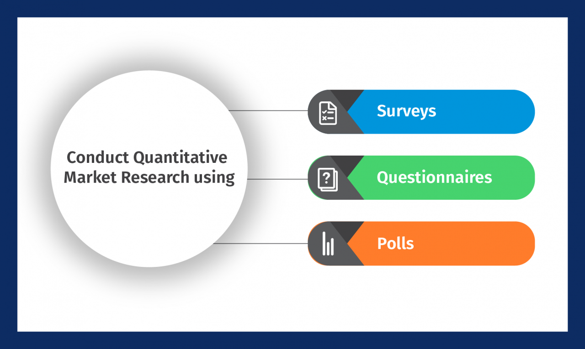

## Table of Contents

## What is quantitative market making?

Quantitative market making is a way for traders to buy and sell things like stocks or cryptocurrencies using math and computer programs. Instead of guessing what prices will do, these traders use numbers and data to decide when to buy or sell. They set up their computers to watch the market all the time and make trades automatically based on what the data says.

This method helps traders make money by always being ready to buy or sell. They earn a small profit from the difference between the price they buy at and the price they sell at. By using computers and math, they can handle lots of trades quickly and accurately, which can be hard to do by hand. This way, they can make more trades and possibly earn more money than if they were trading without these tools.

## How does quantitative market making differ from traditional market making?

Quantitative market making uses computers and math to make trading decisions, while traditional market making relies more on human judgment and experience. In quantitative market making, traders set up algorithms that automatically buy and sell based on data and patterns they find in the market. This means the computer does a lot of the work, watching the market all the time and making trades without needing a person to decide each time. On the other hand, traditional market makers watch the market themselves and decide when to buy or sell based on what they see and their own experience.

Another big difference is how much they can handle. Quantitative market making can deal with a lot more trades because computers can work faster and don't get tired. This means they can make money from small price differences in many trades. Traditional market makers can only handle as many trades as they can watch and decide on themselves, which is usually less than what a computer can do. So, while both methods aim to make money from buying and selling, quantitative market making uses technology to do it more efficiently and on a larger scale.

## What are the key components of a quantitative market making strategy?

The first key part of a quantitative market making strategy is using data and math to make decisions. Traders collect a lot of information about prices, how much things are being bought and sold, and other market details. They use this data to find patterns and build math models that help them predict what prices will do next. These models are important because they help the computer decide when to buy or sell without needing a person to tell it what to do.

The second important part is using computers and software to trade automatically. Once the math models are set up, the computer can watch the market all the time and make trades based on what the models say. This means the computer can buy and sell things very quickly, often faster than a person could. It also means the trader can handle a lot more trades at the same time, which can help them make more money from the small differences in buying and selling prices.

The last key component is managing risk. Even though computers and math help, there's always a chance things won't go as planned. So, part of the strategy is setting rules to limit how much money can be lost. This might mean setting limits on how much to buy or sell at one time, or having rules to stop trading if the market starts moving in a way that could cause big losses. Managing risk well helps keep the strategy safe and profitable over time.

## What types of financial instruments are typically used in quantitative market making?

Quantitative market making often deals with stocks, which are shares in a company that people can buy and sell. These are popular because there's a lot of data available on stock prices and trading volumes, which helps in building the math models used in quantitative strategies. Another common instrument is options, which give people the right to buy or sell a stock at a certain price in the future. Options can be tricky but also useful because they can help manage risk and take advantage of price movements in different ways.

Cryptocurrencies like Bitcoin and Ethereum are also used in quantitative market making. These digital currencies can be very volatile, meaning their prices can change a lot and quickly, which can be both a risk and an opportunity for traders using math models. Lastly, futures contracts, which are agreements to buy or sell something at a future date for a set price, are used as well. Futures are helpful because they let traders make bets on where they think prices will go without having to own the actual thing they're trading.

## How do quantitative market makers use algorithms in their trading strategies?

Quantitative market makers use algorithms to make trading decisions based on math and data. They collect a lot of information about prices and trading volumes, then use this data to build models that predict how prices will move. These models help the computer decide when to buy or sell without needing a person to tell it what to do. For example, if the model shows that a stock's price is likely to go up soon, the algorithm might buy that stock, hoping to sell it later at a higher price.

The algorithms also help the computer trade very quickly and handle many trades at the same time. This is important because it lets the trader make money from small differences in buying and selling prices, even if each trade only makes a little bit of money. The computer can watch the market all the time, so it can react to changes faster than a person could. This speed and ability to handle lots of trades is a big part of why quantitative market making can be successful.

## What are the main risks associated with quantitative market making?

One main risk in quantitative market making is that the math models might not work as expected. These models use past data to predict what prices will do, but the future can be different from the past. If the market changes in a way the model didn't expect, the computer might make trades that lose money instead of making a profit. This is called model risk, and it's a big worry because even the best models can be wrong sometimes.

Another risk is that the market can be very unpredictable. Sometimes, prices can move a lot and very quickly, which is called volatility. If this happens, the computer might not be able to sell what it bought at a good price, or it might have to sell at a loss to avoid even bigger losses. This is called market risk, and it can be hard to manage because no one can predict exactly what the market will do next.

Lastly, there's also the risk of technology failing. Since quantitative market making relies a lot on computers and software, any problem with the technology can cause big issues. If the computer stops working or the internet goes down, the trader might miss out on good trades or be stuck with bad ones. This is called operational risk, and it's important for traders to have backup plans in case something goes wrong with their tech.

## How do quantitative market makers manage liquidity and inventory?

Quantitative market makers manage liquidity by always being ready to buy and sell. They use their computers to watch the market all the time and make trades quickly. This means they can help keep the market moving by providing prices for others to buy or sell at. If there are a lot of people wanting to buy or sell something, the market maker's computer can handle those trades and keep the market liquid, which means it's easy for people to trade.

They also manage their inventory, which is what they own and what they owe. The computer helps them keep track of how much they have bought and sold. If they have too much of something, they might lower their selling price to get rid of it. If they don't have enough, they might raise their buying price to get more. This way, they try to keep a good balance so they can make money from the difference between buying and selling prices without taking on too much risk.

## What role does statistical arbitrage play in quantitative market making?

Statistical arbitrage is a way that quantitative market makers use math to find small differences in prices between similar things they can trade. They use computers to look at a lot of data and find patterns. When they see that one thing is priced a bit lower than it should be compared to another, they buy the cheaper one and sell the more expensive one. This can help them make money from these small differences, even if the prices don't change much.

This method is important in quantitative market making because it helps traders make many small trades that add up to big profits. The computers can do this very quickly and handle lots of trades at the same time. By using statistical arbitrage, market makers can keep the market moving smoothly and make money from the small price differences they find.

## How do regulatory environments affect quantitative market making practices?

Regulatory environments can have a big impact on quantitative market making. Different countries have different rules about how people can trade, and these rules can change what market makers are allowed to do. For example, some places might have strict rules about how much risk a trader can take or how much information they need to share with others. This can make it harder for quantitative market makers to use their math models and computers the way they want to. They might need to change their strategies or even stop trading certain things to follow the rules.

Another way regulations affect quantitative market making is by changing how much it costs to trade. Some places might have fees or taxes that make it more expensive to buy and sell things quickly, which is what quantitative market makers do a lot. If the costs go up, it can be harder for them to make money from the small price differences they find. Also, regulators might watch the market closely to make sure no one is doing anything unfair, which can mean more work for market makers to prove they are following the rules. All of these things can make quantitative market making more complicated and less profitable in some places.

## What advanced mathematical models are used in quantitative market making?

Quantitative market makers use a lot of fancy math to help them trade. One kind of math they use is called "time series analysis." This helps them look at how prices have changed over time and guess what might happen next. They also use something called "stochastic processes," which is a way to model how things might change randomly. This can help them understand how prices might move in the future, even if it's hard to predict exactly. Another important math tool is "machine learning," which lets computers learn from data and get better at making predictions over time. This can help market makers find patterns in the market that they might not see otherwise.

Another set of math models they use is called "option pricing models," like the famous Black-Scholes model. These models help them figure out how much options should cost based on things like how much the price of the stock might change and how long until the option expires. They also use "market microstructure models" to understand how buying and selling works in the market. This can help them make better decisions about when to trade and at what price. All these math models help quantitative market makers make smart trades and manage their risks better.

## How can machine learning enhance quantitative market making strategies?

Machine learning can make quantitative market making better by helping traders find patterns in the market that they might not see otherwise. It does this by looking at a lot of data and learning from it over time. For example, machine learning can help spot when certain things are likely to happen, like when prices might go up or down. This can help market makers decide when to buy or sell to make more money. By using machine learning, traders can keep improving their math models to make better predictions and trade more successfully.

Another way machine learning helps is by making trading decisions faster and more accurate. Since the computer can learn and get better on its own, it can react to changes in the market quickly. This means market makers can make trades at the right time, even when the market is moving fast. Machine learning also helps manage risk by figuring out when things might go wrong and what to do about it. This can help traders avoid big losses and keep their trading safe and profitable.

## What are the future trends and challenges in quantitative market making?

In the future, quantitative market making might see more use of advanced technology like artificial intelligence and machine learning. These tools can help traders find even better patterns in the market and make smarter trades. More people might start using these methods as they become easier to use and more powerful. Also, as markets around the world become more connected, quantitative market makers might need to look at data from many different places to make the best decisions. This could mean trading in new kinds of things, like cryptocurrencies, becomes more common.

However, there are also challenges ahead. One big challenge is dealing with new rules and regulations that might make it harder to use these advanced methods. Governments might put in place new laws to make sure trading is fair and safe, which could mean more work for market makers. Another challenge is that as more people use these strategies, the small price differences that market makers make money from might get smaller. This could make it harder to earn a profit. Lastly, the risk of technology failing or being hacked is always a worry, so keeping systems safe and working well will be important for the future of quantitative market making.

## References & Further Reading

[1]: Kissell, R. (2013). ["The Science of Algorithmic Trading and Portfolio Management."](https://www.sciencedirect.com/book/9780124016897/the-science-of-algorithmic-trading-and-portfolio-management) Academic Press.

[2]: Lopez de Prado, M. (2018). ["Advances in Financial Machine Learning."](https://www.amazon.com/Advances-Financial-Machine-Learning-Marcos/dp/1119482089) Wiley.

[3]: Chan, E. P. (2009). ["Quantitative Trading: How to Build Your Own Algorithmic Trading Business."](https://github.com/ftvision/quant_trading_echan_book) Wiley.

[4]: Aldridge, I. (2013). ["High-Frequency Trading: A Practical Guide to Algorithmic Strategies and Trading Systems."](https://www.amazon.com/High-Frequency-Trading-Practical-Algorithmic-Strategies/dp/1118343506) Wiley.

[5]: Aronson, D. R. (2006). ["Evidence-Based Technical Analysis: Applying the Scientific Method and Statistical Inference to Trading Signals."](https://www.amazon.com/Evidence-Based-Technical-Analysis-Scientific-Statistical/dp/0470008741) Wiley.

[6]: Jansen, S. (2020). ["Machine Learning for Algorithmic Trading."](https://github.com/stefan-jansen/machine-learning-for-trading) Packt Publishing.

[7]: Easley, D., López de Prado, M., & O'Hara, M. (2012). ["Flow Toxicity and Liquidity in a High-Frequency World."](https://www.jstor.org/stable/41485533) Review of Financial Studies, 25(5), 1457-1493.