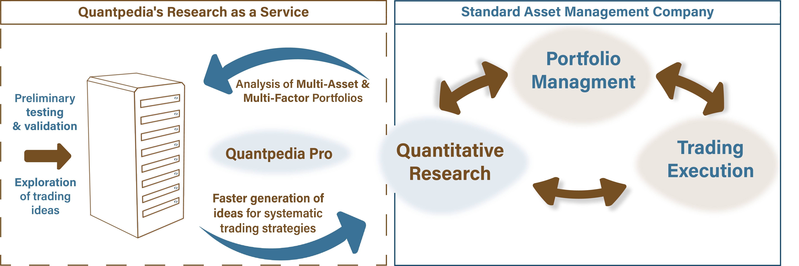

## Table of Contents

## What is quantitative portfolio execution?

Quantitative portfolio execution is a way to buy and sell stocks using math and computers. Instead of people making all the decisions, special programs look at a lot of data and decide the best way to trade. These programs can consider things like how much a stock costs, how many people want to buy it, and how quickly it needs to be bought or sold. This helps make sure that the trades are done in a way that gets the best price and doesn't cause big changes in the market.

The main goal of quantitative portfolio execution is to make trading more efficient and less risky. By using computers, traders can handle a lot more information than they could on their own. This means they can make smarter choices about when and how to trade. Also, because the computer follows a set of rules, it can help avoid mistakes that people might make, like trading too much or too little. This can lead to better results for investors.

## Why is quantitative portfolio execution important in modern investing?

Quantitative portfolio execution is important in modern investing because it helps investors get the best prices when they buy or sell stocks. By using computers and math, investors can handle a lot of information quickly and make smart choices. This is really helpful in today's fast-moving markets where prices can change in the blink of an eye. Instead of guessing or relying on gut feelings, quantitative methods use data to find the best time and way to trade, which can save investors a lot of money.

Also, quantitative portfolio execution can reduce the risk of making big mistakes. When people trade, they might get emotional or make quick decisions without thinking everything through. Computers follow a set of rules and don't get stressed or excited, so they can stick to a plan. This means they can trade in a way that doesn't cause big swings in the market, which can be good for everyone. In the end, using quantitative methods can make investing safer and more predictable, which is why it's so important in modern investing.

## What are the basic components of a quantitative portfolio execution strategy?

The first part of a quantitative portfolio execution strategy is data collection and analysis. This means gathering a lot of information about stocks, like their prices, how many people want to buy or sell them, and other things that can affect their value. Computers then look at all this data to find patterns and make predictions. This helps decide when and how to trade to get the best prices.

The next part is the trading algorithm. This is like a set of rules that the computer follows to buy or sell stocks. The algorithm decides how much to trade at one time and how quickly to do it. It tries to do this in a way that doesn't cause big changes in the market. The goal is to get the best price possible without making the stock price go up or down too much.

The last part is risk management. This is about making sure the trading doesn't lead to big losses. The computer keeps an eye on how things are going and can change the plan if needed. It might slow down trading or stop it if the market gets too risky. This helps protect the investor's money and makes the whole process safer.

## How does quantitative portfolio execution differ from traditional investment strategies?

Quantitative portfolio execution and traditional investment strategies are different in how they make decisions and manage trades. Traditional strategies often rely on a person's experience and gut feeling. A person might look at news, company reports, and talk to other people to decide when to buy or sell stocks. They might also trade based on what they think will happen in the future, even if they don't have all the data to back it up. This can work well, but it can also lead to mistakes if the person gets too emotional or misses important information.

On the other hand, quantitative portfolio execution uses computers and math to make decisions. Instead of relying on a person's judgment, it looks at a lot of data to find the best time and way to trade. This can help get better prices and reduce the risk of big losses. The computer follows a set of rules, so it doesn't get stressed or make quick decisions based on feelings. This can make trading more efficient and less risky, but it also means the strategy might miss out on opportunities that a person might see.

## What are the key metrics used to evaluate the performance of a quantitative portfolio?

The key metrics used to evaluate the performance of a quantitative portfolio include the return on investment (ROI) and the risk-adjusted return. ROI shows how much money the portfolio has made or lost over a certain time. It's a simple way to see if the portfolio is doing well. The risk-adjusted return, like the Sharpe Ratio, looks at how much return the portfolio gets for the amount of risk it takes. This helps investors see if the portfolio is doing better than just putting money in a safe place like a bank.

Another important metric is the tracking error, which measures how closely the portfolio follows its benchmark. A low tracking error means the portfolio is doing what it's supposed to do, while a high tracking error might mean it's not following the plan. The turnover rate is also key, as it shows how often the portfolio is buying and selling stocks. A high turnover rate can mean more costs and more risk, so it's important to keep an eye on this. These metrics help investors understand if the quantitative portfolio is working well and meeting its goals.

## What role do algorithms play in quantitative portfolio execution?

Algorithms are like the brains behind quantitative portfolio execution. They are sets of rules that computers follow to decide when and how to buy or sell stocks. Instead of people making all the choices, the algorithm looks at a lot of data about the stocks, like their prices and how many people want to buy or sell them. This helps the algorithm find the best time to trade, so the portfolio can get the best prices without causing big changes in the market.

These algorithms also help manage risk. They keep an eye on how the portfolio is doing and can change the trading plan if things get too risky. For example, if the market starts to move a lot, the algorithm might slow down trading or stop it altogether to protect the investor's money. By using algorithms, quantitative portfolio execution can be more efficient and less likely to make big mistakes, which is why they are so important in modern investing.

## How can one mitigate risks associated with quantitative portfolio execution?

One way to reduce risks in quantitative portfolio execution is by using risk management tools. These tools help keep an eye on how the portfolio is doing and can change the trading plan if things get too risky. For example, if the market starts to move a lot, the computer can slow down trading or stop it altogether. This helps protect the investor's money and makes sure the portfolio doesn't lose too much.

Another way to mitigate risks is by diversifying the portfolio. This means spreading the money across different types of stocks or other investments. If one stock goes down, the others might go up, which can help balance out the losses. By not putting all the eggs in one basket, investors can make their portfolio safer and less likely to be hurt by big changes in the market.

## What are some common challenges faced when implementing a quantitative portfolio execution strategy?

One common challenge when implementing a quantitative portfolio execution strategy is dealing with data quality and availability. The success of these strategies depends a lot on having good, accurate data. If the data is wrong or missing, the computer might make bad decisions. Also, getting all the data needed can be hard and expensive. This means that the people running the strategy need to spend a lot of time and money making sure they have the right information.

Another challenge is keeping up with changing markets. Markets can change quickly, and what worked yesterday might not work today. The algorithms need to be updated and changed to keep working well. This can be hard because it takes a lot of work to figure out what's changed and how to fix the algorithms. If the algorithms aren't updated, the portfolio might not do as well as it could.

Lastly, there's the risk of overfitting. This happens when the algorithm is too focused on past data and doesn't work well with new data. It's like trying to fit a puzzle piece into a spot where it doesn't belong. To avoid this, people need to test the algorithms carefully and make sure they work well in different situations. This can be tricky and takes a lot of time and skill.

## Can you explain the use of machine learning in enhancing quantitative portfolio execution?

Machine learning can make quantitative portfolio execution better by helping computers learn from data and make smarter choices. Instead of just following a set of rules, machine learning lets the computer look at a lot of past information and find patterns. This means the computer can predict what might happen in the future and decide the best time to buy or sell stocks. For example, it might see that certain things, like news about a company, often make the stock price go up or down. By using this information, the computer can trade in a way that gets the best prices and avoids big losses.

Another way machine learning helps is by making the trading algorithms better over time. As the computer sees more data and learns more, it can change how it trades to work better. This is really helpful because markets can change quickly, and what worked before might not work now. Machine learning can help the computer keep up with these changes and keep making good decisions. This makes the whole process of quantitative portfolio execution more efficient and less risky, which can lead to better results for investors.

## What advanced statistical models are used in quantitative portfolio execution?

In quantitative portfolio execution, advanced statistical models help make smart trading decisions. One common model is regression analysis, which looks at how different things, like stock prices or economic news, affect each other. This helps the computer predict what might happen next and decide when to buy or sell stocks. Another model is time series analysis, which looks at how stock prices change over time. By understanding these patterns, the computer can find the best times to trade and get the best prices.

Another important model is machine learning, which lets the computer learn from past data and improve its decisions over time. This is really helpful because markets can change quickly, and what worked before might not work now. Machine learning can help the computer keep up with these changes and make better trades. Also, models like factor models are used to understand what drives stock prices, like company size or industry. By knowing these factors, the computer can make smarter choices about which stocks to buy or sell.

## How do regulatory requirements impact quantitative portfolio execution strategies?

Regulatory requirements can have a big impact on quantitative portfolio execution strategies. These rules are made by governments and other groups to make sure that trading is fair and safe. For example, there might be rules about how much information traders need to share with the public or how they can use certain kinds of data. These rules can make it harder for people using quantitative strategies to get all the data they need or to trade in the way they want. They might have to change their algorithms or be more careful about how they trade to follow the rules.

Even though these rules can make things more complicated, they also help keep the market safe and fair for everyone. By following the rules, people using quantitative strategies can avoid getting in trouble and make sure their trades are legal. This can build trust with investors and other people in the market. So, while regulatory requirements can be a challenge, they are important for making sure that quantitative portfolio execution is done in a way that is good for everyone.

## What are the future trends and innovations expected in quantitative portfolio execution?

In the future, quantitative portfolio execution is expected to get even better with the help of new technology. One big trend is the use of artificial intelligence (AI) and machine learning. These tools can look at huge amounts of data and learn from it, which helps them make smarter decisions about when and how to trade. They can also change and improve over time, so they can keep up with the fast-changing markets. This means that in the future, computers might be able to find the best prices and manage risks even better than they do now.

Another trend is the use of more and better data. Right now, quantitative strategies use a lot of data, but in the future, there will be even more kinds of data available, like social media posts or satellite images. This can give computers more information to work with, so they can make even better predictions about what will happen next. Also, as technology gets better, it will be easier to handle all this data quickly and cheaply. This can make quantitative portfolio execution more efficient and help investors get even better results.

## How can one build a robust algorithmic strategy?

Creating a successful algorithmic trading strategy involves a methodical approach to identifying market patterns and codifying them into systematic trading rules. The primary step involves rigorous backtesting using historical data, which is crucial for assessing a strategy's robustness across diverse market conditions. By simulating trades over past data, traders can identify potential pitfalls and strengths, thereby increasing the confidence in their strategies before execution in live markets.

Risk management is a critical component in the development of algorithmic strategies. This entails setting appropriate stop-loss levels, position sizing, and diversification tactics to mitigate potential losses. Continuous optimization of these strategies ensures that they remain effective, adapting to market changes and maintaining performance consistency.

Evaluating the performance of a trading strategy relies on specific metrics. The Sharpe ratio, a measure of risk-adjusted return, offers insight into whether the returns of a strategy compensate for the associated risks. It is calculated as:

$$
\text{Sharpe Ratio} = \frac{E[R_p - R_f]}{\sigma_p}
$$

where $E[R_p - R_f]$ is the expected return of the portfolio minus the risk-free rate, and $\sigma_p$ is the standard deviation of the portfolio's excess return.

Maximum drawdown measures the largest peak-to-trough decline, providing a sense of the potential for significant losses between points of relative equity highs. Monitoring these metrics informs traders about the strategy's resilience during unfavorable market conditions.

Automated, real-time monitoring systems are indispensable for maintaining a strategy's relevance. These systems enable traders to track the performance of their algorithms continuously, making necessary adjustments to optimize outcomes. An exemplary approach in Python could involve using libraries such as Backtrader or Zipline for backtesting, and implementing real-time data feeds through API integrations.

By conscientiously building, evaluating, and refining algorithmic strategies, traders can significantly enhance their ability to exploit market inefficiencies effectively. This disciplined approach not only heightens the probability of success but also fortifies the trader's position in the ever-evolving landscape of modern financial markets.

## References & Further Reading

[1]: ["Algorithmic and High-Frequency Trading"](https://www.amazon.com/Algorithmic-High-Frequency-Trading-Mathematics-Finance/dp/1107091144) by Álvaro Cartea, Sebastian Jaimungal, and José Penalva

[2]: ["Advances in Financial Machine Learning"](https://www.amazon.com/Advances-Financial-Machine-Learning-Marcos/dp/1119482089) by Marcos Lopez de Prado

[3]: ["Quantitative Trading: How to Build Your Own Algorithmic Trading Business"](https://www.amazon.com/Quantitative-Trading-Build-Algorithmic-Business/dp/1119800064) by Ernest P. Chan

[4]: Hasbrouck, J. (2003). ["Intraday Price Formation in U.S. Equity Markets."](https://onlinelibrary.wiley.com/doi/10.1046/j.1540-6261.2003.00609.x) The Journal of Finance.

[5]: Aldridge, I. (2013). ["High-Frequency Trading: A Practical Guide to Algorithmic Strategies and Trading Systems."](https://www.amazon.com/High-Frequency-Trading-Practical-Algorithmic-Strategies/dp/1118343506) Wiley.

[6]: Kearns, M., & Nevmyvaka, Y. (2013). ["Machine Learning for Market Microstructure and High Frequency Trading."](https://www.cis.upenn.edu/~mkearns/papers/KearnsNevmyvakaHFTRiskBooks.pdf) In: High-Frequency Trading: New Realities for Traders, Markets, and Regulators. 

[7]: Narang, R. K. (2013). ["Inside the Black Box: A Simple Guide to Quantitative and High-Frequency Trading"](https://onlinelibrary.wiley.com/doi/book/10.1002/9781118662717) by Rishi K. Narang

[8]: Chan, E. P. (2017). ["Machine Trading: Deploying Computer Algorithms to Conquer the Markets."](https://github.com/ftvision/quant_trading_echan_book) Wiley. 

[9]: Malkiel, B. G. (1999). ["A Random Walk Down Wall Street: Including a Life-Cycle Guide to Personal Investing"](https://openlibrary.org/books/OL5417699M/A_random_walk_down_Wall_Street) by Burton G. Malkiel

[10]: Lo, A. W. (2002). ["The Statistics of Sharpe Ratios."](https://www.researchgate.net/publication/228139699_The_Statistics_of_Sharpe_Ratios) Financial Analysts Journal.