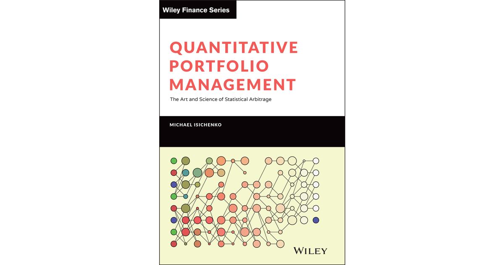

## Table of Contents

## What is quantitative portfolio management?

Quantitative portfolio management is a way of managing investments using math and computers. Instead of picking stocks based on feelings or guesses, it uses numbers and data to make decisions. This method looks at things like how much risk there is, how much money you might make, and how different investments relate to each other. By using these numbers, people who manage portfolios can make choices that are more likely to help their clients reach their financial goals.

In quantitative portfolio management, computers play a big role. They can look at huge amounts of data very quickly and find patterns that humans might miss. This can help managers create strategies that are based on solid evidence rather than just opinions. For example, they might use past stock prices, economic reports, or even social media trends to decide which stocks to buy or sell. This approach can be more reliable and can help investors make better decisions over time.

## How does quantitative portfolio management differ from traditional portfolio management?

Quantitative portfolio management and traditional portfolio management are two different ways to handle investments. Quantitative portfolio management relies heavily on math and computer models to make decisions. It uses data and numbers to figure out which investments to buy or sell, looking at things like risk, potential returns, and how different investments relate to each other. This method tries to take the guesswork out of investing by using a systematic approach based on evidence and patterns found in data.

On the other hand, traditional portfolio management often depends more on the experience and judgment of the portfolio manager. These managers might look at company reports, meet with company leaders, and use their understanding of the market to make investment choices. They may also consider broader economic trends and their own intuition. While this method can be very effective, it can also be more subjective and might be influenced by personal biases or emotions.

The main difference between the two is how they make decisions. Quantitative portfolio management aims to be more objective and data-driven, using algorithms and models to guide choices. Traditional portfolio management, while it can also use data, often leans more on the human element, where the manager's experience and insights play a big role. Both methods have their strengths and can be successful, but they approach the challenge of managing investments in fundamentally different ways.

## What are the key components of a quantitative portfolio?

A quantitative portfolio has a few main parts that help it work well. One important part is the data. This includes all the numbers and information used to make decisions, like past stock prices, company financial reports, and even things like social media trends. Another part is the models. These are like math recipes that use the data to predict what might happen next with the investments. They help figure out things like how risky an investment is and how much money it might make.

Another key part is the algorithms. These are the step-by-step instructions that tell the computer what to do with the data and models. They help decide when to buy or sell investments based on what the models say. Finally, there's risk management. This is about making sure the portfolio doesn't take too many chances. It uses the data and models to keep the portfolio safe and balanced, so it can grow over time without losing too much money if things go wrong.

## What data sources are commonly used in quantitative portfolio management?

In quantitative portfolio management, a lot of different data sources are used to make smart investment choices. One common source is historical stock prices. This helps managers see how stocks have moved in the past, which can give clues about what might happen next. Another source is financial statements from companies. These reports show how much money a company is making and spending, which can tell you if it's a good investment. Economic indicators, like unemployment rates or inflation numbers, are also used because they show what's going on in the economy and can affect stock prices.

Besides these, managers also look at market data, like trading volumes and price changes. This can help them understand how other investors are acting and what might drive stock prices up or down. Another interesting source is alternative data, which includes things like satellite images of parking lots to guess how busy a store is, or social media posts to see what people are saying about a company. All these different types of data help build a full picture of what's going on and what might happen in the future.

Sometimes, managers also use data from news articles and research reports. These can provide insights into new trends or events that could affect the market. By combining all these different data sources, quantitative portfolio managers can make more informed decisions and build portfolios that are more likely to do well over time.

## How do you develop a quantitative investment strategy?

To develop a quantitative investment strategy, you start by figuring out what you want to achieve. Do you want to grow your money quickly, or are you more interested in keeping it safe? Once you know your goals, you can begin gathering data. This includes looking at past stock prices, company financial reports, and even things like social media trends. All this data helps you understand how investments have behaved in the past and what might happen in the future.

Next, you build models and algorithms. Models are like math recipes that use your data to predict what might happen with your investments. Algorithms are the step-by-step instructions that tell your computer what to do with these models. They help you decide when to buy or sell investments based on what the models say. It's important to test these models and algorithms with past data to see if they work well. If they do, you can use them to manage your portfolio. If not, you might need to tweak them or try different ones until you find something that works.

Finally, you need to think about risk management. This means making sure your portfolio doesn't take too many risks. You use your data and models to keep your investments balanced and safe. You might also keep an eye on your strategy and adjust it if things change in the market or if your goals change. By doing all these steps carefully, you can create a quantitative investment strategy that helps you reach your financial goals.

## What are some common quantitative models used in portfolio management?

In quantitative portfolio management, one common model is the Capital Asset Pricing Model (CAPM). This model helps figure out how much risk you're taking with an investment and what return you might expect. It looks at how an investment moves with the overall market. If an investment moves a lot with the market, it's riskier but could give you a bigger return. If it doesn't move much with the market, it's safer but might not grow as fast.

Another model often used is the Arbitrage Pricing Theory (APT). This model thinks that the return on an investment is affected by many different things, like inflation rates or changes in interest rates. It uses these factors to predict how an investment might do. By understanding these factors, you can find investments that might be undervalued and could give you a good return.

A third model is the Mean-Variance Optimization model. This model helps you build a portfolio that balances risk and return. It looks at how different investments work together and tries to pick a mix that gives you the best return for the least amount of risk. By using this model, you can create a portfolio that's more likely to help you reach your financial goals without taking too many chances.

## How do you evaluate the performance of a quantitative portfolio?

To evaluate the performance of a quantitative portfolio, you look at how well it's doing compared to what you wanted it to do. This means checking if the portfolio is making the amount of money you expected and if it's doing this with the right amount of risk. You can use numbers like the return on investment (ROI) to see how much money the portfolio has made. Another important number is the Sharpe ratio, which tells you how much extra return you're getting for the risk you're taking. If the Sharpe ratio is high, it means the portfolio is doing a good job of balancing risk and reward.

Another way to evaluate the portfolio is by comparing it to a benchmark, like a stock market index. If your portfolio is doing better than the benchmark, that's a good sign. You can also look at how the portfolio has done over different time periods, like a month, a year, or even longer. This helps you see if the portfolio is doing well consistently or if it's just having a good or bad time right now. By looking at all these things together, you can get a good idea of how well your quantitative portfolio is performing and if you need to make any changes to keep it on track.

## What are the risks associated with quantitative portfolio management?

One big risk with quantitative portfolio management is that it depends a lot on data and math models. If the data you use is wrong or not good enough, your decisions might be off too. For example, if you're using old data or data that doesn't cover everything you need, your predictions about the market might not be right. Also, the math models you use might not work well in all situations. Sometimes the market can do things that don't follow the patterns your models expect, which can lead to losses.

Another risk is that the computers and systems you use can break down or be hacked. If your computer system stops working, you might not be able to make trades at the right time, which can hurt your portfolio. And if someone hacks into your system, they could mess with your data or steal your money. It's important to have good security and backup plans to protect against these risks. Even though quantitative portfolio management uses a lot of numbers and science, there are still things that can go wrong, so you have to be ready for them.

## How can machine learning enhance quantitative portfolio management?

Machine learning can make quantitative portfolio management better by finding patterns in big sets of data that people might miss. It can look at things like stock prices, company reports, and even social media to predict what might happen next. This helps managers make smarter choices about which stocks to buy or sell. For example, machine learning can spot small changes in how people talk about a company on social media, which might mean the company's stock price will go up or down soon. By using this information, managers can make decisions faster and more accurately than they could before.

Another way machine learning helps is by making the math models used in quantitative portfolio management better over time. These models start with guesses about how the market works, but machine learning can change these guesses to make them more accurate as it learns from new data. This means the models can keep getting better at predicting what will happen in the market. Also, machine learning can handle a lot of different kinds of data at once, which lets managers see the whole picture and make better choices about managing risk and growing their portfolios. By using machine learning, quantitative portfolio management can be more effective and help investors reach their goals more reliably.

## What are the latest trends in quantitative portfolio management?

One of the latest trends in quantitative portfolio management is the use of more advanced machine learning and artificial intelligence. These technologies can look at huge amounts of data very quickly and find patterns that humans might miss. This helps managers make better predictions about what might happen in the market. For example, they can use machine learning to analyze social media trends, news articles, and other data to see what people are saying about a company. This can give them an early warning about changes in stock prices, helping them make smarter investment decisions.

Another trend is the growing use of alternative data. This includes information that isn't usually looked at, like satellite images of parking lots to see how busy a store is, or data from credit card transactions to understand consumer spending. By using this kind of data, managers can get a fuller picture of what's going on with a company and the economy. This can help them find new opportunities and manage their portfolios more effectively. As more and more data becomes available, quantitative portfolio management is becoming even more powerful and precise.

## How do regulatory considerations impact quantitative portfolio management?

Regulatory considerations can have a big impact on quantitative portfolio management. Rules and laws set by governments and financial authorities can affect what data managers can use and how they can use it. For example, there might be rules about privacy that limit what kind of personal data can be used in investment strategies. Also, there are often regulations about how much risk a portfolio can take and what kinds of investments are allowed. Managers have to make sure their strategies follow these rules, or they could get in trouble and face fines or other penalties.

These regulations can also change over time, which means managers need to keep up-to-date and adjust their strategies as needed. For instance, new laws might require more transparency about how data is used or how investment decisions are made. This can add extra steps and costs to the process of managing a quantitative portfolio. But, by following the rules, managers can help protect their clients and keep their business running smoothly. It's all about finding a balance between using the latest tools and data to make smart investment choices, while also staying within the boundaries set by regulators.

## What advanced techniques can be used to optimize a quantitative portfolio?

One advanced technique to optimize a quantitative portfolio is using machine learning. Machine learning can look at a lot of data very quickly and find patterns that people might miss. For example, it can use past stock prices, company reports, and even social media posts to predict what might happen next. By using these predictions, managers can make better choices about which stocks to buy or sell. Machine learning can also keep learning and getting better over time, which means the portfolio can keep improving and adapting to new information.

Another technique is using alternative data. This is information that isn't usually looked at, like satellite images of parking lots to see how busy a store is, or data from credit card transactions to understand consumer spending. By using this kind of data, managers can get a fuller picture of what's going on with a company and the economy. This can help them find new opportunities and manage their portfolios more effectively. As more and more data becomes available, quantitative portfolio management can become even more powerful and precise.

A third technique is risk management through advanced models. These models can help managers understand and control the risks in their portfolios. For example, they can use models like Value at Risk (VaR) to predict how much money they might lose in a bad situation. By understanding these risks, managers can make sure their portfolios are balanced and safe. They can also use these models to find the best mix of investments that gives them the highest return for the least amount of risk. By using these advanced techniques, managers can optimize their quantitative portfolios and help their clients reach their financial goals.

## References & Further Reading

[1]: ["Quantitative Finance and Machine Learning in Financial Markets"](https://onlinelibrary.wiley.com/doi/10.1111/eufm.12408) by Agam Gupta, Manu Sharma

[2]: ["Algorithmic and High-Frequency Trading"](https://www.amazon.com/Algorithmic-High-Frequency-Trading-Mathematics-Finance/dp/1107091144) by Álvaro Cartea, Sebastian Jaimungal, José Penalva

[3]: ["Advances in Financial Machine Learning"](https://www.amazon.com/Advances-Financial-Machine-Learning-Marcos/dp/1119482089) by Marcos Lopez de Prado

[4]: ["Algorithmic Trading and DMA: An introduction to direct access trading strategies"](https://www.amazon.com/Algorithmic-Trading-DMA-introduction-strategies/dp/0956399207) by Barry Johnson

[5]: ["Machine Learning for Algorithmic Trading"](https://github.com/stefan-jansen/machine-learning-for-trading) by Stefan Jansen

[6]: ["Quantitative Trading: How to Build Your Own Algorithmic Trading Business"](https://www.amazon.com/Quantitative-Trading-Build-Algorithmic-Business/dp/1119800064) by Ernest P. Chan

[7]: ["Evidence-Based Technical Analysis: Applying the Scientific Method and Statistical Inference to Trading Signals"](https://www.amazon.com/Evidence-Based-Technical-Analysis-Scientific-Statistical/dp/0470008741) by David Aronson