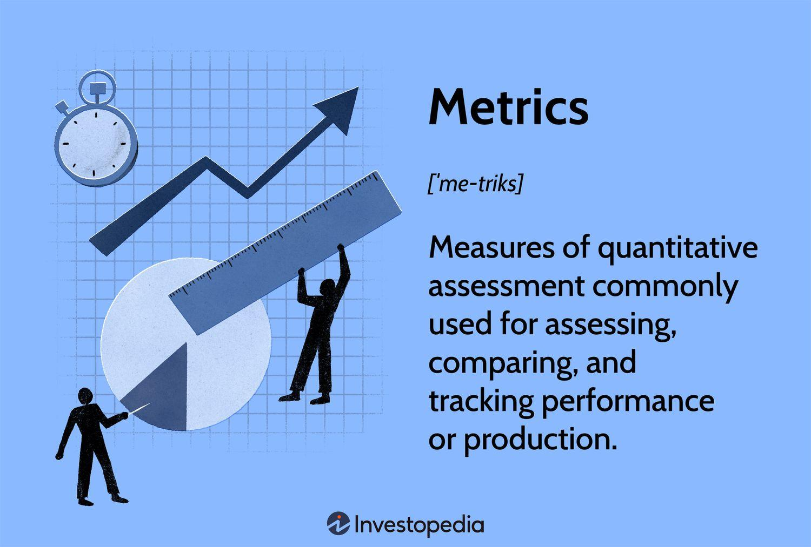

Algorithmic trading, powered by sophisticated quantitative services groups, has fundamentally transformed the financial markets through the use of advanced mathematical models to execute transactions autonomously. These models allow for the rapid processing and analysis of vast amounts of market data, facilitating decisions that would be impossible for human traders to perform manually. Quantitative services groups play a crucial role in this evolution by developing and refining the mathematical algorithms that drive these trading systems.

Such groups bring together experts in statistics, computer science, financial engineering, and machine learning to construct trading models that are not only efficient but also adaptable to the ever-changing market conditions. Their contributions extend beyond trade execution to encompass trade automation, risk management, and portfolio management, making them integral components of modern trading infrastructures.

As of recent statistics, over 84% of U.S. trades are executed by automated software, underscoring the predominant role of algorithmic trading in today's markets. Understanding the functions of quantitative services is essential for both retail and institutional investors aiming to harness the benefits of automated trading systems. These groups underpin high-performance trading strategies and provide robust mechanisms for managing risk, ensuring that trading activities are both profitable and resilient.

By exploring the expertise and strategies employed by quantitative services groups, this article aims to shed light on why their services are indispensable in achieving successful algorithmic trading outcomes. As market dynamics continue to accelerate, the work and insights provided by these groups will increasingly shape the landscape of financial trading.

## Table of Contents

## Understanding Quantitative Services Groups

Quantitative services groups play a pivotal role in the financial sector, primarily concentrating on the development and implementation of systematic trading strategies. These teams are composed of professionals with expertise in [statistics](/wiki/bayesian-statistics), computer science, financial engineering, and [machine learning](/wiki/machine-learning). Their work focuses on applying advanced quantitative models to harness big data and analytics, thereby predicting market trends with enhanced precision.

At the core of their responsibilities is the creation of algorithms and strategies designed to navigate complex financial markets. By employing sophisticated mathematical models and leveraging large volumes of data, they enable the anticipation of price movements and other market behaviors. These tasks often involve utilizing statistical techniques and machine learning algorithms, such as regression models, neural networks, and natural language processing, allowing for the analysis and interpretation of both historical data and real-time market information.

Quantitative services groups work closely with financial entities like banks, investment firms, and hedge funds. By doing so, they contribute to generating external alpha—returns above the market average—through innovative and rational investment strategies. Their role extends beyond just predictive analytics; they are also involved in constructing and maintaining the technological infrastructure necessary for executing trading strategies efficiently. This includes handling vast datasets, managing execution speeds, and ensuring robust data security measures.

Moreover, these groups integrate findings from the latest academic and industry research to refine and improve their models continuously. This dedication to ongoing development ensures that their quantitative methods remain relevant and effective in dynamic market conditions. As a result, their efforts significantly bolster trading performance while simultaneously employing advanced risk management techniques. These techniques are crucial for assessing and mitigating potential risks within investment portfolios.

The ultimate aim of quantitative services groups is to optimize trading efficacy and minimize financial risk. This is accomplished using specialized tools for risk assessment and trade automation, effectively balancing potential gains with associated risks. Such rigorous risk evaluation processes involve calculating risk metrics like Value at Risk (VaR) and stress testing scenarios to ensure resilience against market fluctuations. Through these comprehensive efforts, quantitative services groups are integral to the functioning and advancement of [algorithmic trading](/wiki/algorithmic-trading).

## The Role of Quantitative Services in Algorithmic Trading

Quantitative services play a pivotal role in the creation and execution of algorithmic trading strategies. These services are tasked with designing algorithms that can automatically execute trades at the most favorable prices and within the shortest possible timeframes. By leveraging real-time data streams and employing advanced predictive analytics, these algorithms operate with impressive efficiency and precision.

The integration of real-time data ensures that the algorithms are constantly updated with the freshest information available, allowing them to make informed decisions rapidly. Predictive analytics enable these algorithms to forecast market movements, enhancing their ability to execute trades that align with pre-determined optimal parameters.

Risk management is a fundamental component of quantitative services in algorithmic trading. By embedding risk management protocols into their algorithms, quantitative services ensure that the trading systems can swiftly respond to adverse market conditions. This capability is crucial for protecting investments and minimizing potential losses. The algorithms are designed to trigger automated safeguards, stopping trades or adjusting positions when negative trends are detected, thereby preserving the overall health of the portfolio.

Continuous improvement is another hallmark of quantitative services. Algorithms are perpetually refined based on market feedback and performance metrics. This iterative process allows trading strategies to remain agile and competitive, adapting to evolving market patterns and emerging opportunities. The methodologies employed can range from straightforward adjustments in response to minor discrepancies to complex overhauls aimed at optimizing performance across a range of market scenarios.

In summary, quantitative services are indispensable to algorithmic trading. Their ability to harness real-time data, employ predictive analytics, enforce rigorous risk management, and perpetually refine strategies ensures that these trading algorithms are both effective and reliable. As a result, they provide traders with robust tools for navigating the complexities of modern financial markets.

## Benefits of Utilizing Quantitative Services

Quantitative services provide significant benefits for algorithmic trading, primarily due to their ability to enhance trading efficiency and accuracy. Algorithms, a cornerstone of quantitative services, can process and analyze large datasets with remarkable speed, far surpassing human capabilities. This computational prowess allows traders to make data-driven decisions with improved accuracy, harnessing insights from real-time and historical market data.

Risk mitigation is another critical advantage. Quantitative services employ advanced risk management tools that assess potential market risks and systematically adjust trading strategies. These tools utilize metrics such as Value at Risk (VaR) and stress testing to anticipate and manage potential losses, ensuring that trading strategies remain resilient under various market conditions.

Automating the trading process provides the benefit of emotional detachment. By removing human emotions from trading decisions, quantitative services ensure that strategies are executed consistently and objectively. This automation reduces the impact of psychological biases that can lead to suboptimal trading decisions, such as fear-driven selling or greed-induced buying.

Cost efficiency is a notable advantage of utilizing quantitative services. Automated trading reduces the need for manual intervention, thereby lowering transaction costs. Because trading algorithms can operate 24/7 without fatigue, they optimize resource utilization and minimize operational costs. This efficiency allows for competitive pricing and enhanced profitability over time.

Historical data supports the claim that algorithmic trading often leads to consistent returns, even in volatile markets. By leveraging sophisticated statistical models and machine learning algorithms, quantitative services can identify profitable trading opportunities and adjust strategies dynamically. This adaptability contributes to stable performance and sustained profitability, providing a significant edge in fast-paced financial environments.

## Strategies Deployed by Quantitative Services Groups

Quantitative services groups deploy various sophisticated strategies to enhance the performance of algorithmic trading systems. One such strategy is Mean Reversion, which operates on the assumption that asset prices will revert to their historical average over time. This strategy involves identifying deviations from the historical mean, assuming that prices will eventually return to that average. Traders can capitalize on this by buying undervalued assets and selling overvalued ones, thus allowing algorithms to predict potential entry and [exit](/wiki/exit-strategy) points based on historical price data.

Momentum Trading is another widely used strategy where algorithms are designed to identify and exploit significant market trends. This strategy is predicated on the idea that assets which have demonstrated an upward or downward trend will continue to move in that direction for some time. Algorithms track price [momentum](/wiki/momentum) to execute trades that align with current trends, thus optimizing potential profit opportunities before the trend reverses.

Arbitrage Opportunities present another strategic avenue, where algorithms detect and exploit price discrepancies of the same asset across different markets or instruments. This requires the algorithms to act swiftly to lock in profits before the discrepancies are corrected. Such strategies may include statistical [arbitrage](/wiki/arbitrage) and market-neutral strategies, which minimize exposure to market movements while capturing profit from short-lived inefficiencies.

The integration of Big Data and AI has significantly transformed the landscape of [quantitative trading](/wiki/quantitative-trading). Utilizing AI, quantitative services groups can process vast datasets to uncover patterns and correlations that may not be immediately apparent through traditional analysis. Machine learning algorithms can adapt to new data inputs, improving predictive accuracy and enhancing decision-making processes. Python libraries such as Pandas and Scikit-learn are often employed to develop these complex models due to their efficiency in handling large datasets and performing statistical analyses.

Finally, Custom Solutions are tailored to meet specific client goals and risk profiles, providing a competitive edge. These personalized strategies involve close collaboration with clients to understand their unique objectives and constraints. By leveraging their expertise in quantitative analysis, these groups design bespoke algorithms that align with individual risk appetites and return expectations, ensuring a personalized approach that addresses specific trading needs.

## Why Choose a Quantitative Services Group for Algorithmic Trading

Choosing a quantitative services group for algorithmic trading offers numerous advantages that can significantly enhance trading success. One of the primary benefits is their proven expertise. These groups are composed of professionals who possess extensive knowledge and experience encompassing finance, data science, and other highly technical disciplines. Their diverse skill sets enable them to tackle complex financial models and algorithmic challenges with efficiency and precision, providing clients with a competitive edge.

Moreover, quantitative services groups offer comprehensive support that covers the entire lifecycle of trading algorithms. From conducting in-depth research and thorough analysis to developing algorithms and deploying them into trading environments, these groups provide end-to-end solutions. This holistic approach ensures that clients have the resources and guidance needed at every stage of algorithm development and execution, facilitating smoother transitions and optimized trading operations.

Innovative solutions are a hallmark of quantitative services groups. Staying at the cutting-edge of technological advancement is crucial in algorithmic trading, and these groups continuously push boundaries by integrating the latest technologies and methodologies into their services. Whether it's through the application of [artificial intelligence](/wiki/ai-artificial-intelligence), machine learning, or the latest in big data analytics, they ensure that their clients benefit from state-of-the-art trading solutions.

Being client-focused is another advantage these groups offer. They tailor strategies meticulously to align with the specific objectives and risk appetite of each client. This customization ensures that trading strategies are not only technically sound but also closely matched to the client's individual goals, leading to more satisfying and effective trading outcomes.

Lastly, the reliable performance of quantitative services groups is evidenced by their historical track record. By maintaining robust risk management and consistently generating superior returns, these groups have established themselves as trustworthy partners in the volatile world of financial markets. Their ability to balance risk and reward efficiently allows their clients to benefit from stable, predictable outcomes even in fluctuating market conditions.

In sum, the expertise, support, innovation, client personalization, and reliable performance offered by quantitative services groups make them a strategic choice for any investor looking to thrive in algorithmic trading.

## Conclusion

In today's financial landscape, the importance of quantitative services groups in algorithmic trading is paramount. These groups bring critical enhancements to trading efficiency through their deep expertise in data science, financial engineering, and algorithm development. By implementing sophisticated models that autonomously execute trades, they significantly improve trading speed and accuracy, allowing investors to capitalize on fleeting market opportunities.

Moreover, quantitative services groups play a crucial role in risk management. They develop robust algorithms that not only respond dynamically to market fluctuations but also incorporate advanced risk assessment techniques to minimize potential losses. This ensures that trading strategies can withstand market [volatility](/wiki/volatility-trading-strategies) and protect investor capital effectively.

For investors and financial institutions aiming to optimize their trading strategies, partnering with a quantitative services group provides clear competitive advantages. Access to the latest technological innovations and trading methodologies enables these entities to stay ahead of market trends and adapt swiftly to changes. Quantitative experts tailor strategies to fit specific client goals and risk appetites, ensuring that personalized solutions consistently deliver superior returns.

As algorithmic trading continues to dominate trading floors globally, the influence of quantitative experts is set to increase. Their ability to integrate big data analytics and machine learning into trading strategies ensures that they can navigate the complexities of modern financial markets with precision and insight. By understanding and leveraging the services offered by these groups, traders gain the expertise necessary to thrive in the fast-paced world of algorithmic trading, securing a position at the forefront of financial innovation.

## References & Further Reading

[1]: Bergstra, J., Bardenet, R., Bengio, Y., & Kégl, B. (2011). ["Algorithms for Hyper-Parameter Optimization."](https://papers.nips.cc/paper/4443-algorithms-for-hyper-parameter-optimization) Advances in Neural Information Processing Systems 24.

[2]: ["Advances in Financial Machine Learning"](https://www.amazon.com/Advances-Financial-Machine-Learning-Marcos/dp/1119482089) by Marcos Lopez de Prado

[3]: ["Evidence-Based Technical Analysis: Applying the Scientific Method and Statistical Inference to Trading Signals"](https://www.amazon.com/Evidence-Based-Technical-Analysis-Scientific-Statistical/dp/0470008741) by David Aronson

[4]: ["Machine Learning for Algorithmic Trading"](https://github.com/stefan-jansen/machine-learning-for-trading) by Stefan Jansen

[5]: ["Quantitative Trading: How to Build Your Own Algorithmic Trading Business"](https://books.google.com/books/about/Quantitative_Trading.html?id=j70yEAAAQBAJ) by Ernest P. Chan

[6]: ["The Man Who Solved the Market: How Jim Simons Launched the Quant Revolution"](https://www.amazon.com/Man-Who-Solved-Market-Revolution/dp/073521798X) by Gregory Zuckerman

[7]: Motwani, R., & Raghavan, P. (1995). ["Randomized Algorithms."](https://rajsain.files.wordpress.com/2013/11/randomized-algorithms-motwani-and-raghavan.pdf) Cambridge University Press.