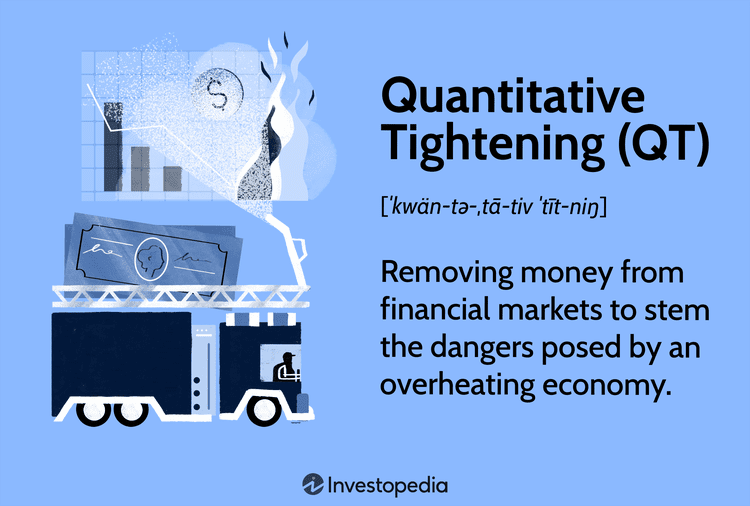

## Table of Contents

## What is Quantitative Tightening (QT)?

Quantitative Tightening (QT) is when a central bank, like the Federal Reserve in the United States, decides to reduce the amount of money it has pumped into the economy. This is usually done after a period of Quantitative Easing (QE), where the central bank buys bonds and other securities to inject money into the system. By selling these assets or letting them mature without buying new ones, the central bank takes money out of circulation, which can help to control inflation and slow down an overheating economy.

QT is important because it helps to balance out the effects of QE. When a central bank uses QE, it's like adding more water to a pool to help it fill up. But if the pool gets too full, you need to take some water out. That's what QT does. By reducing the money supply, QT can help prevent prices from rising too quickly and keep the economy stable. It's a tool that central banks use to manage economic growth and keep inflation in check.

## How does Quantitative Tightening differ from Quantitative Easing (QE)?

Quantitative Easing (QE) and Quantitative Tightening (QT) are two opposite actions that central banks take to manage the economy. QE is like adding more water to a pool. When a central bank does QE, it buys bonds and other securities from banks and investors. This puts more money into the economy, which can help when things are slow and people need more money to spend and invest. It's like trying to fill up the pool to make sure everyone can swim comfortably.

On the other hand, QT is like taking water out of the pool. When a central bank does QT, it sells bonds or lets them mature without buying new ones. This takes money out of the economy, which can help when things are moving too fast and prices are going up too much. It's like making sure the pool doesn't overflow and cause problems. So, while QE is about adding money to help the economy grow, QT is about removing money to keep things stable and control inflation.

## Why do central banks implement Quantitative Tightening?

Central banks use Quantitative Tightening (QT) to slow down an economy that's growing too fast. When an economy grows too quickly, it can cause prices to go up a lot, which is called inflation. To stop this, the central bank takes money out of the economy by selling bonds or letting them mature without buying new ones. This makes sure that there's not too much money floating around, which helps keep prices from rising too fast.

QT is important because it helps balance out the effects of Quantitative Easing (QE). QE is when the central bank adds money to the economy to help it grow when it's slow. But if the economy gets too much of a boost, it can overheat. That's when QT comes in. By taking money out, the central bank can cool things down and keep the economy running smoothly. It's all about finding the right balance to keep things stable.

## What are the typical tools used in Quantitative Tightening?

Central banks use a few main tools for Quantitative Tightening. The first tool is selling bonds and other securities that they bought during Quantitative Easing. When they sell these, banks and investors give money to the central bank, which takes that money out of the economy. The second tool is letting bonds mature without buying new ones. When bonds reach their end date, the central bank doesn't replace them with new bonds, so the money that was tied up in those bonds goes away.

These tools help reduce the amount of money in the economy. By selling bonds or not replacing them, the central bank makes sure there's less money floating around. This can help slow down an economy that's growing too fast and keep prices from going up too much. It's like taking water out of a pool to make sure it doesn't overflow.

## How does QT affect the money supply in an economy?

When a central bank does Quantitative Tightening (QT), it makes the money supply in the economy smaller. They do this by selling bonds or letting them mature without buying new ones. When they sell bonds, banks and people give money to the central bank, which means there's less money out there for spending and investing. If they let bonds mature without replacing them, the money that was tied up in those bonds goes away, which also makes the total money supply smaller.

Having less money in the economy can help slow things down. When there's too much money, prices can go up a lot, which is called inflation. By taking money out, the central bank can help keep prices from rising too fast. It's like taking water out of a pool to make sure it doesn't overflow. This helps keep the economy stable and balanced.

## What are the potential impacts of QT on inflation?

When a central bank does Quantitative Tightening (QT), it tries to lower inflation. Inflation happens when prices go up a lot because there's too much money around. By taking money out of the economy through QT, the central bank can help slow down how fast prices rise. It's like taking water out of a pool to make sure it doesn't overflow. Less money means people and businesses have less to spend, which can help keep prices from going up too quickly.

But QT can also have other effects on inflation. If the central bank takes out too much money too fast, it might slow down the economy too much. This could lead to lower inflation or even deflation, where prices start to go down. Finding the right balance is important. The central bank needs to take out enough money to control inflation but not so much that it hurts the economy. It's a tricky job, but it's important for keeping things stable.

## Can you explain the process of reducing a central bank's balance sheet through QT?

When a central bank wants to reduce its balance sheet through Quantitative Tightening (QT), it starts by selling the bonds and securities it bought during Quantitative Easing (QE). These bonds were bought to put more money into the economy, but now the central bank sells them to take money out. When banks and investors buy these bonds, they give money to the central bank, which means there's less money for people to spend and invest.

Another way the central bank reduces its balance sheet is by letting bonds mature without buying new ones. When bonds reach the end of their term, the central bank gets the money back that was tied up in those bonds. Instead of using that money to buy new bonds, the central bank just keeps it, which makes the total amount of money in the economy smaller. Both of these methods help the central bank shrink its balance sheet and take money out of the economy, which can help control inflation and keep the economy stable.

## How does Quantitative Tightening influence interest rates?

When a central bank does Quantitative Tightening (QT), it can make interest rates go up. This happens because QT takes money out of the economy. When there's less money around, banks and people have to pay more to borrow money. So, the interest rates, which are like the price of borrowing money, go up. It's like when there's less water in a pool, the price of water might go up because it's more valuable.

Higher interest rates can slow down the economy. When borrowing money costs more, people and businesses might borrow less. They might also spend less because they want to save more money to pay for the higher interest. This can help control inflation, which is when prices go up a lot. But if interest rates go up too much, it might slow down the economy too much. So, the central bank has to be careful and find the right balance to keep things stable.

## What are the risks associated with implementing Quantitative Tightening?

When a central bank does Quantitative Tightening, there are some risks to watch out for. One big risk is that it might slow down the economy too much. If the central bank takes out too much money too fast, it can make it harder for people and businesses to borrow and spend. This could lead to less growth and even a recession, where the economy shrinks. It's like trying to cool down a pool that's too hot, but ending up making it too cold.

Another risk is that QT might cause problems in the financial markets. When the central bank sells bonds, it can make bond prices go down and interest rates go up. This can be hard on banks and investors who own bonds because their value goes down. If they panic and start selling a lot of bonds, it could cause bigger problems in the market. It's like trying to take water out of a pool without causing too many waves, but sometimes the waves can get out of control.

## How can the effectiveness of Quantitative Tightening be measured?

The effectiveness of Quantitative Tightening can be measured by looking at how it changes the money supply in the economy. When a central bank does QT, it tries to take money out of the economy by selling bonds or letting them mature without buying new ones. If the money supply goes down, it means QT is working. Economists can check this by looking at data on how much money is in banks and how much people are spending. If there's less money around, it's a sign that QT is doing its job.

Another way to measure the effectiveness of QT is by looking at inflation rates. The main goal of QT is to control inflation, which is when prices go up a lot. If inflation slows down after the central bank starts doing QT, it's a good sign that it's working. Economists can look at price changes over time to see if QT is helping to keep prices from rising too fast. If prices stay stable or go up more slowly, it means QT is effective in managing inflation.

## What historical examples illustrate the use of Quantitative Tightening?

One example of Quantitative Tightening happened in the United States after the financial crisis of 2008. The Federal Reserve used Quantitative Easing to help the economy recover by buying lots of bonds and putting more money into the system. But by 2017, the economy was doing better, and the Fed started to use QT to take some of that money back out. They did this by letting bonds mature without buying new ones and slowly selling off some of their holdings. This helped control inflation and keep the economy from growing too fast.

Another example is from the European Central Bank (ECB). After using QE to help the Eurozone economy during tough times, the ECB started QT in 2022. They did this by not reinvesting all the money from bonds that matured. This was a way to slowly reduce the amount of money in the economy and keep prices from going up too quickly. The ECB had to be careful because they didn't want to slow down the economy too much, but they needed to make sure inflation stayed under control.

## How do different economic theories interpret the effects of Quantitative Tightening?

Different economic theories have different views on how Quantitative Tightening affects the economy. Keynesian economists think that QT can help control inflation by taking money out of the economy. They believe that when there's less money around, people spend less, which slows down the economy and keeps prices from going up too fast. But they also worry that if QT is too strong, it might slow down the economy too much and cause problems like a recession. So, they think the central bank needs to be careful and find the right balance.

Monetarist economists, on the other hand, focus a lot on the money supply. They believe that QT is important for controlling inflation because it reduces the amount of money in the economy. They think that if the central bank can control the money supply well, it can keep the economy stable. But they also know that if QT is done too quickly or too strongly, it could cause big changes in interest rates and financial markets, which might lead to problems. So, they think the central bank should do QT slowly and carefully to avoid big shocks to the economy.

## References & Further Reading

[1]: Hendershott, T., Jones, C. M., & Menkveld, A. J. (2011). ["Does Algorithmic Trading Improve Liquidity?"](https://onlinelibrary.wiley.com/doi/full/10.1111/j.1540-6261.2010.01624.x) The Journal of Finance, 66(1), 1-33.

[2]: Bernanke, B. S. (2015). ["The Courage to Act: A Memoir of a Crisis and Its Aftermath"](https://archive.org/details/couragetoactmemo0000bern). W. W. Norton & Company.

[3]: ["Algorithmic Trading and DMA: An Introduction to Direct Access Trading Strategies"](https://www.amazon.com/Algorithmic-Trading-DMA-introduction-strategies/dp/0956399207) by Barry Johnson

[4]: López de Prado, M. (2018). ["Advances in Financial Machine Learning"](https://www.amazon.com/Advances-Financial-Machine-Learning-Marcos/dp/1119482089). Wiley.

[5]: Volcker, P. A., & Harper, C. (2018). ["Keeping At It: The Quest for Sound Money and Good Government"](https://www.amazon.com/Keeping-At-Quest-Sound-Government/dp/1541788311). PublicAffairs.

[6]: Chan, E. P. (2013). ["Algorithmic Trading: Winning Strategies and Their Rationale"](https://github.com/ftvision/quant_trading_echan_book). Wiley.