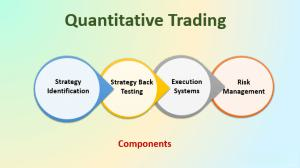

Quantitative trading is an investment strategy that relies on mathematical models to identify and capitalize on trading opportunities. By systematically analyzing large volumes of data, quantitative trading seeks to predict price movements and execute trades based on statistical and mathematical computations. In the current financial markets, where milliseconds can determine success, quantitative trading plays a crucial role. With the availability of vast datasets and computational power, it allows traders and financial institutions to implement strategies with precision and speed that human judgment and traditional trading methods cannot match.

The rise of technology and data analysis in financial trading has revolutionized the way financial markets operate. The advent of high-speed computing and sophisticated data analysis tools enables traders to process massive amounts of historical and real-time market data to forecast trends and price movements. For instance, massive datasets such as historical prices, trading volumes, and macroeconomic indicators can be utilized to construct complex models that aid in decision-making processes. This technological advancement provides a significant edge, facilitating the quick adaptation to volatile market conditions and the identification of lucrative opportunities that might otherwise remain overlooked.



Algorithmic and quantitative trading represent a merger of technology and finance, creating a framework in which trading can be both highly efficient and systematic. Algorithmic trading, which involves the use of automated pre-programmed trading instructions, often employs quantitative models to develop these instructions. These models analyze data patterns and implement trades at speeds and frequencies that are impossible for human traders. By removing human emotions from trading decisions, the merger of algorithms with quantitative strategies allows for the consistent execution of trades based purely on data-driven insights. This marriage of finance with technology has not only broadened the scope of trading strategies available but also democratized access to sophisticated trading tools, enabling a wider range of market participants to engage in high-level trading activities.

Therefore, the integration of quantitative methods with algorithmic execution systems has fundamentally changed the dynamics of financial markets, making trading faster, more efficient, and heavily reliant on data analytics. As technology continues to advance, the potential for enhanced algorithmic and quantitative trading methods will likely expand, shaping the future landscape of financial markets.

## Table of Contents

## Understanding Quantitative Trading

Quantitative trading is an investment approach where trading decisions are governed by numerical and statistical computations. By systematically analyzing vast data sets, quantitative trading enables the development of strategies that are consistent, objective, and emotion-free. At its core, quantitative trading relies on data inputs such as market prices, trading volume, volatility, and even macroeconomic indicators to construct robust trading strategies.

Data inputs play a pivotal role in quantitative trading. Market price, one of the primary inputs, allows traders to analyze historical prices and derive trends or patterns that can inform future price movements. Volume data, which indicates how many shares or contracts of an asset have been traded over a certain period, provides insights into market activity levels and liquidity. Traders often use volume in conjunction with price to validate the strength of a price trend; for instance, a price increase accompanied by high trading volume might suggest a strong bullish trend.

Beyond price and [volume](/wiki/volume-trading-strategy), [quantitative trading](/wiki/quantitative-trading) can include other data types such as open interest for derivatives, sentiment indicators derived from news feeds or social media, and economic data like interest rates or employment figures. These varied data sets provide a richer framework for developing sophisticated models.

The application of mathematical models is at the heart of quantitative trading strategies. Mathematical models in trading often involve statistical methods, [machine learning](/wiki/machine-learning) algorithms, and econometric models. A common technique is regression analysis, which helps in establishing relationships between different variables, such as predicting future stock returns based on historical data. Another prevalent model is the moving average crossover strategy, which uses two moving averages—a short-term and a long-term one. A buy signal is generated when the short-term moving average crosses above the long-term moving average, and a sell signal is generated when the opposite occurs.

Another mathematical model used in quantitative trading is the Black-Scholes model, primarily utilized for options pricing. This model provides a theoretical estimate of the price of European-style options and relies on inputs such as [volatility](/wiki/volatility-trading-strategies), [interest rate](/wiki/interest-rate-trading-strategies), and time to expiration.

In implementing these models, traders often use programming languages like Python to automate and refine their trading strategies. Python, in particular, is favored due to its extensive libraries for data analysis, such as NumPy and pandas, and machine learning, such as scikit-learn and TensorFlow.

Here's an example of a simple moving average crossover strategy implemented in Python:

```python
import pandas as pd

# Load the data
data = pd.read_csv('stock_data.csv')
data['SMA_50'] = data['Close'].rolling(window=50).mean()
data['SMA_200'] = data['Close'].rolling(window=200).mean()

# Define buy/sell signals
data['Signal'] = 0
data['Signal'][data['SMA_50'] > data['SMA_200']] = 1
data['Position'] = data['Signal'].diff()

# Extract buy/sell signals
buy_signals = data[data['Position'] == 1]
sell_signals = data[data['Position'] == -1]
```

The above code calculates 50-day and 200-day simple moving averages (SMA) and determines buy and sell signals based on their crossover. Such models, when tested and optimized, can be used to automate trading decisions.

In conclusion, quantitative trading is a systematic approach that leverages various data inputs and mathematical models to build strategies that capitalize on market inefficiencies. By continuously testing and refining these models, traders aim to generate superior returns.

## Quantitative Trading Strategies

Quantitative trading strategies leverage mathematical models and large datasets to generate trading signals and execute trades. These strategies encompass a variety of methods, each with distinct characteristics and objectives.

**Arbitrage:** Arbitrage strategies seek to exploit price discrepancies in different markets or forms. A simple form is the classic arbitrage, where traders buy and sell the same asset in two different markets to profit from the price differential. More complex forms include statistical arbitrage, which utilizes historical data and statistical measures to predict price movements and identify profitable opportunities.

**High-Frequency Trading (HFT):** HFT strategies are characterized by high-speed trade execution made possible through sophisticated algorithms and advanced technology. These strategies often rely on statistical arbitrage or other quantitative models to identify fleeting trading opportunities in milliseconds, generating profits from minute price fluctuations. The success of HFT is highly dependent on the latency of data processing and order execution capabilities.

**Momentum Investing:** This strategy is based on the premise that assets that have performed well in the past will continue to do so in the future. Quantitative models calculate the momentum of price movements and derive signals for buying or selling securities. A typical momentum strategy might involve ranking stocks by their recent returns and investing in the top performers.

**Mean Reversion:** Mean reversion strategies operate on the hypothesis that prices and returns eventually move back towards the mean or average. Traders using these strategies look for deviations from historical norms and predict reversals, buying assets predicted to go up and selling ones expected to decline. These strategies often involve calculating the z-score of price variations or employing moving averages.

**Examples of Successful Quantitative Trading Strategies:**

1. **Renaissance Technologies’ Medallion Fund:** Known for its remarkable returns, this hedge fund employs complex algorithms and an immense data-processing capacity to execute a variety of short-term strategies. While specific strategies remain confidential, it is known that the fund relies on statistical arbitrage and extensive quantitative analysis to generate substantial profits.

2. **Two Sigma Investments:** This quantitative hedge fund leverages machine learning, distributed computing, and large-scale data analysis to build diversified and sophisticated trading algorithms. Two Sigma employs statistical models to detect patterns and trends that inform trading decisions, exemplifying the practical application of quantitative trading strategies.

These strategies highlight the diversification quantum finance can offer through meticulous statistical and algorithmic exploration. Quantitative trading effectively minimizes human emotion, but remains sensitive to model risk, requiring continuous evaluation and adaptation to market environments.

## Advantages and Challenges of Quantitative Trading

Quantitative trading presents numerous advantages within financial markets. One of its primary benefits is the ability to eliminate emotional bias. Traditional trading often suffers from the influence of human emotions such as fear and greed, which can lead to impulsive decisions. Quantitative trading, however, relies on pre-defined mathematical models and algorithms, ensuring decisions are made based on data and statistical analysis rather than human intuition. This approach not only provides consistency but also enhances the predictability of trading outcomes.

Another significant strength of quantitative trading is its optimal use of data. Markets generate vast amounts of data every second, including price, volume, and order flow. Quantitative trading systems are designed to process and analyze this data at speeds beyond human capability, extracting insights and patterns that inform trading strategies. By leveraging big data, quantitative strategies can identify subtle market inefficiencies and capitalize on them.

Despite these advantages, quantitative trading faces inherent challenges. One of the primary limitations is its sensitivity to changing market conditions. Models are typically built upon historical data, which may not always predict future market behavior accurately. Situations such as economic shifts or unprecedented global events can render a well-optimized model less effective, as the assumptions it was based on may no longer hold true.

This necessitates the continuous adaptation and refinement of trading models. Constant monitoring and adjustment are required to maintain model efficacy, ensuring that strategies remain aligned with current market dynamics. This could involve updating algorithm parameters or incorporating new data sources to capture emerging trends. Additionally, overfitting models to historical data can provide a false sense of security, so quantitative traders must strike a balance between model complexity and robustness.

Mathematically, consider a simple model to predict stock prices based on historical data:

$$
P(t+1) = \alpha P(t) + \beta V(t) + \gamma
$$

where $P(t)$ is the price at time $t$, $V(t)$ is the trading volume, and $\alpha, \beta, \gamma$ are coefficients determined through historical data analysis. If market conditions change drastically, these coefficients might not reflect future performance trends, hence requiring recalibration.

In conclusion, quantitative trading offers benefits such as unemotional decision-making and the efficient usage of data, making it a powerful tool in modern finance. However, its success hinges on the ability to adapt to the ever-evolving landscape of financial markets, highlighting the importance of continual model evaluation and revision.

## Role of Algorithms in Trading

Quantitative trading combines financial expertise with data analysis and mathematical modeling to inform and execute trading decisions. Within this domain, [algorithmic trading](/wiki/algorithmic-trading) plays a crucial role by automating these quantitative strategies. This intersection allows traders to exploit market inefficiencies with precision and speed that manual trading cannot achieve.

Algorithmic trading employs computer programs to execute trading instructions automatically based on predetermined criteria. The automation of quantitative strategies involves converting mathematical models and data-driven insights into executable algorithms. These algorithms are designed to analyze vast datasets, identify trading opportunities, and execute orders without the need for human intervention.

The benefits of algorithmic trading include speed, accuracy, and the ability to manage complex strategies across various markets simultaneously. One primary advantage is speed; algorithms can process a vast amount of information and execute trades within fractions of a second, considerably faster than any human trader. This high speed is critical in today's markets, where prices can change rapidly, and the price advantage is often fleeting.

Efficiency is another major benefit, as algorithms execute trades while minimizing the risk of human error. They ensure trades are consistent with the strategy's predefined rules, removing emotional biases that can cloud judgment. For instance, a [momentum](/wiki/momentum) trading algorithm might buy assets that are experiencing upward price momentum and sell them when the trend reverses, without second-guessing or hesitation.

Consider the following simple Python example to illustrate a basic price momentum trading algorithm:

```python
import pandas as pd

# Sample price data
data = {'Prices': [100, 102, 105, 107, 110, 108, 107, 109]}
df = pd.DataFrame(data)

# Calculate momentum
df['Momentum'] = df['Prices'].diff()

# Buy if the momentum is positive, sell if negative
df['Signal'] = df['Momentum'].apply(lambda x: 'Buy' if x > 0 else 'Sell')

print(df)
```

In this example, the algorithm calculates the momentum of price changes to generate buy or sell signals. This automates the decision-making process based on a simple predefined rule set, illustrating algorithmic trading's ability to execute strategies efficiently.

Moreover, algorithmic trading facilitates the implementation of complex strategies that involve multiple instruments and trading conditions. It allows for scalability, enabling traders to apply the same strategy across multiple markets or asset classes simultaneously. This scalability is vital for institutional investors who manage large portfolios.

In conclusion, the intersection of quantitative and algorithmic trading results in an efficient, fast, and reliable execution of trading strategies. By automating quantitative models, traders can capitalize on short-lived opportunities and apply sophisticated strategies without manual intervention, thus enhancing potential returns while managing risk more effectively.

## High-Frequency Trading and Its Impact

High-frequency trading ([HFT](/wiki/high-frequency-trading-strategies)) is a form of quantitative trading characterized by the high speed and volume of trade execution. It relies heavily on quantitative models to make trading decisions within fractions of a second. These models often incorporate data inputs such as price, volume, and market trends to identify short-term trading opportunities.

Central to HFT is the use of computer algorithms that can process vast amounts of information at extraordinary speeds. These algorithms are designed to identify and capitalize on minimal price discrepancies or market inefficiencies. By using advanced calculations and statistical models, they can determine optimal trade execution strategies, allowing traders to execute a large number of orders in milliseconds. The speed and efficiency of HFT can lead to increased [liquidity](/wiki/liquidity-risk-premium) and tighter spreads, potentially making markets more efficient.

However, the rapid execution associated with HFT introduces certain risks, notably increased market volatility. The ability of HFT algorithms to quickly buy and sell large volumes of securities can amplify small market movements, leading to significant price fluctuations. A prominent example of such volatility was the "Flash Crash" of May 6, 2010, when the Dow Jones Industrial Average plunged about 1,000 points within minutes before quickly recovering. The event was partially attributed to the high-speed nature of algorithmic trading, which created a feedback loop of sell orders leading to further downward pressure on stock prices.

Moreover, the increasing complexity of these algorithms makes them challenging to regulate and monitor, raising ethical and regulatory concerns. The balance between leveraging speed and efficiency while managing systemic risks remains a critical challenge for financial markets adapting HFT practices. As such, regulatory bodies continue to develop guidelines and frameworks to mitigate potential adverse effects while promoting market integrity and stability.

## Implementing Quantitative Trading Strategies

Developing a quantitative trading model involves several crucial steps designed to create strategies capable of capitalizing on market opportunities. At its core, a well-constructed model relies on robust data collection, thorough [backtesting](/wiki/backtesting), and ongoing refinement.

### Data Collection

The foundation of a quantitative trading model is the data it analyzes. This often includes historical price data, trading volumes, and other market-related variables. Accessing reliable data is essential since the accuracy and granularity of the data can significantly impact the model's performance. Typically, data vendors or financial institutions provide this data, which can be ingested into analytical software for processing. Additionally, depending on the strategy, economic indicators, sentiment analysis, or news feeds might be integrated to enrich the dataset.

### Building the Model

Quantitative strategies are crafted by applying statistical and mathematical models to the collected data. These models can range from simple moving averages to complex machine learning algorithms. The key is to identify patterns or signals that suggest profitable trading opportunities. 

Python is widely used due to its powerful libraries like NumPy, pandas, and scikit-learn. Here’s an example of how a simple moving average crossover strategy might be coded:

```python
import pandas as pd

# Load your data
data = pd.read_csv('historical_data.csv')
data['SMA_50'] = data['Close'].rolling(window=50).mean()
data['SMA_200'] = data['Close'].rolling(window=200).mean()

# Signal generation
data['Signal'] = 0
data['Signal'][50:] = np.where(data['SMA_50'][50:] > data['SMA_200'][50:], 1, 0)
data['Position'] = data['Signal'].diff()

# Print the data with signals
print(data)
```

### Backtesting

Once a model is developed, backtesting is conducted to evaluate the strategy’s performance against historical data. This process assesses the viability of the strategy without risking actual capital. By simulating trades in the past, traders can identify how the model would have behaved and refine it to enhance results. Key metrics such as the Sharpe Ratio, drawdown, and win/loss ratio are often used to gauge a strategy’s profitability and risk.

Backtesting also helps in minimizing overfitting, ensuring that the models do not just perform well on past data but have predictive power for future market conditions. It is vital to use out-of-sample data to validate the model’s robustness.

### Continuous Monitoring and Adjustment

Market conditions are dynamic, necessitating continuous monitoring and adjustment of strategies. A quantitative trading model should be regularly updated with new data and fine-tuned to adapt to changes. Monitoring involves tracking the performance of the model, rapidly identifying deviations in expected performance, and making necessary adjustments.

Automatic adjustment techniques, like machine learning-based models, can adapt and recalibrate based on real-time data. This continuous improvement loop helps in keeping the strategy relevant and effective.

In summary, implementing quantitative trading strategies demands a methodical approach, rooted in robust data handling, model building, exhaustive backtesting, and diligent monitoring to ensure that the model adapts to the ever-changing financial markets.

## Choosing the Right Platform for Quant Algorithmic Trading

Quantitative algorithmic trading platforms are crucial for executing sophisticated trading strategies effectively. These platforms are designed to handle complex computations, manage vast datasets, and operate seamlessly in real-time financial markets. The essential features of such platforms include low-latency execution, customizable algorithms, robust data management, and user-friendly interfaces.

Low-latency execution is vital in quantitative trading, particularly when dealing with high-frequency trading (HFT) strategies that require trades to be executed within microseconds. Latency refers to the time delay between the initiation and completion of a trade. In fast-moving markets, even a slight delay can lead to significant price discrepancies and potential losses. Therefore, platforms must be designed with optimal network infrastructure and efficient order routing processes to minimize latency.

Customizable algorithms are another essential feature. Quantitative trading often involves tailoring complex strategies to fit specific trading objectives and market conditions. Platforms that allow users to build and modify algorithms using popular programming languages like Python are particularly advantageous. For example, platforms may offer integrated development environments (IDEs) where traders can implement algorithmic models using Python's extensive libraries, such as NumPy for numerical computations or Pandas for data manipulation. 

```python
import numpy as np
import pandas as pd

# Sample code for calculating moving average
def moving_average(data, window_size):
    return data.rolling(window=window_size).mean()

# Sample usage
prices = pd.Series([100, 101, 102, 103, 104])
print(moving_average(prices, window_size=3))
```

Selecting the right platform requires considering the specific trading strategy and the trader's expertise level. Beginners may prefer user-friendly platforms with intuitive interfaces and educational resources. Experienced traders might opt for platforms offering advanced analytical tools and extensive historical data for backtesting strategies.

Additionally, data management capabilities are paramount. Platforms should provide access to real-time and historical market data, which is essential for developing, testing, and optimizing trading algorithms. Automated data cleaning and processing functionalities can enhance the efficiency and accuracy of the trading models.

In choosing a platform, traders must assess the platform's integration capabilities with external data sources and execution venues, as this can significantly influence the success of their strategies. Moreover, considerations around security, cost, and customer support are also crucial in making an informed decision. By carefully evaluating these factors, traders can select a platform that aligns with their technical needs and strategic goals, ultimately enhancing their trading performance.

## The Future of Quantitative Trading

Quantitative trading is poised for significant transformation due to advancing technologies. At the forefront of this evolution are [artificial intelligence](/wiki/ai-artificial-intelligence) (AI) and machine learning (ML), which are pioneering new methodologies in analyzing market data and formulating trading strategies. These technologies enable the processing of vast data sets for enhanced pattern recognition and predictive modeling, allowing traders to gain insights with unprecedented accuracy. Algorithms employing AI can adapt quickly to ever-changing market conditions, providing a competitive edge by optimizing decision-making processes in real-time. For example, [reinforcement learning](/wiki/reinforcement-learning), a subset of ML, can devise strategies by learning from simulated market environments and rewards, effectively enhancing both automated and human-led trading decisions.

With these technological advancements emerge ethical and regulatory considerations crucial in shaping the future landscape of quantitative trading. The integration of AI and ML raises concerns regarding transparency, accountability, and fairness. Transparent algorithms are essential to ensure they do not disproportionately favor specific market participants or lead to systemic risks. Regulators globally are beginning to address these issues by developing frameworks to govern the use of AI in financial markets, aiming to balance innovation with market integrity and protection for investors.

As computational power continues to grow following Moore's Law, quantitative trading is set to become even more sophisticated. Increased computational capability can lead to more complex models that can process higher volumes of data at faster speeds, catalyzing enhanced predictive accuracy and efficiency in trading decisions. More efficient computing resources facilitate the deployment of resource-intensive computations, such as [deep learning](/wiki/deep-learning) models, which can uncover intricate patterns and insights beyond human capability. This power empowers traders to explore novel strategies that were previously infeasible, opening the door to new opportunities and challenges in financial markets.

The convergence of AI, ML, and expanding computational power heralds a future where quantitative trading is more dynamic and capable. However, this future is contingent on developing responsible technologies and regulatory measures that adapt alongside these innovations to safeguard the market's stability and equity.

## Conclusion

Quantitative trading has transformed how financial markets operate, characterized by its reliance on mathematical models and statistical techniques. This approach enables traders to harness vast amounts of data and implement strategies that can adapt to changing market conditions. By minimizing emotional biases and leveraging precise data analysis, quantitative trading has proven to be a powerful tool for those seeking to optimize their investment strategies.

Traders are encouraged to explore quantitative trading, understanding that it requires a commitment to technology and continuous learning. While the advantages of quantitative trading include enhanced speed and accuracy, it comes with challenges such as model overfitting and the need for constant adaptation to volatile market conditions. Advanced techniques, including backtesting and real-time data analysis, are essential for mitigating these challenges and refining trading models over time.

The evolution of quantitative trading is ongoing, with emerging technologies like artificial intelligence and machine learning poised to further enhance its capabilities. These innovations present opportunities for more sophisticated market predictions and automated decision-making, unlocking new potential for financial gains. Additionally, as computational power continues to increase, traders can expect even more rapid execution and analysis, further integrating quantitative trading into the fabric of modern financial markets.

In summary, quantitative trading offers a dynamic and evolving landscape for traders willing to embrace its complexities and challenges. Its impact on financial markets is significant, and its potential continues to grow, making it a valuable consideration for those seeking to elevate their trading strategies in a data-driven world.

## References & Further Reading

[1]: Bergstra, J., Bardenet, R., Bengio, Y., & Kégl, B. (2011). ["Algorithms for Hyper-Parameter Optimization."](https://papers.nips.cc/paper/4443-algorithms-for-hyper-parameter-optimization) Advances in Neural Information Processing Systems 24.

[2]: ["Advances in Financial Machine Learning"](https://www.amazon.com/Advances-Financial-Machine-Learning-Marcos/dp/1119482089) by Marcos Lopez de Prado

[3]: ["Evidence-Based Technical Analysis: Applying the Scientific Method and Statistical Inference to Trading Signals"](https://www.amazon.com/Evidence-Based-Technical-Analysis-Scientific-Statistical/dp/0470008741) by David Aronson

[4]: ["Machine Learning for Algorithmic Trading"](https://github.com/stefan-jansen/machine-learning-for-trading) by Stefan Jansen

[5]: ["Quantitative Trading: How to Build Your Own Algorithmic Trading Business"](https://www.amazon.com/Quantitative-Trading-Build-Algorithmic-Business/dp/1119800064) by Ernest P. Chan