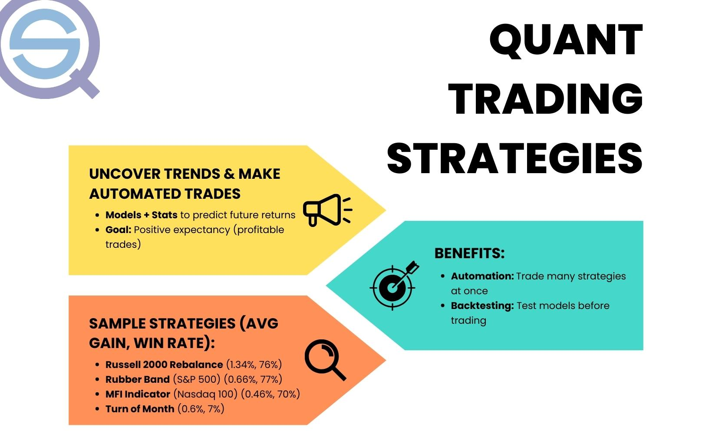

## Table of Contents

## What is quantitative trading and how does it differ from traditional trading?

Quantitative trading, often called "quant trading," is a method where traders use math and computer programs to make trading decisions. Instead of relying on human judgment, quant traders use data and algorithms to buy and sell stocks, bonds, or other financial products. These algorithms can analyze huge amounts of data quickly and look for patterns that might be hard for people to see. This approach aims to remove emotions from trading and make decisions based on numbers and facts.

Traditional trading, on the other hand, often involves human traders making decisions based on their experience, market news, and intuition. These traders might look at charts, read financial reports, and listen to market rumors to decide when to buy or sell. The main difference is that traditional trading relies more on human judgment and less on automated systems. While quant trading tries to be more objective and data-driven, traditional trading can be more subjective and influenced by emotions and personal insights.

## What are the basic principles behind quantitative trading strategies?

The basic principles behind quantitative trading strategies involve using math and computers to make trading decisions. Instead of guessing or relying on feelings, quant traders use numbers and data to find patterns and make predictions. They collect lots of information about prices, how much things are bought and sold, and other financial data. Then, they use special math formulas, called algorithms, to analyze this data and decide when to buy or sell. The goal is to make these decisions quickly and without being influenced by emotions.

Another key principle is backtesting. Before using a trading strategy in the real world, quant traders test it on old data to see how it would have worked in the past. This helps them see if their strategy is good or if it needs changes. If the strategy does well in backtesting, traders feel more confident using it with real money. Lastly, risk management is very important. Quant traders use math to figure out how much risk they are taking and try to keep it at a safe level. They set rules to limit losses and protect their money, making sure they don't lose too much if things go wrong.

## What are some common types of quantitative trading strategies for beginners?

One common type of quantitative trading strategy for beginners is called "momentum trading." This strategy looks at how prices are moving and tries to buy things that are going up and sell things that are going down. The idea is to follow the trend and make money as prices keep moving in the same direction. For example, if a stock has been going up for a few days, a momentum trader might buy it, hoping it will keep going up.

Another simple strategy is "mean reversion." This strategy believes that prices will eventually go back to their average level. If a stock price goes too high, a mean reversion trader might sell it, expecting the price to drop back down. On the other hand, if a stock price goes too low, they might buy it, expecting the price to go back up. Both momentum and mean reversion strategies use math to find these patterns and make decisions, but they are based on different ideas about how prices move.

A third strategy that beginners might try is "statistical arbitrage." This involves looking for small differences in prices between similar things, like two stocks in the same industry. The trader buys the cheaper one and sells the more expensive one, hoping the prices will get closer together. This strategy needs a lot of data and quick computers to find these small differences, but it can be a good way for beginners to learn about using math in trading.

## How do you develop a simple quantitative trading strategy?

To develop a simple quantitative trading strategy, start by choosing what you want to trade, like stocks or currencies. Then, decide on a basic idea for your strategy. For example, you might want to use momentum trading, where you buy things that are going up and sell things that are going down. Collect data on prices and other information you need. You can get this data from financial websites or special data services. Next, use a computer program to write a simple algorithm that follows your trading idea. This algorithm will look at the data and tell you when to buy or sell based on your rules.

After you have your algorithm, you need to test it. This is called backtesting. You run your algorithm on old data to see how it would have worked in the past. If it does well, you can feel more confident about using it with real money. But if it doesn't work well, you might need to change your rules or try a different idea. Once you're happy with your strategy, you can start using it in the real market. Remember to keep an eye on how it's doing and be ready to make changes if things aren't working out. Also, always think about how much risk you're taking and set rules to protect your money.

## What data sources are essential for implementing quantitative trading strategies?

To implement quantitative trading strategies, you need good data about prices, trading volumes, and other financial information. This data can come from stock exchanges, financial websites, or special data services. Stock exchanges like the New York Stock Exchange give you real-time price data, which is important for making quick trading decisions. Financial websites like Yahoo Finance or Bloomberg offer historical data, which you can use to test your trading ideas. Special data services, like Quandl or Alpha Vantage, provide detailed data that might be hard to find elsewhere.

Another important source of data is economic indicators and news. Things like unemployment rates, inflation numbers, and company earnings reports can affect prices and help you make better trading decisions. You can find this information from government websites, financial news outlets, or data services that focus on economic data. Using a mix of these data sources helps you build a complete picture of the market, which is key to making smart trading choices.

## How can backtesting improve the performance of quantitative trading strategies?

Backtesting helps you see how your trading strategy would have worked in the past. You take your trading rules and apply them to old data to see if they would have made money. This is like practicing before playing a real game. If your strategy does well in backtesting, you can feel more confident using it with real money. But if it doesn't work well, you can change your rules or try a different idea before risking your money.

By backtesting, you can also find problems in your strategy. Maybe it works well most of the time but fails during certain market conditions, like when the market goes down a lot. Knowing this, you can add rules to protect your money during those times. Backtesting lets you improve your strategy step by step, making it better before you use it in the real world. This way, you can make smarter trading decisions and hopefully make more money.

## What are advanced statistical methods used in quantitative trading?

In quantitative trading, advanced statistical methods help traders make better decisions by understanding complex patterns in data. One common method is regression analysis, which looks at how different things, like stock prices and economic indicators, are related. Traders use regression to predict future prices based on past data. Another method is time series analysis, which focuses on how prices change over time. This can help traders spot trends and cycles, making it easier to decide when to buy or sell. These methods use a lot of math to find hidden patterns that might be hard to see with just simple charts or numbers.

Another important statistical method is machine learning, which lets computers learn from data and make predictions on their own. Traders use machine learning to create models that can adapt to new market conditions without being told exactly what to do. This can be very useful in fast-changing markets. Also, Monte Carlo simulations are used to test how a trading strategy might work under different possible future scenarios. By running many simulations, traders can see how likely it is that their strategy will make money or lose money. These advanced methods help traders make more informed decisions and manage risk better.

## How do machine learning algorithms enhance quantitative trading strategies?

Machine learning algorithms help make quantitative trading strategies better by learning from lots of data. Instead of following set rules, these algorithms can find patterns and make predictions on their own. For example, they can look at past stock prices and other information to guess what might happen next. This means the trading strategy can change and improve over time without a person having to tell it what to do. It's like having a smart computer that gets better at trading the more it learns.

Using machine learning also helps traders deal with new and changing market conditions. Markets can be unpredictable, and what worked yesterday might not work today. Machine learning algorithms can adapt quickly to these changes because they keep learning from new data. This makes the trading strategy more flexible and able to take advantage of new opportunities or avoid risks. In the end, machine learning can help traders make more money by making smarter and more timely trading decisions.

## What are the risks and challenges associated with quantitative trading?

Quantitative trading can be risky because it relies a lot on math and computers. One big risk is that the data you use might be wrong or not complete. If your trading strategy is based on bad data, it won't work well. Another risk is that markets can change in ways that your math models don't expect. If the market does something new, your strategy might lose money because it's not ready for it. Also, even if you test your strategy on old data, it might not work the same way in the real world. This is called overfitting, where your strategy fits the past data too well but fails in the future.

Another challenge is that you need a lot of computer power and good data to make quantitative trading work. Not everyone can afford the fancy tools and data services that big traders use. Plus, you have to keep updating your strategies because the market is always changing. It can be hard to keep up with all the new information and adjust your models. Finally, there's always the risk of technical problems. If your computer crashes or your internet goes down, you might miss important trades or make mistakes. So, while quantitative trading can be powerful, it comes with its own set of risks and challenges that you need to be ready for.

## How can risk management be integrated into quantitative trading strategies?

Risk management is a big part of making sure your quantitative trading strategies work well and don't lose too much money. One way to do this is by setting stop-loss orders. These are rules that tell your computer to sell something if it loses too much value, so you don't lose more than you can afford. Another way is by using position sizing, which means deciding how much money to put into each trade. By not putting too much money into one trade, you can spread out your risk and protect your money if things go wrong. You can also use something called value at risk (VaR), which is a way to guess how much you might lose on a bad day. By keeping an eye on VaR, you can make sure you're not taking too much risk.

Another important part of risk management is stress testing. This means trying out your trading strategy in pretend situations where the market goes crazy, like during a big crash. By seeing how your strategy would do in these tough times, you can make changes to make it stronger. It's also good to have a plan for what to do if things go really wrong. This could mean setting up rules for when to stop trading or how to move your money to safer places. By thinking about these things ahead of time, you can keep your trading strategy safe and make sure it can handle whatever the market throws at it.

## What are the latest trends and innovations in quantitative trading?

One of the latest trends in quantitative trading is the use of artificial intelligence (AI) and machine learning. These technologies help traders make better predictions by learning from huge amounts of data. Instead of just following set rules, AI can find new patterns and adapt to changes in the market. This makes trading strategies smarter and more flexible. For example, some traders use deep learning, a type of AI, to understand complex relationships between different pieces of financial data. This can help them spot opportunities that other traders might miss.

Another big innovation is the use of alternative data. This means using information that's not usually part of traditional financial data, like social media posts, satellite images, or credit card transactions. By looking at this kind of data, traders can get a better picture of what's happening in the market. For instance, if a lot of people are talking about a company on social media, it might mean the company's stock price will go up. Using alternative data can give traders an edge over others who only look at regular financial data.

Lastly, there's a growing focus on high-frequency trading (HFT). This is where computers make thousands of trades in just a few seconds, trying to make small profits from tiny changes in prices. HFT needs very fast computers and special algorithms to work. It's becoming more popular because it can make money quickly, but it also comes with a lot of risks. Traders have to be careful because even small mistakes can lead to big losses. These trends show how quantitative trading is always changing and getting more advanced.

## How do expert traders optimize and scale their quantitative trading strategies?

Expert traders optimize their quantitative trading strategies by constantly testing and tweaking their algorithms. They use backtesting to see how their strategies would have worked in the past and make changes based on what they learn. They also use forward testing, where they try out their strategies in real-time with small amounts of money to see how they perform in current market conditions. By doing this, they can find and fix problems before they cause big losses. They also keep an eye on how well their strategies are doing and adjust them as the market changes. This way, they can make sure their strategies stay effective and keep making money.

To scale their strategies, expert traders often use more money and trade more often. They might start with a small amount of money to test their strategy and then put in more money as they see it working well. They also use technology to handle more trades at the same time. This can mean using faster computers and better software to make sure they can keep up with the market. But scaling up also means more risk, so they have to be careful. They use risk management tools like stop-loss orders and position sizing to make sure they don't lose too much money if things go wrong. By balancing the need to grow with the need to stay safe, expert traders can make their strategies bigger and more profitable.

## Advanced Quantitative Trading Strategies

### Overview of Traditional vs. Advanced Strategies

Traditional quantitative strategies, such as mean reversion and [trend following](/wiki/trend-following), have been staples in the trader's arsenal, leveraging the concept that markets will oscillate around a mean or continue in a direction once established. Mean reversion is based on the statistical phenomenon that high and low prices are temporary and a price will tend to move to the average over time. This is manifested in strategies that buy low and sell high, capitalizing on statistical anomalies or extreme deviations from a historical mean. Trend following, in contrast, capitalizes on the continuation of market movements, whether up or down, based on the premise that assets will maintain a particular trajectory over time due to underlying market [momentum](/wiki/momentum).

While these traditional strategies still hold significant value and are backboned by years of historical data, the advancement in computing power and data analysis tools has paved the way for more advanced and nuanced strategies. These advanced strategies often employ machine learning algorithms, capable of identifying non-linear relationships and patterns within massive datasets that are imperceptible to human analysts and traditional statistical methods. They are adaptive, learning from new data to continuously evolve and improve predictions and execution, theoretically increasing profitability over static models[3].

Another progression has been the integration of sentiment analysis trading strategies. By analyzing data from news articles, social media, and other textual content, quant traders can gauge the mood of the market towards a particular asset, sector, or the entire market. This is predicated on the hypothesis that the sentiment captured in various media sources can provide leading indicators of market movement, offering a predictive edge.

High-frequency [scalping](/wiki/gamma-scalping) techniques take advantage of minor price gaps created by order flow or spread imbalances. Using powerful computers to conduct a large number of trades at fractions of a second, traders can capture tiny margins at high volumes. These strategies necessitate a sophisticated technological infrastructure and access to very fast data streams to be viable[4].

Statistical [arbitrage](/wiki/arbitrage) has expanded to exploit discrepancies across multiple timeframes and markets, using complex mathematical models to identify price differences. These strategies might involve pairs trading where two historically correlated securities are compared, and trades are made when the relationship between the two deviates beyond a set threshold. As the markets correct and the securities converge back to their expected relationship, the trades are unwound for a profit.

The rise of cryptocurrencies has given birth to new quant strategies unique to the crypto market. Volatility and the 24/7 operational nature of these markets have driven the development of specialized models that can cope with the market's peculiar behavior. These models often integrate a variety of signals, from blockchain data to [liquidity](/wiki/liquidity-risk-premium) metrics, that are unique to the dynamics of crypto assets.

### Machine Learning & AI-Enhanced Strategies

Machine Learning (ML) and Artificial Intelligence (AI) have revolutionized quantitative trading strategies, providing the ability to uncover insights from data that are beyond the capability of human traders. These strategies utilize advanced algorithms that can learn from market data and identify complex patterns for profitable trading opportunities.

ML models, including supervised learning algorithms like regression and classification, unsupervised learning like clustering, and [reinforcement learning](/wiki/reinforcement-learning), enable systems to adapt to new data in real time. For instance, a supervised learning model might be trained on historical data to predict future price movements based on a set of input features, such as price, volume, and technical indicators.

AI enhances these capabilities further, particularly through the use of [neural network](/wiki/neural-network)s, including [deep learning](/wiki/deep-learning) techniques that can process vast amounts of unstructured data for predictive analysis. These networks can make sense of disparate data sources, from price and volume to news and social media sentiment, to generate a more holistic view of market conditions.

Sentiment analysis, a subset of AI, involves using natural language processing (NLP) to understand the emotional tone behind news articles, social media posts, and financial reports. By quantifying the sentiment, trading algorithms can take positions based on the collective mood of market participants, often before this sentiment is reflected in price movements.

Reinforcement learning, another frontier in ML, takes a different approach by learning to make sequences of decisions. By continuously interacting with the market and learning from trades that result in gains or losses, an agent can develop a policy to maximize cumulative rewards.

These ML and AI strategies require significant computational resources and expertise in data science, and they are subject to overfitting and model decay, meaning that they may perform well on historical data but fail to generalize to new, unseen market conditions. Regular retraining and model validation are critical to maintain their edge.

### Sentiment Analysis Based Trading

Sentiment Analysis Based Trading harnesses the collective mood of the market derived from textual data sources to inform trading decisions. This approach has gained prominence with the surge of data from news articles, social media, financial forums, and analyst reports. By interpreting the emotional tone from such texts, traders can gauge the sentiment of the market towards an asset, which is often a precursor to market movements.

To perform sentiment analysis, natural language processing (NLP) and [machine learning](/wiki/machine-learning) algorithms are employed to categorize the polarity of the sentiment as positive, negative, or neutral. Sophisticated models, such as Long Short-Term Memory (LSTM) networks, a type of recurrent neural network, are well-suited for this task as they can understand the context and nuances in language over time, which is critical in capturing the market sentiment accurately.

One of the core advantages of sentiment-based trading is the ability to act on the collective emotions before they have been fully priced into the market. For instance, a surge in negative sentiment on social media following a product recall might signal a potential decline in the company’s stock price, offering an opportunity to short sell before the majority of the market reacts.

However, sentiment analysis comes with challenges. The vast and diverse nature of data sources can introduce noise, and sarcasm or slang used in social media can be particularly difficult for algorithms to interpret correctly. To mitigate these issues, sentiment analysis models must be trained on relevant financial datasets and continuously updated to understand the evolving language used in financial contexts.

There is empirical evidence to support the efficacy of sentiment analysis in trading. Research published in the Journal of Behavioral Finance, for example, has found correlations between market sentiment derived from financial news and stock returns. Additionally, tools such as Bloomberg’s sentiment analysis or the Thomson Reuters MarketPsych Indices offer sentiment data to institutional investors, signaling the practical value of this approach.

Incorporating sentiment analysis into a trading strategy involves aggregating sentiment scores from various sources and integrating them into a model that can time trades or predict price movements. It often works best when combined with other quantitative [factor](/wiki/factor-investing)s, such as price momentum or [volatility](/wiki/volatility-trading-strategies) measures, to provide a more comprehensive trading signal.

For individual traders seeking to implement sentiment analysis, numerous open-source NLP libraries, such as NLTK and TextBlob, can serve as a starting point. However, the need for large datasets and powerful computational resources to process and analyze the data in real-time means that effectively executing a sentiment analysis strategy may require access to advanced technology platforms and databases.

### High-Frequency Scalping Techniques

High-Frequency Scalping Techniques are a subset of high-frequency trading (HFT) strategies that focus on making a large number of trades within seconds or milliseconds to profit from small price gaps and bid-ask spreads. These techniques are designed to exploit inefficiencies in the market and rely heavily on speed and advanced technology.

The core of high-frequency scalping is the ability to process vast amounts of market data in real-time, identifying opportunities where a security can be bought and immediately sold at a profit. This is achieved through sophisticated algorithms that constantly monitor market conditions across multiple trading venues. The scalping strategies can be market-neutral, seeking to profit from the spread without taking significant directional positions in the market, thus reducing the exposure to market risk[5].

To implement high-frequency scalping techniques, traders use direct market access (DMA) to reduce execution times as much as possible. Co-location services are often employed, where the trader’s servers are located as physically close to the exchange's servers as possible, to gain a few microseconds advantage that could make the difference between a successful and an unsuccessful trade.

The infrastructure needed for high-frequency scalping is substantial. Traders require high-speed connections to multiple exchanges, low-latency data feeds, and the computational power to process all of this information instantaneously. The algorithms themselves must be refined and backtested extensively to ensure they can operate effectively in the live market.

High-frequency scalping is controversial because it has been associated with market incidents, such as the Flash Crash of 2010. Critics argue that it can contribute to market volatility and make it difficult for traditional traders to compete. Nevertheless, proponents claim that scalping provides liquidity, which is beneficial for the market.

Regulation plays a significant role in high-frequency trading. In the United States, the Securities and Exchange Commission (SEC) has implemented rules designed to prevent market manipulation and abuse, such as the Market Access Rule (Rule 15c3-5), which requires brokers to put in place risk management controls to prevent erroneous orders and unauthorized trading.

The effectiveness of high-frequency scalping strategies often depends on the continued evolution of technology and the regulatory environment. As exchanges introduce measures like ‘speed bumps’ to level the playing field, HFT strategies, including scalping, need to adapt.

For traders looking to engage in high-frequency scalping, the barrier to entry is high due to the technological investment required and the need for sophisticated understanding of market dynamics. It's a specialized field that demands professionals who are not only savvy in trading but also proficient in mathematics, [statistics](/wiki/bayesian-statistics), and computer science.

### Statistical Arbitrage in Multiple Timeframes

Statistical arbitrage is a strategy that seeks to capitalize on price discrepancies between assets that are expected to converge in value. This approach utilizes statistical models to identify short-term trading opportunities across multiple timeframes, leveraging the temporal aspect to maximize return potential while managing risk.

At its core, [statistical arbitrage](/wiki/statistical-arbitrage) in multiple timeframes involves the simultaneous monitoring and analysis of short, medium, and long-term data to detect mispricings. This multifaceted observation allows traders to exploit price anomalies that may not be apparent when looking at a single timeframe. For example, an asset might show a mispricing on a minute-by-minute basis while appearing fairly valued on a daily scale. Traders use this information to execute trades that anticipate a correction in the mispricing across different time horizons.

A key element of this strategy is the mean reversion principle, which posits that prices and returns eventually move back towards their historical average. Strategies include pairs trading, where two historically correlated securities are traded in opposite directions when their price relationship deviates from the norm; and basket trading, where a collection of stocks is constructed to have a neutral or zero-beta portfolio to market movements.

The implementation of statistical arbitrage requires sophisticated quantitative models that can process complex datasets and execute trades automatically. These models employ a wide array of statistical methods, including cointegration, correlation analysis, and time series analysis, to forecast price movements and identify trading signals.

Risk management is crucial, as mispricings can persist longer than a trader can remain solvent, and the use of leverage can amplify losses. Techniques such as value-at-risk (VaR) and maximum drawdown are employed to control potential losses. The use of stop-loss orders and derivatives can also hedge against unfavorable market moves.

Statistical arbitrage is sensitive to transaction costs, as the profit from each trade is typically small. Thus, achieving scale and maintaining low operational costs is fundamental. Traders must have access to high-speed trading platforms and direct market access to minimize latency and slippage.

Regulatory considerations must also be factored in, as the use of automated trading systems and access to dark pools are often scrutinized by market authorities. Traders must ensure compliance with regulations such as the Dodd-Frank Wall Street Reform and Consumer Protection Act in the U.S., which impacts how financial firms engage in complex trading strategies.

### Crypto-Asset Quant Strategies

Crypto-asset quantitative strategies leverage the mathematical and statistical models at the heart of quantitative trading, applied specifically to the [cryptocurrency](/wiki/cryptocurrency) market. These strategies exploit the unique behaviors of cryptocurrency markets, including higher volatility, extended trading hours, and a different set of market influencers compared to traditional financial markets.

Crypto markets are driven by a diverse array of factors, including technological developments, regulatory news, sentiment shifts, and macroeconomic trends. Quant strategies in this domain range from straightforward statistical arbitrage to complex predictive models using machine learning[7].

**Market Making and Liquidity Provision**: In the crypto space, where spreads can be wide, market making is a common quant strategy. Algorithms provide liquidity by placing buy and sell limit orders on both sides of the order book, profiting from the spread. The lower transaction costs and higher spreads in crypto markets, compared to traditional finance, can often present more lucrative opportunities for market makers.

**Arbitrage Strategies**: These are particularly effective in crypto due to the fragmented nature of the market, with assets trading at different prices across multiple exchanges. Simple cross-exchange arbitrage takes advantage of these price discrepancies. More advanced arbitrage strategies may involve triangular arbitrage within an exchange or spatial arbitrage that accounts for transfer times and risks.

**Machine Learning-Powered Predictive Models**: Machine learning models analyze vast datasets to predict price movements. These models can include traditional data sources like trading volume and price, as well as unstructured data such as news articles and social media posts. The use of Natural Language Processing (NLP) to gauge market sentiment from these sources is a rapidly growing area within crypto quant strategies.

**Momentum Strategies**: Momentum trading involves buying cryptocurrencies that have shown an upward price trend or short-selling those in a downtrend. Given the momentum-prone nature of crypto markets, these strategies can be effective, especially when enhanced with indicators that identify the start and end of such trends.

**Mean Reversion Strategies**: These are based on the assumption that the price of a cryptocurrency will revert to its historical mean. Given the high volatility in the crypto market, mean reversion can be a risky strategy, but also potentially rewarding if applied with sophisticated risk management tools.

**High-Frequency Trading (HFT)**: Similar to traditional markets, HFT in crypto involves making many trades within fractions of a second, often reacting to market-moving information before human traders can process it. The effectiveness of HFT in crypto is amplified due to the market's relative immaturity and lower levels of competition compared to traditional markets.

Crypto quant strategies also require robust data pipelines due to the necessity of real-time or near-real-time data for strategy execution. Traders use APIs from various crypto exchanges to gather data and execute trades. Data integrity and the speed of data processing are critical, as delays can lead to substantial slippage and diminish arbitrage opportunities.

The landscape for crypto-assets is continuously changing with regulatory shifts posing a significant risk. For example, a regulatory announcement can lead to sudden and large market moves. Quant strategies must be built with the agility to quickly adapt to such changes.

## References & Further Reading

[1]: ["Quantitative Trading: How to Build Your Own Algorithmic Trading Business"](https://www.amazon.com/Quantitative-Trading-Build-Algorithmic-Business/dp/0470284889) by Ernest P. Chan

[2]: ["Algorithmic Trading and DMA: An introduction to direct access trading strategies"](https://www.amazon.com/Algorithmic-Trading-DMA-introduction-strategies/dp/0956399207) by Barry Johnson

[3]: ["Advances in Financial Machine Learning"](https://www.amazon.com/Advances-Financial-Machine-Learning-Marcos/dp/1119482089) by Marcos López de Prado

[4]: ["Algorithmic and High-Frequency Trading"](https://www.amazon.com/Algorithmic-High-Frequency-Trading-Mathematics-Finance/dp/1107091144) by Álvaro Cartea, Sebastian Jaimungal, and José Penalva

[5]: ["Algorithmic Trading and the Market for Liquidity"](https://faculty.haas.berkeley.edu/hender/ATMonitor.pdf) by Terrence Hendershott and Ryan Riordan

[6]: ["Statistical Arbitrage in the U.S. Equities Market"](https://math.nyu.edu/~avellane/AvellanedaLeeStatArb071108.pdf) by Marco Avellaneda and Jeong-Hyun Lee

[7]: ["Cryptocurrency Trading: A Comprehensive Survey"](https://jfin-swufe.springeropen.com/articles/10.1186/s40854-021-00321-6) by Fang et al.

[8]: ["Predicting Economic Indicators from Web Text Using Sentiment Composition"](https://www.robots.ox.ac.uk/~parg/pubs/sentiment_ICICA2014.pdf) - International Journal of Forecasting.

[9]: ["Evidence-Based Technical Analysis"](https://www.amazon.com/Evidence-Based-Technical-Analysis-Scientific-Statistical-ebook/dp/B0086KQ3UW) by David Aronson

[10]: ["Algorithmic Trading & DMA"](https://ahmetbeyefendi.com/wp-content/uploads/2020/07/Algorithmic-Trading-and-Direct-Market-Access.pdf) by Barry Johnson

[11]: ["The Quants"](https://www.goodreads.com/book/show/7495395-the-quants) by Scott Patterson