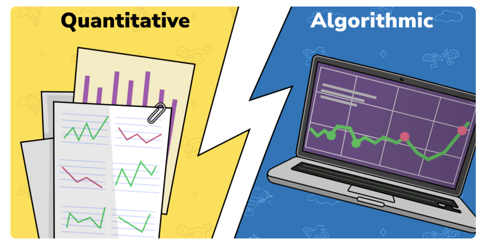
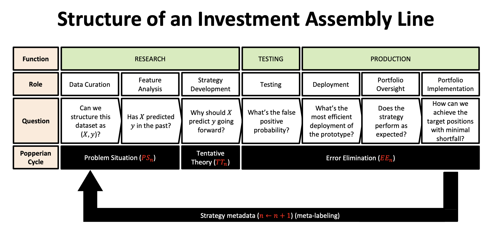

Quantitative trading roots trace back to the mid-20th century, a time when computerized trading was in its embryonic stages. Back then, few could have predicted the seismic shift the financial markets were on the cusp of experiencing. As computers became more accessible and powerful, they began playing an essential role in trading, allowing for the automation of strategies based on mathematical and statistical models. This development was the genesis of what we now refer to as quantitative trading.

Fast forward to today, quantitative trading occupies a dominant position in the financial markets. This prominence isn't merely due to technological advancements, but also the inherent advantages quantitative trading offers. By eliminating human emotions from trading decisions and leveraging vast amounts of data, quantitative strategies strive for precision, consistency, and scalability. In modern financial hubs, from Wall Street to the City of London to Hong Kong, algorithms now make a significant proportion of trade decisions. Recent data indicates that quantitative trading accounts for over a third of all trading activities in the U.S stock market.

In a world characterized by rapid information flow and the paramount importance of data, the approach of quantitative trading — data-driven, logical, and systematic — aligns seamlessly with the zeitgeist of our times.

## Table of Contents

## Defining Quantitative Trading

Quantitative trading is a methodical approach to financial market trading that leverages mathematical and statistical models. At its core, it seeks to harness the power of data, enabling traders to make decisions based on empirical evidence rather than relying on intuition or subjective judgment. It's a discipline that prioritizes objectivity, systematizing the trading process to enhance consistency and scalability.

One can envision quantitative trading as the confluence of three pivotal domains: mathematics, finance, and technology. Each of these components plays a fundamental role in shaping the nature and efficacy of quantitative strategies.

Mathematics provides the theoretical framework. By using mathematical models, traders can predict price movements, identify market inefficiencies, or even gauge the probability of certain market events occurring. The complexity of these models can vary widely; from simple moving averages to intricate neural networks.

Finance, on the other hand, offers the practical context. It defines the asset classes, markets, and instruments that quants trade. Additionally, it informs the risk parameters and provides the benchmarks against which the performance of a quantitative strategy is measured. Knowledge of finance ensures that mathematical models are attuned to real-world market dynamics, making them more applicable and effective.

Finally, technology acts as the catalyst. In the modern era, the implementation of quantitative strategies would be nearly impossible without advanced computational tools. Technology facilitates rapid data processing, allowing for real-time strategy deployment. It bridges the gap between theoretical models and live markets. Furthermore, with the advent of machine learning and artificial intelligence, the scope of quantitative trading has expanded exponentially. These technologies enable strategies to 'learn' from data, refining their predictions over time and adapting to changing market conditions.

## The History and Evolution of Quantitative Trading

Quantitative trading's embryonic roots can be traced back to the mid-20th century. With the advent of modern finance theory, most notably the Efficient Market Hypothesis (EMH) proposed by Eugene Fama in the 1960s[1], there was a burgeoning recognition that markets might have patterns, albeit subtle, that could be discerned and potentially exploited using rigorous statistical analysis.

As computational power grew, especially in the 1970s and 1980s with the proliferation of personal computers, these theories began to move from academic papers to real-world applications. Early quants, equipped with rudimentary data and nascent software tools, sought to discover statistical anomalies in price data, laying the groundwork for what would become a revolutionary approach to trading.

The merging of technology, finance, and quantitative research marked a pivotal shift in the way markets operated. While traditionally, traders relied on intuition, experience, and qualitative analysis, the new breed of traders started to emphasize data-driven, systematic strategies. The 1980s saw the rise of legendary quant-focused firms, such as Renaissance Technologies, founded by James Simons[2], which demonstrated the tremendous potential of purely quantitative approaches.

The 1990s and 2000s witnessed an explosion in quantitative trading as data became more accessible, and computational speeds allowed for more complex and rapid calculations. High-frequency trading (HFT) became a buzzword, and algorithmic strategies capable of executing thousands of orders in fractions of a second started dominating a significant chunk of the market's volume[3].

However, the evolving landscape also changed the profile of the quintessential quant trader. Initially, quants were primarily academicians – holding Ph.D. degrees in mathematics, physics, or related fields – transitioning from academia to finance. They were modelers and strategists. As technology progressed and the strategies grew in complexity, there emerged a need for a blend of skills. Modern quant traders often possess not only deep mathematical insights but also robust programming skills, understanding of finance, and, increasingly, expertise in machine learning and data science.

Furthermore, the financial crises of the early 21st century, notably the 2008 Global Financial Crisis[4], spotlighted the inherent risks in some quantitative models, leading to an enhanced emphasis on risk management within the quantitative trading community.

As the markets continue to evolve, so too will the strategies, tools, and profiles of those operating in the quantitative realm.

## The Mechanics of Quantitative Trading

Quantitative trading fundamentally operates on the principle that through rigorous statistical and mathematical analysis, one can identify patterns, anomalies, or inefficiencies in financial markets. These insights, once discerned, can be exploited for potential profit. At its core, quantitative trading replaces human intuition and judgment with systematic rules, driven by data and algorithms.

The primary objectives of quantitative trading are threefold:

1. **Identification of Alpha**: Alpha refers to the excess return of an investment relative to a benchmark. Quants aim to identify alpha by uncovering trading signals that aren't easily perceptible to the human eye or traditional analysis. By diving deep into vast datasets, quants look for subtle correlations, patterns, or market behaviors that can suggest a probable future movement in prices[5].
2. **Optimization**: Once a strategy or a set of rules is established, it is optimized to maximize returns and minimize risk. This involves tweaking various parameters, such as entry or exit points, leverage, and the assets to be traded, to achieve the desired performance under different market conditions[6].
3. **Risk Management**: An integral aspect of quantitative trading is the ability to measure and manage risk. By using advanced mathematical models, quants can project potential losses in various scenarios and adjust their strategies accordingly to protect capital.

Contrasting quantitative with traditional trading highlights some key differences. Traditional traders often rely on a mix of fundamental analysis (e.g., evaluating a company's earnings, industry position, economic indicators) and technical analysis (e.g., chart patterns). Their decisions are influenced by intuition, experience, and sometimes, emotions. Quantitative traders, however, rely solely on data and predefined algorithms. Their strategies are backtested using historical data to ascertain their viability before being implemented in live markets[7].

While the systematic approach of quantitative trading limits the emotional pitfalls and biases inherent in human decision-making, it also demands rigorous testing and validation. A poorly conceived algorithm, even if it's devoid of emotions, can wreak havoc in the financial markets, making it imperative for quant traders to continuously monitor, refine, and adapt their strategies in line with evolving market conditions.

## Quantitative vs. Algorithmic Trading

The world of trading has always been rife with jargon, and the terms "quantitative" and "algorithmic" trading often become intertwined in discussions. However, while they share similarities, they also have distinct features that differentiate one from the other.

**Quantitative trading** is an approach that emphasizes mathematical and statistical techniques to develop trading strategies. It involves extensive data analysis, ranging from price patterns to broader financial data, aiming to uncover relationships or anomalies that can be exploited for profit. A quantitative strategy is typically underpinned by a hypothesis about market behavior, which is then tested and refined using historical data.

**Algorithmic trading**, on the other hand, refers to the use of computer algorithms to automate the trading process. These algorithms can be as simple as sending orders when a specific price is reached or as complex as considering multiple market parameters to optimize order execution. The essence of algorithmic trading lies in its automation, reducing the lag of human intervention and ensuring that trading strategies are implemented efficiently and accurately.

This differentiation leads us to an important realization: *while all quantitative trading strategies can be executed algorithmically, not all algorithmic trading is quantitative*. For instance, a simple algorithm that buys or sells based on a moving average crossover doesn't necessarily rely on complex quantitative analysis. Conversely, a quantitative strategy, though typically executed by algorithms for speed and precision, doesn't have to be, especially in its initial testing phase.

A prevalent misconception is that algorithmic trading invariably leads to high-frequency trading (HFT). While many HFT firms indeed utilize algorithmic methods to execute their strategies, algorithmic trading doesn't always operate on ultra-short time frames or with high order volume. Many algorithms are designed for longer-term strategies, aiming for optimal execution over extended periods.

Another myth is that quantitative and algorithmic trading remove all human elements from the trading process. While these methods certainly reduce emotional biases, the inception, refinement, and continuous oversight of strategies and algorithms remain intensely human endeavors. No algorithm or quantitative model is immune to changing market dynamics, and human expertise is paramount in ensuring adaptability and mitigating unforeseen risks.

## Dive into Quantitative Trading Systems

At the heart of quantitative trading lies the trading system, a comprehensive platform that incorporates all elements of a trading strategy from data collection and strategy development to trade execution and post-trade analysis.

A quantitative trading system begins with **data**, often vast amounts of it. Data sources can vary from price and volume data from exchanges to macroeconomic indicators and even sentiment data extracted from news and social media. Ensuring data quality is paramount; any inconsistency, inaccuracy, or missing data can lead to flawed analyses and potential losses.

The significance of data in quantitative trading is paramount. The precision and granularity of the data determine the depth of analysis possible. For instance, high-frequency trading strategies require **tick-by-tick** data, capturing every single price change in the market, while longer-term strategies might be satisfied with **daily** or **weekly** data points[8]. Further, it's not just about quantity; the relevance and timeliness of the data play a crucial role. Strategies built on outdated or irrelevant data are less likely to be profitable in the current market conditions.

Once data is acquired and cleaned, the development phase commences. Here, quantitative models are designed to identify profitable **trading signals**. Traditionally, these models were grounded in financial theories and statistical methods. However, with the advent of machine learning and AI, the landscape is rapidly evolving.

**Machine learning**, a subset of AI, offers tools that can find patterns and relationships in the data that might be too complex or counterintuitive for traditional quantitative methods[9]. For instance, deep learning, a kind of machine learning, can analyze vast datasets with minimal manual feature engineering, adapting and learning from new data as it becomes available. These models can self-adjust, making them particularly powerful in the ever-changing landscape of financial markets.

Yet, the integration of AI and machine learning is not without challenges. **Overfitting** is a notorious concern, where a model might perform exceptionally well on historical data but fails in real-time trading because it's too finely tuned to past patterns that no longer apply. Furthermore, understanding the rationale behind machine learning-driven decisions can be elusive, leading to the term "black box" models. Despite their prowess, there's a need for human oversight to ensure they don't go awry.

Post-development, the trading system executes the strategy. Automation is crucial here, ensuring trades are placed promptly, minimizing slippage and maximizing potential profits. Moreover, **post-trade analysis** evaluates the strategy's performance, looking for areas of improvement or adjustments needed in response to changing market conditions.

## The Life Cycle of a Quantitative Trading Strategy

Every quantitative trading strategy evolves through a structured life cycle, ensuring its robustness and effectiveness in the live markets.

**Strategy Identification** is the inception of any trading system. At this stage, quants leverage vast datasets and mathematical models to identify patterns or anomalies that can lead to profitable trading opportunities[10]. This could be anything from price inefficiencies between assets, temporal patterns in market movements, or reactions to specific economic news. The aim is to spot an edge that the market hasn't fully absorbed, or perhaps, hasn't noticed at all.

Once an opportunity is identified, the strategy progresses to **Strategy Backtesting**. Backtesting is a rigorous process where the strategy is tested against historical data to evaluate its performance[11]. This phase is vital to ensure that the identified patterns aren't mere coincidences but have some underlying economic or behavioral rationale. While backtesting provides valuable insights, it's essential to be wary of overfitting — a common pitfall where a strategy is too finely tuned to past data, making it ineffective in real-world conditions.

The next phase involves **Execution Systems**. Once confident in the strategy's potential, it needs to be automated for real-time trading. Execution systems are platforms or software that can take trading signals generated by the strategy and execute them in the market automatically. Speed, precision, and reliability are crucial here, especially for strategies that operate on shorter time frames, like high-frequency trading.

Finally, **Risk Management** ensures the longevity of the strategy in the unpredictable world of financial markets. Even the best strategies can face periods of drawdowns or unexpected market events. Effective risk management practices, like setting stop-losses or diversifying across assets, help in mitigating potential losses[12]. Understanding the trade-offs, like the balance between potential returns and associated risks, ensures that the strategy remains viable in the long run.

Throughout this life cycle, continuous monitoring and iteration are imperative. Markets evolve, and strategies need to adapt to maintain their edge. By following this structured approach, quants aim to ensure that their trading strategies are both profitable and resilient in the face of market challenges.

## Key Strategies in Quantitative Trading

Quantitative trading strategies are diverse, relying on mathematical and statistical tools to identify and exploit market inefficiencies. These are some of the most employed strategies in the realm of quantitative trading:

- **Arbitrage** is the practice of taking advantage of a price difference between two or more markets. There are several forms of arbitrage:
- **Statistical Arbitrage**: Uses statistical techniques to predict future price movements based on historical data. This method often involves complex mathematical models and large data sets[13].
- **Event-driven Arbitrage**: Exploits mispricings that may occur before or after events like mergers, acquisitions, or earnings announcements. Traders capitalize on the price discrepancies resulting from these events[14].
- **Market Making** involves continuously buying and selling securities to provide liquidity to the market. A market maker earns the spread between the buy and sell price, aiming to benefit from the bid-ask spread without holding a net position in the long term[15].
- **Mean Reversion** is based on the assumption that asset prices, after a significant movement, will revert to their mean or average level over time. This strategy identifies and trades price discrepancies when an asset deviates substantially from its historical average[16].
- **Directional Strategies** predict market movements in a particular direction. These can be based on factors like momentum, where traders assume that assets that have been rising in price will continue to do so, or they can be rooted in fundamental analysis, macroeconomic data, or other indicators[17].
- **Spoofing** is a controversial practice where traders place orders with the intent to cancel them before execution. The aim is to manipulate the perception of supply or demand for an asset, misleading other market participants. It's essential to note that spoofing is illegal and is considered a form of market manipulation in many jurisdictions[18].

By understanding these key strategies, participants can gain insights into the intricate workings of quantitative trading and its myriad approaches to generating potential profits.

## The Role and Profile of a Quant Trader

Quant traders, often known as "quants", sit at the intersection of finance, mathematics, and technology. They use advanced mathematical and statistical techniques to create and implement algorithmic trading strategies.

**Educational Background and Skills Required**:

A quant trader typically has a strong foundation in mathematics or statistics. Many hold advanced degrees, such as a Master's or Ph.D., in fields like mathematics, physics, engineering, or financial engineering. A quant's skill set includes proficiency in programming languages such as Python, R, or C++ and familiarity with database management and big data tools. Furthermore, knowledge of financial markets, trading mechanics, and risk management is crucial.

**Day-to-Day Duties and Responsibilities**:

The daily responsibilities of a quant trader revolve around research, strategy development, and execution. They might spend their day analyzing large datasets to uncover market patterns, refining algorithms, or monitoring live trades to ensure smooth execution. Ensuring strategies are functioning as expected, and risk parameters aren't breached is also a critical aspect of their role.

**Difference Between a Quant Trader and a Quantitative Researcher**:

While there's considerable overlap, the primary distinction lies in the focus of their roles. A quant trader is more involved in the implementation of strategies in real-time trading environments. They are tasked with ensuring that trades are executed efficiently and within set risk parameters. On the other hand, a quantitative researcher typically focuses more on the development of new strategies and models, working with historical data to identify patterns and develop predictive algorithms.

**Earnings and Compensation in the Industry**:

The compensation for quant traders can be substantial, reflecting the high demand for their skills and the profits they can generate. Salaries can vary based on experience, educational background, and performance. Entry-level quants might earn between $100,000 to $150,000 annually, while experienced quants or those with a successful track record can command salaries exceeding $300,000, excluding bonuses. Bonuses, often a significant portion of the compensation package, can be multiple times the base salary, especially if the strategies developed by the quant are particularly profitable.

In summary, quant traders are central players in the modern financial markets, leveraging their unique skills to harness technology and data in the pursuit of profitable trading opportunities.

## Tools and Technology

The fusion of computational power and advanced financial theories has paved the way for quantitative trading's growth. In order to harness vast amounts of data and develop intricate models, quant traders employ an array of tools and technologies.

**Essential Tools Used by Quant Traders**:

At the core of a quant trader's toolkit are specialized software platforms designed for backtesting, strategy development, and trade execution. Platforms like QuantConnect, MetaTrader, and NinjaTrader have become industry standards. Additionally, databases and data management tools, such as SQL and pandas in Python, play a pivotal role in handling and manipulating large datasets.

**Key Programming Languages**:

Python has become a predominant language in quantitative finance due to its versatility and rich ecosystem of financial libraries like Quantlib and Zipline. R, primarily a statistical language, is valued for data analysis and econometric tasks. C++ is often employed for high-frequency trading strategies, where nanoseconds matter, and maximum performance optimization is crucial.

**Important Areas of Statistics and Mathematics**:

Quantitative trading is grounded in rigorous mathematical and statistical theories. Essential areas include time series analysis, linear algebra, calculus, and optimization techniques. Furthermore, probability and statistical inference enable quants to validate their models and infer patterns from noisy data.

**Continuous Learning and Staying Updated**:

The rapidly evolving landscape of quantitative finance means quants must stay abreast of the latest research, technological advancements, and market dynamics. Participation in industry conferences, workshops, and online courses, coupled with constant peer interactions and academic journal readings, ensures quants remain at the forefront of their domain.

## Advantages and Disadvantages of Quantitative Trading

Quantitative trading's ascent in modern finance is a testament to the myriad advantages it offers. However, like all approaches, it comes with its set of challenges and critiques.

**Benefits to Traders and Financial Markets**:

1. **Objectivity**: Quantitative trading is driven by mathematical models, eliminating emotional biases that can often plague human decisions in the market.
2. **High-Speed Execution**: Automated trading allows for split-second decisions, capitalizing on fleeting market inefficiencies that might be undetectable to the human eye.
3. **Diversification**: Quants can run multiple strategies across various asset classes simultaneously, spreading risk and increasing potential returns.
4. **Backtesting**: Before deploying capital, quants can test their strategies on historical data, offering a glimpse into potential performance.
5. **Increased Market Liquidity**: High-frequency quantitative trading contributes to market liquidity, ensuring assets can be quickly bought or sold without substantial price changes.

**Criticisms and Potential Pitfalls**:

1. **Overfitting**: There's a risk of creating models that perform exceptionally well on past data but fail in real-world conditions due to their over-reliance on specific historical patterns.
2. **System Failures**: Technical glitches can cause massive losses in mere seconds. The 2010 Flash Crash, in part, resulted from algorithmic trading.
3. **Reduced Human Oversight**: Heavy reliance on machines might lead to missed anomalies that a human could detect.
4. **Market Manipulation Concerns**: Some argue that high-frequency trading strategies can lead to artificial market movements, to the detriment of retail traders.
5. **Homogenization of Strategies**: As more quants enter the field, there's a potential for converging strategies, which can lead to heightened systemic risk during market downturns.

Balancing the evident efficiencies with the associated challenges, quantitative trading represents a transformative approach to finance, shaping markets and trading paradigms.

## Risk Management in Quantitative Trading

Risk management, an indispensable facet of quantitative trading, ensures the durability of trading strategies in diverse market scenarios. It identifies, assesses, and prioritizes uncertainties that could lead to significant losses.

**Different Types of Risks**:

1. **Market Risk**: The risk of losses stemming from movements in market prices. For instance, unexpected geopolitical events can disrupt previously established patterns and affect asset prices.
2. **Model Risk**: Arises when a model used to gauge market risks and values fails to work as expected.
3. **Liquidity Risk**: The risk of not being able to buy or sell a position without affecting its price, especially pertinent to less liquid assets or markets.
4. **Operational Risk**: Includes risks from system breakdowns, human errors, or external events impacting trading operations.
5. **Regulatory Risk**: Changes in trading regulations or tax laws can impact the profitability of certain strategies.
6. **Counterparty Risk**: The risk that a trading partner (or counterparty) will not fulfill their obligations, especially in over-the-counter (OTC) markets.

**Techniques and Strategies to Manage and Mitigate These Risks**:

1. **Diversification**: Distributing investments across various assets or strategies to prevent significant losses from one underperforming area.
2. **Stress Testing and Scenario Analysis**: Simulating extreme market conditions to assess the robustness of a strategy.
3. **Position Limits**: Setting a maximum amount of capital allocated to any particular investment or strategy.
4. **Dynamic Hedging**: Adjusting hedge positions systematically in response to price changes in the hedged asset.
5. **Real-time Monitoring**: Utilizing advanced software tools to monitor portfolio risks and performances in real-time.
6. **Frequent Backtesting**: Regularly testing strategies against new data to ensure continued relevance and effectiveness.
7. **Clearing and Collateral Management**: Using centralized clearinghouses for trades and maintaining sufficient collateral can mitigate counterparty risks.

By adopting these practices, traders ensure that while they cannot eliminate risks altogether, they can mitigate potential damages, enabling sustained portfolio growth and minimizing large drawdowns.

## Real-world Applications and Case Studies

Quantitative trading thrives on its ability to fuse mathematical models with historical data, creating actionable strategies. To illustrate its practicalities, we deep dive into a few standout examples of successful strategies and learn from ones that didn’t quite hit the mark.

**Successful Strategies**:

1. **Statistical Arbitrage at Renaissance Technologies**: Perhaps one of the most illustrious examples, Renaissance Technologies, led by James Simons, employs statistical arbitrage to recognize temporal mispricings between securities[2]. Its flagship fund, the Medallion Fund, has boasted unparalleled returns for decades, largely because of its data-driven, non-emotional trading approach.
2. **High-frequency Trading (HFT) by Virtu Financial**: Virtu became a poster child for the success of HFT, capitalizing on minute price differences in split-second decisions. Their strategy thrived on vast volumes and razor-thin margins, which, when scaled, led to significant profits.
3. **Black-Scholes Option Pricing Model**: Developed by Fischer Black, Myron Scholes, and Robert Merton, this model revolutionized option trading. By quantifying an option's theoretical value, traders could determine if it was over or undervalued in the market[19].

**Lessons from Failed Strategies**:

1. **Long-Term Capital Management (LTCM)**: This hedge fund, led by two Nobel Prize winners, relied heavily on quantitative models. However, they underestimated the risk of rare market moves. Their significant leverage combined with unexpected market events led to a massive collapse, proving that no model can capture every potential outcome[20].
2. **Knight Capital's Algorithmic Glitch**: In 2012, a malfunction in Knight Capital's trading algorithm led to a loss of $440 million in just 30 minutes[21]. This underscores the importance of rigorous testing and the dangers of over-reliance on automated systems without sufficient oversight.
3. **Quant Quake of 2007**: Many quantitative hedge funds experienced significant, unexplained losses in August 2007. It's believed that a large sell-off by one fund triggered a domino effect among other quant funds with similar strategies, revealing the risk of crowded trades and lack of diversification[22].

The journey of quantitative trading in the real world underscores a critical principle: while mathematical prowess and computational capabilities can offer an edge, the markets remain inherently unpredictable. Aspiring traders must marry their strategies with rigorous risk management, continuous learning, and an appreciation for the complexities of market dynamics.

## The Future of Quantitative Trading

Quantitative trading, ever-evolving, has been sculpted by advances in technology, data analytics, and the growing complexity of financial markets. Here's a glimpse into its foreseeable future, honed by industry insights and the transformative potential of emerging tech.

**Predictions and Trends for the Next Decade**:

1. **Higher Data Granularity**: As computing power increases, the capacity to process more detailed datasets will enable traders to capture nuances previously overlooked. From tick-by-tick trading data to understanding micro-movements, a more granular data approach will enhance strategy efficiency.
2. **Alternative Data Sources**: The next wave of quantitative strategies might rely on unconventional data streams, including satellite imagery, social media sentiment, and even biometric data, presenting traders with more diverse datasets to extract alpha.
3. **Increased Regulation**: Given the growing dominance of quant strategies in financial markets, regulatory bodies will likely introduce tighter controls to ensure market stability and fairness.
4. **Decentralized Finance (DeFi)**: The integration of quantitative trading with blockchain-based financial instruments will provide new avenues for strategy development and execution in a decentralized environment.

**Potential Influence of AI and Machine Learning**:

1. **Dynamic Strategy Adaptation**: Machine learning models can continuously learn and adapt to changing market conditions. This self-evolving nature will make strategies more resilient to unprecedented market shocks or anomalies.
2. **Enhanced Predictive Analytics**: Deep learning, a subset of AI, can discern patterns in vast datasets, offering predictions with higher accuracy rates than traditional statistical methods.
3. **Natural Language Processing (NLP)**: AI-driven NLP can analyze news articles, financial reports, and global events in real-time, allowing quants to instantly integrate global happenings into their trading strategies.
4. **Ethical and Bias Considerations**: As AI's role in trading grows, the industry will grapple with ethical questions about machine decision-making, especially if biases in data lead to skewed financial outcomes or market manipulations.
5. **Risk Management Revamp**: AI can provide more holistic risk assessments by processing vast amounts of data across different spectrums, offering a multi-dimensional view of potential market risks.

The impending era of quantitative trading, powered by AI and bolstered by a plethora of data, promises enhanced precision and broader horizons. Yet, it also beckons traders to tread cautiously, respecting the inherent unpredictability of markets and the ethical conundrums AI can pose.

## Conclusion

Quantitative trading, having grown from nascent mathematical models to a pillar of the modern financial landscape, represents the harmonious intersection of mathematics, finance, and technology. Its trajectory, marked by continual evolution, bears testament to the relentless quest for market efficiency and alpha generation. The realm has expanded its boundaries, integrating sophisticated tools and technologies, from intricate algorithms to the transformative powers of AI and machine learning.

The importance of quantitative trading transcends mere profit generation. It embodies the pursuit of understanding market dynamics through the lens of data and technology. The discipline has democratized the financial markets, making them more accessible, transparent, and, in many ways, predictable. Yet, as with all powerful tools, it demands respect, understanding, and continual learning.

For those intrigued by this confluence of numbers, technology, and finance, the world of quantitative trading offers a rich tapestry to explore. Whether you're an aspiring quant, a financial professional, or simply a curious observer, delving deeper into this domain promises insights into the very heartbeats of global financial markets.

The evolution of quantitative trading is a testament to human ingenuity and the relentless quest for market advantage. As the financial landscape continues to transform, this discipline will undoubtedly remain at its forefront, adapting, evolving, and innovating. The journey, fascinating as ever, beckons.

💡 **Read more:**

- Trading strategies papers with code on [Equities](https://wiki.paperswithbacktest.com/trading-strategies/equities), [Cryptocurrencies](https://wiki.paperswithbacktest.com/trading-strategies/cryptocurrencies), [Commodities](https://wiki.paperswithbacktest.com/trading-strategies/commodities), [Currencies](https://wiki.paperswithbacktest.com/trading-strategies/currencies), [Bonds](https://wiki.paperswithbacktest.com/trading-strategies/bonds), [Options](https://wiki.paperswithbacktest.com/trading-strategies/options)
- [A curated list](https://github.com/paperswithbacktest/awesome-systematic-trading) of awesome libraries, packages, strategies, books, blogs, and tutorials for systematic trading
- [A bunch of datasets](https://huggingface.co/paperswithbacktest) for quantitative trading
- [A website to help you](https://paperswithbacktest.com/) become a quant trader and achieve financial independence

## Frequently Asked Questions

1. **What exactly is quantitative trading?**
    
    Quantitative trading involves using mathematical models and algorithms to make trading decisions. At its core, it aims to leverage computational and statistical techniques to identify and capitalize on patterns or anomalies in the financial markets.
    
2. **How does quantitative trading differ from algorithmic trading?**
    
    While both involve the use of algorithms, quantitative trading is rooted in deriving strategies based on quantitative analysis. Algorithmic trading, on the other hand, can be as simple as automating a predefined trading rule without a quantitative basis.
    
3. **Is quantitative trading only for institutional traders?**
    
    While institutions like hedge funds have dominated the scene, the democratization of technology and information means individual traders now also have access to tools previously reserved for larger players. Numerous platforms offer quant tools and backtesting capabilities to retail traders.
    
4. **How reliable are backtested results?**
    
    While backtesting provides insights, it's crucial to understand its limitations. Past performance doesn't guarantee future results, and overfitting—a scenario where a strategy is too tailored to past data—can skew results.
    
5. **Is machine learning the future of quant trading?**
    
    Machine learning offers powerful tools for strategy development, but its application requires caution. A robust understanding of both the financial markets and the intricacies of machine learning algorithms is essential to prevent overfitting and other pitfalls.
    
6. **How risky is quantitative trading?**
    
    Like all trading forms, quant trading comes with risks. However, quant strategies often incorporate rigorous risk management techniques, which, when applied correctly, can mitigate potential losses.
    
7. **Does one need a PhD to become a quant trader?**
    
    While many quant traders have advanced degrees in mathematics, physics, or engineering, a PhD isn't strictly necessary. What's crucial is a solid grounding in mathematics, programming skills, and a deep understanding of the financial markets.
    
8. **Are all quant strategies high-frequency trading (HFT) strategies?**
    
    No, while HFT is a subset of quant trading, many quant strategies don't involve high-frequency trades. HFT specifically refers to holding positions for very short durations, sometimes milliseconds.
    
9. **How has the role of a quant trader evolved over the years?**
    
    With advancements in technology, quants have moved from mere strategy developers to integral parts of the trading process, often overseeing real-time trading operations and risk management.
    
10. **Is the quantitative approach making markets more efficient?**
    
    There's a belief that quantitative strategies help in price discovery and liquidity provision, contributing to market efficiency. However, concerns about systemic risks and market shocks due to algorithm-driven trading persist.
    

## References & Further Reading

[1]: Fama, E. F. (1965). [The Behavior of Stock Market Prices](https://www.jstor.org/stable/2350752). *The Journal of Business*, 38(1), 34-105.

[2]: [The Man Who Solved the Market: How Jim Simons Launched the Quant Revolution](https://www.amazon.com/Man-Who-Solved-Market-Revolution/dp/073521798X) – Gregory Zuckerman, 2019.

[3]: Aldridge, I. (2013). [High-frequency trading: a practical guide to algorithmic strategies and trading systems](https://www.amazon.com/High-Frequency-Trading-Practical-Algorithmic-Strategies/dp/1118343506). John Wiley & Sons.

[4]: Brunnermeier, M. K. (2009). [Deciphering the liquidity and credit crunch 2007-2008](https://www.aeaweb.org/articles?id=10.1257/jep.23.1.77). *Journal of Economic Perspectives*, 23(1), 77-100.

[5]: Lo, A. W. (2017). [Adaptive Markets: Financial Evolution at the Speed of Thought](https://www.amazon.com/Adaptive-Markets-Financial-Evolution-Thought/dp/0691135142). Princeton University Press.

[6]: Chan, E. P. (2013). [Algorithmic Trading: Winning Strategies and Their Rationale](https://www.amazon.com/Algorithmic-Trading-Winning-Strategies-Rationale/dp/1118460146). John Wiley & Sons.

[7]: Murphy, J. J. (1999). [Technical Analysis of the Financial Markets: A Comprehensive Guide to Trading Methods and Applications](https://www.amazon.com/Technical-Analysis-Financial-Markets-Comprehensive/dp/0735200661). New York Institute of Finance.

[8]: Hasbrouck, J. (2007). [Empirical Market Microstructure](https://www.amazon.com/Empirical-Market-Microstructure-Institutions-Econometrics/dp/0195301641). Oxford University Press.

[9]: Prado, M. L. (2018). [Advances in Financial Machine Learning](https://www.amazon.com/Advances-Financial-Machine-Learning-Marcos/dp/1119482089). John Wiley & Sons.

[10]: Chan, E. P. (2013). [Quantitative Trading: How to Build Your Own Algorithmic Trading Business](https://www.amazon.com/Quantitative-Trading-Build-Algorithmic-Business/dp/0470284889). John Wiley & Sons.

[11]: Aronson, D. (2006). [Evidence-Based Technical Analysis: Applying the Scientific Method and Statistical Inference to Trading Signals](https://onlinelibrary.wiley.com/doi/book/10.1002/9781118268315). John Wiley & Sons.

[12]: Kissell, R. (2013). [The Science of Algorithmic Trading and Portfolio Management](https://www.sciencedirect.com/book/9780124016897/the-science-of-algorithmic-trading-and-portfolio-management). Academic Press.

[13]: Gatev, E., Goetzmann, W. N., & Rouwenhorst, K. G. (2006). [Pairs trading: Performance of a relative-value arbitrage rule](https://papers.ssrn.com/sol3/papers.cfm?abstract_id=141615). The Review of Financial Studies, 19(3), 797-827.

[14]: Mitchell, M., & Pulvino, T. (2001). [Characteristics of risk and return in risk arbitrage](https://papers.ssrn.com/sol3/papers.cfm?abstract_id=268144). The Journal of Finance, 56(6), 2135-2175.

[15]: Cartea, Á., & Penalva, J. (2012). [Where is the value in high frequency trading?](https://papers.ssrn.com/sol3/papers.cfm?abstract_id=1855555) Quarterly Journal of Finance, 2(03), 1250019.

[16]: Bouchaud, J. P., Farmer, J. D., & Lillo, F. (2009). [How markets slowly digest changes in supply and demand](https://arxiv.org/pdf/0809.0822.pdf). In Handbook of financial markets: Dynamics and evolution (pp. 57-160). North-Holland.

[17]: Jegadeesh, N., & Titman, S. (1993). [Returns to buying winners and selling losers: Implications for stock market efficiency](https://www.jstor.org/stable/2328882). The Journal of Finance, 48(1), 65-91.

[18]: U.S. Securities and Exchange Commission. (2020). [Anti-Spoofing Provisions](https://www.thompsoncoburn.com/docs/default-source/News-Documents/spoofing.pdf?sfvrsn=e0984cea_0).

[19]: Black, F., & Scholes, M. (1973). [The Pricing of Options and Corporate Liabilities](https://www.jstor.org/stable/1831029). Journal of Political Economy, 81(3), 637-654.

[20]: Lowenstein, R. (2000). [When Genius Failed: The Rise and Fall of Long-Term Capital Management](https://www.amazon.com/When-Genius-Failed-Long-Term-Management/dp/0375758259). Random House.

[21]: Popper, N., & McGinty, T. (2012). [Knight Capital Says Trading Glitch Cost It $440 Million](https://archive.nytimes.com/dealbook.nytimes.com/2012/08/02/knight-capital-says-trading-mishap-cost-it-440-million/). The New York Times.

[22]: Khandani, A. E., & Lo, A. W. (2007). [What Happened to the Quants in August 2007?](https://web.mit.edu/Alo/www/Papers/august07.pdf) MIT Sloan Research Paper.