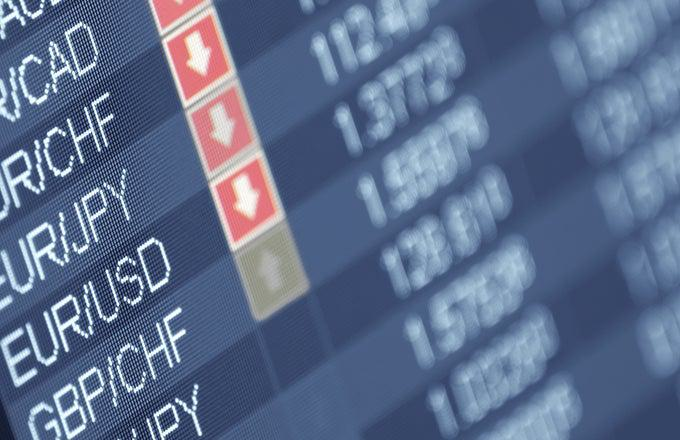

Financial derivatives are intricate instruments whose value is contingent upon the performance of an underlying asset such as stocks, bonds, commodities, or currencies. Among these derivatives, options are pivotal, offering investors tools for both hedging risk and optimizing investment strategies. Options enable investors to secure the right, but not the obligation, to buy or sell an underlying asset at a predetermined price and date, allowing them to take advantage of market movements while limiting potential losses.

Quantity-adjusting options, commonly referred to as quanto options, emerge as a specialized subclass within the broader category of options. These financial instruments are particularly advantageous for international transactions, as they allow investors to hedge against currency risk when engaged in foreign asset dealings. Quanto options are structured to ensure that while the payout is determined based on the performance of the underlying asset in a foreign currency, the settlement is executed in a different currency at a fixed exchange rate, thereby neutralizing the foreign exchange risk.



This article focuses on exploring the multifaceted benefits of financial derivatives, emphasizing the significance of quantity-adjusting options in global financial markets. By investigating the mechanics, potential advantages, and varied applications of these instruments, we aim to enhance the understanding of their strategic value in risk management and investment optimization.

Furthermore, in recent years, the field of algorithmic trading has increasingly intertwined with the domain of derivatives. Algorithmic trading, which employs computer algorithms to execute trades with precision and speed, plays a crucial role in optimizing the trading of complex derivatives like quanto options. This interplay facilitates enhanced trading efficiency and improved risk management, as algorithms can promptly adapt to market dynamics, processing vast data to refine decision-making processes.

Overall, the ongoing developments in financial markets necessitate a comprehensive understanding of sophisticated instruments such as quantity-adjusting options and how they integrate with innovative trading methodologies like algorithmic trading to offer robust solutions for investors navigating global investment landscapes.

## Table of Contents

## Understanding Quantity-Adjusting Options

A quantity-adjusting option, often referred to as a quanto option, offers an innovative approach to managing the complexities of cross-currency transactions by eliminating foreign exchange risk for investors. This derivative instrument is uniquely structured to calculate the payout in one currency while settling it in another, using a predetermined exchange rate. This feature allows investors to capitalize on foreign assets' performance without exposure to currency fluctuations, which can be particularly advantageous in volatile currency markets.

The quanto option provides a strategic hedge against undesirable currency fluctuations, enabling investors to maintain focus on the asset's intrinsic value. By isolating currency risk, investors can concentrate on their assessment of an asset's potential in a foreign market, freed from concerns about adverse movements in exchange rates. Consequently, quanto options have become a valuable tool for international investors seeking to diversify their portfolios globally while managing currency risk effectively.

For example, consider an investor interested in a European stock priced in euros but prefers to receive returns in U.S. dollars. A quanto option can facilitate this by ensuring that the payout is based on the stock's performance, converted to U.S. dollars at a fixed exchange rate. This eliminates the risk associated with fluctuating exchange rates between the euro and U.S. dollar, providing the investor with certainty regarding their returns.

Through such a structure, quanto options enable investors to navigate foreign markets more confidently, leveraging opportunities in high-potential regions without being deterred by prospective currency risks. By extension, they encourage broader participation in international financial markets, opening doors to emerging and volatile economies that might otherwise be deemed too risky due to exchange rate concerns.

## Benefits of Quanto Options

Quantity-adjusting options, commonly known as quanto options, offer distinct advantages by effectively mitigating currency risk, which is crucial for investors engaging in foreign markets. One of the primary benefits of these options is their ability to provide stability in returns by eliminating the uncertainties associated with fluctuating exchange rates. This stability is particularly advantageous for investors exploring opportunities in emerging and volatile markets, where currency [volatility](/wiki/volatility-trading-strategies) can often pose significant barriers to cross-border investments.

By offering a predetermined exchange rate at settlement, quanto options ensure that the payout remains unaffected by adverse currency movements. This feature provides investors with more predictable and consistent returns on their foreign investments, which is essential for strategic financial planning and risk management. As a result of this stability, investors gain increased confidence when venturing into international markets, potentially broadening their investment horizons.

Moreover, quanto options facilitate efficient capital allocation by allowing investors to concentrate on the performance of the underlying foreign assets without the added complexity of currency risk. This focused approach encourages investors to allocate resources more effectively, optimizing portfolio performance and enhancing overall returns.

In addition, these financial instruments contribute significantly to portfolio diversification. Quanto options enable investors to gain exposure to assets in multiple currencies without necessitating direct currency exchange transactions. This indirect exposure to foreign exchange variations can improve the risk-return profile of a portfolio, offering a diversified investment strategy that aligns with global market dynamics.

In summary, the strategic use of quanto options can provide investors with a comprehensive mechanism to hedge currency risk, thereby promoting cross-border investment initiatives and fostering a more diversified and balanced portfolio.

## Algorithmic Trading with Quanto Options

Algorithmic trading employs computer algorithms to automate trading strategies, thereby enhancing the speed and accuracy of transactions. This approach is particularly advantageous for trading complex financial derivatives like quantity-adjusting options, or quanto options, which provide a unique mechanism to manage currency risk in cross-border investments.

When algorithms are applied to trading quanto options, they can significantly optimize both the timing and execution of trades. By leveraging computational power, traders can capitalize on fleeting market opportunities that may not be perceptible through manual trading processes. The use of algorithms permits a more dynamic response to market fluctuations, quickly adapting trading strategies to current conditions and thus improving profit potential.

The integration of [algorithmic trading](/wiki/algorithmic-trading) with quanto options also diminishes the likelihood of human error, a considerable advantage in the fast-paced trading environment. Algorithms execute trades with precision, driven by quantitative models that assimilate vast amounts of market data. This data-driven approach ensures that trading decisions are based on robust statistical analysis, identifying patterns and trends that inform more strategic decision-making.

Algorithmic trading allows for the efficient management of risks inherent in trading complex derivatives like quanto options. These technological advancements enable traders to appraise and act upon market signals with remarkable agility, capitalizing on the isolated currency risk offered by quanto options. The automation also facilitates high-frequency trading, where algorithms can execute multiple transactions in fractions of a second, optimizing portfolio adjustments with minimal latency.

To illustrate, consider a Python snippet that outlines a basic algorithmic trading strategy for quanto options. This example employs technical indicators such as moving averages to trigger buy and sell decisions:

```python
import numpy as np
import pandas as pd

# Sample data for quanto option prices
data = pd.Series([120, 119, 121, 122, 125, 126, 125, 127, 130, 128])

# Calculate moving averages
short_window = 3
long_window = 5

signals = pd.DataFrame(index=data.index)
signals['price'] = data
signals['short_mavg'] = data.rolling(window=short_window, min_periods=1).mean()
signals['long_mavg'] = data.rolling(window=long_window, min_periods=1).mean()

# Generate trade signals
signals['signal'] = 0.0
signals['signal'][short_window:] = np.where(signals['short_mavg'][short_window:] > signals['long_mavg'][short_window:], 1.0, 0.0)

# Calculate positions
signals['positions'] = signals['signal'].diff()

print(signals)
```

This code calculates short-term and long-term moving averages of the option prices and generates buy (signal = 1) and sell (signal = 0) signals based on the crossover of these averages. Although simplistic, this example illustrates the core principles of algorithmic trading: utilizing quantitative criteria to make informed and timely trading decisions.

In conclusion, algorithmic trading, when paired with quanto options, amplifies the capability to navigate the complexities of foreign exchange risk and market volatility. By employing sophisticated algorithms, traders can unlock enhanced opportunities for profitability while maintaining rigorous risk management, establishing a formidable approach to modern financial markets.

## Types of Quantity-Adjusting Options

There are several types of quantity-adjusting options, or quanto options, that cater to different investment strategies by adjusting for currency differentials. Each type offers unique characteristics and applications, allowing investors to mitigate currency risk while engaging in international markets.

Fixed quanto options provide stability by setting a predetermined exchange rate at the inception of the contract. This feature ensures that the exchange rate remains constant throughout the life of the option, protecting investors from adverse currency fluctuations. Fixed quanto options are particularly useful for investors who require certainty in their financial projections and seek to eliminate exchange rate volatility.

Vanilla quanto options maintain the basic structure of traditional options, such as calls and puts, but incorporate the quanto feature for enhanced currency risk mitigation. These options allow investors to participate in foreign markets while avoiding currency exchange risk. The vanilla quanto option calculates the payoff based on an underlying asset's performance in a foreign currency but settles the transaction in the investor's domestic currency at a fixed exchange rate.

In addition to options, other derivatives with quanto features, such as swaps and futures, offer expanded possibilities for international investment and risk management. Quanto swaps, for example, might involve exchanging cash flows in different currencies, with the exchange rate risk removed due to the quanto feature. Similarly, quanto futures provide exposure to foreign market indexes, with settlements occurring in a domestic currency at a predetermined rate, thus eliminating currency exposure.

Investors must carefully consider these variations to select the option that aligns best with their strategic goals and market outlook. Each type of quantity-adjusting option caters to different risk appetites and investment objectives, offering tailored solutions for managing currency exposure. By understanding these diverse instruments, investors can effectively navigate international financial markets and optimize their portfolios against potential currency-related challenges.

## Potential Risks and Challenges

Quantity-adjusting options, while advantageous in managing currency risk, present several potential risks and challenges that investors must consider. One significant risk is counterparty risk, which arises when a party involved in the transaction defaults on their contractual obligations. This can lead to financial losses for the investor if the counterparty fails to fulfill their side of the agreement.

Market risk is another critical [factor](/wiki/factor-investing) that can affect the value of quanto options. Fluctuations in asset performance, interest rates, and market [liquidity](/wiki/liquidity-risk-premium) can impact the option's value. Changes in the underlying asset's value or volatility can lead to unexpected financial outcomes, making it crucial for investors to anticipate and manage these potential downturns.

The complexity of quantity-adjusting options is inherently higher than that of standard financial instruments. A thorough understanding of how these derivatives work, including their pricing, settlement mechanisms, and underlying asset markets, is essential. Investors without sufficient knowledge may face difficulties in making informed decisions, which could result in unfavorable financial outcomes.

Execution risk is a significant challenge related to the timely processing and settlement of these instruments. Delays or inaccuracies in executing trades can lead to missed opportunities or financial losses. Automated trading systems, while helpful, can sometimes exacerbate this risk if not properly monitored or configured.

In conclusion, while quanto options offer excellent tools for hedging currency risk, investors must carefully assess these potential risks. A balanced evaluation of the advantages against the inherent challenges is crucial in making informed investment decisions that align with broader strategic objectives.

## Conclusion

Quantity-adjusting options, known as quanto options, provide a robust mechanism for managing currency risk while facilitating access to international investment opportunities. By eliminating exchange rate volatility, these financial instruments become particularly appealing to investors who prioritize risk mitigation. Their structure allows for the calculation of payouts in one currency while settling in another, thus offering a layer of protection against currency fluctuations.

The integration of algorithmic trading with quanto options significantly enhances their utility. Algorithms contribute precision and speed to trading, enabling swift responses to market changes and thereby reducing potential errors associated with manual trading. Algorithmic strategies can be employed to optimize trade execution, offering scalable and efficient approaches to managing complex financial instruments like quanto options.

However, investors should evaluate both the opportunities and inherent risks when incorporating quanto options into their portfolios. While these options offer substantial protection against exchange rate risk, they also come with challenges such as counterparty and market risks, necessitating a comprehensive understanding of the underlying mechanisms and market dynamics.

As financial markets continue to evolve, the role of sophisticated derivatives like quanto options is expected to expand. These instruments will likely present new opportunities for investment and risk management, catering to a diverse array of global investment strategies. The ongoing development and refinement of such derivatives, complemented by advancements in trading technology, underscore their potential to facilitate nuanced financial strategies in an increasingly interconnected world.

## References & Further Reading

[1]: Hull, J. C. (2017). ["Options, Futures, and Other Derivatives"](https://www.semanticscholar.org/paper/Options%2C-Futures%2C-and-Other-Derivatives-Hull/89bdee500c8623864fc9eb7a471546aa713acc44). Pearson Education.

[2]: Black, F., & Scholes, M. (1973). ["The Pricing of Options and Corporate Liabilities,"](https://www.cs.princeton.edu/courses/archive/fall09/cos323/papers/black_scholes73.pdf) Journal of Political Economy, 81(3), 637-654.

[3]: Geman, H. (2005). ["Commodities and Commodity Derivatives: Modeling and Pricing for Agriculturals, Metals and Energy"](https://download.e-bookshelf.de/download/0000/5675/90/L-G-0000567590-0015270354.pdf). Wiley Finance.

[4]: Shreve, S. E. (2004). ["Stochastic Calculus for Finance I: The Binomial Asset Pricing Model"](https://link.springer.com/book/10.1007/978-0-387-22527-2). Springer.

[5]: Narang, R. K. (2013). ["Inside the Black Box: The Simple Truth About Quantitative Trading"](https://onlinelibrary.wiley.com/doi/book/10.1002/9781118267738). Wiley Finance.

[6]: Drobny, S. (2010). ["Inside the House of Money: Top Hedge Fund Traders on Profiting in the Global Markets"](https://www.amazon.com/Inside-House-Money-Traders-Profiting/dp/0471794473). Wiley.

[7]: Tonis Vaga. (1994). ["Profiting from Chaos: Using Chaos Theory for Market Trading"](https://archive.org/details/profitingfromcha0000vaga). McGraw-Hill.

[8]: Wong, H. Y. (2003). ["Currency Risk Management: A Handbook for Financial Managers, Brokers, and Consultants"](https://www.jstor.org/stable/3666203). iUniverse.