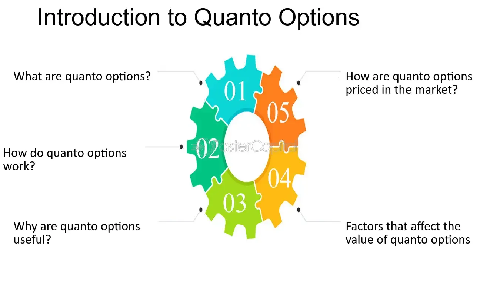

## Table of Contents

## What is a Quantity-Adjusting Option?

A Quantity-Adjusting Option is a type of financial option that lets you change the amount of the asset you can buy or sell. Unlike regular options, where the amount stays the same, this option lets you adjust the quantity based on certain conditions. This can be useful if you think the price of the asset might change a lot, and you want to be able to buy or sell more or less of it.

These options are not very common and are usually used by big investors or companies. They can be complicated because you need to understand when and how you can change the quantity. But they can be very helpful if you want to manage risk better or take advantage of big price changes in the market.

## How does a Quantity-Adjusting Option work?

A Quantity-Adjusting Option works by letting you change how much of an asset you can buy or sell. With a normal option, you pick a set amount when you buy it, and that amount doesn't change. But with a Quantity-Adjusting Option, you can increase or decrease the amount later on, based on certain rules. These rules might say you can only change the amount at specific times or if the price of the asset hits certain levels.

For example, imagine you have an option to buy 100 shares of a company. If it's a Quantity-Adjusting Option, and the stock price goes up a lot, you might be able to change your option to buy 200 shares instead. This can be helpful if you think the price will keep going up and you want to buy more. But if the price goes down, you might decide to lower the amount to 50 shares to not lose as much money. These options are useful for big investors who want to adjust their plans as the market changes.

## What are the main benefits of using a Quantity-Adjusting Option?

One big benefit of using a Quantity-Adjusting Option is that it lets you change your mind about how much of an asset you want to buy or sell. This is helpful because the market can change a lot, and you might want to buy more of something if the price goes up, or buy less if the price goes down. This flexibility can help you make more money or lose less money, depending on what the market does.

Another benefit is that these options can help you manage risk better. If you think the price of an asset might change a lot, you can adjust your option to either take more risk if you think the price will go up, or less risk if you think the price will go down. This can be really useful for big investors or companies that need to plan carefully and adjust their strategies as things change in the market.

## Can you provide examples of Quantity-Adjusting Options in real-life scenarios?

Imagine a farmer who grows wheat. The price of wheat can change a lot from one season to the next. The farmer can use a Quantity-Adjusting Option to buy wheat at a set price, but with the option to change how much wheat they buy. If the price of wheat goes up a lot, the farmer might decide to buy more wheat than they planned because they can sell it for a higher price. But if the price goes down, the farmer might choose to buy less wheat to avoid losing money. This helps the farmer manage the ups and downs of the wheat market.

Another example is a big company that needs a lot of oil to run its factories. The price of oil can be very unpredictable. The company can use a Quantity-Adjusting Option to buy oil at a set price, but with the ability to change the amount of oil they buy. If the price of oil goes down, the company might decide to buy more oil because it's cheaper. But if the price goes up a lot, the company might choose to buy less oil to keep costs down. This helps the company plan better and save money no matter what happens with oil prices.

## Who can benefit most from using Quantity-Adjusting Options?

Big investors and companies can benefit the most from using Quantity-Adjusting Options. These options let them change how much of an asset they want to buy or sell, which is really helpful when prices in the market go up and down a lot. For example, a big company that needs oil might use these options to buy more oil if the price goes down, or less if the price goes up. This helps them save money and plan better.

Farmers can also benefit a lot from Quantity-Adjusting Options. Imagine a farmer who grows wheat. The price of wheat can change a lot from one season to the next. With these options, the farmer can decide to buy more wheat if the price goes up, hoping to sell it for more money later. If the price goes down, the farmer can choose to buy less wheat to avoid losing money. This helps the farmer handle the ups and downs of the wheat market better.

## What are the potential risks associated with Quantity-Adjusting Options?

One big risk with Quantity-Adjusting Options is that they can be hard to understand. These options have special rules about when and how you can change the amount of the asset you want to buy or sell. If you don't understand these rules, you might make a mistake and lose money. Also, these options can be more expensive than regular options because they let you change the amount, so you need to be sure that the extra cost is worth it.

Another risk is that the market might not move the way you expect. If you think the price of an asset will go up and you decide to buy more of it, but then the price goes down instead, you could lose a lot of money. It's hard to predict what the market will do, and Quantity-Adjusting Options can make your losses bigger if you guess wrong. So, it's important to be careful and think about all the possible outcomes before you use these options.

## How do Quantity-Adjusting Options compare to other financial instruments?

Quantity-Adjusting Options are different from other financial instruments because they let you change how much of an asset you want to buy or sell. With regular options, you pick a set amount when you buy them, and that amount stays the same. But with Quantity-Adjusting Options, you can change the amount later based on certain rules. This makes them more flexible than regular options, but also more complicated and possibly more expensive. Compared to futures contracts, which also let you buy or sell an asset at a set price in the future, Quantity-Adjusting Options give you more control over the amount you trade.

Another financial instrument to compare with Quantity-Adjusting Options is a swap, which is an agreement to exchange cash flows or other financial instruments. Swaps can be used to manage risk or take advantage of changes in interest rates or other market conditions. But unlike Quantity-Adjusting Options, swaps don't let you change the amount of the asset you're dealing with. Quantity-Adjusting Options are also different from stocks or bonds, which are more straightforward investments without the ability to change the amount after you buy them. So, Quantity-Adjusting Options are unique because they offer the flexibility to adjust the quantity of the asset, but they come with their own set of complexities and costs.

## What are the key factors to consider before investing in a Quantity-Adjusting Option?

Before you decide to invest in a Quantity-Adjusting Option, it's important to understand how these options work. They let you change how much of an asset you want to buy or sell, but there are special rules about when and how you can do this. You need to know these rules well because if you make a mistake, you could lose money. Also, Quantity-Adjusting Options can be more expensive than regular options because of the extra flexibility they give you. So, you need to think about whether the extra cost is worth it for your investment goals.

Another thing to consider is how the market might change. These options are good if you think the price of an asset might go up or down a lot, and you want to be able to buy or sell more or less of it. But the market can be unpredictable, and if you guess wrong about which way the price will go, you could end up losing more money than you would with a regular option. So, it's important to think carefully about the risks and make sure you have a good plan for how you'll use the Quantity-Adjusting Option to reach your investment goals.

## How can one effectively manage a portfolio that includes Quantity-Adjusting Options?

Managing a portfolio with Quantity-Adjusting Options means you need to keep a close eye on the market and know the rules of these options well. Since these options let you change how much of an asset you want to buy or sell, you need to watch the price of the asset carefully. If the price goes up a lot, you might want to buy more of it, but if it goes down, you might want to buy less. Knowing when and how you can make these changes is important because if you do it wrong, you could lose money. Also, remember that these options can be more expensive, so make sure the extra cost is worth it for your investment goals.

Another thing to think about is how these options fit with the rest of your investments. You need to balance the risk and reward of your whole portfolio. Quantity-Adjusting Options can help you manage risk better if you use them the right way. For example, if you have other investments that might lose value if the market goes down, you can use these options to buy less of an asset if its price drops, which can help protect your money. But if the market goes up, you can buy more and make more money. It's all about having a plan and being ready to adjust that plan as the market changes.

## What are the tax implications of trading Quantity-Adjusting Options?

Trading Quantity-Adjusting Options can have different tax implications depending on where you live and how long you hold the options. In many places, if you hold the options for less than a year, any profits you make are considered short-term capital gains, and you'll pay your regular income tax rate on them. But if you hold the options for more than a year, the profits might be considered long-term capital gains, which often have a lower tax rate. It's important to keep good records of when you buy and sell these options so you can figure out your taxes correctly.

Another thing to think about is that the rules for Quantity-Adjusting Options can be different from regular options. Since these options let you change how much of an asset you want to buy or sell, the tax treatment might be more complicated. You might need to talk to a tax professional to make sure you understand all the rules and how they apply to your situation. They can help you figure out how to report your gains and losses on your tax return and make sure you're following the law.

## How have Quantity-Adjusting Options evolved over time, and what might future trends look like?

Quantity-Adjusting Options have changed a lot over time. They started out as a way for big investors and companies to manage risk better. In the beginning, these options were mostly used by people who needed to buy or sell large amounts of things like oil or wheat, and they wanted to be able to change how much they bought or sold based on what was happening in the market. As time went on, more people started using these options because they saw how useful they could be. Now, they're not just for big investors; smaller investors can use them too, although they're still pretty complicated.

In the future, Quantity-Adjusting Options might become even more popular and easier to use. As more people learn about them and understand how they work, they might be used in more types of investments. Technology could also make a big difference. With better computer programs and online tools, it might become easier for people to use these options and adjust them quickly when the market changes. But no matter what happens, these options will probably always be a bit more complicated and expensive than regular options, so people will need to be careful and make sure they understand what they're doing before they use them.

## What advanced strategies can be employed with Quantity-Adjusting Options to maximize returns?

One advanced strategy with Quantity-Adjusting Options is to use them to take advantage of big price swings in the market. If you think the price of an asset might go up a lot, you can start with a smaller amount and then increase it if the price does go up. This way, you can buy more of the asset at a higher price and make more money when you sell it later. But if the price goes down instead, you can decrease the amount you want to buy, so you don't lose as much money. This strategy needs you to watch the market closely and be ready to make changes quickly.

Another strategy is to use Quantity-Adjusting Options to balance out other investments in your portfolio. If you have other investments that might lose value if the market goes down, you can use these options to buy less of an asset if its price drops. This can help protect your money. On the other hand, if the market goes up, you can buy more of the asset and make more money. This way, you're using the options to manage risk and possibly make more money at the same time. It's all about having a good plan and being ready to adjust it as the market changes.

## References & Further Reading

[1]: Hull, J. C. (2017). ["Options, Futures, and Other Derivatives"](https://www.semanticscholar.org/paper/Options%2C-Futures%2C-and-Other-Derivatives-Hull/89bdee500c8623864fc9eb7a471546aa713acc44). Pearson Education.

[2]: Black, F., & Scholes, M. (1973). ["The Pricing of Options and Corporate Liabilities,"](https://www.cs.princeton.edu/courses/archive/fall09/cos323/papers/black_scholes73.pdf) Journal of Political Economy, 81(3), 637-654.

[3]: Geman, H. (2005). ["Commodities and Commodity Derivatives: Modeling and Pricing for Agriculturals, Metals and Energy"](https://download.e-bookshelf.de/download/0000/5675/90/L-G-0000567590-0015270354.pdf). Wiley Finance.

[4]: Shreve, S. E. (2004). ["Stochastic Calculus for Finance I: The Binomial Asset Pricing Model"](https://link.springer.com/book/10.1007/978-0-387-22527-2). Springer.

[5]: Narang, R. K. (2013). ["Inside the Black Box: The Simple Truth About Quantitative Trading"](https://onlinelibrary.wiley.com/doi/book/10.1002/9781118267738). Wiley Finance.

[6]: Drobny, S. (2010). ["Inside the House of Money: Top Hedge Fund Traders on Profiting in the Global Markets"](https://www.amazon.com/Inside-House-Money-Traders-Profiting/dp/0471794473). Wiley.

[7]: Tonis Vaga. (1994). ["Profiting from Chaos: Using Chaos Theory for Market Trading"](https://archive.org/details/profitingfromcha0000vaga). McGraw-Hill.

[8]: Wong, H. Y. (2003). ["Currency Risk Management: A Handbook for Financial Managers, Brokers, and Consultants"](https://www.jstor.org/stable/3666203). iUniverse.