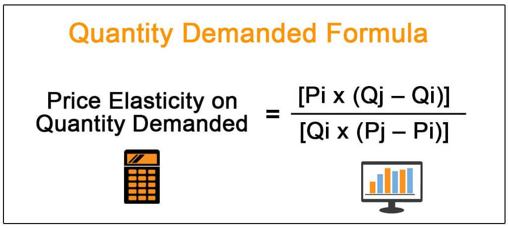

In the rapidly evolving world of economics and trading, understanding the demand curve is crucial for comprehending market dynamics. At its core, the demand curve represents the relationship between the price of a good and the quantity demanded by consumers. This foundational economic principle holds significant implications for both traditional and modern trading strategies.

Algorithmic trading has revolutionized financial markets through the use of complex algorithms that execute trading strategies with high efficiency and speed. By incorporating economic principles like the demand curve into these algorithms, traders can enhance their strategies to better respond to market dynamics. The demand curve influences trading decisions by providing insights into consumer behavior, potential price movements, and overall market sentiment.



This article examines the role of the demand curve and its relationship with the quantity demanded, focusing specifically on how these concepts are integrated into algorithmic trading strategies. We explore how trading algorithms utilize past data and economic models to predict changes in demand, which can be pivotal in deciding entry and exit points in trading. Furthermore, understanding the nuances of the demand curve aids in optimizing these algorithms to manage risk and take advantage of fleeting market opportunities.

As we explore the intersection of demand curve economics and algorithmic trading, it opens up new possibilities for traders to gain a competitive edge. The integration of these principles not only enhances the accuracy and effectiveness of trading algorithms but also aligns with the continuous advancements in data analytics and machine learning. This synergy between economic theory and technological innovation is shaping the future of financial trading, making it an essential area of understanding for both new and seasoned traders.

## Table of Contents

## Understanding the Demand Curve

The demand curve is a foundational concept in economics, demonstrating the relationship between the price of a good and the quantity demanded by consumers. Typically, the demand curve features a downward slope, indicating an inverse relationship between price and quantity demanded. As the price of a good decreases, the quantity demanded generally increases, and vice versa. This inverse relationship is a fundamental principle, reflecting consumer behavior in response to price changes.

Several factors can cause shifts in the demand curve, altering the entire demand relationship rather than just moving along the curve. Key factors include changes in consumer preferences, variations in income levels, and the availability of substitute goods. For example, if a substitute good becomes cheaper or more widely available, consumers may shift their consumption toward that substitute, leading to a leftward shift in the demand curve for the original good.

Understanding these shifts is crucial for traders, as they have a direct impact on market prices and trading volumes. A rightward shift in the demand curve, indicating increased demand at every price level, could signal traders to anticipate higher prices or increased trading activity. Conversely, a leftward shift might suggest a potential decline in market prices or reduced trading interest.

In financial markets, the demand curve is a valuable tool for analyzing investor behavior and predicting market trends. Traders use demand curves to assess market sentiment and gauge future price movements. By interpreting the demand curve, traders can better understand how changes in fundamental economic factors might influence market dynamics, allowing them to make informed trading decisions.

Such analytical techniques rely heavily on quantitative data and statistical analysis. For example, regression models can be used to estimate demand curves from historical price and quantity data. These models help traders predict how changes in external factors, such as consumer income or the price of related goods, might impact the demand curve.

Overall, the demand curve not only provides insights into consumer purchasing behavior but also serves as a vital analytical tool for traders seeking to navigate the complexities of financial markets. Understanding its dynamics enables traders to anticipate market shifts and optimize their trading strategies accordingly.

## Quantity Demanded and Its Implications

Quantity demanded refers to the exact quantity of a commodity that consumers are prepared and financially able to buy at a specified price. This concept differs from the broader term "demand," which encompasses the entire relationship between price and quantity demanded across a variety of prices. Understanding quantity demanded is critical for traders who need to evaluate market [liquidity](/wiki/liquidity-risk-premium) and anticipate price fluctuations, both of which can significantly impact trading strategies.

Algorithmic trading, which relies on computer algorithms to execute trades at high speeds and efficiency, extensively uses historical data alongside market indicators to forecast changes in quantity demanded. This capability influences the timing of trade executions, allowing traders to optimize their strategies based on anticipated market behavior.

Analyzing variations in quantity demanded involves examining consumer behavior and market sentiment, which can shift due to numerous factors, including changes in income, tastes, or the availability of substitute goods. Traders need to be adept at recognizing these patterns to adapt their strategies accordingly, thereby gaining an edge in predicting market trends and [volatility](/wiki/volatility-trading-strategies).

Quantitative models and statistical methods are often employed to identify these patterns. For example, Python can be used to perform regressions or time-series analyses to ascertain potential changes in quantity demanded. Consider the following Python snippet which uses linear regression to predict future quantity demanded based on historical data:

```python
import numpy as np
from sklearn.linear_model import LinearRegression

# Historical data
prices = np.array([10, 12, 14, 16, 18]).reshape(-1, 1)
quantities_demanded = np.array([100, 80, 65, 50, 30])

# Applying linear regression
model = LinearRegression()
model.fit(prices, quantities_demanded)

# Predicting future quantity demanded for a given price
future_price = np.array([[20]])
predicted_quantity = model.predict(future_price)

print(f"Predicted quantity demanded at price $20: {predicted_quantity[0]}")
```

This code illustrates how traders can predict quantity demanded at a future price point, aiding in strategic decision-making. By constantly updating these models with fresh data, algorithmic systems can dynamically adjust to market conditions, offering improved accuracy and adaptability.

Therefore, understanding and analyzing quantity demanded are essential for traders to anticipate shifts in market sentiment, optimize liquidity assessment, and strategically implement trading actions in the rapidly changing financial markets.

## Algorithmic Trading: A Brief Overview

Algorithmic trading is a trading method that employs computer algorithms to execute trades according to pre-set instructions and strategies. These algorithms are adept at processing substantial volumes of data, enabling them to identify trading opportunities and execute orders with remarkable speed and accuracy. This high-speed execution capability is especially advantageous in financial markets where even milliseconds can impact profitability.

One of the principal advantages of [algorithmic trading](/wiki/algorithmic-trading) is increased operational efficiency. By automating the trading process, algorithms reduce the likelihood of human errors that can arise from manual trading, such as miscalculation or emotional decision-making. Moreover, algorithmic systems are capable of systematically capturing fleeting market opportunities that may be too swift for human traders to exploit.

A robust understanding of economic principles, such as the demand curve, can significantly enhance the efficacy of algorithmic strategies. Applying insights from the demand curve allows algorithms to better predict market movements and adjust their trading methods accordingly. This adaptability ensures that algorithms remain effective under various market conditions.

Algorithmic trading has gained considerable popularity over the years, largely because of its ability to optimize trading performance while effectively managing risk. Traders can program algorithms to adhere to specific risk parameters and maintain preferred exposure levels, thereby offering a structured approach to risk management.

The continuous advancements in technology, especially in data analytics and [machine learning](/wiki/machine-learning), have further empowered algorithmic trading by refining data processing and predictive capabilities. As a result, algorithmic trading is not only a fixture in modern financial markets but also a critical tool for maximizing returns and maintaining competitiveness.

## Integrating Demand Curve Insights into Algorithmic Trading

Integrating demand curve insights into algorithmic trading involves leveraging economic models to interpret market demand patterns, which subsequently inform trading strategies. By analyzing these patterns, algorithmic traders can forecast market trends and identify optimal entry and [exit](/wiki/exit-strategy) points, enhancing trading efficiency and profitability.

One critical aspect of this integration is the understanding of demand elasticity, which measures how sensitive the quantity demanded is to changes in price. Elasticity can be expressed mathematically as:

$$
E_d = \frac{\% \text{ Change in Quantity Demanded}}{\% \text{ Change in Price}}
$$

Here, $E_d$ represents the price elasticity of demand. An understanding of this concept allows algorithms to adapt to varying market conditions, adjusting trading parameters in real-time to capitalize on potential profit margins.

Algorithmic systems utilize economic indicators such as shifts in quantity demanded to refine these parameters. For instance, if there is a sudden increase in the quantity demanded for a particular asset, a well-designed algorithm could increase its buying activity to exploit the rising trend, while a decrease might prompt selling to avoid potential losses. This approach requires sophisticated data analytics capable of processing large volumes of historical and real-time market data.

The development of advanced trading algorithms also enables the simulation of multiple market scenarios to assess the impact of demand curve variations on potential trade outcomes. Such simulations can employ historical market data to backtest different strategies, allowing traders to validate the effectiveness of their algorithms under various conditions. A basic Python implementation for simulating demand elasticity might look like this:

```python
def demand_elasticity_change(original_quantity, new_quantity, original_price, new_price):
    percent_change_quantity = (new_quantity - original_quantity) / original_quantity * 100
    percent_change_price = (new_price - original_price) / original_price * 100
    elasticity = percent_change_quantity / percent_change_price
    return elasticity

original_quantity = 1000
new_quantity = 1200
original_price = 50
new_price = 45

elasticity = demand_elasticity_change(original_quantity, new_quantity, original_price, new_price)
print("Demand Elasticity:", elasticity)
```

This [course](/wiki/best-algorithmic-trading-courses) of action not only allows for better anticipation of market shifts but also enhances the adaptability of trading strategies, ensuring they remain responsive to current economic developments. Furthermore, as machine learning and data analysis technologies advance, these integrations are expected to become more sophisticated, providing traders with increasingly accurate and actionable insights.

By incorporating demand curve insights into trading algorithms, traders can achieve a more nuanced understanding of market dynamics, leading to improved strategy execution and better risk management. This alignment of economic theory with cutting-edge technology is essential for maintaining a competitive advantage in the modern financial markets.

## Challenges and Considerations

Integrating economic concepts like the demand curve into algorithmic trading introduces several challenges that must be addressed to ensure effective trading strategies. One primary challenge is data accuracy and model complexity. High-quality, accurate data is crucial for developing reliable models that can accurately reflect real-world economic signals. Data inconsistencies or inaccuracies can lead to faulty predictions and suboptimal trading decisions. Moreover, as the complexity of models increases, so does the risk of overfitting, where a model performs exceptionally well on historical data but poorly in live trading scenarios.

Ensuring algorithms properly interpret economic signals requires rigorous [backtesting](/wiki/backtesting) and validation processes. Backtesting involves simulating trading strategies on historical data to assess their effectiveness and robustness. This process helps identify potential flaws or weaknesses in the strategy. Validation further ensures that the algorithm can adapt to new data and market conditions without compromising performance. A lack of thorough testing can lead to significant financial losses, especially during market volatility.

Market anomalies and sudden economic shifts are another concern. Such events can lead to unexpected algorithmic behavior if the models are not equipped to handle outliers or abrupt changes. It is essential to incorporate robust risk management techniques to mitigate potential losses. For instance, algorithms should be designed to suspend trading or adjust parameters when encountering predefined market conditions or thresholds.

Regulatory requirements and ethical considerations play a significant role in algorithmic trading, especially when deploying strategies in sensitive markets. Compliance with financial regulations is mandatory to avoid legal repercussions. Additionally, the ethical implications of algorithmic decisions, such as market manipulation or unfair trading practices, must be thoroughly evaluated. Algorithms should be transparent and auditable, maintaining integrity and fairness in trading activities.

Despite these challenges, the potential benefits of aligning trading strategies with demand curve economics can be substantial. By integrating economic insights, algorithms can achieve a nuanced understanding of market dynamics, leading to more informed trading decisions. This alignment has the potential to enhance profitability, optimize resource allocation, and improve overall market efficiency.

## Conclusion

The integration of demand curve economics into algorithmic trading represents a powerful convergence of economic theory and technological innovation. Understanding the dynamics of the demand curve and the quantity demanded allows traders to enhance algorithmic strategies, providing a strategic advantage. As an example, by incorporating demand elasticity into trading algorithms, traders can create models that predict consumer responsiveness to price changes, leading to more informed decision-making. This can be expressed through the demand elasticity formula:

$$
E_d = \frac{\%\ \text{change in quantity demanded}}{\%\ \text{change in price}}
$$

Ongoing advancements in data analytics and machine learning further refine the integration of economic principles in trading algorithms. Machine learning models, such as supervised learning algorithms, can analyze vast datasets to uncover patterns in market behavior, improving the predictive accuracy of demand forecasts. Python libraries like Scikit-learn and TensorFlow are widely used in this context for developing and training machine learning models.

As markets continue to evolve, insights from demand curve economics will remain invaluable for algorithmic traders. The ability to anticipate market shifts based on consumer demand is crucial for optimizing trade execution. With the continual evolution of markets, traders must remain adaptable, using these economic insights to navigate the complexities of financial dynamics effectively.

This intersection of economics and technology highlights the need for continuous learning and adaptation in financial markets. As algorithmic trading platforms grow more sophisticated, they necessitate a deeper understanding of both economic theory and technological tools. This dual approach ensures that traders not only keep pace with rapidly changing markets but also leverage these changes for sustained competitive advantage.

## References & Further Reading

[1]: Bergstra, J., Bardenet, R., Bengio, Y., & Kégl, B. (2011). ["Algorithms for Hyper-Parameter Optimization."](https://papers.nips.cc/paper/4443-algorithms-for-hyper-parameter-optimization) Advances in Neural Information Processing Systems 24.

[2]: ["Advances in Financial Machine Learning"](https://www.amazon.com/Advances-Financial-Machine-Learning-Marcos/dp/1119482089) by Marcos Lopez de Prado

[3]: ["Evidence-Based Technical Analysis: Applying the Scientific Method and Statistical Inference to Trading Signals"](https://www.amazon.com/Evidence-Based-Technical-Analysis-Scientific-Statistical/dp/0470008741) by David Aronson

[4]: ["Machine Learning for Algorithmic Trading"](https://github.com/stefan-jansen/machine-learning-for-trading) by Stefan Jansen

[5]: ["Quantitative Trading: How to Build Your Own Algorithmic Trading Business"](https://www.amazon.com/Quantitative-Trading-Build-Algorithmic-Business/dp/1119800064) by Ernest P. Chan