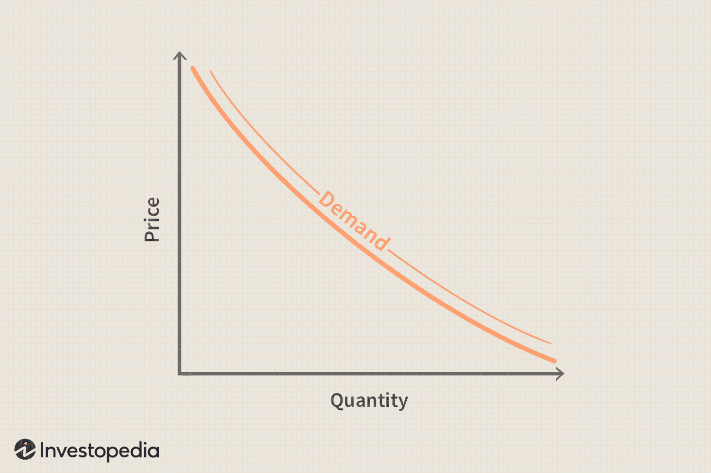

## Table of Contents

## What is quantity demanded?

Quantity demanded is the amount of a product or service that people want to buy at a certain price. It's like how many apples people would buy if each apple costs a dollar. This number can change if the price changes. If the price goes down, more people might want to buy the product, so the quantity demanded goes up. If the price goes up, fewer people might want to buy it, so the quantity demanded goes down.

This idea is shown on a graph called a demand curve. The demand curve slopes downward because when the price is lower, more people want to buy the product. Economists use this to understand how people react to price changes and to predict how much of a product will be sold at different prices. It's an important part of figuring out how to set prices and plan production.

## How is quantity demanded different from demand?

Quantity demanded is the specific amount of a product people want to buy at a certain price. It's like saying how many ice creams you would buy if each one costs $2. If the price changes, the quantity demanded changes too. For example, if ice creams go on sale for $1 each, you might want to buy more, so the quantity demanded would go up.

Demand, on the other hand, is the whole relationship between the price of a product and how much of it people want to buy. It's shown by a demand curve on a graph, which looks like a line going down from left to right. This curve shows all the different quantities people would buy at all possible prices. So, demand is the big picture, and quantity demanded is just one point on that big picture, depending on the price at that moment.

## What factors influence quantity demanded?

The main thing that changes how much people want to buy of something is the price. When the price goes down, more people usually want to buy it, so the quantity demanded goes up. If the price goes up, fewer people want to buy it, so the quantity demanded goes down. This is the most important [factor](/wiki/factor-investing) because it directly affects how much people are willing to spend on the product.

Other things can also change how much people want to buy. For example, if people's income goes up, they might buy more of a product, especially if it's something they see as a luxury. Changes in tastes and preferences can also make a big difference. If a new study says that eating apples is really good for you, more people might want to buy apples, so the quantity demanded for apples would go up. Also, if there are other similar products out there, and one of them becomes cheaper or better, it might make people want to buy less of the original product.

## How does price affect quantity demanded?

Price has a big effect on how much people want to buy of something. When the price goes down, more people are willing to buy the product because it costs less. This means the quantity demanded goes up. For example, if a toy that used to cost $20 is now on sale for $10, more kids might want to buy it because it's cheaper.

On the other hand, when the price goes up, fewer people want to buy the product because it's more expensive. This means the quantity demanded goes down. If that same toy now costs $30 instead of $20, fewer kids might want to buy it because it's too pricey. This relationship between price and quantity demanded is shown on a demand curve, which always slopes downward because lower prices lead to higher quantities demanded.

## What is the law of demand and how does it relate to quantity demanded?

The law of demand is a basic idea in economics that says when the price of something goes down, people want to buy more of it. And when the price goes up, people want to buy less of it. It's like if apples are cheaper, you might buy more apples, but if they get more expensive, you might buy fewer. This is why the demand curve, which shows how much people want to buy at different prices, always slopes downward.

The law of demand directly relates to quantity demanded. Quantity demanded is the specific amount of a product people want to buy at a certain price. When the price changes, the quantity demanded changes too, following the law of demand. For example, if the price of a toy goes down from $20 to $10, the quantity demanded for that toy will go up because more kids will want to buy it at the lower price. So, the law of demand helps explain why quantity demanded changes when the price changes.

## Can you explain the concept of a demand curve?

A demand curve is a line on a graph that shows how much people want to buy of something at different prices. It's like a picture that helps us see the relationship between the price of a product and how many people want to buy it. The demand curve always slopes downward. This means that when the price is lower, more people want to buy the product, so the quantity demanded goes up. And when the price is higher, fewer people want to buy it, so the quantity demanded goes down.

This downward slope is because of the law of demand. The law of demand says that when the price of something goes down, people want to buy more of it, and when the price goes up, people want to buy less. The demand curve makes it easy to see this pattern. For example, if you look at the curve, you can see that if the price of a toy drops from $20 to $10, the demand curve shows that more kids will want to buy that toy because it's cheaper. So, the demand curve is a helpful tool for understanding how price changes affect how much people want to buy.

## How do income changes impact the quantity demanded of a product?

When people's income changes, it can affect how much they want to buy of a product. If people's income goes up, they usually have more money to spend. This can make them want to buy more things, especially if those things are seen as luxuries or nice-to-have items. For example, if someone gets a raise at work, they might decide to buy a new TV or go out to eat more often. So, when income goes up, the quantity demanded for these kinds of products usually goes up too.

On the other hand, if people's income goes down, they might have less money to spend. This can make them want to buy less of certain products, especially if those products are expensive or not really necessary. For example, if someone loses their job, they might decide to stop buying fancy coffee and switch to making it at home. So, when income goes down, the quantity demanded for these kinds of products usually goes down too. This shows how important income is in deciding how much people want to buy.

## What role do consumer preferences play in determining quantity demanded?

Consumer preferences are really important when it comes to deciding how much of a product people want to buy. If people start liking a product more, they'll want to buy more of it. For example, if a new movie comes out and everyone loves it, more people will want to buy tickets to see it. On the other hand, if people start liking a product less, they'll want to buy less of it. Like if a new study says that a certain type of snack is bad for you, fewer people might want to buy it.

These changes in what people like can make a big difference in how much of a product is sold. Businesses need to pay attention to what people are into because it can change how much they want to buy. If a company sees that people are starting to like their product more, they might make more of it to meet the higher demand. And if they see that people are starting to like it less, they might make less of it or try to change the product to make it more popular again. So, consumer preferences are a big part of figuring out how much of a product people will want to buy.

## How do expectations about future prices affect current quantity demanded?

When people think that the price of something will go up in the future, they might want to buy it now while it's still cheaper. This means the quantity demanded for that product goes up right away. For example, if people hear that the price of gas is going to go up next month, they might fill up their tanks now to save money. So, if people expect prices to rise, they'll buy more of the product now, which increases the current quantity demanded.

On the other hand, if people think that the price of something will go down in the future, they might wait to buy it later when it's cheaper. This means the quantity demanded for that product goes down right now. For example, if a new phone is coming out and people think it will be cheaper after the holidays, they might hold off on buying it now. So, if people expect prices to fall, they'll buy less of the product now, which decreases the current quantity demanded.

## What is the difference between a change in quantity demanded and a shift in demand?

A change in quantity demanded happens when the price of a product changes. It's like if the price of a toy goes down, more kids will want to buy it, so the quantity demanded goes up. Or if the price goes up, fewer kids will want to buy it, so the quantity demanded goes down. This change is shown by moving along the demand curve, which is a line on a graph that shows how much people want to buy at different prices. The demand curve itself doesn't move; you just go up or down on it depending on the new price.

A shift in demand is different because it's when the whole demand curve moves. This happens when something other than the price changes how much people want to buy. For example, if people start liking a product more, or if they get more money to spend, the whole demand curve will move to the right, showing that people want to buy more of the product at every price. If people start liking it less, or if they have less money, the demand curve will move to the left, showing that people want to buy less of the product at every price. So, a shift in demand is about the whole curve moving, not just moving along it.

## How can cross-price elasticity affect the quantity demanded of related goods?

Cross-price elasticity is a way to see how the price of one thing can change how much people want to buy of another thing. If two things are related, like peanut butter and jelly, a change in the price of one can affect how much people buy of the other. If the price of peanut butter goes up, people might buy less peanut butter and also less jelly because they usually eat them together. This means the quantity demanded for jelly goes down too. Economists call this a positive cross-price elasticity because the price of one thing going up makes people buy less of the other thing.

On the other hand, if two things are substitutes, like Coke and Pepsi, a change in the price of one can make people switch to the other. If the price of Coke goes up, people might buy more Pepsi instead because it's cheaper. This means the quantity demanded for Pepsi goes up. Economists call this a positive cross-price elasticity too, but for a different reason: the price of one thing going up makes people buy more of the other thing. So, cross-price elasticity helps us understand how the prices of related goods can change what people want to buy.

## What advanced econometric models are used to predict changes in quantity demanded?

Economists use advanced econometric models to predict how much people will want to buy of something. One common model is the regression analysis, which helps figure out how different things like price, income, and other factors affect how much people buy. This model can look at past data to see patterns and then use those patterns to guess what might happen in the future. For example, if the model sees that every time the price of a product goes down, people buy more of it, it can predict that if the price goes down again, people will buy more again.

Another model that economists use is the time series analysis. This model looks at how the quantity demanded changes over time and tries to find patterns in those changes. It can help predict future demand by looking at things like seasonal trends or long-term changes. For example, if the model sees that people buy more ice cream in the summer every year, it can predict that they will buy more ice cream next summer too. Both of these models help businesses and economists make better guesses about how much people will want to buy, which is really important for planning and making decisions.

## How can demand curve insights be integrated into algorithmic trading?

Integrating demand curve insights into [algorithmic trading](/wiki/algorithmic-trading) involves leveraging economic models to interpret market demand patterns, which subsequently inform trading strategies. By analyzing these patterns, algorithmic traders can forecast market trends and identify optimal entry and [exit](/wiki/exit-strategy) points, enhancing trading efficiency and profitability.

One critical aspect of this integration is the understanding of demand elasticity, which measures how sensitive the quantity demanded is to changes in price. Elasticity can be expressed mathematically as:

$$
E_d = \frac{\% \text{ Change in Quantity Demanded}}{\% \text{ Change in Price}}
$$

Here, $E_d$ represents the price elasticity of demand. An understanding of this concept allows algorithms to adapt to varying market conditions, adjusting trading parameters in real-time to capitalize on potential profit margins.

Algorithmic systems utilize economic indicators such as shifts in quantity demanded to refine these parameters. For instance, if there is a sudden increase in the quantity demanded for a particular asset, a well-designed algorithm could increase its buying activity to exploit the rising trend, while a decrease might prompt selling to avoid potential losses. This approach requires sophisticated data analytics capable of processing large volumes of historical and real-time market data.

The development of advanced trading algorithms also enables the simulation of multiple market scenarios to assess the impact of demand curve variations on potential trade outcomes. Such simulations can employ historical market data to backtest different strategies, allowing traders to validate the effectiveness of their algorithms under various conditions. A basic Python implementation for simulating demand elasticity might look like this:

```python
def demand_elasticity_change(original_quantity, new_quantity, original_price, new_price):
    percent_change_quantity = (new_quantity - original_quantity) / original_quantity * 100
    percent_change_price = (new_price - original_price) / original_price * 100
    elasticity = percent_change_quantity / percent_change_price
    return elasticity

original_quantity = 1000
new_quantity = 1200
original_price = 50
new_price = 45

elasticity = demand_elasticity_change(original_quantity, new_quantity, original_price, new_price)
print("Demand Elasticity:", elasticity)
```

This [course](/wiki/best-algorithmic-trading-courses) of action not only allows for better anticipation of market shifts but also enhances the adaptability of trading strategies, ensuring they remain responsive to current economic developments. Furthermore, as [machine learning](/wiki/machine-learning) and data analysis technologies advance, these integrations are expected to become more sophisticated, providing traders with increasingly accurate and actionable insights.

By incorporating demand curve insights into trading algorithms, traders can achieve a more nuanced understanding of market dynamics, leading to improved strategy execution and better risk management. This alignment of economic theory with cutting-edge technology is essential for maintaining a competitive advantage in the modern financial markets.

## What is the conclusion?

The integration of demand curve economics into algorithmic trading represents a powerful convergence of economic theory and technological innovation. Understanding the dynamics of the demand curve and the quantity demanded allows traders to enhance algorithmic strategies, providing a strategic advantage. As an example, by incorporating demand elasticity into trading algorithms, traders can create models that predict consumer responsiveness to price changes, leading to more informed decision-making. This can be expressed through the demand elasticity formula:

$$
E_d = \frac{\%\ \text{change in quantity demanded}}{\%\ \text{change in price}}
$$

Ongoing advancements in data analytics and machine learning further refine the integration of economic principles in trading algorithms. Machine learning models, such as supervised learning algorithms, can analyze vast datasets to uncover patterns in market behavior, improving the predictive accuracy of demand forecasts. Python libraries like Scikit-learn and TensorFlow are widely used in this context for developing and training machine learning models.

As markets continue to evolve, insights from demand curve economics will remain invaluable for algorithmic traders. The ability to anticipate market shifts based on consumer demand is crucial for optimizing trade execution. With the continual evolution of markets, traders must remain adaptable, using these economic insights to navigate the complexities of financial dynamics effectively.

This intersection of economics and technology highlights the need for continuous learning and adaptation in financial markets. As algorithmic trading platforms grow more sophisticated, they necessitate a deeper understanding of both economic theory and technological tools. This dual approach ensures that traders not only keep pace with rapidly changing markets but also leverage these changes for sustained competitive advantage.

## References & Further Reading

[1]: Bergstra, J., Bardenet, R., Bengio, Y., & Kégl, B. (2011). ["Algorithms for Hyper-Parameter Optimization."](https://papers.nips.cc/paper/4443-algorithms-for-hyper-parameter-optimization) Advances in Neural Information Processing Systems 24.

[2]: ["Advances in Financial Machine Learning"](https://www.amazon.com/Advances-Financial-Machine-Learning-Marcos/dp/1119482089) by Marcos Lopez de Prado

[3]: ["Evidence-Based Technical Analysis: Applying the Scientific Method and Statistical Inference to Trading Signals"](https://www.amazon.com/Evidence-Based-Technical-Analysis-Scientific-Statistical/dp/0470008741) by David Aronson

[4]: ["Machine Learning for Algorithmic Trading"](https://github.com/stefan-jansen/machine-learning-for-trading) by Stefan Jansen

[5]: ["Quantitative Trading: How to Build Your Own Algorithmic Trading Business"](https://www.amazon.com/Quantitative-Trading-Build-Algorithmic-Business/dp/1119800064) by Ernest P. Chan