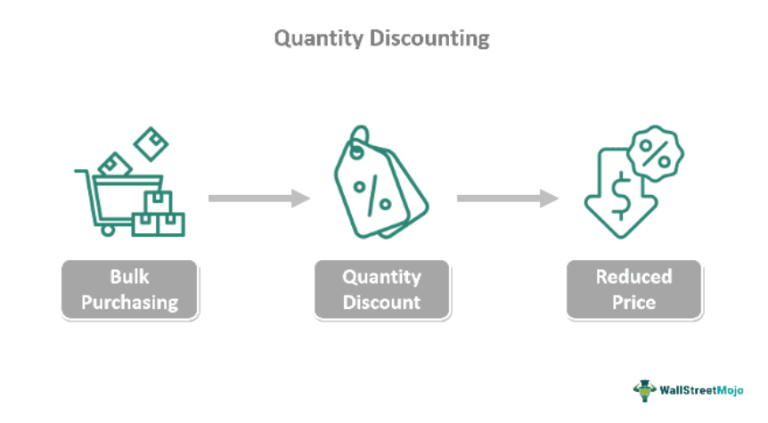

In today's dynamic business environment, the ability to master innovative sales strategies and comprehend the complexities of algorithmic trading is crucial for success in competitive markets. Quantity discount pricing is a key sales strategy, enabling businesses to offer reduced unit costs when customers purchase goods in bulk. This approach aims to increase sales volume and reduce inventory costs, capitalizing on economies of scale. Businesses benefit by achieving higher transaction volumes, but they must also navigate potential challenges like reduced profit margins and disruptions to standard pricing structures.

On the other hand, algorithmic trading has transformed the financial trading landscape by using computer algorithms to execute trades with precision and speed. This technological advancement reduces human error, eliminates emotional biases, and allows real-time strategy testing against historical data. The accessibility to advanced technology even empowers individual traders to leverage these benefits, providing a significant edge in trading efficiency and accuracy.



Through the integration of quantity discount pricing and algorithmic trading, businesses and traders can enhance their operations and competitiveness. This article explores these methods and their potential advantages, equipping businesses and traders with comprehensive insights for leveraging these strategies effectively in today's market landscape.

## Table of Contents

## Understanding Quantity Discount Pricing

Quantity discount pricing is a strategy where sellers offer customers a reduced cost per unit of a product when they purchase large quantities. This approach serves dual purposes: it aims to boost sales volume while simultaneously reducing inventory costs. By incentivizing bulk purchases, businesses can move more product efficiently and potentially reach a broader customer base. 

The mechanism behind quantity discount pricing leverages the principle that selling larger quantities at a reduced unit price can lead to higher overall revenue. The foundational concept is rooted in the idea that consumers are more likely to increase their purchase volume if they perceive a financial benefit in doing so. For instance, a customer may buy ten units of a product rather than one if the price per unit decreases with increased volume. Mathematically, the discount can be structured such that $P(q) = a(q) \times q$, where $P(q)$ is the total price for $q$ units, and $a(q)$ is the adjusted price per unit based on the quantity purchased.

Beyond boosting sales volume, quantity discount pricing helps sellers capitalize on economies of scale. As production and distribution processes become more efficient at larger scales, the cost per unit decreases. When these savings are partially passed on to the consumer via discounts, both parties benefit: consumers enjoy lower prices, and sellers achieve increased volume efficiencies. 

Nonetheless, it is important for businesses to weigh the potential advantages against possible drawbacks. Challenges include ensuring that discounted pricing does not erode profit margins significantly, unless compensated by the [volume](/wiki/volume-trading-strategy) of sales. Furthermore, businesses must calculate the optimal discount levels carefully, balancing perceived value to the consumer against the impact on revenue and inventory turnover. Using data-driven analysis, including predictive modeling, can aid businesses in determining optimal pricing thresholds and ensuring that this pricing strategy aligns with overall financial goals.

## Benefits of Quantity Discount Pricing

Quantity discount pricing offers several advantages, primarily by incentivizing consumers to make larger purchases through price reductions based on the quantity bought. This mechanism is particularly effective in increasing buying incentives. When customers perceive value in purchasing more units at a lower price per item, they are often persuaded to purchase in quantities they might not have considered otherwise. This can lead to increased total sales volume for businesses, which is a substantial advantage in competitive markets.

One significant benefit of this strategy is its ability to assist businesses in moving large volumes of inventory. This aspect is crucial for products that are time-sensitive or perishable, such as food items, seasonal goods, or products with expiry dates. By offering discounts on bulk purchases, companies can efficiently manage their inventories and reduce the risk of unsold stock, which might otherwise result in losses.

Quantity discount pricing also contributes to economies of scale, as it encourages the production and sale of larger quantities, which can lead to lower average costs per unit. When businesses are able to operate on larger scales, they can reduce the cost of production per unit due to more efficient use of resources, including factory run-times, bulk raw material purchases, and streamlined logistic operations. This cost efficiency can be captured by the formula for average cost reduction:

$$
\text{Average Cost} = \frac{\text{Total Cost}}{\text{Quantity Produced}}
$$

As quantity increases, the average cost per unit often decreases, allowing businesses to potentially improve profit margins even when offering price discounts.

Furthermore, enhanced cash flow is another key advantage. As customers are encouraged to purchase in bulk, companies benefit from quicker sales, resulting in a more constant inflow of revenue. This can improve the [liquidity](/wiki/liquidity-risk-premium) position of a business, enabling it to reinvest promptly into operations, marketing, or further inventory.

Overall, quantity discount pricing not only boosts direct sales and reduces inventory risks but also supports broader financial stability and operational efficiency. These benefits make it a compelling strategy for businesses aiming to optimize their sales operations and maintain competitive pricing advantages.

## Challenges and Limitations of Quantity Discount Pricing

Quantity discount pricing, while effective in driving sales, presents several challenges and limitations that businesses must carefully consider. One of the primary concerns is the potential reduction in profit margins. When offering discounts for bulk purchases, a company may find that although sales volume increases, the reduced price per unit can lead to decreased overall profitability unless the increased volume sufficiently compensates for the lower margins. This relationship can be expressed using the formula:

$$
\text{Profit} = (\text{Price per unit} - \text{Cost per unit}) \times \text{Quantity sold}
$$

In this formula, a decrease in the price per unit necessitates a proportionate increase in the quantity sold to maintain or enhance profit levels.

Furthermore, quantity discount pricing can impact customers' purchasing behavior, potentially disrupting existing linear pricing structures. Customers might adjust their buying habits to take advantage of bulk discounts, leading to irregular purchasing patterns and causing inventory management challenges. Such shifts require businesses to adapt their supply chain strategies to accommodate fluctuating demand, which can introduce additional operational complexities.

Careful calculation of per-unit costs is essential for businesses to avoid financial pitfalls. Setting the discount too high or miscalculating the associated costs could result in selling at a loss. Businesses must consider all relevant factors, such as production costs, storage, and distribution expenses, to determine an appropriate discount level that aligns with strategic objectives.

To illustrate, using Python can help simulate different scenarios to evaluate the impact of various discount levels on profit:

```python
def calculate_profit(price_per_unit, cost_per_unit, quantity_sold):
    return (price_per_unit - cost_per_unit) * quantity_sold

# Example values
price_per_unit = 100
cost_per_unit = 70
quantities = [100, 200, 300]  # Different sales volumes

for quantity in quantities:
    profit = calculate_profit(price_per_unit, cost_per_unit, quantity)
    print(f"Profit for {quantity} units: {profit}")
```

In conclusion, while quantity discount pricing can be advantageous by increasing sales volume and customer satisfaction, it requires careful analysis and strategic implementation to mitigate the challenges and limitations it poses.

 to Algorithmic Trading (Algo Trading)

Algorithmic trading, often referred to as algo trading, leverages advanced computer algorithms to execute trades automatically in financial markets. These algorithms perform tasks such as timing, pricing, and managing orders with a level of precision and speed that surpasses human capability. The primary objective is to capitalize on decision-making processes that are too complex or fast for individual traders to manage manually.

One of the core advantages of [algorithmic trading](/wiki/algorithmic-trading) is its ability to minimize human error and eliminate emotional biases from trading decisions. Human traders can be influenced by emotions like fear and greed, which may lead to irrational decisions. Algorithms, being purely data-driven, eliminate these emotional aspects, ensuring that trades are executed based on predefined criteria and logic.

The surge of affordable technology has made algo trading accessible beyond institutional investors, empowering individual traders to exploit its benefits. Previously, high-frequency trading and algorithmic execution were confined to large financial institutions due to the technical infrastructure required. However, with technological advancements, individual traders can now develop and deploy custom algorithms, giving them the opportunity to participate in the market with similar efficiencies.

Algo trading systems work by analyzing a vast amount of data to identify trends and trading opportunities. These systems employ quantitative models that can be backtested against historical data to gauge performance before live deployment. An example of a simple algorithm in Python might look like this:

```python
import pandas as pd
from pandas_datareader import data as pdr

# Define parameters
stock_symbol = 'AAPL'
start_date = '2022-01-01'
end_date = '2023-01-01'
short_window = 5
long_window = 20

# Fetch stock data
data = pdr.get_data_yahoo(stock_symbol, start=start_date, end=end_date)

# Calculate moving averages
data['Short_MA'] = data['Close'].rolling(window=short_window, min_periods=1).mean()
data['Long_MA'] = data['Close'].rolling(window=long_window, min_periods=1).mean()

# Signal generation
data['Signal'] = 0
data['Signal'][short_window:] = np.where(data['Short_MA'][short_window:] > data['Long_MA'][short_window:], 1, 0)

# Generate trading orders
data['Position'] = data['Signal'].diff()
```

In this example, a simple moving average crossover strategy is implemented where the algorithm generates buy signals when the short-term moving average crosses above the long-term moving average. Although basic, this illustrates how algorithms can automate trading decisions based on specified criteria. 

Overall, the integration of technology in trading has democratized access, allowing a more diverse range of participants to utilize algorithmic trading methods, enhancing market efficiency and liquidity.

## Key Benefits of Algo Trading

Algorithmic trading offers several significant advantages that make it a valuable tool for modern traders. One of its most notable benefits is the incredible speed and efficiency with which trades are executed. Unlike manual trading, where orders might take minutes to be placed and executed, algorithmic trading systems can analyze markets and execute trades within milliseconds. This speed is critical in high-frequency trading environments where even microsecond delays can lead to significant financial disadvantages.

Another key benefit is the accuracy inherent in algorithmic trading. By minimizing the role of human intervention, algorithmic trading reduces the likelihood of errors related to data entry, order interpretation, and the emotional biases that can affect trading decisions. This precision ensures that trades are executed exactly as planned, adhering to pre-defined strategies.

Algorithmic trading systems also provide the capability to backtest trading strategies against historical data. This feature allows traders to validate their strategies with past market conditions, enhancing the reliability of their trading approach. Backtesting can reveal insights into the strategy's potential profitability and risk by showing how it would have performed historically. This information is invaluable for refining strategies before applying them in live markets.

Moreover, algorithmic trading allows for the management of complex strategies that involve multiple markets, instruments, or strategies simultaneously. This complexity is handled more efficiently by algorithms than by manual processes, providing opportunities to capitalize on market inefficiencies or [arbitrage](/wiki/arbitrage) opportunities.

Here's a simple example of [backtesting](/wiki/backtesting) a trading strategy using Python:

```python
import pandas as pd
import numpy as np
import matplotlib.pyplot as plt

# Load historical data
data = pd.read_csv('historical_data.csv')  # Assume historical_data.csv has 'Date' and 'Close' columns.
data['Returns'] = data['Close'].pct_change()

# Simple moving average strategy
short_window = 40
long_window = 100

data['Short_MA'] = data['Close'].rolling(window=short_window, min_periods=1).mean()
data['Long_MA'] = data['Close'].rolling(window=long_window, min_periods=1).mean()
data['Signal'] = np.where(data['Short_MA'] > data['Long_MA'], 1.0, 0.0)

# Calculate strategy returns
data['Strategy_Returns'] = data['Returns'] * data['Signal'].shift(1)

# Plot the strategy returns
plt.figure(figsize=(10, 5))
plt.plot(data['Date'], data['Strategy_Returns'].cumsum(), label='Strategy Returns')
plt.plot(data['Date'], data['Returns'].cumsum(), label='Market Returns')
plt.legend()
plt.show()
```

In this example, a simple moving average crossover strategy is backtested on historical close price data. By comparing the cumulative returns of the strategy to the market, traders can evaluate the potential effectiveness of their algorithmic strategy before deploying it in live trading.

## Popular Algo Trading Strategies

Strategies such as [trend following](/wiki/trend-following), arbitrage, and mean reversion are essential in algorithmic trading, each leveraging unique market conditions for optimal trading results.

**Trend Following**: This strategy capitalizes on the idea that asset prices often follow trends. By identifying and riding these trends, traders can potentially profit from significant price movements. Typically, traders employ moving averages or other indicators to detect upward or downward trends. For example, the Moving Average Crossover strategy, where a shorter-term moving average crosses above a longer-term moving average, might signal a buy opportunity. A simple Python implementation to identify such crossovers could look like this:

```python
import pandas as pd

data = pd.read_csv('market_data.csv')
short_window = 10
long_window = 50

data['short_mavg'] = data['close'].rolling(window=short_window, min_periods=1, center=False).mean()
data['long_mavg'] = data['close'].rolling(window=long_window, min_periods=1, center=False).mean()

data['signal'] = 0.0
data['signal'][short_window:] = np.where(data['short_mavg'][short_window:] > data['long_mavg'][short_window:], 1.0, 0.0)
data['positions'] = data['signal'].diff()

print(data[['close', 'short_mavg', 'long_mavg', 'signal']])
```

**Arbitrage**: Arbitrage strategies exploit price discrepancies of the same asset on different markets or exchanges. This might involve simple arbitrage, where profiting is achieved by buying low in one market and selling high in another. High-frequency trading algorithms are often employed to detect and act on these fleeting opportunities, essential due to the minimal price gaps and substantial competition.

**Mean Reversion**: The mean reversion strategy assumes that asset prices fluctuate around a mean or average level. When prices deviate significantly from this mean, they are expected to revert over time. Traders using this strategy identify these deviations as opportunities to trade. Bollinger Bands are commonly used to visualize price volatility and detect potential mean reversion signals. Consider a differential equation that expresses the idea of mean reversion where changes in price (P) over time (t) revert to a long-term mean (M):

$$
\frac{dP}{dt} = -\lambda (P - M)
$$

where $\lambda$ is a positive constant indicating the speed of reversion.

Each of these strategies utilizes algorithmic technology to efficiently and precisely execute trades, eliminating human error and biases. The adaptability and speed of algorithms make them particularly effective in responding to varying market conditions, thus offering a comprehensive toolkit for modern traders.

## Enhancing Sales and Trading with Integrated Strategies

Integrating sales strategies such as quantity discount pricing with advanced technological tools like algorithmic trading presents businesses with an opportunity to accelerate growth and enhance operational efficiency. This synergy leverages the principles of each approach, providing a robust framework for optimizing sales and trading activities.

Firstly, quantity discount pricing serves as a potent sales incentive. By reducing the cost per unit for bulk purchases, businesses can entice customers to place larger orders, enhancing immediate cash flow and clearing inventory. This strategy, commonly applied in sectors dealing with perishable goods or high inventory turnover, can benefit from the precision and speed offered by algorithmic trading. For instance, algorithmic systems can analyze purchasing patterns and dynamic market trends, enabling businesses to fine-tune their pricing models effectively. By incorporating real-time data analysis, businesses can adjust discount thresholds based on market demand, minimizing the risk of overstocking or underpricing.

Algorithmic trading, renowned for its speed and accuracy in executing trades, contributes to this integrated strategy by offering predictive insights and historical data analysis. Businesses can harness these capabilities to forecast demand, optimize their supply chain logistics, and set strategic objectives based on market fluctuations. Python, a popular programming language for algorithmic strategies, offers libraries such as NumPy and Pandas that facilitate complex data analysis and visualization, aiding in more informed decision-making.

```python
import numpy as np
import pandas as pd

# Hypothetical sales data simulation
data = {
    'quantity_sold': np.random.poisson(lam=20, size=100),
    'unit_price': np.random.normal(loc=100, scale=10, size=100)
}

df = pd.DataFrame(data)

# Calculating revenue
df['revenue'] = df['quantity_sold'] * df['unit_price']

# Adjusting price based on quantity discounts
def apply_discount(quantity):
    if quantity > 50:
        return 0.90  # 10% discount
    elif quantity > 20:
        return 0.95  # 5% discount
    else:
        return 1.00  # no discount

df['discount_factor'] = df['quantity_sold'].apply(apply_discount)
df['adjusted_revenue'] = df['revenue'] * df['discount_factor']

# Example output
print(df.head())
```

The integration of these strategies can be further enhanced through the automation of sales transactions using algorithmic techniques. This allows businesses to rapidly respond to market changes and customer needs without the delays associated with manual pricing adjustments. Moreover, by synchronizing sales promotions through algorithmic analysis, firms can optimize revenue streams and appeal to a broader market segment. 

In conclusion, by integrating quantity discount pricing with algorithmic trading, businesses can achieve a synergy that leads to enhanced competitiveness. The combination ensures that strategic pricing is met with agility and precision, ultimately driving growth and operational success in competitive markets.

## Conclusion

Mastering sales strategies and algorithmic trading offers businesses a significant competitive advantage in today's highly competitive markets. The strategic use of quantity discount pricing, combined with the precision and speed of algorithmic trading, equips businesses to optimize operations effectively, thereby enhancing customer engagement and satisfaction. 

When sales strategies such as quantity discount pricing are implemented, businesses can capitalize on increased transaction volumes, reduced inventory costs, and enhanced cash flow. These benefits are achieved by leveraging economies of scale, enabling businesses to deliver value to customers through attractive pricing while maintaining profitability. Likewise, algo trading introduces unparalleled efficiency in trading activities. By automating trades through computer algorithms, businesses and traders can execute transactions with precision, eliminating human error and emotion-driven decisions. This automation not only accelerates trading activities but also allows for rigorous back-testing of trading strategies, further refining the decision-making process.

As technology continues to progress, the integration of innovative sales strategies and algo trading systems promises further refinement and evolution in business and trading practices. The ongoing development and application of these methodologies provide avenues for businesses to explore novel value propositions, optimize resource allocation, and navigate market complexities with increased agility and foresight. This continued innovation ensures that businesses remain at the forefront, harnessing both strategy and technology for sustained growth and competitive positioning in an ever-evolving marketplace.

## References & Further Reading

[1]: Dahlquist, E., Siljebråt, A., & Jacobsson, A. (2017). ["Economies of Scale: Theory and Estimations"](https://link.springer.com/article/10.1007/s10543-006-0072-1). Advances in Economics and Econometrics.

[2]: Harris, L. (2003). ["Trading and Exchanges: Market Microstructure for Practitioners"](https://academic.oup.com/book/52292) by Larry Harris.

[3]: Kaminski, K., & Lo, A. W. (2013). ["Quantitative Equity Portfolio Management: Modern Techniques and Applications"](https://books.google.com/books/about/Quantitative_Equity_Portfolio_Management.html?id=Zs8rAAAACAAJ) by Ludovic Phalippou.

[4]: Narang, R. (2013). ["Inside the Black Box: A Simple Guide to Quantitative and High-Frequency Trading"](https://onlinelibrary.wiley.com/doi/book/10.1002/9781118662717) by Rishi K. Narang.

[5]: Tsay, R. S. (2005). ["Analysis of Financial Time Series"](https://cpb-us-w2.wpmucdn.com/blog.nus.edu.sg/dist/0/6796/files/2017/03/analysis-of-financial-time-series-copy-2ffgm3v.pdf) by Ruey S. Tsay.