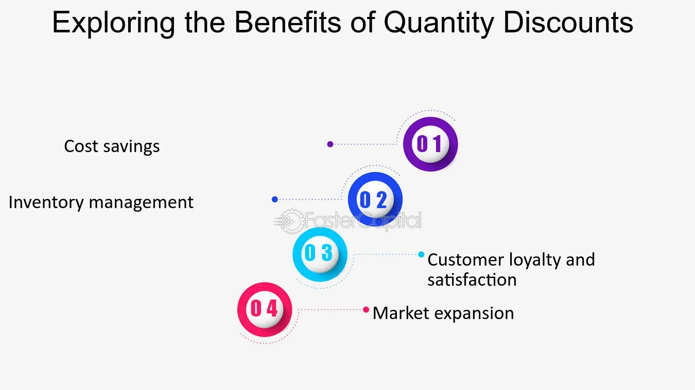

## Table of Contents

## What is a quantity discount?

A quantity discount is a reduction in price that a seller offers to a buyer for purchasing larger amounts of a product. It's like getting a special deal for buying more. Businesses use quantity discounts to encourage customers to buy more at once, which can help the business by reducing inventory and increasing sales.

Quantity discounts can be good for both the buyer and the seller. For the buyer, it means they can save money by buying in bulk. This is often seen in places like wholesale stores where you can buy big packs of items for less money per item. For the seller, offering a quantity discount can lead to bigger sales and less time spent on managing lots of small orders.

## How do quantity discounts work?

Quantity discounts work by giving customers a lower price if they buy more of a product at once. For example, if you buy one box of cereal, it might cost $5. But if you buy three boxes, the store might sell them to you for $12 instead of $15. This means you save money by buying more at one time. Stores do this to encourage people to buy more, which helps them sell more products faster.

The way quantity discounts are set up can be different. Sometimes, the discount gets bigger the more you buy. So, buying 10 boxes might give you a bigger discount than buying just 3. Other times, there might be set levels, like a 10% discount for buying 5-10 items, and a 20% discount for buying more than 10. This helps stores manage how much they sell and how much they keep in stock.

## What is the primary purpose of offering quantity discounts?

The main reason businesses offer quantity discounts is to encourage customers to buy more products at once. When customers buy more, it helps the business sell their stock faster. This is good for the business because it means they don't have to keep as many products in their warehouse, which can save them money.

Quantity discounts also help businesses make more money from each sale. When a customer buys more items because of a discount, the business can make up for the lower price per item with the larger total sale. This can lead to bigger profits and happier customers who feel like they are getting a good deal.

## Can you explain the different types of quantity discounts?

There are mainly two types of quantity discounts: cumulative and non-cumulative. Cumulative discounts are based on the total amount a customer buys over a period of time. For example, if you buy a certain amount of products from a store over a year, you might get a discount on future purchases. This type of discount encourages loyalty and repeat business because the more you buy overall, the bigger your discount can be.

Non-cumulative discounts, on the other hand, are given based on the size of a single order. If you buy a lot of something in one go, you get a discount right away. For instance, buying 10 items might get you a 10% discount on that order. This type of discount is great for encouraging customers to buy more at once, helping the business move their stock quickly.

Both types of discounts help businesses sell more products and manage their inventory better. Cumulative discounts build customer loyalty over time, while non-cumulative discounts can boost immediate sales. Depending on the business's goals, they might choose one type of discount or use both to attract different kinds of customers.

## What are the benefits of quantity discounts for buyers?

Quantity discounts help buyers save money. When you buy more of something at once, the price per item goes down. For example, if you buy a big pack of pens, each pen might cost less than if you bought them one at a time. This means you can get more for your money and spend less overall. It's like getting a special deal just for buying more.

These discounts also make it easier for buyers to plan and buy what they need in bulk. Instead of having to buy things often, you can buy a lot at once and not worry about running out for a while. This can save time and effort because you don't have to go shopping as much. Plus, it can be really handy for businesses that use a lot of the same items, like restaurants buying food supplies or offices buying paper.

## How do quantity discounts benefit sellers?

Quantity discounts help sellers by encouraging customers to buy more at once. When people buy a lot of items in one go, it helps the seller sell their stock faster. This means they don't have to keep as many products in their warehouse, which saves them money on storage costs. Plus, selling more products quickly can lead to bigger profits because the seller can make up for the lower price per item with the larger total sale.

These discounts also help sellers build better relationships with their customers. When customers see they can save money by buying more, they might keep coming back to the same seller. This can lead to repeat business and loyalty, which is great for the seller. Over time, offering quantity discounts can help a business grow by attracting more customers and keeping them happy.

## What are the potential drawbacks of quantity discounts for businesses?

Quantity discounts can sometimes hurt a business if they are not careful. When a business gives a discount, they make less money on each item sold. If they lower the price too much, they might not make enough profit to cover their costs. This can be a big problem, especially if the business is already struggling to make money. Also, if too many customers start buying in bulk, the business might run out of stock quickly and have trouble keeping up with demand.

Another issue is that quantity discounts can change how customers buy things. Some people might wait until they can buy a lot at once to get the discount, which means they buy less often. This can make it hard for the business to predict how much they need to order and when. If the business orders too much because they expect big sales, they might end up with too much stock that doesn't sell. This can lead to wasted money and space.

## How can a business determine the optimal quantity discount strategy?

A business can figure out the best way to offer quantity discounts by looking at a few key things. First, they need to understand how much it costs them to make or buy the products they sell. This helps them know how much they can lower the price and still make a profit. They also need to think about how their customers buy things. If customers usually buy a lot at once, bigger discounts might work well. But if customers buy small amounts often, smaller discounts on bigger orders could encourage them to buy more.

Next, the business should test different discount levels to see what works best. They can start with a small discount and see if it gets customers to buy more. If it does, they might try a bigger discount to see if they can sell even more. It's important to keep an eye on how much they are selling and how much profit they are making. This way, they can adjust the discounts to find the right balance that keeps customers happy and the business profitable.

## What role do quantity discounts play in inventory management?

Quantity discounts help businesses manage their inventory by encouraging customers to buy more at once. When customers buy a lot of items in one go, it helps the business sell their stock faster. This means the business doesn't have to keep as many products in their warehouse, which saves them money on storage costs. By moving products out quickly, the business can keep their inventory levels low and avoid having too much stock that doesn't sell.

However, quantity discounts can also make inventory management trickier. If too many customers start buying in bulk, the business might run out of stock quickly and have trouble keeping up with demand. This can lead to delays and unhappy customers. Also, if customers start waiting to buy more at once to get the discount, it can be hard for the business to predict how much they need to order and when. So, while quantity discounts can help sell products faster, businesses need to be careful and plan well to manage their inventory effectively.

## How do quantity discounts affect pricing strategies?

Quantity discounts change how a business sets its prices. When a business offers a discount for buying more, they have to think about how much they can lower the price and still make money. They need to know their costs and how much profit they need to make. If the discount is too big, they might lose money. But if it's just right, it can help them sell more and make more money overall. It's all about finding the balance that makes customers happy and keeps the business profitable.

Quantity discounts also affect how customers see the prices. When people see they can save money by buying more, they might wait until they can buy in bulk. This can make the business's pricing strategy more complicated because they have to predict when and how much customers will buy. If the business gets it wrong, they might have too much or too little stock. So, businesses need to be careful and keep an eye on how their discounts are working to make sure their pricing strategy stays on track.

## Can you discuss the impact of quantity discounts on supply chain dynamics?

Quantity discounts can change how the supply chain works. When businesses offer these discounts, they encourage customers to buy more at once. This means the business can sell their stock faster, which is good because it helps them manage their inventory better. They don't have to keep as many products in their warehouse, which saves them money on storage costs. Plus, selling more products quickly can help the business order new stock more efficiently, keeping the supply chain moving smoothly.

But quantity discounts can also make things harder in the supply chain. If too many customers start buying in bulk, the business might run out of stock quickly. This can lead to delays because they have to wait for more products to come in. Also, if customers start waiting to buy more at once to get the discount, it can be hard for the business to predict how much they need to order and when. This can mess up the supply chain, causing problems with having the right amount of stock at the right time. So, while quantity discounts can help sell products faster, businesses need to plan carefully to keep their supply chain running well.

## What advanced analytics can be used to optimize quantity discount programs?

Advanced analytics can help businesses make their quantity discount programs better. One way is by using data to figure out the best discount levels. Businesses can look at past sales to see how customers respond to different discounts. They can use this information to set discounts that encourage people to buy more without losing too much money. Another way is by using predictive models to guess how much customers will buy in the future. This can help businesses plan their inventory and discounts better, so they have the right amount of stock and can offer discounts that work well.

Another important part of advanced analytics is tracking how well the discount program is doing. Businesses can use real-time data to see if their discounts are helping them sell more and make more money. If something isn't working, they can change it quickly. Also, advanced analytics can help businesses understand different types of customers. By looking at customer data, they can offer personalized discounts that fit each customer's buying habits. This can make customers happier and more likely to keep coming back, which is good for the business in the long run.

## What are the benefits of quantity discount pricing?

Quantity discount pricing offers several advantages, primarily by incentivizing consumers to make larger purchases through price reductions based on the quantity bought. This mechanism is particularly effective in increasing buying incentives. When customers perceive value in purchasing more units at a lower price per item, they are often persuaded to purchase in quantities they might not have considered otherwise. This can lead to increased total sales volume for businesses, which is a substantial advantage in competitive markets.

One significant benefit of this strategy is its ability to assist businesses in moving large volumes of inventory. This aspect is crucial for products that are time-sensitive or perishable, such as food items, seasonal goods, or products with expiry dates. By offering discounts on bulk purchases, companies can efficiently manage their inventories and reduce the risk of unsold stock, which might otherwise result in losses.

Quantity discount pricing also contributes to economies of scale, as it encourages the production and sale of larger quantities, which can lead to lower average costs per unit. When businesses are able to operate on larger scales, they can reduce the cost of production per unit due to more efficient use of resources, including factory run-times, bulk raw material purchases, and streamlined logistic operations. This cost efficiency can be captured by the formula for average cost reduction:

$$
\text{Average Cost} = \frac{\text{Total Cost}}{\text{Quantity Produced}}
$$

As quantity increases, the average cost per unit often decreases, allowing businesses to potentially improve profit margins even when offering price discounts.

Furthermore, enhanced cash flow is another key advantage. As customers are encouraged to purchase in bulk, companies benefit from quicker sales, resulting in a more constant inflow of revenue. This can improve the [liquidity](/wiki/liquidity-risk-premium) position of a business, enabling it to reinvest promptly into operations, marketing, or further inventory.

Overall, quantity discount pricing not only boosts direct sales and reduces inventory risks but also supports broader financial stability and operational efficiency. These benefits make it a compelling strategy for businesses aiming to optimize their sales operations and maintain competitive pricing advantages.

## What are the challenges and limitations of quantity discount pricing?

Quantity discount pricing, while effective in driving sales, presents several challenges and limitations that businesses must carefully consider. One of the primary concerns is the potential reduction in profit margins. When offering discounts for bulk purchases, a company may find that although sales volume increases, the reduced price per unit can lead to decreased overall profitability unless the increased volume sufficiently compensates for the lower margins. This relationship can be expressed using the formula:

$$
\text{Profit} = (\text{Price per unit} - \text{Cost per unit}) \times \text{Quantity sold}
$$

In this formula, a decrease in the price per unit necessitates a proportionate increase in the quantity sold to maintain or enhance profit levels.

Furthermore, quantity discount pricing can impact customers' purchasing behavior, potentially disrupting existing linear pricing structures. Customers might adjust their buying habits to take advantage of bulk discounts, leading to irregular purchasing patterns and causing inventory management challenges. Such shifts require businesses to adapt their supply chain strategies to accommodate fluctuating demand, which can introduce additional operational complexities.

Careful calculation of per-unit costs is essential for businesses to avoid financial pitfalls. Setting the discount too high or miscalculating the associated costs could result in selling at a loss. Businesses must consider all relevant factors, such as production costs, storage, and distribution expenses, to determine an appropriate discount level that aligns with strategic objectives.

To illustrate, using Python can help simulate different scenarios to evaluate the impact of various discount levels on profit:

```python
def calculate_profit(price_per_unit, cost_per_unit, quantity_sold):
    return (price_per_unit - cost_per_unit) * quantity_sold

# Example values
price_per_unit = 100
cost_per_unit = 70
quantities = [100, 200, 300]  # Different sales volumes

for quantity in quantities:
    profit = calculate_profit(price_per_unit, cost_per_unit, quantity)
    print(f"Profit for {quantity} units: {profit}")
```

In conclusion, while quantity discount pricing can be advantageous by increasing sales volume and customer satisfaction, it requires careful analysis and strategic implementation to mitigate the challenges and limitations it poses.

 to Algorithmic Trading (Algo Trading)

Algorithmic trading, often referred to as algo trading, leverages advanced computer algorithms to execute trades automatically in financial markets. These algorithms perform tasks such as timing, pricing, and managing orders with a level of precision and speed that surpasses human capability. The primary objective is to capitalize on decision-making processes that are too complex or fast for individual traders to manage manually.

One of the core advantages of [algorithmic trading](/wiki/algorithmic-trading) is its ability to minimize human error and eliminate emotional biases from trading decisions. Human traders can be influenced by emotions like fear and greed, which may lead to irrational decisions. Algorithms, being purely data-driven, eliminate these emotional aspects, ensuring that trades are executed based on predefined criteria and logic.

The surge of affordable technology has made algo trading accessible beyond institutional investors, empowering individual traders to exploit its benefits. Previously, high-frequency trading and algorithmic execution were confined to large financial institutions due to the technical infrastructure required. However, with technological advancements, individual traders can now develop and deploy custom algorithms, giving them the opportunity to participate in the market with similar efficiencies.

Algo trading systems work by analyzing a vast amount of data to identify trends and trading opportunities. These systems employ quantitative models that can be backtested against historical data to gauge performance before live deployment. An example of a simple algorithm in Python might look like this:

```python
import pandas as pd
from pandas_datareader import data as pdr

# Define parameters
stock_symbol = 'AAPL'
start_date = '2022-01-01'
end_date = '2023-01-01'
short_window = 5
long_window = 20

# Fetch stock data
data = pdr.get_data_yahoo(stock_symbol, start=start_date, end=end_date)

# Calculate moving averages
data['Short_MA'] = data['Close'].rolling(window=short_window, min_periods=1).mean()
data['Long_MA'] = data['Close'].rolling(window=long_window, min_periods=1).mean()

# Signal generation
data['Signal'] = 0
data['Signal'][short_window:] = np.where(data['Short_MA'][short_window:] > data['Long_MA'][short_window:], 1, 0)

# Generate trading orders
data['Position'] = data['Signal'].diff()
```

In this example, a simple moving average crossover strategy is implemented where the algorithm generates buy signals when the short-term moving average crosses above the long-term moving average. Although basic, this illustrates how algorithms can automate trading decisions based on specified criteria. 

Overall, the integration of technology in trading has democratized access, allowing a more diverse range of participants to utilize algorithmic trading methods, enhancing market efficiency and liquidity.

## What are some popular algo trading strategies?

Strategies such as [trend following](/wiki/trend-following), arbitrage, and mean reversion are essential in algorithmic trading, each leveraging unique market conditions for optimal trading results.

**Trend Following**: This strategy capitalizes on the idea that asset prices often follow trends. By identifying and riding these trends, traders can potentially profit from significant price movements. Typically, traders employ moving averages or other indicators to detect upward or downward trends. For example, the Moving Average Crossover strategy, where a shorter-term moving average crosses above a longer-term moving average, might signal a buy opportunity. A simple Python implementation to identify such crossovers could look like this:

```python
import pandas as pd

data = pd.read_csv('market_data.csv')
short_window = 10
long_window = 50

data['short_mavg'] = data['close'].rolling(window=short_window, min_periods=1, center=False).mean()
data['long_mavg'] = data['close'].rolling(window=long_window, min_periods=1, center=False).mean()

data['signal'] = 0.0
data['signal'][short_window:] = np.where(data['short_mavg'][short_window:] > data['long_mavg'][short_window:], 1.0, 0.0)
data['positions'] = data['signal'].diff()

print(data[['close', 'short_mavg', 'long_mavg', 'signal']])
```

**Arbitrage**: Arbitrage strategies exploit price discrepancies of the same asset on different markets or exchanges. This might involve simple arbitrage, where profiting is achieved by buying low in one market and selling high in another. High-frequency trading algorithms are often employed to detect and act on these fleeting opportunities, essential due to the minimal price gaps and substantial competition.

**Mean Reversion**: The mean reversion strategy assumes that asset prices fluctuate around a mean or average level. When prices deviate significantly from this mean, they are expected to revert over time. Traders using this strategy identify these deviations as opportunities to trade. Bollinger Bands are commonly used to visualize price volatility and detect potential mean reversion signals. Consider a differential equation that expresses the idea of mean reversion where changes in price (P) over time (t) revert to a long-term mean (M):

$$
\frac{dP}{dt} = -\lambda (P - M)
$$

where $\lambda$ is a positive constant indicating the speed of reversion.

Each of these strategies utilizes algorithmic technology to efficiently and precisely execute trades, eliminating human error and biases. The adaptability and speed of algorithms make them particularly effective in responding to varying market conditions, thus offering a comprehensive toolkit for modern traders.

## References & Further Reading

[1]: Dahlquist, E., Siljebråt, A., & Jacobsson, A. (2017). ["Economies of Scale: Theory and Estimations"](https://link.springer.com/article/10.1007/s10543-006-0072-1). Advances in Economics and Econometrics.

[2]: Harris, L. (2003). ["Trading and Exchanges: Market Microstructure for Practitioners"](https://academic.oup.com/book/52292) by Larry Harris.

[3]: Kaminski, K., & Lo, A. W. (2013). ["Quantitative Equity Portfolio Management: Modern Techniques and Applications"](https://books.google.com/books/about/Quantitative_Equity_Portfolio_Management.html?id=Zs8rAAAACAAJ) by Ludovic Phalippou.

[4]: Narang, R. (2013). ["Inside the Black Box: A Simple Guide to Quantitative and High-Frequency Trading"](https://onlinelibrary.wiley.com/doi/book/10.1002/9781118662717) by Rishi K. Narang.

[5]: Tsay, R. S. (2005). ["Analysis of Financial Time Series"](https://cpb-us-w2.wpmucdn.com/blog.nus.edu.sg/dist/0/6796/files/2017/03/analysis-of-financial-time-series-copy-2ffgm3v.pdf) by Ruey S. Tsay.