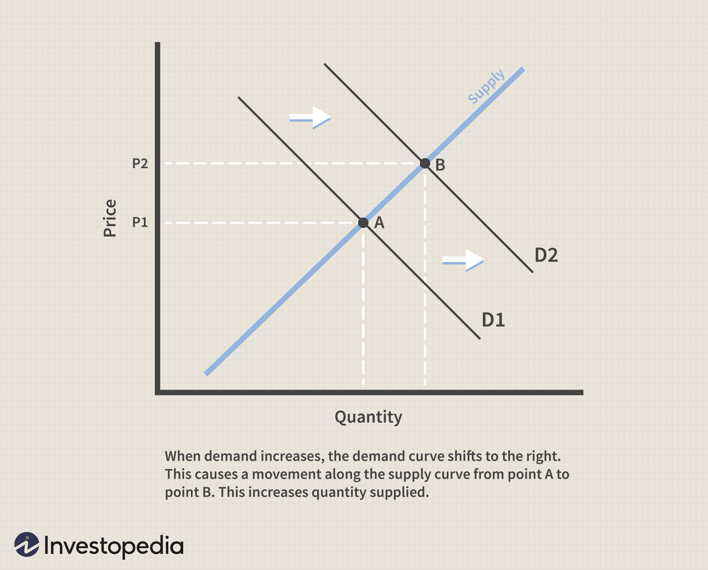

In the ever-evolving world of finance and economics, understanding the dynamic interplay between economic factors and market supply is crucial. At the core of these interactions is the concept of quantity supplied, which refers to the amount of a good or service that producers are willing and able to offer for sale at a given price point within a specific time period. This notion forms the basis of the supply curve, a fundamental element of economic theory. The supply curve graphically represents the relationship between price levels and the quantity of goods supplied, typically illustrating an upward slope that reflects a direct relationship: as prices increase, the quantity supplied tends to rise.

Technological advancements have significantly transformed market operations, introducing new dimensions to supply dynamics and fostering real-time market environments. Among these innovations is algorithmic trading, or algo trading, which uses complex algorithms and computer programs to execute trades at speeds and frequencies beyond human capacity. This technology has reshaped how supply factors are perceived and acted upon in the market, offering a sophisticated approach to navigating price movements and supply changes.



Algorithmic trading systems offer traders and investors the ability to leverage insights derived from the relationship between supply and demand. These systems can swiftly react to shifts in quantity supplied, optimizing trading strategies based on real-time data and predefined economic indicators. The convergence of traditional supply concepts with cutting-edge technology in algorithmic trading thus provides a comprehensive view of modern trading practices and highlights the importance of understanding economic factors in today's markets.

This article will explore these intricate relationships, examining how they influence contemporary trading practices. It will address the basics of quantity supplied, the various factors affecting it, and how algorithmic trading systems capitalize on these insights to enhance trading efficacy. By appreciating these relationships, traders and investors can develop more informed strategies, effectively navigating the complexities of modern financial markets.

## Table of Contents

## Understanding Quantity Supplied

Quantity supplied is a fundamental concept in economics, referring to the specific quantity of a product that producers are willing and able to sell at a certain price within a specified timeframe. This concept underpins the supply curve, a graphical representation illustrating the direct relationship between the price of a good and the quantity of it that producers are prepared to supply. In economic terms, the supply curve is typically upward sloping, indicating that, as prices rise, the quantity supplied generally increases as well.

The quantity supplied is not static; it fluctuates in response to various economic stimuli. A primary driver of changes in quantity supplied is the shift in market demand. For instance, if consumer demand for a product increases, producers may respond by raising the quantity supplied to meet this enhanced demand. Conversely, a decline in demand may lead producers to decrease output. Understanding these dynamics allows firms and economists to foresee supply-side adjustments in response to market changes.

Accurately predicting changes in quantity supplied is essential for producers to make informed production decisions. It involves evaluating factors such as production costs, technology, and regulatory conditions. Understanding these elements aids in strategizing around supply chain adjustments, inventory management, and pricing strategies. For example, if advances in technology lead to decreased production costs, producers might increase their quantity supplied at the existing price levels, thereby shifting the supply curve to the right.

Moreover, quantity supplied is central to understanding broader economic phenomena, such as how supply reacts to price ceilings or floors. Analyzing quantity supplied can provide insights into market equilibrium, where the quantity demanded by consumers meets the quantity supplied by producers. This equilibrium is a vital concept for both market stability and efficient resource allocation.

In summary, grasping the concept of quantity supplied is crucial for anticipating how producers adjust their offerings in response to price shifts and demand variations, ultimately affecting market dynamics and economic outcomes.

## The Supply Curve: A Graphical Analysis

The supply curve is a fundamental concept in economic theory that visually represents the relationship between the price of a good and the quantity that producers are willing to supply. Typically, the supply curve is upward sloping, which indicates a direct relationship: as prices rise, the quantity of goods supplied also increases. This positive correlation is due to suppliers being more inclined to produce more at higher prices to increase potential profits.

Several factors can lead to shifts in the supply curve, reflecting changes in the market environment:

1. **Production Costs**: Changes in the cost of inputs such as labor, raw materials, and energy can significantly impact the supply curve. An increase in production costs at constant output prices reduces profit margins, leading to a leftward shift in the supply curve, indicating a decrease in the quantity supplied at each price level. Conversely, reductions in production costs will shift the supply curve to the right, representing an increase in supply.

2. **Technological Advances**: Innovations and improvements in production technology can enhance the efficiency of production processes, lowering costs and increasing output. This typically results in a rightward shift of the supply curve, as more goods can be supplied at each price level due to the increased efficiency.

3. **Government Policies**: Regulations, taxes, and subsidies are forms of government intervention that influence supply. An increase in taxes on production can increase costs, shifting the supply curve to the left. Subsidies, on the other hand, reduce production costs, shifting the supply curve to the right by encouraging more production.

Understanding and analyzing shifts and movements along the supply curve are crucial for businesses and investors. Accurate analysis allows businesses to make informed production decisions and strategize effectively. For instance, if a business anticipates technological improvements, it may invest in new technologies to enhance production efficiency. Similarly, understanding potential tax changes can help businesses prepare for alterations in their cost structures.

In trading, recognizing shifts in the supply curve helps anticipate market dynamics, enabling traders to adjust their strategies effectively. For example, if external economic analyses predict increasing production costs due to regulatory changes, traders might expect a reduction in supply and an upward price movement, driving strategic purchasing decisions.

Overall, the supply curve offers valuable insights into how price changes impact the quantity of goods supplied, forming a basis for strategic economic and trading decisions.

## Economic Factors Influencing Quantity Supplied

Multiple economic factors can significantly shape the quantity supplied of a product, ultimately influencing the position and shape of the supply curve. A primary determinant is input costs, which encompass expenses related to raw materials, labor, energy, and other resources necessary for production. An increase in input costs generally leads to a decrease in the quantity supplied, as producers find it less profitable to maintain or increase production levels. Conversely, a reduction in these costs can lead to an increase in supply as production becomes more cost-effective.

Technological advancements are also pivotal in affecting quantity supplied. Innovations can enhance production efficiency, reduce costs, and improve output quality, thereby encouraging producers to increase the quantity supplied at any given price point. For example, the introduction of automation in manufacturing can lead to a significant increase in the productivity of firms, shifting the supply curve to the right.

Another significant economic [factor](/wiki/factor-investing) includes taxes and subsidies. Taxes on production or sales inversely affect supply by increasing producers' costs, typically resulting in a leftward shift of the supply curve. Conversely, subsidies can lower production costs and provide incentives for increased output, promoting a rightward shift of the supply curve. This governmental influence can be mathematically modeled as $Q_s = f(P, C - T + S)$, where $Q_s$ is quantity supplied, $P$ is the price of the good, $C$ is input costs, $T$ is taxes, and $S$ is subsidies.

Expectations about future prices also play a crucial role. If producers anticipate a rise in prices, they might hold back on supplying their products to sell in the future at higher prices, thus decreasing current supply. Conversely, an expectation of a price decline could prompt suppliers to increase current production to sell as much as possible before prices drop.

Lastly, the number of suppliers in the market affects the overall market supply. An increase in the number of suppliers typically leads to an increase in the quantity supplied, as more firms contribute to the total market output. This factor reflects the market's competitive dynamics, influencing both the supply and the price of goods.

Understanding these factors enables businesses and investors to better anticipate shifts in supply dynamics, thereby facilitating more strategic decisions in pricing, production, and investment. This comprehensive perspective on supply behavior aids in maximizing economic efficiencies and optimizing market participation.

## Algorithmic Trading: A Modern Approach

Algorithmic trading, or algo trading, employs computer programs to execute trades at speeds and frequencies far exceeding human capability. This method leverages algorithms that can instantly react to small price movements in the market, utilizing insights drawn from fluctuations in supply and demand. Essentially, [algorithmic trading](/wiki/algorithmic-trading) is a convergence of technology and classical economic theories, providing a sophisticated approach to market trading.

Algoritmic systems are designed with complex algorithms that can process vast amounts of data to analyze market conditions and execute trades more efficiently than manual methods. By processing numerous data points, these algorithms can identify and act on [arbitrage](/wiki/arbitrage) opportunities across different asset classes and markets. They capitalize on the rapid execution of trades to profit from minute discrepancies in price.

To develop effective trading strategies, algorithmic traders must have an extensive understanding of the factors controlling supply. Recognizing shifts in supply or demand can reveal potential openings for strategic trades. For instance, algorithms may incorporate economic indicators that signal changes in supply conditions, such as variations in commodity prices or shifts in producer activity. By swiftly analyzing these indicators, algorithms can adjust trading strategies proactively.

A simple algorithm to model such trading logic might be outlined in Python:

```python
def trading_decision(current_price, supply_data):
    if supply_data['current_supply'] < supply_data['expected_supply']:
        return 'BUY'
    elif supply_data['current_supply'] > supply_data['expected_supply']:
        return 'SELL'
    return 'HOLD'
```

This basic function acts on real-time supply data, comparing current supply levels to expected ones. Such straightforward logic can be part of a more extensive system that rigorously evaluates diverse economic factors and market signals.

An additional advantage of algo trading is its ability to back-test strategies against historical data. Traders can simulate how a particular algorithm might have performed in past market conditions, making adjustments to improve future performance. This testing capability, combined with algorithmic efficiency, presents traders with powerful tools for navigating complex and volatile markets.

In summary, algorithmic trading merges technological prowess with economic insights, offering a modernized and efficient means of trading. By integrating supply-side analysis into their algorithms, traders can effectively respond to ever-changing market dynamics.

## The Interplay Between Economic Factors and Algo Trading

Algorithmic trading has revolutionized the financial sector by enhancing the speed and precision of trade execution, enabling strategies that respond instantaneously to economic factors influencing supply. This has allowed traders to capitalize on small and fleeting inefficiencies in the market.

Economic indicators, such as interest rates, inflation, and employment data, directly impact the quantity supplied of goods and services in the market. For example, a rise in production costs might reduce the quantity supplied at a given price, thereby influencing supply curves. In an algorithmic trading setup, programs can be designed to adjust trading strategies based on these economic shifts. For instance, an algorithm may be set to sell equities if the inflation rate exceeds a certain threshold, indicating higher production costs and possibly lower supply.

Real-time data plays a crucial role in optimizing algorithmic trading strategies. The ability to process and analyze vast amounts of information swiftly is key to maintaining a competitive edge. Economic data feeds allow algorithms to quickly assess and react to changes in supply dynamics. Using Python, a simple algorithm to adjust trading [volume](/wiki/volume-trading-strategy) based on supply data might be structured as follows:

```python
def adjust_trading_strategy(supply_change):
    if supply_change > 0:
        increase_trading_volume()
    elif supply_change < 0:
        decrease_trading_volume()
    else:
        maintain_trading_volume()

def increase_trading_volume():
    # code to increase trading volume
    pass

def decrease_trading_volume():
    # code to decrease trading volume
    pass

def maintain_trading_volume():
    # code to maintain current trading volume
    pass
```

Here, `supply_change` signifies a change in the quantity supplied, prompting the algorithm to modify trading strategies accordingly. This kind of automation is vital in markets where supply dynamics rapidly evolve.

Moreover, the integration of economic theories with technological innovations in algorithmic trading has profoundly transformed market operations. The classic economic principles of supply and demand find new expression in quantitative models that adjust to real-time variations in market conditions. This synthesis allows for strategies that not only anticipate but also adapt to market trends, optimizing trade outcomes in the process.

The fusion of advanced computing capabilities with economic insights offers unprecedented opportunities in trading. These developments signify a shift towards a more analytically driven approach, where empirical data, rather than intuition, guides trading decisions. This evolution underscores the necessity of robust algorithm design that reflects an understanding of economic fundamentals, ensuring that trading strategies are not only reactive but also predictive of future market movements.

## Conclusion

In the context of continually developing financial markets, a comprehensive understanding of economic supply concepts and their application through technology is crucial. The interaction among economic factors, the supply curve, and algorithmic trading provides a novel outlook on the dynamics that define modern markets. This interplay allows for a deeper analysis of how shifts in supply influence pricing and trading strategies.

Grasping these relationships equips traders and investors with a strategic edge, enabling them to make more informed decisions. For instance, by recognizing how technological advances, input costs, and regulatory changes shift the supply curve, market participants can better anticipate market movements and adjust their positions accordingly. Such foresight is invaluable in crafting strategies that capitalize on market opportunities while minimizing risks.

Furthermore, the integration of these economic principles into algorithmic trading frameworks amplifies the potential for innovation in trading technologies. Algorithms that incorporate real-time supply data can dynamically adapt to market conditions, enhancing trade execution efficiency. As a result, the industry is witnessing a marked shift towards more agile and responsive trading systems that leverage both economic insights and technological prowess.

This knowledge base not only enhances decision-making but also spurs advancements in trading technology, fostering an environment of continuous innovation. As financial markets become increasingly complex, the synthesis of economic theory and technology will remain a cornerstone of successful trading strategies, driving both individual and institutional investors toward more robust market participation.

## References & Further Reading

[1]: Bergstra, J., Bardenet, R., Bengio, Y., & Kégl, B. (2011). ["Algorithms for Hyper-Parameter Optimization."](https://papers.nips.cc/paper/4443-algorithms-for-hyper-parameter-optimization) Advances in Neural Information Processing Systems 24.

[2]: ["Advances in Financial Machine Learning"](https://www.amazon.com/Advances-Financial-Machine-Learning-Marcos/dp/1119482089) by Marcos Lopez de Prado

[3]: ["Evidence-Based Technical Analysis: Applying the Scientific Method and Statistical Inference to Trading Signals"](https://www.amazon.com/Evidence-Based-Technical-Analysis-Scientific-Statistical/dp/0470008741) by David Aronson

[4]: ["Machine Learning for Algorithmic Trading"](https://github.com/stefan-jansen/machine-learning-for-trading) by Stefan Jansen

[5]: ["Quantitative Trading: How to Build Your Own Algorithmic Trading Business"](https://www.amazon.com/Quantitative-Trading-Build-Algorithmic-Business/dp/1119800064) by Ernest P. Chan