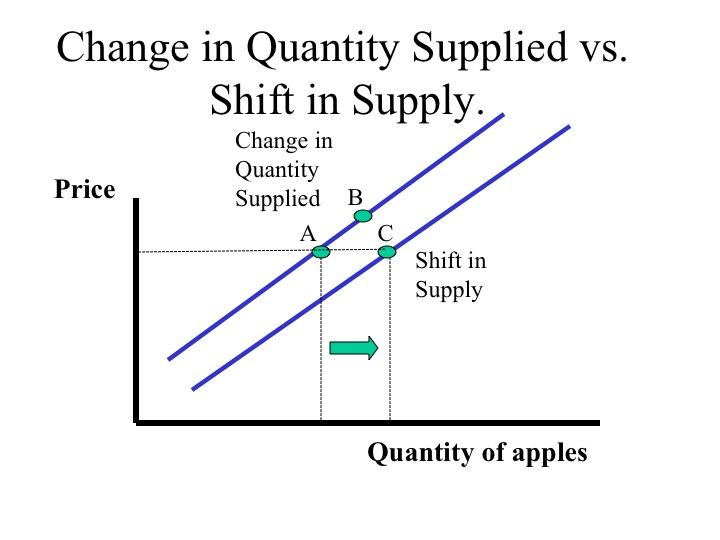

## Table of Contents

## What is quantity supplied?

Quantity supplied is the amount of a product that producers are willing and able to sell at a certain price. It shows how much of a good or service businesses want to offer in the market. The quantity supplied depends on the price of the product. When the price is high, producers are usually willing to supply more because they can make more money. When the price is low, they might supply less because it's not as profitable.

The relationship between price and quantity supplied is shown on a supply curve. This curve usually slopes upward, meaning that as the price goes up, the quantity supplied also goes up. Factors like production costs, technology, and the number of sellers can also affect the quantity supplied. For example, if it costs less to make a product, producers might be willing to supply more of it at any given price.

## How is the supply curve represented graphically?

The supply curve is shown on a graph with two lines that cross each other. The bottom line, called the x-axis, shows the quantity of the product. The side line, called the y-axis, shows the price. The supply curve itself is a line that starts at the bottom left of the graph and goes up to the top right. This shows that when the price is higher, producers want to sell more of the product.

The slope of the supply curve is usually upward. This means that as you move to the right on the x-axis (more quantity), you also move up on the y-axis (higher price). This makes sense because when the price goes up, it's more profitable for producers to make and sell more. If something changes, like the cost to make the product or new technology, the whole supply curve can move. If it's cheaper to make the product, the curve might move to the right, showing that producers will supply more at any price.

## What factors can shift the supply curve?

Several things can make the supply curve move to a different spot on the graph. One big reason is the cost of making the product. If it costs less to make something, like if the price of materials goes down or if a new machine makes it easier to produce, then producers will want to sell more at any price. This makes the supply curve move to the right. On the other hand, if it costs more to make the product, like if workers want more money or if the price of materials goes up, then producers will want to sell less at any price, and the supply curve moves to the left.

Another thing that can shift the supply curve is changes in technology. If new technology makes it easier or faster to make a product, then producers can supply more of it at any price, and the supply curve shifts to the right. Also, the number of sellers in the market can affect the supply curve. If more people start selling the product, the total amount that can be supplied goes up, moving the supply curve to the right. If fewer people are selling, the supply curve moves to the left.

Lastly, government policies and taxes can also change where the supply curve sits. If the government gives money to help producers, like subsidies, it can lower their costs and shift the supply curve to the right. But if the government puts a tax on the product, it raises the cost for producers, and the supply curve shifts to the left. Other things like natural disasters or changes in the weather can also affect how much can be supplied, moving the supply curve around.

## How does the price of a good affect the quantity supplied?

The price of a good has a big effect on how much of it producers want to sell. When the price goes up, it becomes more profitable for producers to make and sell the good. So, they are willing to supply more of it. This is because higher prices mean more money for each item they sell. For example, if a farmer can get more money for each apple, they will want to grow and sell more apples.

On the other hand, when the price goes down, it's less profitable for producers. They might decide to supply less because they won't make as much money for each item. If the price of apples drops, a farmer might choose to grow fewer apples or sell them somewhere else where the price is better. This relationship between price and quantity supplied is shown on a supply curve, which usually slopes upward to show that higher prices lead to a higher quantity supplied.

## What is the difference between a change in quantity supplied and a shift in the supply curve?

A change in quantity supplied happens when the price of a good changes. If the price goes up, producers will want to sell more of the good because they can make more money. If the price goes down, they will sell less because it's not as profitable. This change is shown by moving along the same supply curve. For example, if the price of apples goes up, farmers will grow and sell more apples, and you can see this by moving up and to the right on the supply curve.

A shift in the supply curve, on the other hand, happens when something other than the price of the good changes. This could be things like the cost of making the good, new technology, or the number of sellers in the market. If it costs less to make the good or if new technology makes it easier, the whole supply curve moves to the right, showing that producers will supply more at any price. If it costs more to make the good or if there are fewer sellers, the supply curve moves to the left, showing that producers will supply less at any price. For example, if a new machine makes it easier to grow apples, the supply curve for apples will shift to the right, showing that farmers will grow more apples at any given price.

## How do production costs influence the supply curve?

Production costs are a big deal when it comes to the supply curve. If it costs less to make something, like if the price of materials goes down or if a new way of making things is cheaper, then producers can make more money at any price. This makes them want to sell more of the product. So, the whole supply curve moves to the right. This means that at any price, producers are willing to supply more of the good because it's cheaper for them to make it.

On the other hand, if production costs go up, like if the price of materials goes up or if workers want more money, it's less profitable for producers to make the product. They might not want to sell as much because it costs them more to make each item. This makes the supply curve move to the left. Now, at any price, producers will supply less of the good because it's more expensive for them to produce it.

## What role do technological advancements play in affecting supply?

Technological advancements can really change how much of a product producers can make. If there's a new machine or a better way to make things, it can make it easier and faster to produce stuff. This means that producers can make more of the product without it costing them more money. So, they'll be willing to sell more at any price. This makes the supply curve move to the right, showing that there's more of the product available.

For example, imagine a new machine that helps farmers grow more apples faster. With this machine, they can grow more apples without spending more money. So, they'll want to sell more apples at any price because it's easier for them to grow them. This is how technology can make the supply of a product go up, which is good for both the producers and the people who want to buy the product.

## How do government policies and taxes impact the supply of goods?

Government policies and taxes can change how much of a product producers want to sell. If the government gives money to help producers, like subsidies, it makes it cheaper for them to make the product. This means they can sell more at any price because they're spending less to make it. So, the supply curve moves to the right, showing that there's more of the product available. For example, if the government helps farmers by giving them money to grow wheat, farmers will grow more wheat because it costs them less.

On the other hand, if the government puts a tax on a product, it makes it more expensive for producers to make it. This means they won't want to sell as much because they're not making as much money. So, the supply curve moves to the left, showing that there's less of the product available. For instance, if there's a new tax on cars, car makers might make fewer cars because it costs them more to produce each one. This is how government policies and taxes can affect how much of a product is supplied.

## Can you explain the concept of elasticity of supply?

Elasticity of supply tells us how much the amount of a product that producers want to sell changes when the price changes. If the supply is elastic, it means that even a small change in the price can make a big difference in how much producers want to sell. For example, if the price of apples goes up a little bit, farmers might quickly decide to grow and sell a lot more apples because it's now more profitable. On the other hand, if the supply is inelastic, it means that changes in the price don't make much of a difference in how much producers want to sell. For instance, if it's really hard to grow more apples quickly, farmers won't be able to sell much more even if the price goes up.

What makes supply elastic or inelastic depends on a few things. One big thing is how easy it is to make more of the product. If it's easy to increase production, like with digital goods or simple manufactured items, the supply is usually more elastic. But if it takes a long time to make more of the product, like with wine or certain crops, the supply is more inelastic. Another thing that matters is how much it costs to make more of the product. If it costs a lot more to make more, the supply will be less elastic. Understanding elasticity of supply helps businesses and economists predict how changes in price will affect how much of a product is available in the market.

## How do expectations of future prices affect current supply decisions?

When producers think that the price of a good will go up in the future, they might decide to hold onto some of their products now instead of selling them right away. They do this because they believe they can make more money by selling the product later when the price is higher. For example, if farmers think the price of wheat will be higher next year, they might store some of their wheat now and sell it later. This means that less wheat will be available in the market today, which can make the current supply go down.

On the other hand, if producers expect the price of a good to go down in the future, they might want to sell more of it right now. They do this to make as much money as they can before the price drops. For instance, if car makers think the price of cars will be lower next year, they might try to sell as many cars as they can today. This can make the current supply go up because more cars are being put on the market now. So, what producers think will happen with prices in the future can really change how much they are willing to supply today.

## What are the long-term versus short-term factors affecting supply?

In the short term, things like the cost of materials, sudden changes in technology, or quick shifts in the number of sellers can affect supply. For example, if the price of oil goes up suddenly, it costs more to make things that use oil, so producers might supply less. Also, if there's a new machine that makes it easier to produce a product, producers might quickly start using it to supply more. But in the short term, it's hard to change a lot because it takes time to adjust how much you're making.

In the long term, bigger changes can happen that affect supply more deeply. Things like building new factories, investing in new technology, or changes in government policies can make a big difference. For example, if a company builds a new factory, they can make a lot more of their product over time. Also, if the government changes laws that make it easier or cheaper to produce things, producers can supply more in the long run. These long-term changes take time but can really change how much of a product is available in the market.

## How do global economic conditions influence the supply curve of a product?

Global economic conditions can change how much of a product producers want to sell. If the world economy is doing well, people have more money to spend, so producers might make more of their products to meet the demand. Also, if the cost of materials goes down because of good economic conditions in other countries, it becomes cheaper to make things, so producers can supply more at any price. This makes the supply curve move to the right, showing that there's more of the product available.

On the other hand, if the global economy is struggling, it can make it harder for producers to supply as much. If people around the world have less money to spend, producers might not want to make as much because there won't be as many buyers. Also, if the cost of materials goes up because of bad economic conditions in other countries, it becomes more expensive to make things, so producers might supply less at any price. This makes the supply curve move to the left, showing that there's less of the product available.

## References & Further Reading

[1]: Bergstra, J., Bardenet, R., Bengio, Y., & Kégl, B. (2011). ["Algorithms for Hyper-Parameter Optimization."](https://papers.nips.cc/paper/4443-algorithms-for-hyper-parameter-optimization) Advances in Neural Information Processing Systems 24.

[2]: ["Advances in Financial Machine Learning"](https://www.amazon.com/Advances-Financial-Machine-Learning-Marcos/dp/1119482089) by Marcos Lopez de Prado

[3]: ["Evidence-Based Technical Analysis: Applying the Scientific Method and Statistical Inference to Trading Signals"](https://www.amazon.com/Evidence-Based-Technical-Analysis-Scientific-Statistical/dp/0470008741) by David Aronson

[4]: ["Machine Learning for Algorithmic Trading"](https://github.com/stefan-jansen/machine-learning-for-trading) by Stefan Jansen

[5]: ["Quantitative Trading: How to Build Your Own Algorithmic Trading Business"](https://www.amazon.com/Quantitative-Trading-Build-Algorithmic-Business/dp/1119800064) by Ernest P. Chan