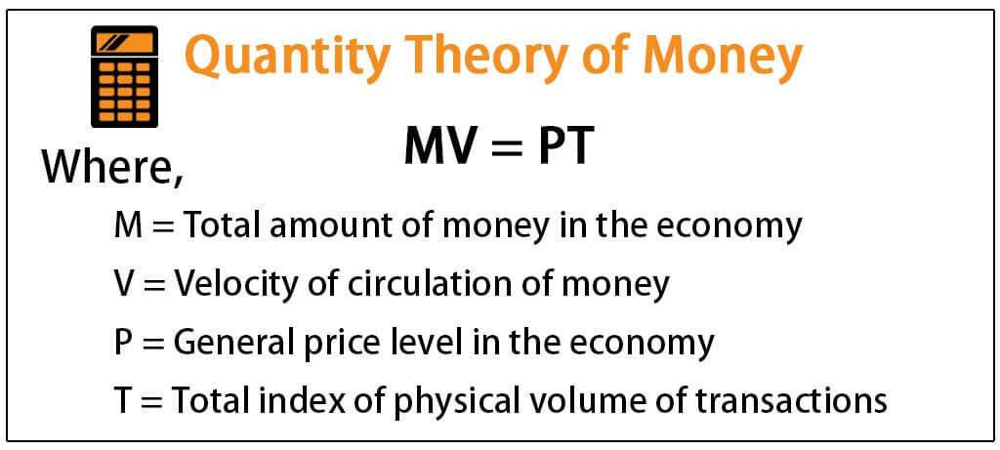

Inflation theory is pivotal in understanding how prices evolve and ensuring the stability of an economy. This subject interlinks with the concepts of money supply, where changes can directly affect inflationary trends. By examining this relationship, we gain insights into how monetary policy is shaped and its subsequent impact on financial markets. 

Quantitative easing, interest rate adjustments, and other monetary interventions are driven by changes in money supply, which can lead to inflation. Central banks closely monitor these dynamics to formulate strategies that balance economic growth and price stability. The connection between money supply and inflation is crucial for determining policy actions that aim to stabilize economies.



In financial markets, these economic shifts influence trading strategies. Algorithmic trading has emerged as a sophisticated tool to manage these complexities. By utilizing preset rules and data-driven models, algorithmic trading provides efficiency and speed in executing trades, allowing investors to swiftly respond to economic changes. This technology integrates economic indicators, including inflation data, into its models to enhance decision-making precision.

Through the exploration of these critical areas, we endeavor to shed light on the fundamental monetary mechanisms that drive economic landscapes and trading environments today. The integration of algorithmic trading into the broader context of monetary economics represents a significant evolution in how financial markets operate and adapt to changing economic policies.

## Table of Contents

## Understanding Inflation Theory

Inflation theory examines the relationship between changes in money supply and price levels within an economy. At the heart of this examination lies the Quantity Theory of Money (QTM), a classical concept that establishes a proportional linkage between money supply and price levels. The fundamental equation of QTM is expressed as:

$$
MV = PQ
$$

where $M$ denotes the money supply, $V$ is the velocity of money (the rate at which money circulates in the economy), $P$ represents the price level, and $Q$ signifies the real output of goods and services—often measured as real GDP. The theory suggests that if the velocity of money and real output are constant, any increase in money supply ($M$) leads directly to a proportional increase in the price level ($P$).

Fisher's quantity theory, often referred to as the Fisher Equation, further clarifies the relationship by addressing interest rates and inflation. It posits that nominal interest rates ($i$) are the sum of real interest rates ($r$) and expected inflation ($\pi$):

$$
i = r + \pi
$$

This theoretical framework helps economists understand how anticipated changes in money supply can influence inflation expectations and nominal interest rates.

Alternative perspectives enrich the discourse on inflation theory. Keynesian economics, for instance, challenges the QTM's assumption of constant velocity. Keynes argued that changes in money supply do not directly translate into price changes because they are mediated by factors like [liquidity](/wiki/liquidity-risk-premium) preference and fiscal policy. John Maynard Keynes emphasized that in the short term, economic output and employment are more significantly influenced by aggregate demand than by money supply alone.

Similarly, Knut Wicksell contributed to inflation theory through the concept of the natural rate of interest, arguing that inflation occurs when the market [interest rate](/wiki/interest-rate-trading-strategies) is below the natural rate, leading to excessive borrowing and spending. This divergence causes demand-pull inflation, where increased demand pushes prices upward.

Understanding these varied theories is crucial for analyzing the scope and effectiveness of monetary policy. By recognizing the interactions between money supply, price levels, and economic output, policymakers can tailor interventions to foster economic stability and growth. Assessing the validity of these theories—especially in periods of economic fluctuation—remains a central task for economists seeking to optimize monetary policy.

## Monetary Economics and Money Supply

Monetary economics examines the influences of monetary elements, such as money supply, on economic growth and stability. A central component of this study is understanding how these elements affect price levels, employment, and output. Central banks, acting as the custodians of monetary policy, deploy several tools to modulate money supply, thereby influencing the broader economy. These tools include interest rates, open market operations, and reserve requirements.

Interest rates are pivotal in controlling the money supply. By adjusting the benchmark interest rates, central banks either encourage borrowing and spending—stimulating economic activity—or they discourage it, aiming to cool down an overheated economy. A lower interest rate reduces the cost of borrowing, increasing the money supply, while a higher rate has the opposite effect.

Open market operations involve the buying or selling of government securities in the open market. When a central bank purchases securities, it injects liquidity into the economy, increasing the money supply. Conversely, selling these securities absorbs money, tightening the supply. This method is crucial for the daily regulation of money supply and for signaling the central bank's monetary policy stance.

Reserve requirements refer to the mandatory reserves a bank must hold, usually as a percentage of its deposits. Altering these requirements can directly influence the lending capacity of commercial banks. Reducing reserve requirements allows banks to lend more, increasing money supply, while increasing them has a contractionary effect.

The expansion or contraction of money supply plays a significant role in shaping economic activity, often resulting in inflation or deflation. Inflation occurs when the money supply grows faster than the economy's ability to produce goods and services, leading to higher prices. Deflation, meanwhile, is often a result of a shrinking money supply, contributing to lower prices and potentially stalling economic growth.

Understanding the intricate relationship between money supply and economic parameters is essential for formulating effective monetary policies. These policies aim not only to control inflation but also to foster conducive conditions for sustainable economic growth. By carefully monitoring money supply and using available monetary tools, central banks strive to maintain economic stability and prevent the adverse effects of inflation and deflation on an economy.

## The Role of Algorithmic Trading in Monetary Economics

Algorithmic trading, commonly referred to as algo-trading, revolutionizes the financial markets by employing computer programs to execute trades with unprecedented efficiency and speed. These programs follow predefined criteria, allowing for faster decision-making and execution compared to traditional trading methods. In the sphere of monetary economics, [algorithmic trading](/wiki/algorithmic-trading) presents a robust framework to address the complex interplay between inflation, money supply, and market dynamics.

One significant advantage of algorithmic trading is its ability to respond swiftly to economic changes, a crucial feature in periods of inflationary fluctuations. When central banks adjust the money supply as a measure of monetary policy, the resulting changes in inflation can create rapid shifts in market prices. Algorithmic systems are designed to process large volumes of data quickly, assimilating economic indicators such as inflation rates to adjust trading strategies on the fly. This capability is particularly vital in environments where inflation data act as key signals for market movements, enabling traders to optimize their portfolios accordingly.

Moreover, integrating economic indicators into algorithmic models enhances the precision of trading decisions. Economic indicators, including inflation rates, gross domestic product (GDP) data, employment [statistics](/wiki/bayesian-statistics), and central bank communications, are instrumental in shaping market expectations and investors' behavior. Algorithms can be programmed to interpret these indicators and adjust trading strategies, leading to more informed decision-making processes. For instance, an algorithm might incorporate a simple rule such as:

```python
def adjust_portfolio(inflation_rate, threshold):
    if inflation_rate > threshold:
        # Strategy for high inflation
        print("Shift investment to inflation-protected assets")
    else:
        # Strategy for low inflation
        print("Maintain current investment strategy")
```

This Python function illustrates a simplified decision-making process that an algorithmic trading model might employ, adjusting investment strategies based on inflation rates exceeding a predefined threshold.

Furthermore, algorithmic trading systems can leverage complex [machine learning](/wiki/machine-learning) models to identify patterns in inflation data and predict future economic trends. These models can discern subtle trends in vast datasets, potentially identifying leading indicators of inflation that human traders might overlook. By doing so, algorithms not only react to current economic conditions but also position traders to anticipate future market developments, capitalizing on opportunities brought about by changes in monetary policy.

In summary, algorithmic trading serves as a crucial instrument within monetary economics, especially in an era where rapid response to inflationary dynamics can yield significant competitive advantages. By harnessing the power of technology to interpret and act upon economic data swiftly, algorithmic trading ensures that market participants remain agile in navigating the financial landscape.

## Interplay Between Inflation, Money Supply, and Trading

Inflation impacts asset prices, which traders, including algorithmic systems, must anticipate to optimize their portfolios. As inflation rises, the purchasing power of money falls, leading to adjustments in asset valuations. Traders need to forecast these changes to make informed decisions about asset allocation and risk management. Algorithms can process large datasets, incorporate economic indicators like Consumer Price Index (CPI) trends, and adjust trading strategies accordingly.

Fluctuations in money supply directly impact market liquidity, influencing trading volumes and [volatility](/wiki/volatility-trading-strategies). An increase in money supply typically lowers interest rates, encouraging borrowing and investing, which can lead to higher asset demand and increased trading activity. Conversely, a decrease in the money supply can tighten liquidity, increasing market volatility as traders reassess their portfolios. These dynamics can be modeled using the equation of exchange in the quantity theory of money, $MV = PT$, where $M$ is the money supply, $V$ is the velocity of money, $P$ is the price level, and $T$ is the transaction [volume](/wiki/volume-trading-strategy).

Traders, particularly those utilizing algorithmic systems, benefit from a robust understanding of monetary theory. Such knowledge allows them to predict policy shifts and adjust strategies accordingly. For instance, central bank decisions on interest rates and open market operations are influenced by inflationary trends and money supply changes. By analyzing these economic indicators through quantitative models, algorithmic traders can preemptively position their portfolios to mitigate risks or capitalize on anticipated market movements.

Incorporating economic forecasts into trading algorithms enhances decision-making by enabling quicker reactions to monetary policy announcements and macroeconomic data releases. Python, a common programming language in algorithmic trading, allows for the development of models that can ingest streams of economic data and simulate various market scenarios. Here's a straightforward example of how traders might use Python to track inflation trends and adjust trading strategies:

```python
import numpy as np
import pandas as pd

# Load economic data
inflation_data = pd.read_csv('inflation_data.csv')  # Sample file

# Calculate moving average of inflation to determine trend
inflation_data['MA_Inflation'] = inflation_data['inflation_rate'].rolling(window=12).mean()

# Define simple strategy: Buy if inflation is predicted to rise above a threshold
def trading_signal(current_inflation, threshold=2.0):
    return 'Buy' if current_inflation > threshold else 'Hold'

# Apply trading strategy
inflation_data['Signal'] = inflation_data['MA_Inflation'].apply(lambda x: trading_signal(x))

print(inflation_data[['date', 'inflation_rate', 'MA_Inflation', 'Signal']].tail())
```
This code outlines a basic strategy where the moving average of inflation is used to generate buy or hold signals depending on set thresholds. Adjusting such thresholds based on deeper monetary insights can significantly enhance trading performance.

In summary, the interplay between inflation, money supply, and trading highlights the importance of understanding economic indicators and their influences on market dynamics. Algorithmic trading systems stand to gain significantly from these insights, enabling them to respond effectively to shifts in economic policies and market conditions.

## Conclusion

Inflation theory illuminates how changes in the money supply trigger price fluctuations, offering critical insights for policymakers and economists as they aim to achieve economic stability. By understanding the intricate relationships between money supply and price levels, stakeholders can better anticipate inflationary trends and respond with appropriate monetary policies. This theoretical framework underpins many decisions regarding interest rates, taxation, and government spending.

Algorithmic trading emerges as a powerful tool within this complex environment, allowing investors to swiftly react to economic changes driven by central bank policies. Algorithms, through predefined criteria and rapid execution, adapt to market conditions that stem from inflationary or deflationary pressures. These systems analyze vast amounts of economic data — including inflation indicators — to make informed trading decisions, significantly enhancing the precision and speed of financial operations.

The continuous study of monetary economics, alongside advancements in algorithmic trading technologies, remains crucial for navigating the modern financial landscape. By integrating robust economic theories with technological innovations, financial actors can better predict and respond to monetary policy shifts, optimize their portfolios, and mitigate risks associated with economic volatility. As economic landscapes evolve, these disciplines collectively foster a deeper understanding of market dynamics, strengthening both policy formulation and investment strategies.

## References & Further Reading

[1]: Fisher, I. (1911). ["The Purchasing Power of Money: Its Determination and Relation to Credit, Interest, and Crises."](https://fraser.stlouisfed.org/title/purchasing-power-money-3610) Macmillan.

[2]: Friedman, M. (1956). ["The Quantity Theory of Money: A Restatement."](https://link.springer.com/chapter/10.1007/978-1-349-19804-7_1) In Studies in the Quantity Theory of Money, University of Chicago Press.

[3]: ["Advances in Financial Machine Learning"](https://www.amazon.com/Advances-Financial-Machine-Learning-Marcos/dp/1119482089) by Marcos Lopez de Prado.

[4]: Bernanke, B. S., & Blinder, A. S. (1992). ["The Federal Funds Rate and the Channels of Monetary Transmission."](https://www.jstor.org/stable/2117350) The American Economic Review.

[5]: ["Quantitative Trading: How to Build Your Own Algorithmic Trading Business"](https://www.amazon.com/Quantitative-Trading-Build-Algorithmic-Business/dp/1119800064) by Ernest P. Chan.

[6]: Keynes, J. M. (1936). ["The General Theory of Employment, Interest, and Money."](https://link.springer.com/book/10.1007/978-3-319-70344-2) Palgrave Macmillan.

[7]: Wicksell, K. (1898). ["Interest and Prices: A Study of the Causes Regulating the Value of Money."](https://mises.org/library/book/interest-and-prices) Macmillan.

[8]: ["Machine Learning for Algorithmic Trading"](https://github.com/stefan-jansen/machine-learning-for-trading) by Stefan Jansen.