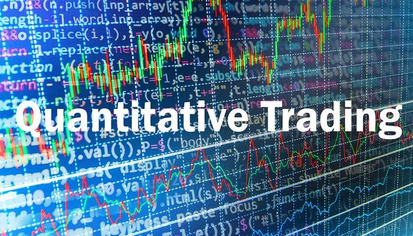

## Table of Contents

## What is quantization in the context of trading?

Quantization in trading refers to the process of converting continuous data into discrete data. In simpler terms, it's like turning a smooth, flowing river into a series of steps or levels. This is important in trading because it helps traders manage and analyze large amounts of data more easily. For example, instead of dealing with every tiny change in a stock's price, traders can group these changes into specific price ranges.

This process is especially useful in high-frequency trading, where computers need to make quick decisions based on large datasets. By quantizing the data, traders can set specific thresholds or levels that trigger buying or selling actions. This makes the trading algorithms simpler and faster, allowing traders to react more quickly to market changes. Overall, quantization helps make complex trading data more manageable and actionable.

## Why is quantization important for traders?

Quantization is important for traders because it makes handling big amounts of data easier. Instead of looking at every tiny change in a stock's price, traders can group these changes into bigger chunks. This helps them see the bigger picture and make decisions more quickly. It's like turning a long, detailed story into a short summary that's easier to understand.

This process is really helpful in fast trading, where computers need to make quick choices. By using quantization, traders can set clear points where they will buy or sell. This makes their trading plans simpler and faster. In the end, quantization helps traders manage and use complex data better, making their trading smoother and more effective.

## What are the basic principles behind quantization methods?

The basic idea behind quantization methods is to take something that changes smoothly and break it into smaller, easier-to-handle pieces. Imagine you have a long rope that you want to measure. Instead of measuring every tiny bit of the rope, you can mark it at regular intervals, like every foot. This way, you turn a continuous measurement into a series of steps. In trading, this means taking the constant flow of price changes and grouping them into specific ranges, making it easier to see patterns and make decisions.

Another principle is about setting clear limits or thresholds. When you quantize data, you decide on certain points where something important happens. For example, if a stock price hits a certain level, it might trigger a buy or sell action. This helps traders create simple rules for their trading strategies. By using these thresholds, traders can react quickly to market changes without getting overwhelmed by all the tiny details. In essence, quantization simplifies complex data into manageable parts, making it easier to act on.

## How do quantization methods differ from traditional trading strategies?

Quantization methods and traditional trading strategies are different in how they handle information. Traditional strategies often look at every little change in prices, trying to make sense of all the details. They might use charts and patterns to decide when to buy or sell. This can be like trying to read a very long book and remember every word. It's detailed but can be hard to keep up with, especially when the market moves fast.

On the other hand, quantization methods take all that detailed information and break it into simpler parts. Instead of focusing on every tiny price change, they group these changes into bigger steps. It's like turning that long book into a short summary. This makes it easier for traders to see the big picture and react quickly. Quantization is especially useful in fast trading, where computers need to make quick decisions based on lots of data. By using quantization, traders can set clear rules for when to buy or sell, making their strategies simpler and more effective.

## What are the common types of quantization methods used in trading?

One common type of quantization method used in trading is uniform quantization. This is where you take a range of prices and split it into equal parts. Imagine you're dividing a chocolate bar into even pieces. If the price of a stock moves from $10 to $11, you might split that dollar into ten equal steps, so each step is worth 10 cents. This helps traders set clear levels for buying or selling. For example, if the price hits $10.50, it might be time to buy.

Another method is non-uniform quantization. This is like cutting the chocolate bar into different-sized pieces based on where you want to focus. In trading, this means setting different step sizes for different price ranges. For example, you might make smaller steps near important price levels, like $10, where a lot of trading happens, and bigger steps where the price doesn't change much. This helps traders pay more attention to the parts of the market that matter most to them.

Both methods help traders turn a continuous flow of price changes into something simpler and easier to work with. By using these quantization methods, traders can create clear rules for their trading strategies, making it easier to react to market changes quickly and effectively.

## Can you explain how time series quantization works in trading?

Time series quantization in trading is like taking a long story and breaking it into short chapters. Instead of looking at every tiny change in a stock's price over time, traders group these changes into bigger time chunks. For example, instead of watching the price every second, they might look at it every minute or every hour. This makes it easier to see patterns and trends without getting lost in all the details. Imagine you're watching a movie and instead of seeing every frame, you see a summary of each scene. That's what time series quantization does with price data.

By using time series quantization, traders can set up clear rules for when to buy or sell based on these time chunks. If the price goes up a certain amount over an hour, it might be a signal to buy. This helps traders make quick decisions without getting overwhelmed by all the tiny price movements. It's like turning a long, detailed report into a short summary that's easy to understand and act on. This method is especially useful in fast trading, where quick decisions based on big data are important.

## What role does machine learning play in quantization methods?

Machine learning helps make quantization methods better by finding the best way to group data into chunks. Imagine you're trying to sort a big pile of different colored marbles into groups. Machine learning can look at all the marbles and figure out the best way to sort them so that each group makes sense. In trading, [machine learning](/wiki/machine-learning) can look at lots of price data and decide the best way to split it into steps or levels. This makes the trading rules clearer and more effective because the computer can find patterns that humans might miss.

By using machine learning, traders can also make their quantization methods adapt to changes in the market. If the market starts behaving differently, the machine learning model can learn from the new data and adjust the quantization steps. This means the trading strategy stays sharp and can react to new trends quickly. It's like having a smart helper that keeps updating the rules to make sure they work well, even when things change.

## How can quantization methods help in risk management?

Quantization methods help in risk management by making it easier to set clear rules for when to buy or sell. Instead of trying to keep track of every tiny change in a stock's price, traders can group these changes into bigger steps. This makes it simpler to decide when a price move is big enough to be risky. For example, if a stock price drops a certain amount within a set time, it might be a signal to sell and cut losses. By using quantization, traders can set these thresholds and manage risk without getting overwhelmed by all the details.

Additionally, quantization helps traders see the bigger picture and react quickly to market changes. By breaking down continuous data into manageable parts, traders can focus on the most important price levels and time periods. This helps them spot trends and potential risks more easily. For instance, if a stock's price starts moving outside of its usual range, quantization can help traders see this quickly and take action to protect their investments. Overall, quantization simplifies complex data, making it easier to manage risk effectively.

## What are the challenges and limitations of applying quantization methods in trading?

One challenge of using quantization methods in trading is that they can miss out on small but important price changes. When you group prices into bigger steps, you might not see the tiny movements that can sometimes signal big shifts in the market. This means traders might miss out on chances to make money or avoid losses. Also, setting the right levels for quantization can be tricky. If the steps are too big, you might not catch important changes, but if they're too small, it can be like not using quantization at all.

Another limitation is that quantization can make trading strategies too simple. The market is full of details, and sometimes these details matter a lot. By turning everything into big steps, you might lose the ability to react to all the little things that can affect prices. Plus, quantization works best when the market behaves in a predictable way. If the market starts to change a lot, the steps you set might not work anymore, and you might need to keep changing them. This can be hard to do quickly and accurately.

## How do advanced quantization techniques like deep learning quantization enhance trading algorithms?

Deep learning quantization helps make trading algorithms smarter and faster. It's like having a super smart friend who can look at a lot of data and find the best way to group it into steps. This friend can keep learning from new data and adjust the steps to make sure they work well, even when the market changes. By using [deep learning](/wiki/deep-learning), traders can create trading rules that are more accurate and can adapt to new trends quickly. This means the algorithms can make better decisions and react to the market faster than before.

But deep learning quantization also has its challenges. It can be hard to understand how the deep learning model makes its decisions because it's like a very complicated puzzle. Also, it needs a lot of data to work well, and sometimes that data can be hard to get. If the market changes a lot, the model might need to keep learning and updating, which can take time and resources. Still, when used right, deep learning quantization can really help traders make smarter and quicker choices in the fast-moving world of trading.

## What are some case studies or real-world applications of quantization methods in trading?

One real-world example of quantization methods in trading is how high-frequency trading firms use them to make quick decisions. These firms deal with huge amounts of data every second, and quantization helps them break this data into manageable chunks. For example, a firm might use uniform quantization to divide price changes into equal steps. If a stock's price moves from $50 to $51, they might split that dollar into ten steps of 10 cents each. This allows the firm to set clear rules for when to buy or sell, making their trading strategies simpler and faster. By using quantization, these firms can react to market changes in milliseconds, which is crucial in high-frequency trading.

Another example comes from algorithmic trading, where traders use non-uniform quantization to focus on important price levels. Imagine a trader who wants to pay more attention to price changes near $100 because that's where a lot of trading happens. They might use smaller steps around $100 and bigger steps elsewhere. This helps them spot trends and make decisions more accurately at key price points. A case study showed that a trading firm using this method was able to improve its trading performance by setting more precise thresholds for buying and selling. This helped them manage risk better and take advantage of market opportunities more effectively.

## How can one evaluate the performance of quantization methods in trading?

To evaluate the performance of quantization methods in trading, you can look at how well they help you make money and manage risk. One way to do this is by checking the profit and loss of your trades. If using quantization helps you make more money or lose less, then it's working well. You can also see if it makes your trading decisions quicker and easier. If you can react to the market faster and with less stress, that's a good sign that quantization is helping.

Another way to evaluate quantization methods is by comparing them to other trading strategies. You might try trading with and without quantization and see which way gives better results. Also, you can look at how often your trading rules based on quantization work. If the steps you set for buying and selling often lead to good outcomes, then the quantization method is effective. Remember, the goal is to make sure quantization helps you understand the market better and make smarter trading choices.

## What are Common Quantization Methods in Algo Trading?

There are several quantization techniques employed in [algorithmic trading](/wiki/algorithmic-trading), each serving different purposes. These techniques are crucial for optimizing data processing and enhancing trading model performance.

**Uniform Quantization**: This technique involves dividing the entire range of data into equal-sized intervals. It is straightforward and computationally efficient, making it suitable for applications where simplicity and speed are prioritized. However, the uniformity in interval size can lead to a loss of precision, especially in datasets where data points are not evenly distributed. As a result, significant information may be lost in regions with high data concentration, affecting the model's overall accuracy.

**Non-uniform Quantization**: Non-uniform quantization uses variable-sized intervals, tailored according to the data distribution. This method allocates more intervals to regions with dense data, allowing for greater precision where it is most needed. By adapting to the underlying distribution of the data, non-uniform quantization minimizes information loss, thereby improving the accuracy of trading algorithms. Techniques such as Lloyd's algorithm or K-means clustering are often employed to determine optimal interval sizes in a non-uniform quantization framework.

**Logarithmic Quantization**: This approach converts data values into a logarithmic scale, which is particularly beneficial when the data range spans several orders of magnitude. Logarithmic quantization compresses a wide range of values into a manageable scale, maintaining relative differences between data points. It is an effective technique for processing financial data characterized by large variances, as it ensures that both small and large values retain significance. This method can often be implemented using a formula of the form:

$$
Q(x) = \text{sign}(x) \cdot \log_b(1 + |x|)
$$

where $b$ is the base of the logarithm, and $x$ represents the data point.

Understanding and implementing these quantization methods can significantly enhance the performance of trading models. By reducing computational loads and improving precision, trading algorithms can operate more efficiently, providing traders with a competitive advantage in rapidly changing markets.

## References & Further Reading

[1]: Gong, D., Xu, Z., & Zhang, Y. (2020). ["A Survey of Quantization Methods for Efficient Deep Learning."](https://pubmed.ncbi.nlm.nih.gov/31967403/) Neurocomputing.

[2]: Krener, A. J. (2000). ["Quantization of Stochastic Filtering."](https://www.math.ucdavis.edu/~krener/) SIAM Journal on Control and Optimization.

[3]: Nielsen, M. A. (2012). ["Neural Networks and Deep Learning"](https://link.springer.com/book/10.1007/978-3-031-29642-0).

[4]: ["Advances in Financial Machine Learning"](https://www.amazon.com/Advances-Financial-Machine-Learning-Marcos/dp/1119482089) by Marcos Lopez de Prado.

[5]: ["Quantitative Trading: How to Build Your Own Algorithmic Trading Business"](https://www.amazon.com/Quantitative-Trading-Build-Algorithmic-Business/dp/1119800064) by Ernest P. Chan.

[6]: Aggarwal, C. C., & Reddy, C. K. (2013). ["Data Clustering: Algorithms and Applications."](https://www.taylorfrancis.com/books/edit/10.1201/9781315373515/data-clustering-chandan-reddy-charu-aggarwal) Chapman and Hall/CRC. 

[7]: Gray, R. M., & Neuhoff, D. (1998). ["Quantization."](https://eecs.umich.edu/courses/eecs651/w03/quantization.pdf) IEEE Transactions on Information Theory.