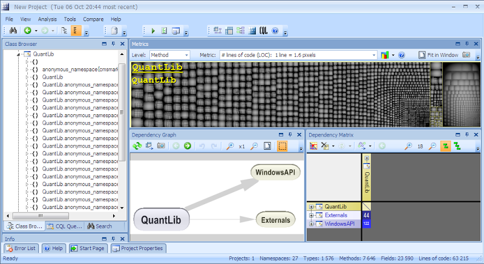

## Table of Contents

## What is QuantLib and what is its primary purpose?

QuantLib is a free, open-source library that helps people who work with financial calculations. It is mainly used by people in banking, investment, and other finance jobs to do complex math related to money and investments. The library includes a lot of tools that can be used to figure out things like how much an investment might be worth in the future, or how risky certain financial products might be.

The main purpose of QuantLib is to give finance professionals a reliable and flexible set of tools to help them make better decisions. By using QuantLib, they can create models and run simulations to understand how different financial scenarios might play out. This helps them to manage risk and plan investments more effectively.

## How can someone get started with installing QuantLib?

To get started with installing QuantLib, you first need to decide which programming language you want to use. QuantLib is mainly written in C++, but there are also versions for Python and other languages. If you choose Python, you can easily install QuantLib using a package manager like pip. Just open a command line and type 'pip install QuantLib' to download and install it. For C++, you'll need to download the source code from the QuantLib website and follow the instructions to compile and install it on your computer.

Once QuantLib is installed, you can start using it in your projects. If you're using Python, you can import the library at the beginning of your script with 'import QuantLib'. Then, you can use its functions and classes to do financial calculations. For C++, you'll need to include the appropriate header files in your code and link against the QuantLib library when you compile your program. There are many examples and tutorials available online to help you learn how to use QuantLib effectively.

## What are the basic components of QuantLib?

QuantLib has many parts that help with financial calculations. The main parts are the date and time tools, which help keep track of when things happen in finance, like when a bond pays interest or when a stock option expires. There are also tools for working with interest rates, which are important for figuring out how much money will grow over time. QuantLib also includes ways to handle different kinds of financial products, like bonds, stocks, and options, so you can study how they might behave in the future.

Another important part of QuantLib is the math tools. These help with the complex calculations needed in finance, like figuring out the value of an option or the risk of an investment. There are also tools for running simulations, which let you see how different scenarios might play out. This can be really helpful for making decisions about where to invest money. All these parts work together to make QuantLib a powerful tool for anyone working in finance.

## Can you explain how to use QuantLib for pricing a simple financial instrument like a bond?

To price a simple financial instrument like a bond using QuantLib, you first need to set up the basic details of the bond. This includes things like the bond's face value, its coupon rate, and the dates when it pays interest. In QuantLib, you can create a bond object and fill in these details. For example, if you have a bond that pays a 5% coupon annually and has a face value of $1000, you would set these values in the bond object. You also need to set up a calendar and a day count convention, which help QuantLib figure out the exact dates and how to calculate the time between them.

Once you have the bond set up, you need to choose a way to price it. This usually involves setting up an interest rate model and a yield curve, which tell QuantLib what interest rates to use for the calculations. You can use something simple like a flat yield curve if you want, or a more complex model if you need to. After setting up the interest rate model, you can tell QuantLib to calculate the bond's price. It will use the bond details, the interest rates, and the time until the bond matures to figure out what the bond is worth today. This can help you decide if the bond is a good investment or not.

## What are the different interest rate models available in QuantLib and how do they differ?

QuantLib offers several interest rate models, each with its own way of figuring out how interest rates might change over time. Some common models include the Black-Karasinski model, the Hull-White model, and the G2++ model. Each model tries to predict how interest rates will move, but they do it in slightly different ways. The Black-Karasinski model, for example, uses a log-normal process to predict interest rates, which means it assumes rates can grow at a rate that changes over time. The Hull-White model, on the other hand, uses a normal process, which means it assumes rates can grow at a steady rate. The G2++ model is more complex and uses two factors to predict rates, which can make it more accurate but also more complicated to use.

These models differ in how they handle the randomness of interest rates and how they fit with real-world data. The Black-Karasinski model is good for situations where interest rates can change a lot, because it can handle big swings in rates. The Hull-White model is simpler and easier to use, making it a good choice for many common situations. The G2++ model is more flexible and can be adjusted to fit different kinds of data, which makes it useful for more complex financial situations. Choosing the right model depends on what you need to do and how much detail you want in your predictions.

## How does QuantLib handle the calibration of models to market data?

QuantLib helps people match their interest rate models to real-world data through a process called calibration. This means adjusting the model so it fits the prices of financial products seen in the market. To do this, QuantLib uses special math tools to find the best values for the model's settings. It looks at things like the prices of bonds or interest rate swaps and tries different settings until the model's predictions match these prices closely. This helps make sure the model's guesses about future interest rates are as accurate as possible.

Calibration in QuantLib can be done in different ways depending on what you need. For example, you might use a method called least squares to find the best fit, or you might use other methods that work better for your specific situation. The key is to keep adjusting the model until its predictions are close to the real market prices. This process can be tricky and might need a lot of computing power, but QuantLib makes it easier by providing tools that do the hard work for you. Once the model is calibrated, you can use it to make better decisions about financial products.

## What are some advanced features of QuantLib for derivatives pricing?

QuantLib has some advanced features that help with pricing derivatives, which are financial products whose value depends on something else, like a stock or an interest rate. One of these features is the ability to use different kinds of models to price options, like the Black-Scholes model or more complex ones like the Heston model. These models can handle things like how much the price of the underlying asset might move around, which is really important for figuring out the value of an option. QuantLib also lets you set up different scenarios to see how an option's price might change if the market does something unexpected, which helps you understand the risks better.

Another advanced feature is the ability to price exotic options, which are more complicated than regular options. Exotic options might have special rules about when they can be used or how their value is calculated. QuantLib has tools to handle these special rules and calculate their prices accurately. For example, it can price barrier options, which only pay out if the price of the underlying asset hits a certain level, or Asian options, which depend on the average price of the asset over time. These features make QuantLib a powerful tool for anyone working with complex financial products.

## How can QuantLib be integrated with other programming languages or tools?

QuantLib can be used with other programming languages and tools to make it even more helpful. For example, if you use Python, you can easily connect QuantLib with other popular libraries like NumPy or Pandas. These libraries help you do math and work with data, so you can use them together with QuantLib to do more complex calculations and analyze financial data better. If you need to show your results in a nice way, you can also connect QuantLib to tools like Jupyter Notebooks, which let you write code and show graphs and charts in the same place.

For people who use other languages like C++, QuantLib can be integrated with tools like R or MATLAB. This is useful if you want to use R's powerful statistics tools or MATLAB's advanced math functions along with QuantLib's finance calculations. By linking these tools together, you can create more complete financial models and simulations. This makes it easier to understand and predict how different financial products might behave in the future.

## What are some common pitfalls or mistakes to avoid when using QuantLib?

When using QuantLib, one common mistake is not setting up the correct date and time conventions. Finance has special rules for counting days and calculating dates, and if you get these wrong, your calculations will be off. Another pitfall is not calibrating your models properly to real market data. If your model doesn't match what's happening in the market, your predictions won't be accurate. This can lead to wrong decisions about investments or financial products.

Another issue to watch out for is using the wrong model for your needs. QuantLib has many different models, and choosing the wrong one can give you bad results. For example, using a simple model when you need a more complex one might not capture all the important details of your financial product. Also, be careful with how you handle errors and exceptions in your code. If you don't manage these well, your program might crash or give you incorrect results without warning you.

## Can you provide examples of real-world applications where QuantLib has been successfully implemented?

QuantLib has been used by many big banks and financial companies to help them make smart choices about money. For example, a bank might use QuantLib to figure out how much a bond or a loan is worth. They can put in details about the bond, like how much it pays and when it matures, and QuantLib will calculate its price. This helps the bank decide if buying or selling the bond is a good idea. Another use is in trading desks, where people buy and sell financial products quickly. They use QuantLib to see how much these products might be worth in different situations, which helps them trade better.

Another real-world use of QuantLib is in risk management. Companies use it to understand how much risk they are taking with their investments. For example, an insurance company might use QuantLib to see how changes in interest rates could affect the value of their investments. By running different scenarios with QuantLib, they can plan for what might happen and make sure they are not taking too much risk. This helps them protect their money and make safer choices.

## How does QuantLib manage computational efficiency and performance optimization?

QuantLib helps make calculations faster by using smart ways to do math. It uses special techniques to make sure the computer does not have to do the same calculations over and over again. For example, it can remember the results of some calculations and use them again later, which saves time. QuantLib also lets you choose different ways to solve problems, so you can pick the one that works best for your computer and the kind of work you are doing. This means you can get results quicker, which is important when you are making decisions about money.

Another way QuantLib keeps things running smoothly is by being careful about how it uses the computer's memory. It tries to use as little memory as possible while still doing all the calculations right. This is important because if a program uses too much memory, it can slow down or even crash. QuantLib also works well with other tools that help with performance, like parallel computing, where different parts of the calculation can be done at the same time on different parts of the computer. This can make the calculations much faster, especially for big and complex financial models.

## What are the latest developments or upcoming features in QuantLib?

QuantLib is always getting better, with new updates and features coming out regularly. One of the latest developments is improving how the library works with different programming languages. This means it's easier to use QuantLib with other tools, like Python or R, to do more complex financial calculations. Another important update is making the library faster and more efficient. The developers are working on new ways to make calculations quicker, so you can get your results faster and make better decisions about money.

In the future, QuantLib plans to add more models for pricing financial products. This will help people in finance to study even more types of investments and understand how they might behave in different situations. There are also plans to make the library easier to use for beginners, with better guides and examples. This way, more people can start using QuantLib to help with their financial work, even if they are not experts in programming or finance.

## References & Further Reading

[1]: Ametrano, F., & Ballabio, L. (2016). ["QuantLib: A Software Framework for Quantitative Finance."](https://www.quantlib.org/) Available at SSRN.

[2]: Hull, J. C. (2017). ["Options, Futures, and Other Derivatives."](https://www.amazon.com/Options-Futures-Derivatives-English-Spanish/dp/1292212896) Pearson Education.

[3]: Black, F., & Scholes, M. (1973). ["The Pricing of Options and Corporate Liabilities."](https://www.jstor.org/stable/1831029) Journal of Political Economy, 81(3), 637-654.

[4]: Glasserman, P. (2003). ["Monte Carlo Methods in Financial Engineering."](https://www.academia.edu/26054760/Monte_Carlo_Methods_In_Financial_Engineering) Springer Science & Business Media.

[5]: Andersen, L., & Piterbarg, V. (2010). ["Interest Rate Modeling. Volume I: Foundations and Vanilla Models."](https://hpcquantlib.wordpress.com/2017/06/05/andersen-piterbarg-integration-limits-for-the-time-dependent-heston-model/) Atlantic Financial Press.

[6]: Wilmott, P. (2007). ["Paul Wilmott Introduces Quantitative Finance."](https://www.wiley.com/en-us/Paul+Wilmott+Introduces+Quantitative+Finance-p-9780471498629) John Wiley & Sons.