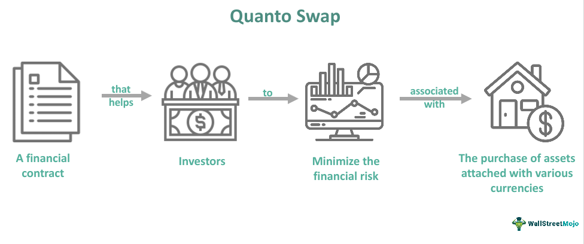

## Table of Contents

## What is a Quanto Swap?

A Quanto Swap is a type of financial agreement where two parties exchange cash flows, but with a twist. Instead of using the usual currency of the asset, the payments are made in a different currency. This is useful when someone wants to invest in a foreign asset but wants to avoid the risk of the foreign currency changing in value.

For example, imagine an investor in the U.S. wants to invest in Japanese stocks but doesn't want to deal with the ups and downs of the Japanese yen. They can enter into a Quanto Swap where the returns from the Japanese stocks are paid to them in U.S. dollars. This way, they can focus on the performance of the stocks without worrying about currency fluctuations.

## How does a Quanto Swap differ from a regular swap?

A Quanto Swap is different from a regular swap mainly because of how it handles currency. In a regular swap, the payments are usually made in the currency of the assets involved. For example, if you're swapping cash flows from U.S. stocks, the payments would be in U.S. dollars. But with a Quanto Swap, the payments are converted into a different currency that the parties agree on. This means you can invest in, say, European stocks but get your payments in U.S. dollars.

This difference in currency handling is what makes Quanto Swaps useful for managing currency risk. If you're worried about how changes in the value of a foreign currency might affect your investment, a Quanto Swap can help. It lets you focus on the performance of the asset itself, without worrying about currency fluctuations. This can be really helpful for investors who want to diversify their portfolios with foreign investments but prefer to keep their cash flows in their home currency.

## What are the primary uses of Quanto Swaps?

Quanto Swaps are mainly used by investors who want to invest in foreign assets without worrying about changes in currency values. For example, an investor from the U.S. might want to invest in European stocks but doesn't want to deal with the ups and downs of the Euro. By using a Quanto Swap, they can get the returns from the European stocks in U.S. dollars. This way, they can focus on how well the stocks are doing without having to think about currency exchange rates.

Another big use of Quanto Swaps is for companies that do business in different countries. These companies might have income in one currency but need to pay expenses in another. A Quanto Swap can help them manage this by converting their foreign income into their home currency. This makes it easier for them to plan their finances because they don't have to worry about how changes in currency values might affect their money.

## Can you explain the basic mechanics of a Quanto Swap?

A Quanto Swap works by letting two people or companies agree to swap cash flows from different investments, but with a special twist: the payments are made in a different currency than the one the investment is in. For example, if someone wants to invest in Japanese stocks but doesn't want to deal with the Japanese yen, they can use a Quanto Swap to get their returns in U.S. dollars instead. This is done by agreeing on a fixed exchange rate at the start of the swap, so the returns from the Japanese stocks are converted to U.S. dollars using this rate.

The basic idea is that one side of the swap gets the returns from a foreign investment, while the other side gets a fixed or variable payment in their home currency. This helps the investor avoid the risk that comes from changes in the value of the foreign currency. For example, if the yen gets weaker compared to the dollar, the investor's returns would normally go down. But with a Quanto Swap, their returns stay the same because they're getting paid in dollars at the fixed exchange rate they agreed on at the start.

## What currencies are typically involved in a Quanto Swap?

In a Quanto Swap, the currencies involved are usually the currency of the asset being invested in and the currency the investor wants to get paid in. For example, if someone wants to invest in European stocks but get paid in U.S. dollars, the swap would involve the Euro and the U.S. dollar. The Euro is the currency of the stocks, and the U.S. dollar is the currency the investor wants to receive.

Common pairs of currencies in Quanto Swaps often include major world currencies like the U.S. dollar, the Euro, the Japanese yen, and the British pound. For instance, an investor might use a Quanto Swap to invest in Japanese stocks and get paid in Euros. This way, they can focus on the performance of the stocks without worrying about how changes in the value of the yen might affect their returns.

## What are the key risks associated with Quanto Swaps?

One big risk with Quanto Swaps is the chance that the other person in the swap might not be able to pay what they owe. This is called counterparty risk. If the person or company you're swapping with runs into money troubles, they might not be able to make the payments you're expecting. This could leave you with less money than you planned on, which can be a big problem.

Another risk is that the value of the foreign investment might go down. Even though a Quanto Swap helps you avoid the risk of the foreign currency changing, it doesn't protect you from the investment itself losing value. If the stocks or bonds you're investing in don't do well, you could still lose money, even if you're getting paid in your home currency.

Lastly, there's the risk of the fixed exchange rate not working out in your favor. When you start a Quanto Swap, you agree on a fixed rate to convert the foreign currency into your home currency. If the actual exchange rate turns out to be better than the fixed rate you agreed on, you could miss out on extra money. This means you might not get as much benefit from the swap as you hoped.

## How is the quanto adjustment calculated in a Quanto Swap?

The quanto adjustment in a Quanto Swap is a special calculation that helps figure out how much money should be paid in the different currency. It's like a correction that makes sure the swap works right. To calculate it, you need to think about how the foreign currency might change compared to the home currency you want to get paid in. You also need to look at how the investment itself is doing. The adjustment is usually based on the difference between the actual exchange rate and the fixed exchange rate you agreed on at the start of the swap.

Let's say you want to invest in Japanese stocks but get paid in U.S. dollars. The quanto adjustment would take into account how the Japanese yen might change compared to the U.S. dollar. If the yen gets weaker, the adjustment would make sure your payments in dollars stay the same, even though the yen's value changed. This way, the quanto adjustment helps keep your returns steady in your home currency, no matter what happens to the foreign currency.

## What are the typical contractual terms in a Quanto Swap agreement?

A Quanto Swap agreement usually includes some basic terms that both parties agree on. One important term is the notional amount, which is the amount of money the swap is based on. Another key term is the fixed exchange rate, which is set at the start of the swap and used to convert the foreign currency into the home currency for payments. The agreement also specifies the start date and the end date of the swap, so everyone knows when the swap begins and when it will end.

In addition to these, the agreement will detail the underlying asset, like stocks or bonds, that the swap is based on. It will also describe how often payments will be made, like monthly or quarterly, and whether these payments will be fixed or variable. The contract will also include terms about what happens if one party can't make the payments, which is called counterparty risk. This helps protect both sides if something goes wrong.

Overall, the goal of these terms is to make sure both parties understand exactly what they're getting into. By setting clear rules about the notional amount, exchange rate, payment schedule, and what to do in case of problems, the Quanto Swap agreement helps investors manage their foreign investments without worrying too much about currency changes.

## How do market conditions affect the pricing of Quanto Swaps?

Market conditions play a big role in how Quanto Swaps are priced. One important factor is the difference between the fixed exchange rate agreed on in the swap and the actual exchange rate in the market. If the actual rate changes a lot, it can make the Quanto Swap more or less valuable. For example, if the foreign currency gets weaker compared to the home currency, the swap might become more valuable because it protects the investor from losing money due to the currency change.

Another thing that affects the pricing is how the underlying asset is doing. If the stocks or bonds that the swap is based on are doing well, the swap might be priced higher because it's linked to a good investment. But if the asset isn't doing well, the swap's price might go down. Also, how much risk there is in the market can change the price. If people think there's a lot of risk, they might want more money to take on that risk, which can make the Quanto Swap more expensive.

## What are the regulatory considerations for engaging in Quanto Swaps?

Engaging in Quanto Swaps involves following rules set by financial regulators to make sure everything is done fairly and safely. These rules can be different depending on where you live. In the U.S., for example, the Commodity Futures Trading Commission (CFTC) and the Securities and Exchange Commission (SEC) have rules about swaps. They want to make sure that people know what they're getting into and that there's enough information available about the swaps. This helps keep the market honest and protects investors from being tricked or losing too much money.

Another thing to think about is that some countries might have special rules for foreign investments. If you're using a Quanto Swap to invest in assets from another country, you might need to follow those rules too. This can include things like reporting your investments to the government or making sure you're not breaking any laws about moving money across borders. It's important to check all the rules in your country and the country of the investment to make sure you're doing everything right.

## How can one hedge the risks associated with Quanto Swaps?

To hedge the risks of Quanto Swaps, you can use other financial tools like options or futures. For example, if you're worried about the foreign currency getting weaker, you can buy options that will pay you if the currency does get weaker. This way, even if the Quanto Swap loses value because of the currency change, the options can help make up for the loss. Another way to hedge is by using futures contracts. These are agreements to buy or sell something at a set price in the future. If you think the underlying asset in your Quanto Swap might go down in value, you can use futures to lock in a good price for that asset, which can protect you from losing money.

Another important way to hedge is by diversifying your investments. Instead of putting all your money into one Quanto Swap, you can spread it out across different types of investments. This way, if something goes wrong with the Quanto Swap, you won't lose everything because you have other investments that might do well. Also, keeping an eye on the market and being ready to make changes to your investments can help manage risk. If you see that the market conditions are changing in a way that might hurt your Quanto Swap, you can adjust your strategy to protect your money.

## What advanced strategies can be employed using Quanto Swaps?

One advanced strategy with Quanto Swaps is to use them to bet on the performance of foreign markets without worrying about currency changes. For example, if you think the stock market in Japan is going to do really well but you're worried about the yen getting weaker, you can use a Quanto Swap to invest in Japanese stocks and get paid in U.S. dollars. This way, you can focus on making money from the stocks without the risk of losing money because the yen changes value. It's like having your cake and eating it too, because you get the benefits of a foreign investment without the currency headache.

Another strategy is to use Quanto Swaps as part of a bigger plan to manage your whole investment portfolio. You can use them to balance out risks in other parts of your investments. For instance, if you have a lot of investments in U.S. dollars and you want to spread your risk to other countries, you can use Quanto Swaps to invest in European stocks but still get paid in U.S. dollars. This way, you're diversifying your investments across different markets, but you're keeping everything in the same currency, which can make it easier to manage your money. By using Quanto Swaps smartly, you can make your overall investment strategy stronger and more flexible.

## References & Further Reading

[1]: ["Understanding Quantos"](https://fastercapital.com/content/Quantos--Quantos--The-Cross-Currency-Exotic-Option-Explained.html) - Global Capital

[2]: ["Quantitative Risk Management: Concepts, Techniques, and Tools"](https://www.amazon.com/Quantitative-Risk-Management-Techniques-Princeton/dp/0691166277) by Alexander J. McNeil, Rüdiger Frey, and Paul Embrechts

[3]: Shapiro, E., Dent, P. (2015). ["Quanto Swaps and Their Pricing"](https://psycnet.apa.org/record/2015-35843-000). Journal of Derivatives

[4]: ["Option Volatility and Pricing: Advanced Trading Strategies and Techniques"](https://www.amazon.com/Option-Volatility-Pricing-Strategies-Techniques/dp/0071818774) by Sheldon Natenberg

[5]: Hull, J. (2021). ["Options, Futures, and Other Derivatives"](https://elibrary.pearson.de/book/99.150005/9781292410623) by John C. Hull

[6]: ["Machine Learning for Financial Engineering"](https://engineering.nyu.edu/sites/default/files/2023-01/Machine_Learning_in_Financial_Engineering_%28FIN-UY_4903%29.pdf) by Masashi Sugiyama, Shohei Shirai, and Jaeho Lee

[7]: Clark, I. (2011). ["Foreign Exchange Option Pricing: A Practitioners Guide"](https://books.google.com/books/about/Foreign_Exchange_Option_Pricing.html?id=7vua-0-2sgMC) by Iain J. Clark