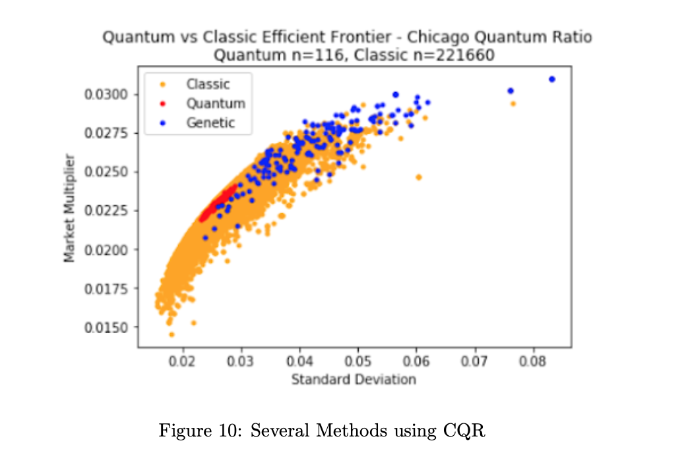

In recent years, the prospect of quantum computing has garnered significant attention from both the scientific community and investors. This burgeoning technology boasts the potential to revolutionize various domains by addressing complex computational challenges. Notably, the finance industry stands to benefit significantly from these advancements, particularly in algorithmic trading, where the need for rapid data processing and complex calculations is paramount.

Quantum computing distinguishes itself from classical computing through its fundamental operational units called 'qubits', which, unlike traditional bits, can exist in multiple states simultaneously, a phenomenon known as superposition. This capability allows quantum computers to perform a vast number of calculations in parallel, potentially solving problems that are currently infeasible for classical systems.



One of the most promising applications of quantum computing in finance is the optimization of processes that classical computers struggle with, such as real-time market data analysis and portfolio management. Algorithmic trading, in particular, could be transformed through enhanced computational speed and efficiency. Quantum algorithms could facilitate the analysis of large datasets and the execution of complex trading strategies much quicker than their classical counterparts.

This article examines the current state of quantum computing, its unique characteristics — such as quantum entanglement and superposition — and assesses its anticipated impact on the algorithmic trading landscape. By understanding these elements, stakeholders can better prepare for the potential paradigm shift that quantum computing represents for the financial sector.

## Table of Contents

## Understanding Quantum Computing

Quantum computing represents a distinctive paradigm in the field of information technology, differentiated from classical computing by its use of quantum bits, or qubits. While classical computers operate with bits that can be in one of two definite states representing 0 or 1, quantum computers leverage the principle of superposition. This principle allows qubits to exist in multiple states at once, effectively representing both 0 and 1 simultaneously. Consequently, this ability facilitates parallel processing, enabling quantum computers to solve complex computational problems at significantly faster rates than classical computers.

The phenomenon of superposition is central to the enhanced processing capability of quantum computers. It allows for the encoding of a large amount of data as compared to classical bits. Mathematically, the state of a single qubit can be denoted as a linear combination: 

$$
|\psi\rangle = \alpha|0\rangle + \beta|1\rangle
$$

where $\alpha$ and $\beta$ are complex numbers that describe the probability amplitudes of the qubit's state being measured as 0 or 1, respectively. The sum of the squares of these amplitudes equals one, ensuring a valid probability distribution.

Quantum entanglement further extends the computational potential of quantum computing. This phenomenon occurs when qubits become interdependent, such that the state of one qubit instantly influences the state of another, irrespective of the distance separating them. Entangled qubits exhibit correlations that are preserved even when they are part of a larger quantum system. The implications of entanglement allow quantum computers to perform operations on an exponentially higher number of states simultaneously, drastically enhancing computational efficiency and leading to faster problem-solving capabilities.

The power of quantum computing, primarily attributed to superposition and entanglement, harnesses these quantum phenomena to process information in novel ways unattainable by classical computing means. As research in quantum computing progresses, its potential applications continue to expand, promising transformative impacts across numerous fields, including cryptography, chemistry, and particularly, [algorithmic trading](/wiki/algorithmic-trading) in the financial sector.

## The Current State and Challenges

Quantum computers, while promising transformative potential across multiple sectors, are still primarily in experimental phases. Their current developmental state means they are not yet capable of executing many of the groundbreaking tasks that developers and researchers have envisioned. A significant obstacle in quantum computing is maintaining the qubits, the fundamental units of quantum information, in environments that are close to absolute zero. Such low temperatures are essential for minimizing thermal noise and other environmental factors that can lead to decoherence—a phenomenon where qubits lose their quantum mechanical properties, making them unstable and unreliable for computations.

Decoherence is particularly problematic because it disturbs the delicate quantum states that quantum computing relies on, such as superposition and entanglement. Quantum states need to be preserved long enough for the computer to perform complex calculations, and this requires not only low temperatures but also precise control over environmental conditions. Achieving and maintaining this level of control is a technical challenge that researchers and engineers are striving to overcome.

Another challenge facing quantum computing is the specificity required in its architecture. Unlike classical computers, which can generally perform a broad array of tasks with a universal architecture, current quantum computers are highly specialized. They often require unique configurations tailored to the particular problem they are solving. This specificity limits their applicability and scalability, as each new problem might necessitate a different architectural setup, making the development of broadly applicable quantum computing machines a significant hurdle.

These challenges, while formidable, are the focal points of ongoing research and development efforts. As the field progresses, overcoming these issues could unlock the expansive potential of quantum computing across various applications, including algorithmic trading and beyond.

## Impact of Quantum Computing on Algorithmic Trading

Quantum computing, with its ability to process complex computations at unprecedented speeds, is poised to significantly influence algorithmic trading. In traditional computing, tasks are often processed sequentially, which can be time-consuming, especially when handling large datasets or complex calculations. Quantum computing offers a transformative advantage by leveraging qubits that operate in superposition, allowing multiple calculations to occur simultaneously. This computational parallelism is particularly beneficial in areas like portfolio optimization, where finding the optimal asset allocation from a vast universe of options can be computationally intensive for classical computers.

### Portfolio Optimization

Portfolio optimization involves selecting the best distribution of assets to achieve specific investment goals, such as maximizing returns while minimizing risk. Quantum computers could efficiently solve this problem by considering numerous possible combinations and evaluating them simultaneously. This contrasts with classical methods, which generally rely on iterative techniques, such as the Markowitz mean-variance optimization. Quantum algorithms, like the Quantum Approximate Optimization Algorithm (QAOA), could potentially outperform these classical methods by yielding faster and possibly more optimal solutions.

### Real-Time Strategy Execution

The high-speed processing capabilities of quantum computers could also enable real-time execution of complex algorithmic strategies. In a market environment where time is often critical, the ability to rapidly process and respond to market changes confers a significant advantage. For instance, high-frequency trading strategies require swift data analysis and decision-making, both of which could benefit from the speed of quantum computing. By processing large datasets more efficiently, traders can deploy strategies that react almost instantaneously to market fluctuations.

### Market Trend Prediction

Predicting market trends is another domain where quantum computing could offer substantial benefits. The capability to analyze vast datasets and model intricate market dynamics can lead to improved predictions and, subsequently, more informed trading decisions. Quantum [machine learning](/wiki/machine-learning) algorithms are being explored to enhance predictive accuracy beyond what is currently possible with classical machine learning techniques. The increased model complexity that quantum computing can handle may unveil patterns and insights that are otherwise unobservable.

### Adaptation of Trading Systems

Though the potential is considerable, fully leveraging quantum computing in algorithmic trading necessitates significant modifications to existing trading systems and strategies. Current algorithmic trading systems are optimized for classical computational architectures and may not automatically benefit from quantum enhancements. Developing new algorithms that can harness quantum capabilities and integrating them into the trading infrastructure is essential. Furthermore, stakeholders must invest in understanding quantum mechanics fundamentals, quantum algorithm development, and the integration of quantum hardware with legacy systems to fully exploit the technology’s advantages.

In conclusion, as quantum computing continues to evolve, its influence on algorithmic trading will likely grow, providing traders with tools to perform complex analyses and execute trades with heightened speed and accuracy. Yet, the transition to quantum-enabled trading will require strategic updates to current methodologies and infrastructures.

## Quantum Computing and Market Analysis

Quantum computing can significantly enhance market analysis by addressing data discrepancies and enhancing predictive models with its unparalleled processing capabilities. Unlike classical computers, which often struggle with data integrity issues and computational limitations, quantum computers can handle vast and complex datasets more efficiently. This capability stems from their ability to process multiple variables simultaneously through superposition and entanglement, allowing financial analysts to gain more profound and accurate insights into market trends.

For instance, quantum algorithms such as the Quantum Approximate Optimization Algorithm (QAOA) can optimize complex portfolio strategies faster and more efficiently than traditional methods. A sample implementation in Python using a quantum computing framework could identify optimal investment strategies under varying market conditions:

```python
from qiskit import Aer, transpile
from qiskit.algorithms import QAOA
from qiskit_optimization.applications.ising import portfolio

# Define problem
problem = portfolio.Portfolio()
qaoa = QAOA(sampler=Aer.get_backend('aer_simulator'))
result = qaoa.solve(problem)

# Output optimized portfolio
print(result)
```

This coincides with the deeper insights provided by quantum computers into market [volatility](/wiki/volatility-trading-strategies), allowing traders to adjust strategies proactively. Quantum computing's concurrent processing offers improved models for predicting market behavior, essential for effective strategy formulation. Enhanced prediction models mean traders can identify subtle market signals and trends that would otherwise be indistinguishable using classical computing, thus improving decision-making processes.

Moreover, the advanced computation ability of quantum systems promises significantly improved risk assessment protocols. Quantum computers' capacity to analyze vast datasets and simulate potential market scenarios with high accuracy augments risk management practices. By offering more precise risk assessments, quantum computing can help financial institutions mitigate adverse outcomes and enhance strategic planning. 

Thus, quantum computing not only improves the granularity of market analysis but also transforms the mechanisms of risk management within financial sectors. However, realizing these enhancements requires transitioning current market analysis tools to integrate with quantum technologies, enabling institutions to fully leverage this transformative power.

## Quantum Computing and Data Security

Quantum computing presents significant implications for data security, particularly concerning widely-used encryption algorithms like RSA. Classical encryption methods rely on the computational difficulty of factoring large numbers—a task that is onerous for classical computers but potentially trivial for quantum computers through Shor's algorithm. This algorithm allows quantum systems to [factor](/wiki/factor-investing) large numbers exponentially faster than the best classical counterparts, posing a substantial threat to encryption methods traditionally considered secure.

As quantum advancement continues, the urgency for developing quantum-resistant encryption becomes paramount. Quantum-resistant, or post-quantum cryptography, involves designing cryptographic algorithms that remain secure even when executed on quantum computers. These algorithms must anticipate and withstand the capabilities of quantum systems, ensuring the confidentiality and integrity of sensitive financial data.

The financial sector, dealing extensively with sensitive transactions, must proactively address these forthcoming security challenges. This involves not only transitioning to quantum-resistant cryptographic protocols but also investing in ongoing research to stay ahead of quantum computing's rapid evolution. Implementing protocols like lattice-based, hash-based, or multivariate polynomial cryptography offers potential solutions. For instance, lattice-based cryptography is believed to be secure against quantum attacks due to the complexity of the lattice problems that underpin its structure.

Furthermore, stakeholders need to undertake comprehensive assessments of their current security infrastructure to identify vulnerabilities to quantum attacks. Strategic planning, combined with investment in quantum-secure technologies, will be essential for ensuring that secure communication remains robust against the evolutionary pressures introduced by quantum computing capabilities. Organizations need to incorporate this quantum-resistant mindset into their cybersecurity roadmaps to maintain data integrity and gain competitive advantages in a future defined by quantum technology.

## Conclusion

Quantum computing represents a transformative potential for the financial industry, particularly by optimizing algorithmic trading processes. Its unique capability to process complex information with exceptional speed and accuracy marks the beginning of a technological revolution in financial services. Quantum computers can solve problems and perform computations that are currently beyond the reach of classical computers, offering unprecedented advantages in areas such as portfolio optimization, real-time data analysis, and risk assessment.

Despite the current challenges—such as maintaining qubits at ultra-low temperatures and preventing decoherence—the trajectory of quantum computing research and development suggests that these obstacles will be addressed over time. As the technology matures, the implications for financial trading strategies and systems are profound. Institutions can exploit quantum algorithms to gain deeper insights into market trends and improve decision-making processes at a pace unattainable by classical computing technologies.

The rapid evolution of quantum computing underscores the importance for traders and organizations to stay informed about advancements in the field. Those who adapt early to integrate quantum computing capabilities may achieve significant competitive advantages. Future financial technologies must be rewritten to accommodate these advancements, ensuring systems are ready to leverage quantum's full potential.

In conclusion, while quantum computing is still in an evolving phase, the groundwork being laid today promises a financial revolution, characterized by enhanced speed, accuracy, and efficiency. By monitoring and preparing for these advancements, financial professionals can ensure they capitalize on the transformative potential of quantum computing.

## References & Further Reading

[1]: Preskill, J. (2018). "Quantum Computing in the NISQ era and beyond." Quantum, 2, 79. [https://quantum-journal.org/papers/q-2018-08-06-79/](https://quantum-journal.org/papers/q-2018-08-06-79/)

[2]: Nielsen, M. A., & Chuang, I. L. (2010). ["Quantum Computation and Quantum Information."](https://www.michaelnielsen.org/qcqi/QINFO-book-nielsen-and-chuang-toc-and-chapter1-nov00.pdf) Cambridge University Press.

[3]: Shor, P. W. (1994). "Algorithms for quantum computation: Discrete logarithms and factoring." Proceedings 35th Annual Symposium on Foundations of Computer Science. IEEE. [https://ieeexplore.ieee.org/document/365700](https://ieeexplore.ieee.org/document/365700)

[4]: Terhal, B. M. (2015). "Quantum error correction for quantum memories." Reviews of Modern Physics, 87(2), 307. [https://journals.aps.org/rmp/abstract/10.1103/RevModPhys.87.307](https://link.aps.org/doi/10.1103/RevModPhys.87.307)

[5]: Arute, F., Arya, K., Babbush, R., et al. (2019). "Quantum supremacy using a programmable superconducting processor." Nature, 574(7779), 505-510. [https://www.nature.com/articles/s41586-019-1666-5](https://www.nature.com/articles/s41586-019-1666-5)

[6]: Farhi, E., Goldstone, J., & Gutmann, S. (2014). "A Quantum Approximate Optimization Algorithm." arXiv preprint arXiv:1411.4028. [https://arxiv.org/abs/1411.4028](https://arxiv.org/abs/1411.4028)

[7]: Montanaro, A. (2016). "Quantum algorithms: an overview." npj Quantum Information, 2(1), 15023. [https://www.nature.com/articles/npjqi201523](https://www.nature.com/articles/npjqi201523)

[8]: Gidney, C., & Ekerå, M. (2021). "How to factor 2048 bit RSA integers in 8 hours using 20 million noisy qubits." Quantum, 5, 433. [https://quantum-journal.org/papers/q-2021-04-15-433/](https://quantum-journal.org/papers/q-2021-04-15-433/)