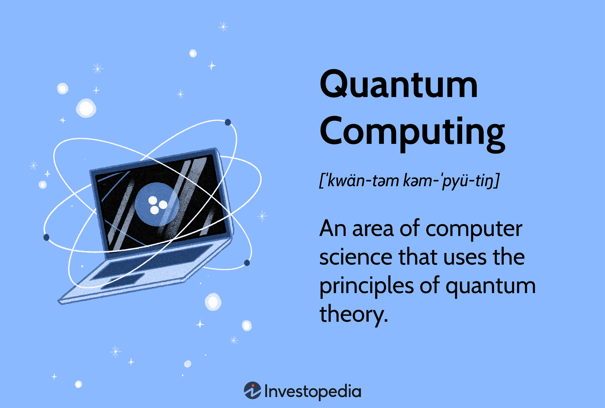

The quantum era of trading has arrived, radically transforming the world of finance. Quantum computing, rooted in the principles of quantum mechanics, is gaining momentum within the field of algorithmic trading. Unlike classical computers that use bits as the smallest unit of data, quantum computers use qubits. Qubits can exist in multiple states simultaneously through a phenomenon known as superposition, allowing them to process information at unprecedented speeds. Additionally, the property of entanglement enables qubits to be linked with one another regardless of the distance separating them, facilitating instant communication. These attributes collectively empower quantum computers to handle complex calculations and large datasets, characteristics that are immensely beneficial in the fast-paced world of financial markets.

Quantum computing's transformative role in trading involves generating data-driven insights and enhancing the accuracy of predictions. By analyzing vast amounts of market data in real-time, algorithmic traders can make more informed decisions, optimizing their strategies and managing risks efficiently. This burgeoning technology also has significant implications for financial data security. Traditional encryption methods may become obsolete in face of quantum computing's capabilities, necessitating the development of quantum-resistant encryption techniques to ensure the safety and confidentiality of financial information.



Exploring these aspects reveals the groundbreaking potential of quantum computing for algorithmic trading. As financial markets continue to evolve, this technology could redefine trading strategies, offering traders unparalleled advantages in market analysis and decision-making processes.

## Table of Contents

## Understanding Quantum Computing

Quantum computing is a burgeoning field of technology that transcends the limitations of classical computers by exploiting the principles of quantum mechanics. Traditional computers operate using bits as the smallest unit of data, which can exist in one of two states: 0 or 1. In contrast, quantum computers utilize qubits, which dramatically expand the computational capabilities through unique quantum properties—superposition and entanglement—endowing them with remarkable potential to solve certain problems exponentially faster than classical computers.

### Qubits and Quantum States

Qubits, or quantum bits, are the basic units of quantum information. Unlike classical bits, a qubit can be in a state similar to a 0, or similar to a 1, or in any quantum superposition of these states. This property is formalized in quantum mechanics by expressing a qubit state as a linear combination of the basis states |0⟩ and |1⟩, represented mathematically as:

$$
|\psi\rangle = \alpha |0\rangle + \beta |1\rangle
$$

where $\alpha$ and $\beta$ are complex numbers that satisfy the normalization condition $|\alpha|^2 + |\beta|^2 = 1$. The coefficients $\alpha$ and $\beta$ determine the probability amplitudes of the qubit being measured in states 0 and 1, respectively.

### Superposition: Enhancing Processing Capabilities

Superposition is one of the cornerstone principles enabling qubits to exist in multiple states simultaneously, vastly enhancing their processing capabilities. This multifaceted existence allows quantum computers to process a significant amount of data at once, leading to potentially exponential improvements in computation speed for specific problems. For instance, while a classical computer would need to evaluate each possible solution serially to solve complex problems, a quantum computer could leverage superposition to evaluate many possible solutions simultaneously.

### Entanglement: A Resource for Rapid Data Processing

Entanglement is another fundamental phenomenon that sets quantum computing apart from classical systems. When qubits become entangled, the state of one qubit directly correlates with the state of another, regardless of the physical distance separating them. This non-classical correlation facilitates quantum communication and computation processes. For example, the measurement of one entangled qubit instantly determines the state of the other, potentially allowing for faster-than-light information transfer at a level abstracted away from classical communication speeds. Entangled qubits thus form the basis for advanced quantum algorithms and protocols that underpin the rapid data processing capabilities of advanced quantum systems.

Quantum computing’s leverage of qubits, superposition, and entanglement not only promises to redefine the boundaries of computational viability but also offers a transformative approach to complex problem solving across various domains, including [algorithmic trading](/wiki/algorithmic-trading), cryptography, and beyond.

## Impact on Trading Technology

Quantum computing signifies a transformative advancement in trading technology, especially concerning market data analysis. The unique capabilities of quantum computing allow it to perform computations that would be impossible or prohibitively time-consuming for classical computers. One of the most significant advantages offered by quantum computing is its enhanced processing power, enabling the analysis of complex datasets in real-time. This capability can dramatically improve decision-making processes for traders, providing them with timely insights and a competitive edge.

The core of quantum computing's benefit lies in its algorithms, which can outperform traditional computational strategies. Quantum algorithms, such as Shor's algorithm and Grover's algorithm, are known for their efficiency in solving particular classes of problems. In the context of trading, these algorithms can generate highly accurate predictions by processing vast amounts of market data quickly and recognizing patterns that classical algorithms might overlook. Furthermore, quantum computing allows for comprehensive risk assessments. By evaluating numerous potential scenarios simultaneously, quantum systems offer more reliable metrics for portfolio management and asset allocation.

As a result, quantum computing fosters an environment where financial markets can benefit from more informed and strategic decisions. Traders equipped with quantum-enhanced tools might anticipate market shifts earlier and adjust their strategies with a precision that was previously unattainable. This ability not only aids in maximizing returns but also in minimizing risks, potentially revolutionizing strategies within algorithmic trading platforms.

In summary, the integration of quantum computing in trading technology stands to substantially enhance the accuracy and efficiency of market data analysis, leading to better-informed decisions and more effective strategic planning. This shift could redefine competitive advantage in financial markets, emphasizing the need for traders and institutions to embrace these advancements.

## Quantum Computing in Algorithmic Trading

Quantum computing offers significant advancements in algorithmic trading by enhancing and refining existing strategies while introducing innovative approaches. One of the key advantages lies in the sophisticated risk management and portfolio optimization quantum computing enables. Traditional models often rely on classical algorithms, which can become computationally expensive and time-consuming, especially when processing large amounts of market data. In contrast, quantum algorithms have the potential to handle complex calculations more efficiently due to their ability to evaluate multiple scenarios simultaneously.

For instance, the application of the Quantum Approximate Optimization Algorithm (QAOA) can improve portfolio optimization by efficiently navigating vast solution spaces to find optimal asset allocations. This capability is crucial for early adopters who are looking to gain a competitive edge in fast-paced financial markets. The inherent parallelism in quantum computing allows for a thorough examination of various market conditions, offering traders a more nuanced understanding of risk factors.

Moreover, quantum computing enables real-time processing of global economic conditions, geopolitical events, and market sentiments—critical factors that influence trading decisions. Classical systems typically process these elements sequentially, potentially leading to delays that affect trading performance. Quantum systems, however, can assess these components concurrently, providing a timely synthesis of diverse market influences. This real-time analysis capability allows traders to adapt swiftly to ever-changing environments, thereby enhancing decision-making processes.

For quantifying this potential, consider the following pseudocode that outlines a simplified quantum approach to analyzing market sentiment:

```python
def analyze_sentiment(data):
    # Define quantum states representing market sentiment
    sentiment_qubits = initialize_qubits(data)

    # Apply quantum transformation to compute sentiment
    transformed_state = quantum_transformation(sentiment_qubits)

    # Measure the result to determine overall market sentiment
    sentiment_score = measure_state(transformed_state)

    return sentiment_score
```

In this scenario, `initialize_qubits` represents the process of mapping classical sentiment data to quantum states, `quantum_transformation` applies transformations typical of quantum algorithms, and `measure_state` retrieves the final sentiment score from the transformed quantum state.

By leveraging such capabilities, traders can develop an acute understanding of complex market dynamics, making informed decisions that were previously unattainable with classical computation alone. As quantum computing continues to mature, its integration into algorithmic trading strategies could fundamentally alter market behaviors, enabling more adaptive and predictive models.

## Data Security in the Quantum Era

Quantum computing has introduced significant challenges to the field of data security, particularly concerning traditional encryption methods. Classical cryptographic systems, which rely primarily on the complexity of mathematical problems for security, such as factoring large prime numbers or computing discrete logarithms, are potentially vulnerable to the advanced capabilities of quantum computers.

A prominent example of this vulnerability is the potential for quantum computers to effectively break widely-used algorithms like RSA or ECC (Elliptic Curve Cryptography) through Shor's Algorithm. Shor's Algorithm provides an exponential speed-up over the best-known classical approaches for factoring integers and computing discrete logarithms, which are the mathematical underpinnings of these cryptographic systems. This capability poses a substantial risk to data privacy and security in financial systems, where large amounts of sensitive data are transmitted and stored.

In response to this threat, the development of quantum-resistant encryption techniques, also known as post-quantum cryptography, has become a critical area of focus. These new cryptographic methods are designed to be secure against both classical and quantum computational threats. Some promising approaches in this domain include lattice-based cryptography, hash-based signatures, code-based cryptography, multivariate quadratic equations, and quantum key distribution.

Lattice-based cryptography, for example, builds security on hard problems related to lattice structures in mathematics. These problems are believed to be resistant to the efficient solutions that quantum computers could provide. Similarly, quantum key distribution (QKD) offers a method for secure communication that enables two parties to produce a shared random secret key, which is secure against any computational attack, given the laws of quantum mechanics.

Implementing these quantum-resistant techniques is essential to ensure that financial transactions remain secure and that sensitive information retains its confidentiality. The integration of these methods into existing financial systems requires careful consideration of performance impacts, regulatory compliance, and the need for standardization across the industry. Organizations like the National Institute of Standards and Technology (NIST) are actively working on standardizing post-quantum cryptographic algorithms to facilitate this transition.

It is crucial for stakeholders in the finance sector to recognize the implications of quantum advancements on data security. Proactive adaptation of quantum-resistant methods will be key to maintaining robust security measures in the quantum era, ensuring the integrity and confidentiality of financial systems worldwide.

## Adapting to Quantum Advances in Trading

Staying abreast of advancements in quantum computing is increasingly important for traders aiming to maintain a competitive edge in the evolving landscape of algorithmic trading. Educational initiatives and partnerships with quantum experts become paramount in equipping traders with the necessary tools and knowledge to harness quantum technology effectively. Engaging with academic institutions, participating in specialized training programs, and attending workshops can help traders understand the intricacies of quantum computing and its applications in finance.

Collaborations with quantum computing firms and researchers can accelerate the adaptation process by providing traders with insights into cutting-edge developments and access to early-stage quantum solutions tailored for financial markets. Such collaborations can facilitate the integration of quantum algorithms into existing trading frameworks, paving the way for more effective strategies in risk management and portfolio optimization.

Furthermore, comprehending the potential for faster transaction processing and sophisticated market analysis is essential. Quantum computing promises to drastically reduce the time taken to analyze large datasets, thereby enabling traders to react more swiftly to market changes. By exploiting quantum algorithms like Grover's and Shor's, which offer faster data retrieval and integer factorization capabilities, traders can enhance their predictive modeling and execute trades with greater speed and accuracy.

Incorporating quantum computing into trading requires not only technical understanding but also a strategic shift in how traders approach market analysis. This involves recognizing the potential of quantum-enhanced [machine learning](/wiki/machine-learning) models, which can discern complex patterns in financial data that are beyond the reach of classical methods. Traders who adapt efficiently will be well-positioned to capitalize on the transformative impact of quantum technology in financial markets.

## Conclusion

Quantum computing stands poised to fundamentally alter the landscape of algorithmic trading, primarily through its exceptional data processing capabilities. As this technology matures, it becomes increasingly clear that the acceleration of computational tasks will redefine strategies that heavily depend on fast and precise data analysis. This shift allows for the quick assessment of vast datasets, which is crucial for spotting trends and making timely decisions in volatile markets.

To remain competitive, traders must not only acknowledge but also integrate quantum computing into their operational frameworks. The unprecedented speeds at which quantum systems can process information represent a transformative opportunity to reevaluate and potentially overhaul existing trading strategies. Moreover, the ability to anticipate shifts in market dynamics hinges on the successful adoption of quantum technologies. These insights, gleaned at speeds previously unattainable, can lead to advantageous positioning and strategic decision-making.

By actively embracing the advantages offered by quantum advances, the trading community can place itself on the cutting edge of technological evolution. This proactive stance is essential for capitalizing on the novel opportunities that quantum computing will introduce, thereby maintaining a competitive edge in this rapidly evolving sector. As the industry progresses, those who adapt swiftly will likely lead in innovation and success, reshaping the future of algorithmic trading.

## References & Further Reading

[1]: Montanaro, A. (2016). ["Quantum algorithms: an overview."](https://www.nature.com/articles/npjqi201523) npj Quantum Information, 2, 15023.

[2]: Shor, P. W. (1997). ["Polynomial-Time Algorithms for Prime Factorization and Discrete Logarithms on a Quantum Computer."](https://arxiv.org/abs/quant-ph/9508027) SIAM Journal on Computing, 26(5), 1484-1509.

[3]: Lloyd, S., & Weedbrook, C. (2016). ["Quantum machine learning with small-scale devices."](https://link.aps.org/doi/10.1103/PhysRevLett.121.040502) Nature, 540(7631), 42-44.

[4]: Nielsen, M. A., & Chuang, I. L. (2010). ["Quantum Computation and Quantum Information: 10th Anniversary Edition."](https://dl.acm.org/doi/book/10.5555/1972505) Cambridge University Press.

[5]: Arute, F. et al. (2019). ["Quantum supremacy using a programmable superconducting processor."](https://www.nature.com/articles/s41586-019-1666-5) Nature, 574, 505-510.

[6]: Farhi, E., Goldstone, J., & Gutmann, S. (2014). ["A quantum approximate optimization algorithm."](https://arxiv.org/abs/1411.4028) arXiv preprint arXiv:1411.4028.

[7]: Grover, L. K. (1996). ["A fast quantum mechanical algorithm for database search."](https://dl.acm.org/doi/10.1145/237814.237866) Proceedings of the twenty-eighth annual ACM symposium on Theory of Computing, 212-219.

[8]: Bernstein, D. J. (2009). ["Post-quantum cryptography."](https://link.springer.com/book/10.1007/978-3-540-88702-7) Springer.

[9]: Preskill, J. (2018). ["Quantum Computing in the NISQ era and beyond."](https://quantum-journal.org/papers/q-2018-08-06-79/) Quantum, 2: 79.