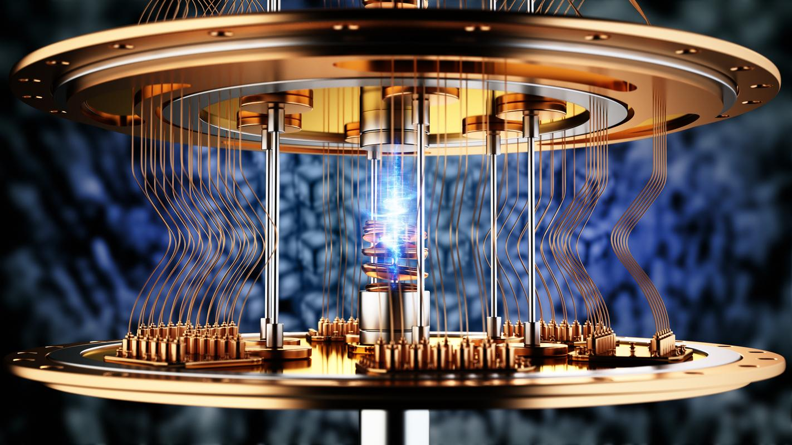

## Table of Contents

## What is quantum computing?

Quantum computing is a new type of computing that uses the rules of quantum mechanics to solve problems. Unlike regular computers that use bits, which are either a 0 or a 1, quantum computers use qubits. Qubits can be both 0 and 1 at the same time, thanks to a special property called superposition. This allows quantum computers to process a lot more information at once than regular computers.

Quantum computing could be really helpful for solving certain types of problems that are too hard for regular computers. For example, they could be used to find new medicines, make better batteries, or help with financial modeling. However, building quantum computers is very hard because qubits are very sensitive to their environment. Scientists are working on making them more stable and practical for everyday use.

## How does quantum computing differ from classical computing?

Quantum computing and classical computing are different in how they process information. Classical computers use bits, which can be either a 0 or a 1. These bits are like tiny switches that are either on or off. Quantum computers, on the other hand, use qubits. Qubits can be both 0 and 1 at the same time, thanks to something called superposition. This means quantum computers can handle much more information at once than classical computers.

Another big difference is how they solve problems. Classical computers solve problems step by step, following a set of instructions. They are great for everyday tasks like browsing the internet or writing documents. Quantum computers can solve certain types of problems much faster because they can explore many solutions at the same time. This makes them potentially very useful for things like finding new medicines or breaking complex codes. However, quantum computers are still hard to build and keep stable, so they're not as common as classical computers yet.

## What are qubits and how do they work?

Qubits are the basic units of information in quantum computing, similar to bits in classical computing. But while bits can only be a 0 or a 1, qubits can be both 0 and 1 at the same time. This is because of a special property called superposition. Superposition lets qubits exist in multiple states at once, which means a quantum computer can do many calculations at the same time.

Qubits also use another property called entanglement. When qubits are entangled, the state of one qubit is directly related to the state of another, no matter how far apart they are. This connection can help quantum computers solve problems even faster. However, qubits are very sensitive and can easily lose their quantum properties if disturbed by things like heat or vibrations, which makes building and using quantum computers challenging.

## What is superposition in quantum computing?

Superposition in quantum computing means that a qubit can be in more than one state at the same time. In normal computers, bits are either a 0 or a 1, but qubits can be both 0 and 1 at once. This is like a coin that is spinning in the air – it's not heads or tails until it lands. Because of superposition, quantum computers can do lots of calculations at the same time, which makes them very powerful.

This ability to be in multiple states helps quantum computers solve certain problems much faster than regular computers. For example, if you need to search through a huge list of items, a quantum computer can look at many possibilities at once, thanks to superposition. However, keeping qubits in superposition is tricky because they can be easily disturbed by their surroundings, like changes in temperature or vibrations.

## What is entanglement and why is it important?

Entanglement is when two or more qubits are connected in a special way. When qubits are entangled, what happens to one qubit affects the other, no matter how far apart they are. It's like if you have two dice and rolling one changes what the other shows, even if they're in different rooms. This connection happens because of the weird rules of quantum mechanics.

Entanglement is important because it helps quantum computers do things much faster than regular computers. When qubits are entangled, they can work together to solve problems in ways that are impossible for normal computers. This makes quantum computers really good at things like breaking codes or finding new medicines. But, keeping qubits entangled is hard because they can easily lose this special connection if something in their environment changes.

## What are some current applications of quantum computing?

Quantum computing is starting to be used in some important areas. One of these is in drug discovery. Scientists can use quantum computers to understand how different molecules work together. This can help them find new medicines faster than with regular computers. Another use is in finance. Quantum computers can help with things like risk analysis and portfolio optimization, which can make financial models more accurate and help people make better investment choices.

Another area where quantum computing is making a difference is in cryptography. Quantum computers could break some of the codes that keep our information safe online. But they can also help create new, stronger codes. This means they can both challenge and improve the way we protect our data. Finally, quantum computing is being used in logistics and optimization problems. For example, it can help find the best routes for delivery trucks, which can save time and money.

## What are the main challenges in developing quantum computers?

One big challenge in developing quantum computers is keeping qubits stable. Qubits are very sensitive and can lose their special quantum properties if they are disturbed by things like heat, vibrations, or electromagnetic waves. This problem is called decoherence. Scientists are working hard to find ways to protect qubits from these disturbances, like building better shields or cooling systems. But it's still a big challenge that needs more research and new ideas.

Another challenge is making quantum computers bigger and more practical. Right now, most quantum computers are small and can only do a few things. To make them useful for solving real-world problems, we need to connect many more qubits together. This is hard because as you add more qubits, it becomes even harder to keep them all stable and working together. So, scientists are trying to find new ways to build and control large numbers of qubits to make quantum computers more powerful and useful.

Lastly, there's the challenge of making quantum computers easier to use. Right now, they need special conditions and a lot of technical know-how to operate. To make them more accessible, we need to develop better software and tools that can help people use quantum computers without needing to be experts in quantum physics. This means creating user-friendly interfaces and programs that can translate regular problems into quantum-friendly ones. It's a lot of work, but it's important for making quantum computing a part of everyday life.

## What is quantum supremacy and has it been achieved?

Quantum supremacy is when a quantum computer can do a task much faster than any regular computer. It's like showing that quantum computers can do things that are too hard for normal computers. Scientists wanted to prove this to show how powerful quantum computers could be.

In 2019, Google said they achieved quantum supremacy. They used their quantum computer to do a calculation in just 200 seconds that they said would take the world's best regular computer about 10,000 years. But some people argue about whether this really counts as quantum supremacy. They say the task Google did might not be very useful in real life. Still, it was a big step in showing what quantum computers can do.

## How do quantum algorithms like Shor's and Grover's work?

Shor's algorithm is a way to quickly break certain types of codes, like RSA encryption, which is used to keep information safe online. It works by using the special properties of quantum computers, like superposition and entanglement. When you want to break a code, you need to find the factors of a big number. Shor's algorithm can do this much faster than a regular computer. It does this by turning the problem into a quantum problem and then using the power of qubits to find the answer. If quantum computers become common, Shor's algorithm could change how we keep our information safe.

Grover's algorithm is another important quantum algorithm, but it's used for searching through lists. Imagine you have a huge list of items and you need to find one specific item. A regular computer would have to check each item one by one, which could take a long time. Grover's algorithm uses quantum computing to search the list much faster. It does this by putting the list into a quantum state and then using the power of qubits to find the item you're looking for. This makes searching through big lists much quicker, which can be useful in things like database searches or finding the best solution to a problem.

## What are quantum error correction and fault-tolerant quantum computing?

Quantum error correction is like a safety net for qubits. Qubits are very sensitive and can easily lose their quantum properties because of things like heat or noise. This is called decoherence. To stop this from happening, scientists use extra qubits to check and fix errors. It's like having backup dancers who help the main dancer stay in step. By using these extra qubits, quantum computers can keep working even when things go wrong, which is really important for making them reliable.

Fault-tolerant quantum computing takes this idea even further. It means building a quantum computer that can keep working even if some parts of it fail. Imagine a team where some players can get tired or injured, but the team keeps playing well because others step in. In fault-tolerant quantum computing, the computer can handle small errors without breaking down completely. This is crucial for making quantum computers useful for solving big, real-world problems because it helps them stay stable and accurate over long periods of time.

## What is the current state of quantum computing hardware?

Right now, quantum computing hardware is still in its early stages. Companies like Google, IBM, and others are making quantum computers, but they're small and can only do a few things. These computers use different ways to make qubits, like using super-cold temperatures or special particles called ions. The biggest challenge is keeping the qubits stable because they can easily lose their quantum properties if they get too warm or are bumped around. Scientists are working on better ways to protect qubits, like building stronger shields or using better cooling systems.

Even though quantum computers are small now, they're getting better. They can do some tasks faster than regular computers, but they're not ready for everyday use yet. Researchers are trying to make bigger quantum computers by connecting more qubits together. This is hard because as you add more qubits, it gets even harder to keep them all working well. But with more research and new ideas, scientists hope to make quantum computers more powerful and useful for solving real-world problems soon.

## What future developments can we expect in quantum computing?

In the future, we can expect quantum computers to get much better and more useful. Scientists are working on making qubits more stable so they can keep their quantum properties longer. This means quantum computers will be able to do more complex tasks without breaking down. They're also trying to build bigger quantum computers by connecting more qubits together. This will make them powerful enough to solve big problems in areas like medicine, finance, and even space exploration. As these technologies improve, quantum computers might become as common as regular computers are today.

Another thing we can look forward to is better software for quantum computers. Right now, using a quantum computer is hard and needs a lot of special knowledge. But in the future, there will be easier ways to use them, with user-friendly programs and tools. This will make it possible for more people to use quantum computers for all sorts of things, from finding new drugs to solving tricky math problems. As quantum computing grows, it could change the world by helping us solve problems that are too hard for regular computers.

## What is Understanding Quantum Computing?

Quantum computing is a burgeoning field of technology that transcends the limitations of classical computers by exploiting the principles of quantum mechanics. Traditional computers operate using bits as the smallest unit of data, which can exist in one of two states: 0 or 1. In contrast, quantum computers utilize qubits, which dramatically expand the computational capabilities through unique quantum properties—superposition and entanglement—endowing them with remarkable potential to solve certain problems exponentially faster than classical computers.

### Qubits and Quantum States

Qubits, or quantum bits, are the basic units of quantum information. Unlike classical bits, a qubit can be in a state similar to a 0, or similar to a 1, or in any quantum superposition of these states. This property is formalized in quantum mechanics by expressing a qubit state as a linear combination of the basis states |0⟩ and |1⟩, represented mathematically as:

$$
|\psi\rangle = \alpha |0\rangle + \beta |1\rangle
$$

where $\alpha$ and $\beta$ are complex numbers that satisfy the normalization condition $|\alpha|^2 + |\beta|^2 = 1$. The coefficients $\alpha$ and $\beta$ determine the probability amplitudes of the qubit being measured in states 0 and 1, respectively.

### Superposition: Enhancing Processing Capabilities

Superposition is one of the cornerstone principles enabling qubits to exist in multiple states simultaneously, vastly enhancing their processing capabilities. This multifaceted existence allows quantum computers to process a significant amount of data at once, leading to potentially exponential improvements in computation speed for specific problems. For instance, while a classical computer would need to evaluate each possible solution serially to solve complex problems, a quantum computer could leverage superposition to evaluate many possible solutions simultaneously.

### Entanglement: A Resource for Rapid Data Processing

Entanglement is another fundamental phenomenon that sets quantum computing apart from classical systems. When qubits become entangled, the state of one qubit directly correlates with the state of another, regardless of the physical distance separating them. This non-classical correlation facilitates quantum communication and computation processes. For example, the measurement of one entangled qubit instantly determines the state of the other, potentially allowing for faster-than-light information transfer at a level abstracted away from classical communication speeds. Entangled qubits thus form the basis for advanced quantum algorithms and protocols that underpin the rapid data processing capabilities of advanced quantum systems.

Quantum computing’s leverage of qubits, superposition, and entanglement not only promises to redefine the boundaries of computational viability but also offers a transformative approach to complex problem solving across various domains, including [algorithmic trading](/wiki/algorithmic-trading), cryptography, and beyond.

## References & Further Reading

[1]: Montanaro, A. (2016). ["Quantum algorithms: an overview."](https://www.nature.com/articles/npjqi201523) npj Quantum Information, 2, 15023.

[2]: Shor, P. W. (1997). ["Polynomial-Time Algorithms for Prime Factorization and Discrete Logarithms on a Quantum Computer."](https://arxiv.org/abs/quant-ph/9508027) SIAM Journal on Computing, 26(5), 1484-1509.

[3]: Lloyd, S., & Weedbrook, C. (2016). ["Quantum machine learning with small-scale devices."](https://link.aps.org/doi/10.1103/PhysRevLett.121.040502) Nature, 540(7631), 42-44.

[4]: Nielsen, M. A., & Chuang, I. L. (2010). ["Quantum Computation and Quantum Information: 10th Anniversary Edition."](https://dl.acm.org/doi/book/10.5555/1972505) Cambridge University Press.

[5]: Arute, F. et al. (2019). ["Quantum supremacy using a programmable superconducting processor."](https://www.nature.com/articles/s41586-019-1666-5) Nature, 574, 505-510.

[6]: Farhi, E., Goldstone, J., & Gutmann, S. (2014). ["A quantum approximate optimization algorithm."](https://arxiv.org/abs/1411.4028) arXiv preprint arXiv:1411.4028.

[7]: Grover, L. K. (1996). ["A fast quantum mechanical algorithm for database search."](https://dl.acm.org/doi/10.1145/237814.237866) Proceedings of the twenty-eighth annual ACM symposium on Theory of Computing, 212-219.

[8]: Bernstein, D. J. (2009). ["Post-quantum cryptography."](https://link.springer.com/book/10.1007/978-3-540-88702-7) Springer.

[9]: Preskill, J. (2018). ["Quantum Computing in the NISQ era and beyond."](https://quantum-journal.org/papers/q-2018-08-06-79/) Quantum, 2: 79.