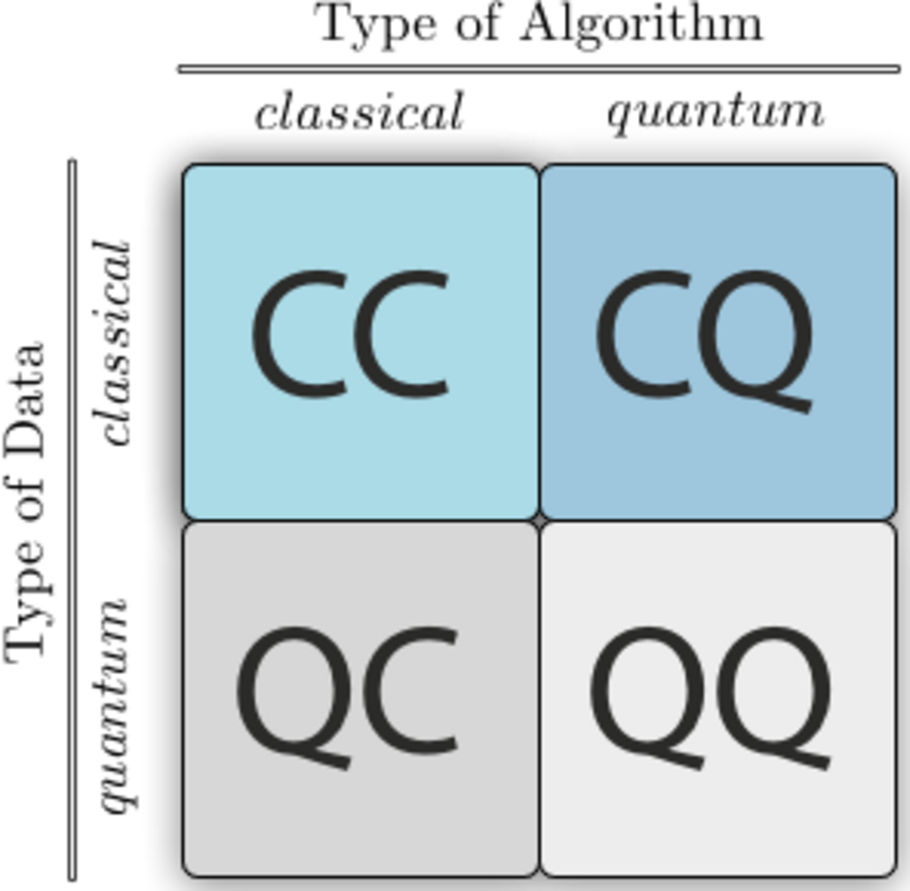

## Table of Contents

## What are quantum methods in the context of machine learning?

Quantum methods in machine learning involve using principles from quantum mechanics to enhance or speed up machine learning algorithms. These methods take advantage of quantum computing's ability to process information in ways that classical computers cannot. For example, quantum computers can handle multiple states at once, a property known as superposition. This allows them to perform certain calculations much faster than classical computers. In machine learning, this can be used to solve complex optimization problems more efficiently or to process large datasets more quickly.

One common application of quantum methods in machine learning is in the field of quantum machine learning algorithms. These algorithms use quantum circuits to perform tasks like classification or regression. For instance, a quantum support vector machine might use quantum states to represent data points and quantum operations to find the best hyperplane that separates different classes. This approach can potentially lead to faster training times and better performance on certain types of data. However, quantum machine learning is still a developing field, and practical implementations face challenges due to the current limitations of quantum hardware.

Another area where quantum methods are applied is in quantum-enhanced classical algorithms. These are traditional machine learning algorithms that are improved by using quantum techniques. For example, quantum-inspired classical algorithms might use ideas from quantum mechanics, like entanglement or superposition, to design more efficient classical algorithms. These methods do not require actual quantum computers but can still benefit from quantum concepts to improve performance. As quantum technology continues to advance, the integration of quantum methods into machine learning is expected to grow, potentially leading to significant breakthroughs in the field.

## How do quantum methods differ from classical machine learning techniques?

Quantum methods in machine learning use ideas from quantum physics to do things that regular computers can't. Regular computers, or classical computers, work with bits that are either 0 or 1. But quantum computers use qubits, which can be 0 and 1 at the same time, thanks to something called superposition. This lets quantum computers do many calculations at once, which can make them faster at solving certain problems. In machine learning, this means quantum methods can potentially find patterns in data much quicker than classical methods.

Another big difference is how quantum methods handle information. Classical machine learning algorithms use traditional math to process data, but quantum methods use quantum operations. For example, quantum algorithms can use entanglement, where qubits are connected in ways that affect each other, to process data in new ways. This can help with tasks like optimization, where you're trying to find the best solution among many possibilities. While classical machine learning has been around for a long time and is widely used, quantum methods are still new and mostly experimental, but they show a lot of promise for the future.

Overall, quantum methods offer a different way of thinking about and solving machine learning problems. They can potentially do things faster and in ways that classical methods can't. But because quantum computers are still being developed, these methods are not as practical yet. As quantum technology gets better, we might see more use of quantum methods in machine learning, leading to new breakthroughs and improvements in how we process and understand data.

## What is gCANS and how does it apply to machine learning?

gCANS stands for generalized Canonical Correlation Analysis for Nonlinear Systems. It's a method used in machine learning to find relationships between different sets of data. Imagine you have two sets of information, like the height and weight of people. gCANS helps you see how these two sets are connected, even if the relationship is not a straight line but something more complex.

In machine learning, gCANS can be useful for tasks like data fusion, where you want to combine information from different sources to make better predictions or understand patterns better. For example, if you're trying to predict stock prices, you might use gCANS to combine data from stock market trends and news articles. By understanding how these different types of data relate to each other, you can create more accurate models. While gCANS is a bit more complicated than some other methods, it's powerful because it can handle nonlinear relationships, which are common in real-world data.

## Can you explain the basic principles behind VQSVD?

VQSVD stands for Variational Quantum Singular Value Decomposition. It's a way to use quantum computers to break down big sets of data into smaller, easier-to-understand pieces. Think of it like taking a big puzzle and figuring out how to put it together by looking at smaller parts. In regular computers, this process can be slow and hard, especially with huge amounts of data. But with quantum computers, VQSVD can do this much faster because it uses the special abilities of quantum mechanics.

The main idea behind VQSVD is to use something called a variational quantum circuit. This is like a set of instructions that the quantum computer follows to process the data. The circuit tries different ways of breaking down the data until it finds the best way. It's a bit like trying different keys in a lock until you find the one that fits perfectly. By doing this, VQSVD can help find patterns and connections in data that might be hard to see otherwise. This makes it a powerful tool for things like machine learning, where understanding data is key.

## What are the advantages of using VTDE in quantum machine learning?

VTDE, or Variational Tensor Decomposition and Encoding, is a method used in quantum machine learning to handle and process large amounts of data more efficiently. It works by breaking down big sets of data into smaller, more manageable parts, which can then be processed using quantum computers. This approach is helpful because quantum computers can do many calculations at once, thanks to a concept called superposition. By using VTDE, quantum machine learning algorithms can work with complex data structures more easily and find patterns that might be hard to see with regular computers.

One big advantage of VTDE is that it can help reduce the number of qubits needed to process data. Qubits are the basic units of information in quantum computers, and they can be hard to keep stable. By breaking down data into smaller parts, VTDE can make it possible to use fewer qubits while still getting good results. This makes quantum machine learning more practical and easier to implement with current quantum technology. Overall, VTDE helps make quantum machine learning more efficient and effective, opening up new possibilities for handling big data and solving complex problems.

## How does Variational Entanglement Detection work in quantum systems?

Variational Entanglement Detection is a method used to figure out if particles in a quantum system are entangled. Entanglement is a special kind of connection between particles where what happens to one affects the other, no matter how far apart they are. This method uses a special kind of quantum circuit called a variational quantum circuit to test for entanglement. The circuit tries different ways to measure the particles until it finds the best way to see if they are entangled. It's like trying different keys in a lock until you find the one that fits.

To do this, the variational quantum circuit uses something called a parameterized quantum circuit. This circuit has knobs you can turn, which change how the circuit works. By turning these knobs and seeing how the measurements change, the circuit can find the best settings to detect entanglement. This method is helpful because it can work with the kinds of quantum computers we have now, which are not perfect but are getting better. By using variational entanglement detection, scientists can learn more about how particles are connected in quantum systems, which is important for building better quantum computers and using them for things like machine learning.

## What are the practical applications of quantum methods in machine learning?

Quantum methods in machine learning can help make computers work faster and better at understanding data. One way they do this is by using quantum computers, which can do many calculations at the same time. This is called superposition. For example, quantum methods can be used to quickly find patterns in big sets of data, like figuring out what customers might buy next based on what they've bought before. They can also help with making predictions more accurate, like guessing how the stock market might move. By using quantum methods, machine learning can solve problems that are too hard or take too long for regular computers.

Another practical use of quantum methods in machine learning is in areas like drug discovery and material science. Scientists can use quantum computers to simulate how molecules behave, which helps them design new drugs or materials faster. For example, they can use quantum machine learning to predict how a new drug will interact with the body. This can save a lot of time and money compared to traditional methods. Quantum methods are still new and not perfect, but as quantum computers get better, these applications will become more common and useful.

## How can quantum methods enhance the performance of neural networks?

Quantum methods can help neural networks work faster and better. In regular computers, neural networks process information one step at a time. But quantum computers can handle many steps at once, thanks to a special ability called superposition. This means they can train neural networks much quicker. For example, when a neural network is learning to recognize pictures, a quantum computer can try many different ways of recognizing the pictures at the same time. This can lead to finding the best way to recognize pictures faster than a regular computer.

Another way quantum methods can improve neural networks is by handling complex patterns in data. Sometimes, the relationships between different pieces of data are not simple and straight, but twisty and hard to see. Quantum computers can use something called entanglement to understand these twisty relationships better. This can make neural networks more accurate at predicting things, like guessing what someone might buy next based on what they've bought before. As quantum computers get better, they could make neural networks even more powerful and useful in everyday life.

## What are the current challenges in implementing quantum methods for machine learning?

One big challenge in using quantum methods for machine learning is that quantum computers are still new and not perfect. They can make mistakes because of something called noise, which is like static on a radio. This noise can mess up the calculations and make it hard to get good results. Also, quantum computers need a lot of qubits to do useful work, but keeping qubits stable and working together is really hard. Scientists are working on making quantum computers better, but right now, they are not as reliable as regular computers.

Another challenge is that the algorithms we use for quantum machine learning are still being developed. We need to figure out the best ways to use quantum computers to do things like training neural networks or finding patterns in data. This means a lot of research and trying different ideas to see what works best. Plus, even when we have good algorithms, they might need to be changed to work well with the quantum computers we have now, which are not perfect. So, it's a bit like trying to solve a puzzle where the pieces keep changing shape.

## How do you compare the efficiency of quantum methods like gCANS and VQSVD?

gCANS, or generalized Canonical Correlation Analysis for Nonlinear Systems, and VQSVD, or Variational Quantum Singular Value Decomposition, are both quantum methods used in machine learning, but they work in different ways and have different strengths. gCANS is good at finding connections between different sets of data, even if those connections are not simple. It's like trying to understand how the weather might affect ice cream sales, where the relationship is not a straight line but more complicated. gCANS can handle this kind of twisty relationship well, but it needs a lot of data to work right and can be slow on regular computers. On a quantum computer, gCANS can be faster because it can look at many different ways the data might be connected at the same time.

VQSVD, on the other hand, is about breaking down big sets of data into smaller, easier-to-understand pieces. Imagine you have a huge puzzle, and you want to figure out how to put it together. VQSVD helps by taking the puzzle apart into smaller parts that are easier to work with. This method can be very fast on a quantum computer because it uses the power of superposition to try many different ways of breaking down the data at once. But VQSVD also needs a lot of qubits to work well, and keeping qubits stable is hard. So, while VQSVD can be very efficient, it's still limited by the current state of quantum technology.

In simple terms, gCANS is great for finding complex relationships in data, and VQSVD is excellent for breaking down big data into smaller parts. Both methods can be much faster on a quantum computer than on a regular one, but they face challenges because quantum computers are still new and not perfect. As quantum technology improves, these methods could become even more useful and efficient in machine learning.

## What future developments can we expect in quantum machine learning?

In the future, we can expect big improvements in quantum machine learning as quantum computers get better. Right now, quantum computers are not perfect and can make mistakes because of noise. But scientists are working hard to make them more reliable. As they do this, quantum machine learning methods like gCANS and VQSVD will become more useful. They'll be able to handle bigger and more complex data sets much faster than regular computers. This could help us solve problems in areas like drug discovery, where understanding how molecules work together is key, or in finance, where predicting stock prices can be very hard.

Another thing we might see is new quantum algorithms being developed. These algorithms will be made to work well with the quantum computers we have now, even though they're not perfect. For example, variational quantum circuits will become more common because they can be adjusted to deal with the noise in quantum computers. As these algorithms get better, they'll make quantum machine learning more practical for everyday use. This means businesses and researchers could use quantum computers to make better predictions and find patterns in data that are too hard for regular computers to see.

## How can one start learning and experimenting with quantum methods in machine learning?

To start learning about quantum methods in machine learning, you can begin by studying the basics of quantum computing and machine learning separately. There are many online courses and resources that can help you understand how quantum computers work, like the concepts of superposition and entanglement. Websites like edX and Coursera offer free courses on quantum computing from universities like MIT and the University of Toronto. For machine learning, platforms like Kaggle and tutorials on TensorFlow or PyTorch can give you a good start. Once you have a basic understanding of both fields, you can move on to more specialized resources that focus on combining quantum computing with machine learning.

To experiment with quantum methods, you can use software simulators that mimic quantum computers. One popular tool is Qiskit, which is an open-source framework developed by IBM. You can use Qiskit to write and run quantum circuits on a simulator or even on real quantum computers if you have access to them. Here's a simple example of a quantum circuit in Qiskit:

```python
from qiskit import QuantumCircuit, execute, Aer

# Create a quantum circuit with 2 qubits
qc = QuantumCircuit(2, 2)

# Apply a Hadamard gate to the first qubit
qc.h(0)

# Apply a CNOT gate with the first qubit as control and the second as target
qc.cx(0, 1)

# Measure both qubits
qc.measure([0,1], [0,1])

# Execute the circuit on a simulator
backend = Aer.get_backend('qasm_simulator')
job = execute(qc, backend, shots=1000)
result = job.result()

# Get the counts
counts = result.get_counts(qc)
print(counts)
```

This code creates a simple quantum circuit and runs it on a simulator. As quantum technology improves, more tools and libraries will become available, making it easier to experiment with quantum methods in machine learning.