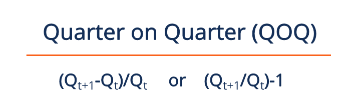

## Table of Contents

## What is Quarter-on-Quarter (QoQ) analysis?

Quarter-on-Quarter (QoQ) analysis is a way to compare how a business or economy is doing from one three-month period to the next. It helps people see if things are getting better or worse over time by looking at changes in numbers like sales, profits, or other important measures. For example, if a company made more money this quarter than last quarter, that's a positive QoQ change.

This type of analysis is useful because it can show short-term trends that might not be clear if you only look at yearly data. It's especially helpful for businesses that want to make quick decisions or adjust their plans based on recent performance. However, it's important to remember that QoQ changes can sometimes be affected by seasonal patterns, so it's good to consider these factors when looking at the numbers.

## Why is QoQ analysis important for businesses?

QoQ analysis is important for businesses because it helps them see how they are doing over short periods of time. By looking at changes from one quarter to the next, businesses can quickly spot if they are growing or shrinking. This is useful because it lets them make fast decisions. For example, if sales are going down, a business might decide to change its marketing plan or find new ways to attract customers.

Another reason QoQ analysis is helpful is that it can show trends that might not be clear if you only look at yearly data. Sometimes, a business might look okay over a whole year, but QoQ analysis can show if there were ups and downs during that time. This helps businesses understand their performance better and plan for the future. However, it's important to remember that QoQ numbers can be affected by things like seasonal changes, so businesses need to think about these factors too.

## How do you calculate QoQ growth rate?

To calculate the Quarter-on-Quarter (QoQ) growth rate, you need to compare the value of a certain measure, like sales or profits, from one quarter to the next. First, find the difference between the value in the current quarter and the value in the previous quarter. Then, divide that difference by the value from the previous quarter. Finally, multiply the result by 100 to get the percentage growth rate.

For example, if a company had sales of $100,000 in the first quarter and $120,000 in the second quarter, you would subtract $100,000 from $120,000 to get $20,000. Then, you would divide $20,000 by $100,000 to get 0.2. Multiply 0.2 by 100 to find that the QoQ growth rate is 20%. This means the company's sales grew by 20% from the first quarter to the second quarter.

## What are the common metrics used in QoQ analysis?

In QoQ analysis, businesses often look at sales to see if they are making more or less money than the last quarter. Sales are important because they show how well a company is doing at selling its products or services. Another common metric is profit, which tells a business if it is making more money after paying for all its costs. By comparing profits from one quarter to the next, a company can see if it is becoming more efficient or if costs are going up.

Other metrics that businesses might use in QoQ analysis include revenue, which is similar to sales but can include other income sources, and expenses, which show how much money the business is spending. Looking at changes in expenses can help a company understand if it is managing its costs well. Additionally, businesses might look at metrics like customer growth or employee productivity to get a fuller picture of their performance over time.

## Can you explain the difference between QoQ and Year-on-Year (YoY) analysis?

Quarter-on-Quarter (QoQ) analysis looks at how a business is doing from one three-month period to the next. It helps businesses see short-term changes in things like sales or profits. For example, if a company wants to know if it made more money this quarter than last quarter, it would use QoQ analysis. This type of analysis is great for making quick decisions because it shows what's happening right now.

Year-on-Year (YoY) analysis, on the other hand, compares the same quarter from one year to the same quarter the next year. It's useful for seeing longer-term trends and understanding how a business is doing over time. For example, if a company wants to know if its sales in the first quarter of this year are better than the first quarter of last year, it would use YoY analysis. This type of analysis helps businesses see if they are growing or shrinking over a whole year, which can be important for planning for the future.

Both QoQ and YoY analyses are important, but they serve different purposes. QoQ is better for spotting short-term changes and making quick adjustments, while YoY is better for understanding long-term trends and planning ahead. Businesses often use both types of analysis to get a complete picture of their performance.

## How can seasonal variations affect QoQ analysis?

Seasonal variations can make QoQ analysis tricky because some quarters might naturally have higher or lower numbers than others. For example, a toy company might sell a lot more toys in the fourth quarter because of the holidays. If they compare the fourth quarter to the third quarter, it might look like they grew a lot, but really, it's just because of the holiday season. This can make it hard to tell if the company is actually doing better or if it's just a seasonal bump.

To deal with seasonal changes, businesses need to think carefully about what they are comparing. They might look at the same quarter from the previous year to see if the growth is real or just seasonal. For instance, if the toy company's fourth-quarter sales this year are higher than last year's fourth quarter, that's a good sign that they are actually growing. By understanding and accounting for seasonal variations, businesses can get a clearer picture of their performance using QoQ analysis.

## What are the limitations of using QoQ analysis?

One big problem with QoQ analysis is that it can be affected by seasonal changes. For example, a store might sell a lot more in the winter because of the holidays. If they compare this winter to the fall, it might look like they grew a lot, but really, it's just because of the season. This can make it hard to tell if the business is actually doing better or if it's just a seasonal bump.

Another limitation is that QoQ analysis only looks at short periods of time. It might show big changes from one quarter to the next, but these changes might not mean much in the long run. For example, a company might have a really good quarter because of a one-time event, but that doesn't tell you if they will keep doing well. So, it's important to use QoQ analysis along with other types of analysis to get a full picture of how a business is doing.

## How can QoQ analysis be used to forecast future trends?

QoQ analysis can help businesses predict future trends by looking at how things change from one quarter to the next. If a company sees that its sales are growing every quarter, it might guess that this trend will continue. For example, if a store sees that its sales went up by 10% from the first quarter to the second quarter, and then another 10% from the second to the third quarter, it might think that sales will go up by 10% in the next quarter too. This can help the business plan for the future, like deciding how much to order or how many people to hire.

However, it's important to be careful when using QoQ analysis to forecast because it can be affected by seasonal changes. For instance, if a toy store sees a big jump in sales in the fourth quarter because of the holidays, it shouldn't assume that this will happen in the first quarter of the next year. To make better predictions, businesses should look at several quarters and also compare the same quarters from different years. This way, they can see if the changes they are seeing are part of a real trend or just because of the time of year.

## What tools or software can assist in performing QoQ analysis?

There are many tools and software that can help businesses do QoQ analysis. Some popular ones are Microsoft Excel and Google Sheets. These programs are easy to use and let you put in your numbers and use formulas to figure out how much your sales or profits grew from one quarter to the next. They also have charts and graphs that can show your QoQ changes in a way that's easy to understand. Another tool is Tableau, which is great for making detailed reports and dashboards. It can take data from different places and help you see trends and changes over time.

Other software like QuickBooks and SAP can also help with QoQ analysis. QuickBooks is often used by small businesses to keep track of their money, and it can show you how your numbers changed from one quarter to another. SAP is used by bigger companies and can handle a lot of data, making it easy to compare quarters and see what's happening with your business. All these tools make it easier to do QoQ analysis, but it's still important to understand how to use them and what the numbers mean.

## How do you interpret QoQ results in the context of industry benchmarks?

When you look at QoQ results, it's helpful to compare them with what's happening in the whole industry. If your business grew by 5% from one quarter to the next, you might think that's good. But if the rest of your industry grew by 10%, then your business is actually falling behind. Industry benchmarks give you a way to see if your QoQ growth is normal or if it's better or worse than other companies in your field.

To use industry benchmarks, you need to find out what the average growth rate is for your industry. You can do this by looking at reports from industry groups or using data from market research companies. Once you know the industry average, you can compare your QoQ results to see if you're doing better or worse. This helps you understand if your business is keeping up with the competition or if you need to make changes to improve your performance.

## What advanced statistical methods can enhance QoQ analysis?

One advanced statistical method that can make QoQ analysis better is called time series analysis. This method looks at data over time to find patterns and trends. It can help businesses understand if the changes they see from one quarter to the next are part of a bigger trend or just random ups and downs. For example, time series analysis can take out the effect of seasonal changes, so you can see the real growth or decline in your business. This can make your QoQ analysis more accurate and help you make better decisions.

Another useful method is regression analysis. This helps businesses see how different things affect their QoQ results. For example, you might use regression analysis to find out how changes in marketing spending or new product launches impact your sales from one quarter to the next. By understanding these relationships, you can predict future QoQ results more accurately and plan your strategies better. Both time series and regression analysis can give you deeper insights into your QoQ performance and help you stay ahead in your industry.

## How can QoQ analysis be integrated into a broader financial strategy?

QoQ analysis can be a big help in making a good financial strategy for a business. By looking at how sales, profits, and other important numbers change from one quarter to the next, businesses can see what's working and what's not. This helps them make quick decisions, like changing their marketing plan or finding new ways to save money. When businesses use QoQ analysis as part of their financial strategy, they can react faster to changes in the market and keep their business growing.

To make the most of QoQ analysis, businesses should also look at other types of analysis, like Year-on-Year (YoY) analysis, to get a full picture of their performance. QoQ analysis is great for short-term planning, but YoY analysis helps with long-term goals. By using both together, businesses can see if the changes they make are helping them grow over time. This way, QoQ analysis becomes a key part of a bigger financial strategy that helps businesses stay strong and successful.

## What is Understanding Quarter-on-Quarter (QoQ) Analysis?

Quarter-on-Quarter (QoQ) analysis plays a pivotal role in evaluating a company's performance by measuring the change in various financial metrics from one fiscal quarter to the next. While Year-over-Year (YoY) comparisons offer a broader view over a longer period, QoQ analysis is instrumental for capturing short-term variations, providing insights that are essential for investors and traders who focus on immediate trends and shifts.

Businesses employ QoQ metrics to monitor growth, assess profitability, and evaluate operational efficiency across successive quarters. By analyzing these short-term changes, companies can identify potential areas requiring strategic adjustments or enhancements. This kind of analysis is especially vital in industries subject to seasonal fluctuations, where quarterly data might reveal trends masked in annual figures.

The calculation of QoQ growth is straightforward. The formula used is:

$$
\text{QoQ Growth Rate} = \left(\frac{\text{Current Quarter Value} - \text{Previous Quarter Value}}{\text{Previous Quarter Value}}\right) \times 100
$$

This formula quantifies the percentage change from one quarter to the next, highlighting increases or decreases in key performance indicators.

Automated tools such as Excel or specialized financial analysis software can facilitate these calculations. They provide efficiency and accuracy, enabling firms to process large data sets without human error. These tools can generate comprehensive reports swiftly, helping businesses and traders respond promptly to emerging trends or shifts.

QoQ analysis provides insights into a firm’s recent performance, which can influence investment decisions, operational strategies, and competitive positioning. For instance, a consistent upward trend in quarterly revenue might suggest robust growth, prompting investors to take a favorable view of the company’s stock. Meanwhile, significant dips could signal underlying issues, leading to strategic reassessments.

Overall, QoQ analysis is a crucial quantitative tool for stakeholders seeking to understand a company's short-term financial trajectory. By focusing on quarterly changes, it furnishes relevant, timely insights that can inform decision-making in rapidly evolving financial landscapes.

## What is the Importance of QoQ Analysis in Algo Trading?

Algorithmic trading, or algo trading, has become an essential component of modern financial markets, enabling traders to execute complex strategies efficiently. Quarter-on-Quarter (QoQ) analysis is particularly important in this context due to its focus on tracking short-term financial performance. Algo trading algorithms leverage QoQ data to identify seasonal trends and short-term fluctuations, facilitating strategic decision-making.

In high-frequency trading ([HFT](/wiki/high-frequency-trading-strategies)), the ability to quickly interpret and act upon financial metrics is vital. QoQ analysis provides a granular view of a company's performance, breaking down changes in earnings, revenues, and operational metrics on a quarterly basis. This level of detail is crucial for HFT programs, which thrive on exploiting minute market movements. By understanding the quarterly shifts, these programs can pinpoint trends and anomalies that might signal lucrative trading opportunities.

Consider the formula for calculating QoQ growth rate: 

$$
\text{QoQ Growth Rate} = \left( \frac{\text{Current Quarter Value} - \text{Previous Quarter Value}}{\text{Previous Quarter Value}} \right) \times 100
$$

This formula provides a straightforward mechanism for comparing sequential quarters, enabling traders to quickly assess the direction and magnitude of changes in financial metrics. In an [algorithmic trading](/wiki/algorithmic-trading) model, this calculation might be automated using programming languages like Python:

```python
def calculate_qoq_growth(current_value, previous_value):
    return ((current_value - previous_value) / previous_value) * 100

# Example usage
q1_revenue = 1000000
q2_revenue = 1050000
qoq_growth = calculate_qoq_growth(q2_revenue, q1_revenue)
print(f'QoQ Revenue Growth: {qoq_growth:.2f}%')
```

By harnessing such calculations within their algorithms, algo traders gain a competitive edge, swiftly reacting to market changes. The precision and speed offered by algorithmic systems ensure that traders can capitalize on QoQ data, executing strategies that align with short-term market trends.

However, while the precise data from QoQ analysis provides valuable insights, it is essential for algorithmic traders to incorporate additional analytical layers. This approach helps mitigate the risks of seasonal distortions or other short-term anomalies that might skew decision-making. By balancing QoQ insights with other financial metrics, traders can build robust, adaptable trading strategies that maximize profitability across varying market conditions.

## How do you calculate QoQ Growth Rates?

To calculate the Quarter-on-Quarter (QoQ) growth rate, the fundamental formula is:

$$
\text{QoQ Growth Rate} = \left( \frac{\text{Current Quarter Value} - \text{Previous Quarter Value}}{\text{Previous Quarter Value}} \right) \times 100
$$

This calculation enables analysts and traders to assess the relative change in a company's performance or financial metric from one fiscal quarter to the next. Understanding what drives changes in QoQ metrics offers insights into company operations and market conditions, potentially impacting trading decisions.

### Example Calculation

To practically illustrate this, consider a fictional company, CorpTech, which reported revenue of $1,000,000 in Q1 and $1,100,000 in Q2. Here's how to compute the QoQ growth rate:

1. Subtract the previous quarter's revenue from the current quarter's revenue:  
   $\$1,100,000 - \$1,000,000 = \$100,000$

2. Divide this difference by the previous quarter's revenue:  
   $\frac{\$100,000}{\$1,000,000} = 0.1$

3. Multiply by 100 to convert the result to a percentage:  
   $0.1 \times 100 = 10\%$

Therefore, CorpTech's QoQ revenue growth rate from Q1 to Q2 is 10%.

### Automation Using Tools

Advancements in technology facilitate the calculation of QoQ metrics effectively using tools such as Microsoft Excel or specialized financial analysis software. These platforms can automate complex financial calculations, providing real-time data analysis with reduced risk of human error.

For instance, the following Python code snippet can automate QoQ growth calculation, enhancing accuracy and efficiency:

```python
def calculate_qoq_growth(current_value, previous_value):
    if previous_value == 0:
        raise ValueError("Previous quarter value cannot be zero.")
    growth_rate = ((current_value - previous_value) / previous_value) * 100
    return growth_rate

# Example usage
current_quarter_value = 1100000
previous_quarter_value = 1000000

growth_rate = calculate_qoq_growth(current_quarter_value, previous_quarter_value)
print(f"QoQ Growth Rate: {growth_rate:.2f}%")
```

In this code snippet, a function `calculate_qoq_growth()` is defined to compute the QoQ growth rate given the current and previous quarter values. This approach can be particularly helpful for financial analysts who require rapid calculations and data integration across multiple datasets.

## How is QoQ Analysis Applied in Algorithmic Trading Strategies?

Algorithmic trading relies heavily on the rapid processing and interpretation of financial data, with Quarter-on-Quarter (QoQ) analysis forming a critical component of this data-driven ecosystem. By providing insights into short-term performance metrics, QoQ data helps algorithmic models anticipate market movements, enabling traders to execute profitable transactions swiftly and accurately.

QoQ analysis is crucial for algorithmic trading strategies because it offers a snapshot of a company's financial health within a specific quarter compared to the previous one. This analysis is particularly beneficial for detecting trends in earnings, revenue, and other operational metrics that may not be evident in year-over-year data. For instance, by using QoQ data, trading algorithms can identify accelerating or decelerating revenue growth, offering timely insights into a company's financial trajectory. 

In practical applications, trading algorithms ingest data feeds that include QoQ metrics to adjust trading strategies in real-time. For example, an algorithm might be designed to increase investments in a company that has demonstrated a strong sequential growth in gross profit margins quarter-over-quarter. These changes can be detected using the formula for QoQ growth, giving:

$$
\text{QoQ Growth Rate} = \frac{\text{Current Quarter Value} - \text{Previous Quarter Value}}{\text{Previous Quarter Value}} \times 100
$$

Such calculations can be automated using programming languages like Python, where libraries like Pandas can handle data manipulation and analysis efficiently. An example snippet for calculating QoQ growth could look like this:

```python
import pandas as pd

# Sample data representing quarterly values
data = {'Quarter': ['Q1', 'Q2', 'Q3', 'Q4'],
        'Value': [200, 210, 220, 230]}

df = pd.DataFrame(data)

# Calculate QoQ growth rate
df['QoQ Growth Rate'] = df['Value'].pct_change() * 100
print(df)
```

In algorithmic models, the integration of QoQ data allows for more dynamic decision-making processes. Models can be programmed to flag potential buy or sell signals based on predefined thresholds of QoQ performance. A sharp increase in QoQ revenue might trigger a buy order, while a decrease could prompt a sell order. This responsiveness to recent data is critical for high-frequency trading platforms, where split-second decisions can significantly impact profitability.

Additionally, QoQ metrics often serve as inputs in predictive models used for forecasting stock prices and market trends. By analyzing historical QoQ trends, algorithms can predict future market behavior, optimizing trading strategies for expected earnings announcements or financial reports.

Overall, QoQ analysis enhances algorithmic trading strategies by providing a granular view of short-term corporate financial performance. This level of detail allows traders to capitalize on emerging trends and adjust their portfolios with agility, ultimately improving the effectiveness of trading operations in volatile market environments.

## References & Further Reading

[1]: ["Advances in Financial Machine Learning"](https://www.amazon.com/Advances-Financial-Machine-Learning-Marcos/dp/1119482089) by Marcos Lopez de Prado

[2]: ["Evidence-Based Technical Analysis: Applying the Scientific Method and Statistical Inference to Trading Signals"](https://www.amazon.com/Evidence-Based-Technical-Analysis-Scientific-Statistical/dp/0470008741) by David Aronson

[3]: ["Machine Learning for Algorithmic Trading"](https://github.com/stefan-jansen/machine-learning-for-trading) by Stefan Jansen

[4]: ["Quantitative Trading: How to Build Your Own Algorithmic Trading Business"](https://www.amazon.com/Quantitative-Trading-Build-Algorithmic-Business/dp/1119800064) by Ernest P. Chan

[5]: Menkveld, A. J. (2013). ["High frequency trading and the new market makers."](https://www.sciencedirect.com/science/article/pii/S1386418113000281) Journal of Financial Markets, 16(4), 712-740.

[6]: Hasbrouck, J., & Saar, G. (2013). ["Low-latency trading."](https://papers.ssrn.com/sol3/papers.cfm?abstract_id=1695460) The Journal of Finance, 68(2), 629-647.