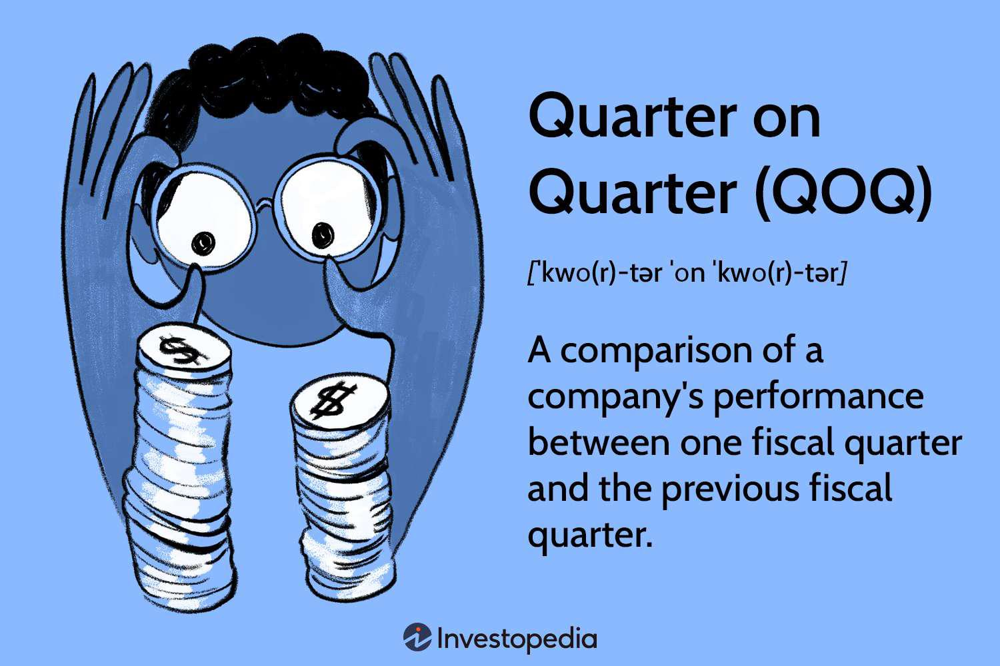

In today's fast-paced financial markets, understanding the nuances of financial calculations and analyses is crucial. Quarter-on-Quarter (QoQ) analysis stands out as a vital method for assessing short-term shifts in a company's financial performance. Unlike Year-over-Year (YoY) comparisons that focus on annual changes, QoQ analysis measures consecutive quarters, offering a more granular view of recent performance trends. This is especially useful for detecting seasonal influences and recent business cycle changes which are key to making informed investment decisions.

Algo trading, often referred to as algorithmic trading, relies heavily on these precise analyses to execute trades based on quantitative data. Leveraging QoQ analysis, algorithmic trading systems can quickly respond to minor fluctuations in financial metrics, aligning strategy with current market conditions. These systems use pre-set algorithms to process vast amounts of financial data, including QoQ growth rates, to manage trades with speed and accuracy that far surpasses human capability.



This article will explore how combining QoQ analysis with algorithmic trading strategies can enhance decision-making in financial markets. By examining the relationship between these elements, we can appreciate the significant impact they have on the effectiveness and efficiency of modern trading strategies.

## Table of Contents

## Understanding Quarter-on-Quarter (QoQ) Analysis

Quarter-on-Quarter (QoQ) analysis plays a pivotal role in evaluating a company's performance by measuring the change in various financial metrics from one fiscal quarter to the next. While Year-over-Year (YoY) comparisons offer a broader view over a longer period, QoQ analysis is instrumental for capturing short-term variations, providing insights that are essential for investors and traders who focus on immediate trends and shifts.

Businesses employ QoQ metrics to monitor growth, assess profitability, and evaluate operational efficiency across successive quarters. By analyzing these short-term changes, companies can identify potential areas requiring strategic adjustments or enhancements. This kind of analysis is especially vital in industries subject to seasonal fluctuations, where quarterly data might reveal trends masked in annual figures.

The calculation of QoQ growth is straightforward. The formula used is:

$$
\text{QoQ Growth Rate} = \left(\frac{\text{Current Quarter Value} - \text{Previous Quarter Value}}{\text{Previous Quarter Value}}\right) \times 100
$$

This formula quantifies the percentage change from one quarter to the next, highlighting increases or decreases in key performance indicators.

Automated tools such as Excel or specialized financial analysis software can facilitate these calculations. They provide efficiency and accuracy, enabling firms to process large data sets without human error. These tools can generate comprehensive reports swiftly, helping businesses and traders respond promptly to emerging trends or shifts.

QoQ analysis provides insights into a firm’s recent performance, which can influence investment decisions, operational strategies, and competitive positioning. For instance, a consistent upward trend in quarterly revenue might suggest robust growth, prompting investors to take a favorable view of the company’s stock. Meanwhile, significant dips could signal underlying issues, leading to strategic reassessments.

Overall, QoQ analysis is a crucial quantitative tool for stakeholders seeking to understand a company's short-term financial trajectory. By focusing on quarterly changes, it furnishes relevant, timely insights that can inform decision-making in rapidly evolving financial landscapes.

## The Importance of QoQ Analysis in Algo Trading

Algorithmic trading, or algo trading, has become an essential component of modern financial markets, enabling traders to execute complex strategies efficiently. Quarter-on-Quarter (QoQ) analysis is particularly important in this context due to its focus on tracking short-term financial performance. Algo trading algorithms leverage QoQ data to identify seasonal trends and short-term fluctuations, facilitating strategic decision-making.

In high-frequency trading ([HFT](/wiki/high-frequency-trading-strategies)), the ability to quickly interpret and act upon financial metrics is vital. QoQ analysis provides a granular view of a company's performance, breaking down changes in earnings, revenues, and operational metrics on a quarterly basis. This level of detail is crucial for HFT programs, which thrive on exploiting minute market movements. By understanding the quarterly shifts, these programs can pinpoint trends and anomalies that might signal lucrative trading opportunities.

Consider the formula for calculating QoQ growth rate: 

$$
\text{QoQ Growth Rate} = \left( \frac{\text{Current Quarter Value} - \text{Previous Quarter Value}}{\text{Previous Quarter Value}} \right) \times 100
$$

This formula provides a straightforward mechanism for comparing sequential quarters, enabling traders to quickly assess the direction and magnitude of changes in financial metrics. In an [algorithmic trading](/wiki/algorithmic-trading) model, this calculation might be automated using programming languages like Python:

```python
def calculate_qoq_growth(current_value, previous_value):
    return ((current_value - previous_value) / previous_value) * 100

# Example usage
q1_revenue = 1000000
q2_revenue = 1050000
qoq_growth = calculate_qoq_growth(q2_revenue, q1_revenue)
print(f'QoQ Revenue Growth: {qoq_growth:.2f}%')
```

By harnessing such calculations within their algorithms, algo traders gain a competitive edge, swiftly reacting to market changes. The precision and speed offered by algorithmic systems ensure that traders can capitalize on QoQ data, executing strategies that align with short-term market trends.

However, while the precise data from QoQ analysis provides valuable insights, it is essential for algorithmic traders to incorporate additional analytical layers. This approach helps mitigate the risks of seasonal distortions or other short-term anomalies that might skew decision-making. By balancing QoQ insights with other financial metrics, traders can build robust, adaptable trading strategies that maximize profitability across varying market conditions.

## Calculating QoQ Growth Rates

To calculate the Quarter-on-Quarter (QoQ) growth rate, the fundamental formula is:

$$
\text{QoQ Growth Rate} = \left( \frac{\text{Current Quarter Value} - \text{Previous Quarter Value}}{\text{Previous Quarter Value}} \right) \times 100
$$

This calculation enables analysts and traders to assess the relative change in a company's performance or financial metric from one fiscal quarter to the next. Understanding what drives changes in QoQ metrics offers insights into company operations and market conditions, potentially impacting trading decisions.

### Example Calculation

To practically illustrate this, consider a fictional company, CorpTech, which reported revenue of $1,000,000 in Q1 and $1,100,000 in Q2. Here's how to compute the QoQ growth rate:

1. Subtract the previous quarter's revenue from the current quarter's revenue:  
   $\$1,100,000 - \$1,000,000 = \$100,000$

2. Divide this difference by the previous quarter's revenue:  
   $\frac{\$100,000}{\$1,000,000} = 0.1$

3. Multiply by 100 to convert the result to a percentage:  
   $0.1 \times 100 = 10\%$

Therefore, CorpTech's QoQ revenue growth rate from Q1 to Q2 is 10%.

### Automation Using Tools

Advancements in technology facilitate the calculation of QoQ metrics effectively using tools such as Microsoft Excel or specialized financial analysis software. These platforms can automate complex financial calculations, providing real-time data analysis with reduced risk of human error.

For instance, the following Python code snippet can automate QoQ growth calculation, enhancing accuracy and efficiency:

```python
def calculate_qoq_growth(current_value, previous_value):
    if previous_value == 0:
        raise ValueError("Previous quarter value cannot be zero.")
    growth_rate = ((current_value - previous_value) / previous_value) * 100
    return growth_rate

# Example usage
current_quarter_value = 1100000
previous_quarter_value = 1000000

growth_rate = calculate_qoq_growth(current_quarter_value, previous_quarter_value)
print(f"QoQ Growth Rate: {growth_rate:.2f}%")
```

In this code snippet, a function `calculate_qoq_growth()` is defined to compute the QoQ growth rate given the current and previous quarter values. This approach can be particularly helpful for financial analysts who require rapid calculations and data integration across multiple datasets.

## Application of QoQ Analysis in Algorithmic Trading Strategies

Algorithmic trading relies heavily on the rapid processing and interpretation of financial data, with Quarter-on-Quarter (QoQ) analysis forming a critical component of this data-driven ecosystem. By providing insights into short-term performance metrics, QoQ data helps algorithmic models anticipate market movements, enabling traders to execute profitable transactions swiftly and accurately.

QoQ analysis is crucial for algorithmic trading strategies because it offers a snapshot of a company's financial health within a specific quarter compared to the previous one. This analysis is particularly beneficial for detecting trends in earnings, revenue, and other operational metrics that may not be evident in year-over-year data. For instance, by using QoQ data, trading algorithms can identify accelerating or decelerating revenue growth, offering timely insights into a company's financial trajectory. 

In practical applications, trading algorithms ingest data feeds that include QoQ metrics to adjust trading strategies in real-time. For example, an algorithm might be designed to increase investments in a company that has demonstrated a strong sequential growth in gross profit margins quarter-over-quarter. These changes can be detected using the formula for QoQ growth, giving:

$$
\text{QoQ Growth Rate} = \frac{\text{Current Quarter Value} - \text{Previous Quarter Value}}{\text{Previous Quarter Value}} \times 100
$$

Such calculations can be automated using programming languages like Python, where libraries like Pandas can handle data manipulation and analysis efficiently. An example snippet for calculating QoQ growth could look like this:

```python
import pandas as pd

# Sample data representing quarterly values
data = {'Quarter': ['Q1', 'Q2', 'Q3', 'Q4'],
        'Value': [200, 210, 220, 230]}

df = pd.DataFrame(data)

# Calculate QoQ growth rate
df['QoQ Growth Rate'] = df['Value'].pct_change() * 100
print(df)
```

In algorithmic models, the integration of QoQ data allows for more dynamic decision-making processes. Models can be programmed to flag potential buy or sell signals based on predefined thresholds of QoQ performance. A sharp increase in QoQ revenue might trigger a buy order, while a decrease could prompt a sell order. This responsiveness to recent data is critical for high-frequency trading platforms, where split-second decisions can significantly impact profitability.

Additionally, QoQ metrics often serve as inputs in predictive models used for forecasting stock prices and market trends. By analyzing historical QoQ trends, algorithms can predict future market behavior, optimizing trading strategies for expected earnings announcements or financial reports.

Overall, QoQ analysis enhances algorithmic trading strategies by providing a granular view of short-term corporate financial performance. This level of detail allows traders to capitalize on emerging trends and adjust their portfolios with agility, ultimately improving the effectiveness of trading operations in volatile market environments.

## Challenges of QoQ Analysis in Financial Markets

Quarter-on-Quarter (QoQ) analysis, while a valuable tool for gaining insights into recent business developments, presents several challenges in financial markets. One of the primary issues with QoQ analysis is its susceptibility to seasonal variances. These variances can significantly affect a company's operations, leading to fluctuations that may not necessarily reflect the true underlying performance. For instance, retail companies typically experience higher sales during holiday seasons, which could lead to misleading QoQ growth if not adjusted for seasonal patterns.

In addition to seasonal effects, relying solely on QoQ analysis for decision-making may not capture the complete financial health of an organization. Since QoQ focuses on short-term metrics, it may overlook long-term trends and potential risks. For example, a company might show impressive QoQ growth due to temporary factors, such as a successful marketing campaign or the launch of a popular product, while its long-term sustainability remains uncertain.

To address these limitations, financial analysts and traders employ several strategies. One common approach is the application of seasonal adjustments, which aim to account for predictable fluctuations in data. By using historical data to identify patterns, analysts can adjust the raw QoQ figures to provide a clearer picture of a company's performance. These adjustments are particularly useful in industries with pronounced seasonal effects, such as tourism and agriculture.

Furthermore, integrating QoQ analysis with other long-term metrics can offer a more comprehensive assessment of a company's financial health. For instance, combining QoQ data with Year-over-Year (YoY) figures, which compare a company's performance against the same period in the previous year, can help smooth out seasonal distortions and highlight underlying trends. Metrics like revenue growth, net income, and cash flow over multiple quarters can also provide valuable insights into the sustainability of short-term gains.

By employing these methodologies, traders and analysts can mitigate the risks associated with QoQ analysis and make more informed decisions. Ultimately, while QoQ analysis is essential for capitalizing on short-term market opportunities, it is most effective when used in combination with broader financial evaluations to ensure a balanced view of a company's prospects.

## Real-World Examples of QoQ Analysis in Action

Quarter-on-Quarter (QoQ) analysis serves as a critical instrument for investors and traders seeking to understand short-term market dynamics. Examining real-world instances highlights the tangible effects QoQ reports can have on stock prices, often driving substantial market movements.

A prominent example is Amazon, whose quarterly earnings announcements consistently capture significant market attention. In the fourth quarter of 2018, Amazon reported earnings that exceeded market expectations, reflecting a 20% increase in net sales compared to the previous quarter. This positive QoQ growth was primarily driven by increased sales during the holiday season and the expansion of Amazon Web Services (AWS). The announcement led to a notable surge in Amazon's stock price, underscoring the market's positive reception to the robust quarter-on-quarter performance. 

Conversely, in the second quarter of 2021, Amazon reported slightly lower-than-expected results, with a QoQ growth rate of only 8%, compared to the projected 10%. Despite overall positive year-on-year growth, the shortfall in quarterly expectations led to a decline in Amazon's stock price, exemplifying the potential for QoQ results to influence market sentiment significantly.

The influence of QoQ analysis extends beyond individual companies like Amazon. For instance, during the COVID-19 pandemic, many industries, such as travel and retail, experienced dramatic shifts in quarterly performance due to rapid changes in consumer behavior and operational challenges. Companies that reported unexpected QoQ improvements amidst these conditions saw substantial increases in their stock valuations, as investors responded to the potential signs of recovery or adaptation to the new market environment.

These examples highlight the importance of QoQ analysis as a tool for understanding short-term financial performance and the critical impact such analyses can have on stock prices. For algorithmic traders and investors, leveraging QoQ data allows them to identify and capitalize on these market fluctuations, positioning themselves strategically in response to quarterly financial disclosures.

## Conclusion

Quarter-on-Quarter (QoQ) analysis is an essential tool for financial analysts and algorithmic traders aiming to capitalize on short-term market opportunities. By providing insights into how a company's performance changes quarterly, QoQ metrics facilitate the rapid decision-making process crucial in fast-paced trading environments. These metrics are integral in identifying seasonal patterns, gauging a company's operational efficiency, and predicting short-term market trends, making them indispensable for algorithmic trading strategies.

However, relying solely on QoQ data can sometimes lead to misleading conclusions due to inherent seasonal fluctuations and temporary anomalies. Thus, it is crucial to complement QoQ analysis with other methods, such as Year-over-Year (YoY) comparisons and seasonal adjustments, to obtain a comprehensive view of a company's long-term financial health. This integrated approach allows traders to distinguish between short-lived variations and genuine growth trends, thereby minimizing the impact of short-term [volatility](/wiki/volatility-trading-strategies) on investment decisions.

Financial analysts and traders must remain aware of the dynamic nature of markets and ensure that their strategies are both adaptable and data-driven. By leveraging both QoQ and long-term financial metrics, they can craft strategies that not only capitalize on immediate opportunities but also align with broader financial objectives. Continuous learning and strategy refinement remain key to sustained success in unsteady markets.

## References & Further Reading

[1]: ["Advances in Financial Machine Learning"](https://www.amazon.com/Advances-Financial-Machine-Learning-Marcos/dp/1119482089) by Marcos Lopez de Prado

[2]: ["Evidence-Based Technical Analysis: Applying the Scientific Method and Statistical Inference to Trading Signals"](https://www.amazon.com/Evidence-Based-Technical-Analysis-Scientific-Statistical/dp/0470008741) by David Aronson

[3]: ["Machine Learning for Algorithmic Trading"](https://github.com/stefan-jansen/machine-learning-for-trading) by Stefan Jansen

[4]: ["Quantitative Trading: How to Build Your Own Algorithmic Trading Business"](https://www.amazon.com/Quantitative-Trading-Build-Algorithmic-Business/dp/1119800064) by Ernest P. Chan

[5]: Menkveld, A. J. (2013). ["High frequency trading and the new market makers."](https://www.sciencedirect.com/science/article/pii/S1386418113000281) Journal of Financial Markets, 16(4), 712-740.

[6]: Hasbrouck, J., & Saar, G. (2013). ["Low-latency trading."](https://papers.ssrn.com/sol3/papers.cfm?abstract_id=1695460) The Journal of Finance, 68(2), 629-647.