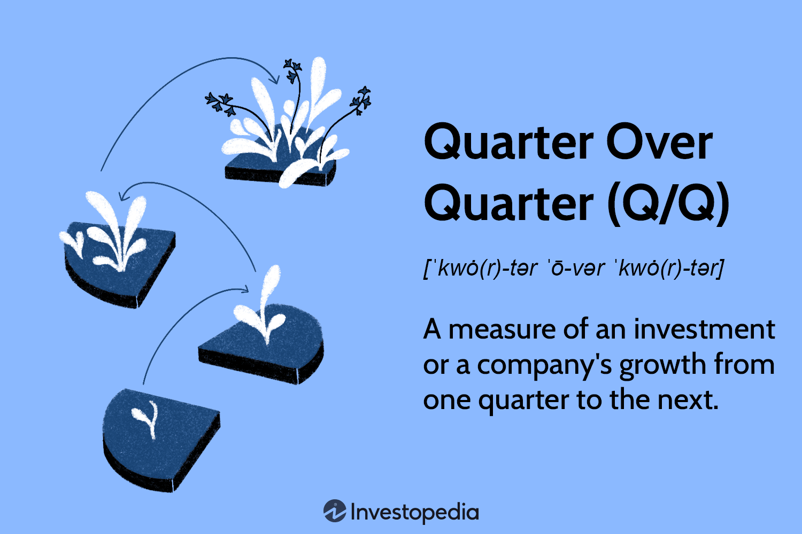

Quarter Over Quarter (Q/Q) growth is a critical metric in business analytics, representing the rate at which a company's financial performance changes from one fiscal quarter to the next. This metric is essential for businesses seeking to quickly gauge their short-term performance, offering a snapshot that can reveal emerging trends and shifts in the company's operations. By calculating the percentage increase or decrease in key financial figures such as revenue, net profit, and expenses between consecutive quarters, businesses can assess their immediate financial health and operational efficiency.

Q/Q metrics are crucial for businesses aiming to remain competitive, as they offer significant insights that inform tactical decision-making. Unlike Year Over Year (YOY) or Month Over Month (MOM) metrics, Q/Q analysis provides a more immediate perspective, allowing businesses to track progress or setbacks over short periods. This is particularly beneficial for identifying trends that may not be evident in longer-term analyses, such as changes in consumer behavior, marketing effectiveness, or cost management.



Algorithmic trading (algo trading) is a modern trading system that utilizes complex algorithms to execute trades at high speed and volume. This form of trading relies heavily on precise quantitative analyses, such as Q/Q growth metrics, to detect and exploit short-term market trends. The rapid pace of algo trading demands accurate and timely data to optimize trading strategies and minimize risk, making Q/Q data invaluable. By incorporating Q/Q growth into their algorithms, traders can better predict market movements, adjust trading positions, and capitalize on emerging opportunities.

Understanding the synergy between Q/Q analysis and algorithmic trading is crucial for leveraging financial metrics to enhance trading strategies. Q/Q analysis provides algorithmic trading systems with essential data to forecast and adapt to market shifts promptly, thereby reinforcing the efficiency and effectiveness of these automated systems. As businesses and traders strive to make informed decisions in dynamic environments, the integration of Q/Q metrics into their analytical frameworks becomes an indispensable advantage. This intersection of Q/Q analysis and algo trading underscores the potential for innovative approaches in financial strategies and market engagement.

## Table of Contents

## Understanding Quarter Over Quarter (Q/Q) Growth Metrics

Quarter Over Quarter (Q/Q) growth is a performance measurement used to evaluate a company's financial progress over two consecutive quarters. This metric compares a company's current quarter results against the results from the previous quarter, providing insights into its short-term performance trends.

### Definition and Application

Q/Q growth measures the incremental change in key performance indicators, such as revenue, net income, or earnings, from one fiscal quarter to the next. This metric is particularly useful for assessing short-term business performance and for identifying recent trends in a company's operations or market conditions. Businesses and investors rely on Q/Q growth to discern whether a company's strategies are effective in the short run and to make timely adjustments as necessary.

### Calculation Method

To calculate Q/Q growth, the formula typically used is:

$$
\text{Q/Q Growth Rate} = \left( \frac{\text{Current Quarter Value} - \text{Previous Quarter Value}}{\text{Previous Quarter Value}} \right) \times 100
$$

This formula expresses the growth rate as a percentage, enabling straightforward comparisons.

**Example**: Suppose a company's revenue in Q1 is $500,000 and in Q2 it is $550,000. The Q/Q growth rate for revenue would be:

$$
\text{Q/Q Growth Rate} = \left( \frac{550,000 - 500,000}{500,000} \right) \times 100 = 10\%
$$

### Comparison with YOY and MOM

Quarter Over Quarter growth differs from other growth metrics like Year Over Year (YOY) and Month Over Month (MOM). While Q/Q focuses on quarter-to-quarter changes, YOY compares performance from the same quarter in the previous year, providing a longer-term view that accounts for seasonal variations. MOM measures changes from one month to the next, offering an even more granular perspective. Each metric has its place in financial analysis, with Q/Q offering the middle ground in terms of time frame and detail.

For example, YOY growth might be more meaningful in industries subject to seasonal trends, like retail, where comparisons across the same quarter in different years can reveal more about underlying business progress than a single quarter's result might.

### Significance in Financial Statements

In financial reporting, Q/Q growth is significant because it provides immediate feedback on a company's recent performance, helping stakeholders make more informed decisions. Investors and analysts often focus on a company's ability to maintain or accelerate growth each quarter, which can be indicative of a company's operational efficiency and market competitiveness.

The insights gained from Q/Q growth can drive strategic decision-making, such as altering marketing strategies, adjusting operational needs, or identifying new market opportunities. It helps stakeholders assess whether a company can consistently improve its financial results or whether there are potential challenges that need addressing.

In summary, while Q/Q growth offers critical insights into short-term dynamics, it is important to consider it alongside other performance metrics such as YOY and MOM to obtain a comprehensive view of a company's performance over time.

## The Role of Q/Q Growth in Algo Trading

Algorithmic trading, often referred to as algo trading, utilizes computer programs to execute a large number of orders at high speed, relying on defined strategies that take into account various market variables. It heavily depends on rapid and accurate data analysis to exploit market inefficiencies and [volatility](/wiki/volatility-trading-strategies). Quarter Over Quarter (Q/Q) growth metrics play a crucial role in this context by providing timely insights into short-term market trends which are essential for formulating trading strategies.

Q/Q metrics are valuable for identifying short-term trends by comparing a company's performance from one quarter to the next. This comparison can reveal patterns that indicate emerging market trends, allowing algo traders to make informed decisions based on the latest available data. For instance, if a company's revenue shows consistent Q/Q growth, it might suggest an upward trend in its business performance, which can be interpreted as a buying signal for traders. Conversely, a decline might trigger selling or short-selling decisions.

Integrating Q/Q growth data in [algorithmic trading](/wiki/algorithmic-trading) strategies involves the use of quantitative models that incorporate these metrics into the decision-making process. By analyzing Q/Q growth alongside other financial indicators, algorithms can compute the likelihood of certain stock movements and adjust trading strategies accordingly. This integration ensures that trading models are responsive to the most current financial data, improving their predictive accuracy.

High-frequency trading systems, which execute trades on extremely short timescales, can greatly benefit from incorporating Q/Q metrics. These systems thrive on speed and precision, processing vast amounts of data to realize tiny but numerous gains. Q/Q growth metrics contribute to the systematic analysis of data, identifying potential profitable opportunities that might be masked at longer intervals. By responding swiftly to Q/Q insights, high-frequency traders can gain a competitive edge, capturing gains in the market more efficiently.

In conclusion, the role of Q/Q growth in algo trading underscores its importance in generating actionable insights for traders. Accurate and timely Q/Q analysis can uncover short-term opportunities and guide strategic decisions in high-frequency trading environments, thereby enhancing the reliability and success rate of trading algorithms.

## Calculating Q/Q Growth Rates for Trading Algorithms

In the analysis of Quarter Over Quarter (Q/Q) growth rates, a clear understanding of the formula and its practical implementation in algorithmic trading is essential. The Q/Q growth rate measures the percentage change in a company’s performance from one quarter to the next. The formula for calculating the Q/Q growth rate is expressed as follows:

$$
\text{Q/Q Growth Rate} = \left(\frac{\text{Current Quarter Value} - \text{Previous Quarter Value}}{\text{Previous Quarter Value}}\right) \times 100
$$

This formula provides insights into the short-term financial improvements or declines a company experiences, making it an invaluable tool for traders aiming to exploit market inefficiencies rapidly.

### Practical Example Using Python

To illustrate the calculation of Q/Q growth rates using Python, consider this code snippet:

```python
def calculate_qq_growth(previous_quarter, current_quarter):
    try:
        growth_rate = ((current_quarter - previous_quarter) / previous_quarter) * 100
        return growth_rate
    except ZeroDivisionError:
        return "Previous quarter value is zero, growth rate is undefined."

# Example values
previous_quarter_revenue = 500000
current_quarter_revenue = 550000

qq_growth_rate = calculate_qq_growth(previous_quarter_revenue, current_quarter_revenue)
print(f"The Q/Q growth rate is {qq_growth_rate:.2f}%")
```

In this example, if we have previous and current quarter revenues of $500,000 and $550,000, respectively, the Q/Q growth rate is calculated as 10%. The Python function `calculate_qq_growth` automates this computation, handling division by zero scenarios gracefully by alerting the user to undefined growth rates.

### Automation of Q/Q Calculations

Automating Q/Q calculations is integral to algorithmic trading. Software tools are typically used to ingest raw financial data, process calculations at high speed, and update trading strategies based on new insights. Python libraries like Pandas can be employed to handle large datasets, simplifying the automation process:

```python
import pandas as pd

# Example dataset
data = {'Quarter': ['Q1', 'Q2', 'Q3', 'Q4'],
        'Revenue': [500000, 550000, 600000, 580000]}
df = pd.DataFrame(data)

# Calculate Q/Q growth rate
df['Q/Q Growth Rate'] = df['Revenue'].pct_change() * 100

print(df)
```

This code demonstrates the use of Pandas to calculate Q/Q growth rates for multiple quarters efficiently, enabling seamless integration into trading platforms that rely on up-to-date financial metrics.

### Importance of Precision and Speed

In algorithmic trading, precision and speed in calculating Q/Q growth rates are critical. High-frequency trading systems rely on minute changes in financial indicators for timely decision-making. Even slight errors or delays in data processing can result in significant financial implications, making it crucial to employ robust software solutions and well-optimized algorithms.

By integrating automated and precise Q/Q calculations, algorithmic traders gain a competitive edge, leveraging timely insights for strategic maneuvers in dynamic market environments. This capability not only enhances decision-making but also optimizes the execution of trading strategies, ensuring maximum return on investment.

## Application of Q/Q Analysis in Algorithmic Trading

Quarter over Quarter (Q/Q) analysis plays a crucial role in the framework of algorithmic trading models. Its application helps traders adjust their strategies promptly by leveraging short-term financial performance indicators. This capability is essential in creating trading algorithms that are reactive and adaptive to current market conditions.

Q/Q data can be incorporated into trading models by integrating it into the decision-making algorithms that form the backbone of trading systems. These systems rely on key financial metrics that are calculated on a quarterly basis to evaluate a company’s short-term performance. When these metrics indicate significant changes or trends, they can trigger automated trading decisions. For instance, a company showing consistent Q/Q growth might be flagged as a potential buy, whereas declining Q/Q growth could trigger a sell decision.

Real-time adjustments to trading strategies are made possible by Q/Q insights. These adjustments often depend on streamlining data processing systems to ensure that the most recent data is always available. Trading algorithms can be designed to automatically account for Q/Q data, leading to swift strategy adaptation based on the latest financial results. This requires robust data pipelines and software capable of handling high-frequency data inflows and executing trades with minimal delay.

An example of Q/Q analysis success in stock [picking](/wiki/asset-class-picking) is evident in its use for constructing baskets of stocks aimed at both long and short plays. By employing algorithms that prioritize stocks with superior Q/Q growth relative to their peers, traders can efficiently create positions that exploit these signals. For example, a Python script could be set up to access financial API data, filter for top Q/Q performances, and automatically rebalance the portfolio accordingly.

Predictive modeling and future market forecasting also benefit from Q/Q trends. These models use historical Q/Q data to establish patterns that help forecast future performance. By statistically analyzing Q/Q changes alongside other data inputs, predictive models can provide estimates of future market behavior, supporting strategic decision-making. Algorithms utilizing these forecasts can help enhance portfolio performance by anticipating market movements and adjusting positions in advance.

In conclusion, Q/Q analysis provides a framework for making informed, real-time decisions in algorithmic trading. By incorporating these metrics into trading models, traders can adapt their strategies to current market conditions, enhance stock picking success, and improve forecasting accuracy. The precision and adaptability offered by Q/Q analysis are vital in maintaining competitiveness in fast-moving markets.

## Challenges and Limitations of Q/Q Analysis

Quarter over Quarter (Q/Q) analysis, though invaluable for its insights into short-term business performance, is not without its challenges. One of the primary issues with Q/Q data is the influence of seasonal variations. Many industries experience predictable fluctuations throughout the year, such as retail sales spikes during the holidays. These seasonal patterns can distort Q/Q growth figures, making it difficult to assess a company's actual performance. To overcome this, analysts often incorporate seasonally adjusted data, which removes typical seasonal effects and provides a clearer picture of underlying trends.

Another significant limitation of Q/Q analysis is the lack of contextual depth. Focusing exclusively on Q/Q growth can lead to misleading conclusions if not paired with other metrics. For example, a company might show impressive Q/Q growth while ignoring underlying issues like increasing debt or diminishing cash flow. Hence, it is essential to include Year Over Year (YOY) data, which provides a broader historical perspective, helping to avoid potential distortions from temporary factors.

Incorporating YOY data, alongside Q/Q figures, provides a more holistic view. While Q/Q data offers a snapshot of recent changes, YOY analysis can reflect longer-term trends and help validate whether the growth is sustainable. For instance, a Q/Q growth rate might indicate a positive trend, but when compared with YOY data, it might just be a temporary spike rather than a permanent shift.

Finally, the accuracy of Q/Q analysis heavily depends on the quality and consistency of the financial data used. Discrepancies in financial reporting practices between companies can cause variations that undermine the reliability of Q/Q comparisons. Analysts must therefore be vigilant about the sources of their data and cautious when comparing results across different entities. Ensuring data integrity involves using standardized accounting practices and may require adjustments for any anomalies or inconsistencies present in the reports.

In conclusion, while Q/Q analysis is a useful tool for evaluating short-term performance, it must be applied with caution. A comprehensive strategy that incorporates other metrics like YOY data, acknowledges seasonal variations, and relies on consistent data quality is essential for drawing accurate and meaningful conclusions from Q/Q figures.

## Real-World Impacts of Q/Q Analysis

Quarter-over-quarter (Q/Q) analysis plays a pivotal role in assessing market dynamics and influencing decision-making among investors and algorithmic traders alike. By examining Q/Q growth metrics, analysts can derive valuable insights into company performance, market trends, and broader economic conditions. This section explores the real-world impacts of Q/Q analysis, highlighting notable case studies and industry-level effects.

### Case Studies and Company Impacts: Amazon

Amazon provides a compelling example of how Q/Q analysis impacts market decisions. The company's quarterly earnings releases often serve as a catalyst for market activity. For instance, Amazon's Q1 earnings report in 2021 demonstrated a substantial increase in revenue, surpassing analyst expectations. This growth was attributed to heightened online shopping activity and cloud computing services, leading to a sharp increase in Amazon's stock price post-announcement.

Investors and algorithmic trading systems responded rapidly to this Q/Q data, recalibrating models to reflect the updated growth trajectory. Short-term trading strategies, particularly those relying on [momentum](/wiki/momentum), benefitted from these insights, capitalizing on the stock price surge that followed the earnings release.

### Industry-Level Effects During Economic Downturns

The assessment of Q/Q performance is particularly crucial during economic downturns, where rapid shifts in market conditions necessitate prompt adjustments in trading strategies. During the COVID-19 pandemic, many industries experienced abrupt declines in quarterly performance metrics. For instance, the travel and hospitality sectors saw precipitous drops in revenues. By analyzing Q/Q growth rates, companies and investors were able to gauge the extent of the downturn's impact, informing both immediate actions and long-term strategic planning.

Q/Q analysis was also instrumental in detecting early signs of recovery. By monitoring sequential quarterly improvements, investors could identify potential turnaround opportunities, thus shaping portfolio allocation decisions.

### Reactions of Investors and Algorithmic Traders

Quarterly reports, rich with Q/Q data, are critical touchpoints for investors and algorithmic trading platforms. These reports offer a periodic benchmark for evaluating the financial health and performance trends of companies. Investors typically scrutinize Q/Q metrics for signals of operational efficiency, revenue growth, and cost management.

Algorithmic traders, in particular, leverage Q/Q data to enhance predictive models and refine trading algorithms. For instance, high-frequency trading systems integrate Q/Q results to adjust real-time trading strategies, optimizing their engagement with rapid market fluctuations post-report release. The prompt incorporation of Q/Q insights enhances the efficiency of trading decisions, allowing these systems to exploit short-lived market inefficiencies.

In conclusion, Q/Q analysis is an indispensable tool in understanding and responding to market dynamics. Whether examining individual companies like Amazon or assessing industry-level shifts during economic downturns, Q/Q growth metrics provide essential insights that drive investor behavior and inform algorithmic trading strategies.

## Conclusion

Quarter-over-quarter (Q/Q) analysis is pivotal in modern trading strategies, especially within algorithmic trading frameworks. This metric provides a granular view of a company's short-term performance, allowing traders to react swiftly to evolving market conditions. By focusing on Q/Q changes, traders gain insights into company trends that might not be visible through other metrics like year-over-year (YOY) or month-over-month (MOM) analyses. This precision is crucial for identifying shifts in momentum, which can influence trading decisions.

However, relying exclusively on Q/Q metrics can be limiting. It is important to adopt a balanced approach by integrating multiple financial indicators. Combining Q/Q data with other metrics allows traders to capture a more comprehensive picture of a company's performance. For instance, coupling Q/Q growth rates with YOY data can help mitigate seasonal distortions and provide a more accurate assessment. Additionally, incorporating economic indicators and sector-specific trends enriches the analysis, reducing the risk of making decisions based on isolated data points.

Integrating Q/Q analytics into algorithmic trading offers significant benefits. Algorithms that process real-time Q/Q data can adjust trading strategies dynamically, seizing opportunities as they arise. These strategies are particularly effective in high-frequency trading environments, where speed and precision are paramount. The ability to predict future market movements through historical Q/Q patterns enhances the potential for profit, making Q/Q analysis a valuable component of trading models.

Financial professionals are encouraged to leverage Q/Q trends for strategic advantage. By understanding the nuances captured by Q/Q data and employing it alongside other metrics, traders can enhance their decision-making processes and increase their competitiveness. In an industry where information is power, the strategic application of Q/Q analysis stands as a critical tool for navigating complex financial markets efficiently.

## References & Further Reading

[1]: Bergstra, J., Bardenet, R., Bengio, Y., & Kégl, B. (2011). ["Algorithms for Hyper-Parameter Optimization."](https://dl.acm.org/doi/10.5555/2986459.2986743) Advances in Neural Information Processing Systems 24.

[2]: ["Advances in Financial Machine Learning"](https://www.amazon.com/Advances-Financial-Machine-Learning-Marcos/dp/1119482089) by Marcos Lopez de Prado

[3]: ["Evidence-Based Technical Analysis: Applying the Scientific Method and Statistical Inference to Trading Signals"](https://www.amazon.com/Evidence-Based-Technical-Analysis-Scientific-Statistical/dp/0470008741) by David Aronson

[4]: ["Machine Learning for Algorithmic Trading"](https://github.com/stefan-jansen/machine-learning-for-trading) by Stefan Jansen

[5]: ["Quantitative Trading: How to Build Your Own Algorithmic Trading Business"](https://www.amazon.com/Quantitative-Trading-Build-Algorithmic-Business/dp/1119800064) by Ernest P. Chan