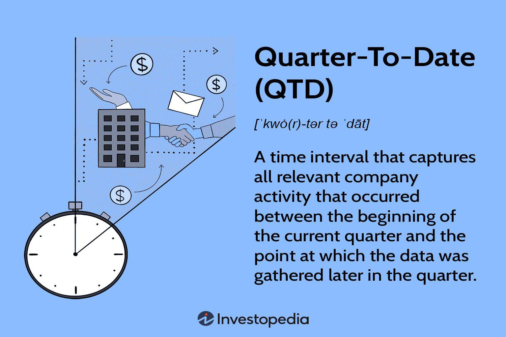

## Table of Contents

## What is Quarter-To-Date (QTD) analysis?

Quarter-To-Date (QTD) analysis is a way to look at how a business is doing from the start of a quarter up to the current date. A quarter is three months long, and there are four quarters in a year. QTD analysis helps businesses see their progress and performance during part of the year, instead of waiting until the end.

This type of analysis is useful for making quick decisions. By looking at sales, costs, and other important numbers during the quarter, a business can see if it's doing well or if it needs to make changes. For example, if sales are lower than expected, the business might decide to start a new marketing campaign to boost them. QTD analysis helps keep businesses on track and responsive to changes.

## How is QTD different from Month-To-Date (MTD) and Year-To-Date (YTD)?

Quarter-To-Date (QTD) analysis looks at how a business is doing from the start of the current quarter up to today. A quarter is three months long, so QTD covers a bigger time frame than Month-To-Date (MTD) but smaller than Year-To-Date (YTD). QTD is useful for checking progress within a quarter, helping businesses see if they are on track to meet their goals for that period.

Month-To-Date (MTD) analysis, on the other hand, focuses on the performance from the start of the current month up to today. It's a shorter time frame than QTD and YTD, making it great for quick checks and immediate adjustments. For example, if sales are down this month, a business might decide to launch a special offer to boost them before the month ends.

Year-To-Date (YTD) analysis covers the longest period, from the start of the year up to the current date. It gives a broader view of the business's performance over the entire year so far. YTD is useful for understanding long-term trends and making annual forecasts. Each of these analyses helps businesses in different ways, depending on what they need to know and how quickly they need to act.

## What are the basic steps to perform a QTD analysis?

To perform a Quarter-To-Date (QTD) analysis, first, you need to gather all the data from the start of the current quarter up to today. This includes information like sales numbers, costs, and any other important metrics your business tracks. Make sure the data is accurate and complete, as this will help you get a clear picture of how your business is doing.

Next, compare the QTD data to your goals or targets for the quarter. Look at how well you're doing in different areas, like sales or expenses. If your sales are lower than expected, you might need to think about why that's happening and what you can do to improve them. If costs are higher than planned, you might need to find ways to cut back.

Finally, use the insights from your QTD analysis to make decisions. If you see that you're doing well, you might decide to keep doing what you're doing. But if you're not meeting your goals, you might need to make changes, like starting a new marketing campaign or adjusting your budget. QTD analysis helps you stay on track and make smart choices for your business.

## What types of data are typically included in a QTD analysis?

A Quarter-To-Date (QTD) analysis usually includes sales data, which shows how much money the business has made from selling its products or services since the start of the quarter. This can be broken down by different products, regions, or customer groups to see where the business is doing well or where it needs to improve. Another important type of data is expenses, which tracks how much the business has spent on things like materials, salaries, and marketing during the quarter. By comparing sales and expenses, the business can see if it's making a profit or if costs are too high.

In addition to sales and expenses, QTD analysis often includes data on key performance indicators (KPIs) like customer satisfaction, employee productivity, and inventory levels. Customer satisfaction scores can help the business understand how happy its customers are with its products or services. Employee productivity data shows how efficiently the team is working, which can affect the business's overall performance. Inventory levels are important for businesses that sell physical products, as they need to make sure they have enough stock to meet demand but not so much that they tie up too much money in unsold goods.

By looking at all this data together, a business can get a good picture of how it's doing during the quarter. This helps managers make informed decisions about what to do next, whether it's boosting sales, cutting costs, or making other changes to improve performance.

## How can QTD analysis be used to assess business performance?

QTD analysis helps businesses see how they are doing from the start of the quarter up to now. By looking at sales numbers, the business can tell if it's making enough money. If sales are good, that's great. But if they are lower than expected, the business might need to start a new marketing campaign or offer special deals to bring in more customers. Expenses are also important. If the business is spending too much, it might need to find ways to save money, like buying materials at a lower cost or cutting back on other costs.

Besides sales and expenses, QTD analysis looks at other important numbers too. For example, customer satisfaction scores show how happy customers are with the business's products or services. If scores are low, the business might need to improve its products or customer service. Employee productivity is another key thing to check. If employees are not working efficiently, the business might need to train them better or find ways to help them work faster. Inventory levels are also important, especially for businesses that sell physical products. The business needs to make sure it has enough stock to meet demand but not so much that it ties up too much money in unsold goods.

By putting all this data together, QTD analysis gives a clear picture of how the business is doing during the quarter. This helps managers make smart choices about what to do next. If things are going well, they might decide to keep doing what they're doing. But if the business is not meeting its goals, they might need to make changes to improve performance. QTD analysis is a helpful tool for keeping the business on track and making quick decisions to stay successful.

## What are common tools and software used for QTD analysis?

Many businesses use software like Microsoft Excel to do QTD analysis. Excel is easy to use and lets you put in numbers, make charts, and see how your business is doing. You can set up a spreadsheet to track sales, costs, and other important numbers from the start of the quarter up to now. Excel also has tools like pivot tables and formulas that can help you look at the data in different ways and find out what's working and what's not.

Another tool that businesses use is specialized business intelligence software like Tableau or Power BI. These tools are good at taking a lot of data and turning it into clear reports and dashboards. They help you see trends and patterns in your QTD data, which can be hard to do with just a regular spreadsheet. With Tableau or Power BI, you can make colorful charts and graphs that show how your business is doing, making it easier to understand and share with others.

Some businesses also use enterprise resource planning (ERP) systems like SAP or Oracle to do their QTD analysis. These systems are big and can handle all sorts of data from different parts of the business. They can track sales, costs, inventory, and more, all in one place. ERP systems are great for businesses that need to look at a lot of different numbers and want everything to be connected and up-to-date.

## How can QTD analysis help in forecasting and budgeting?

QTD analysis helps businesses plan for the future by looking at how they are doing right now. By checking sales, costs, and other numbers from the start of the quarter up to today, businesses can see if they are on track to meet their goals. If sales are higher than expected, the business might decide to increase its budget for the rest of the quarter to take advantage of the good performance. If sales are lower, the business might need to cut back on spending or find new ways to bring in more money. This helps the business make smart choices about where to spend its money and how much to spend.

Forecasting is another way QTD analysis helps. By looking at the data from the current quarter, businesses can make better guesses about what will happen in the future. For example, if sales are growing each month of the quarter, the business might expect this trend to continue and plan accordingly. If costs are going up, the business can forecast higher expenses and adjust its budget to cover them. Using QTD analysis for forecasting helps the business be ready for what's coming and make plans that are based on real numbers, not just guesses.

## What are the challenges and limitations of QTD analysis?

QTD analysis can be tricky because it only looks at part of the year. This means it might not show the full picture of how a business is doing. For example, if a business has a big sale at the end of the quarter, the QTD numbers might not look as good, even if the business is doing well overall. Also, QTD analysis can be affected by seasonal changes. If a business sells more in certain months, the QTD data might look different depending on when the quarter starts and ends.

Another challenge is that QTD analysis needs good data. If the numbers are wrong or missing, the analysis won't be helpful. It takes time and effort to make sure all the data is correct and complete. Plus, QTD analysis can be hard to compare with other time periods like MTD or YTD. Each type of analysis looks at different time frames, so it can be confusing to figure out how they all fit together. This can make it hard for businesses to see the big picture and make the best decisions.

## How can QTD analysis be integrated with other financial analyses?

QTD analysis can be used together with other financial analyses like Month-To-Date (MTD) and Year-To-Date (YTD) to get a fuller picture of how a business is doing. By looking at QTD data alongside MTD data, businesses can see how the current month is affecting the quarter's performance. For example, if sales are down this month, the business can check the QTD numbers to see if it's just a one-month dip or if it's a trend that started earlier in the quarter. YTD analysis gives an even bigger view, showing how the business has been doing from the start of the year up to now. By comparing QTD numbers with YTD numbers, businesses can see if the current quarter is better or worse than the rest of the year and make plans accordingly.

Another way to integrate QTD analysis is with forecasting and budgeting. By using QTD data, businesses can make better guesses about what will happen in the future and plan their budgets more accurately. For instance, if QTD sales are higher than expected, the business might decide to increase its budget for the rest of the quarter to take advantage of the good performance. On the other hand, if QTD costs are going up, the business can adjust its budget to cover these higher expenses. By combining QTD analysis with other financial tools, businesses can make smarter decisions and be better prepared for what's coming.

## What advanced techniques can enhance the accuracy of QTD analysis?

To make QTD analysis more accurate, businesses can use something called data validation. This means checking the numbers carefully to make sure they are correct and complete. If the data is wrong or missing, the analysis won't be helpful. Another way to improve accuracy is by using predictive analytics. This is a fancy way of saying that the business can use math and computer programs to guess what will happen next based on the QTD data. For example, if sales are going up each month of the quarter, predictive analytics can help the business plan for even more sales in the future.

Another advanced technique is to use data normalization. This means adjusting the numbers so that they can be compared fairly, even if they come from different parts of the business or different time periods. For example, if one store is bigger than another, data normalization can help the business compare their sales in a way that makes sense. Also, businesses can use something called cohort analysis. This means looking at groups of customers or products to see how they behave over time. By doing this, the business can see patterns that might not show up in the overall QTD numbers, making the analysis more accurate and useful.

## How can QTD analysis be customized for different industries?

QTD analysis can be customized for different industries by focusing on the specific metrics that matter most to each one. For example, in the retail industry, QTD analysis might look at sales per store, inventory turnover rates, and customer foot traffic. Retail businesses can use this data to see if certain products are selling well or if they need to adjust their stock levels. In the manufacturing industry, QTD analysis might focus on production efficiency, machine downtime, and raw material costs. Manufacturers can use this information to see if they are making products quickly enough and if they need to find cheaper materials to keep costs down.

In the healthcare industry, QTD analysis could include patient satisfaction scores, the number of appointments, and the cost of medical supplies. Hospitals and clinics can use this data to see if patients are happy with their care and if they need to order more supplies. For the tech industry, QTD analysis might look at software development progress, customer acquisition rates, and server uptime. Tech companies can use this information to see if they are releasing new features on time and if their services are working well for customers. By customizing QTD analysis to focus on industry-specific metrics, businesses can get a clearer picture of their performance and make better decisions.

## What case studies demonstrate successful applications of QTD analysis?

A retail company used QTD analysis to boost its sales. They looked at their sales numbers from the start of the quarter up to now and saw that some products were not selling well. By using QTD data, they decided to start a big sale on those products in the middle of the quarter. The sale worked, and they sold a lot more of those products. This helped them meet their sales goals for the quarter and made their customers happy with the discounts.

A manufacturing business used QTD analysis to save money. They looked at their costs from the start of the quarter and saw that their raw material expenses were too high. By using QTD data, they found a new supplier that offered cheaper materials. They switched to the new supplier and saved a lot of money. This helped them lower their costs for the rest of the quarter and make more profit.

## References & Further Reading

[1]: Bergstra, J., Bardenet, R., Bengio, Y., & Kégl, B. (2011). ["Algorithms for Hyper-Parameter Optimization."](https://dl.acm.org/doi/10.5555/2986459.2986743) Advances in Neural Information Processing Systems 24.

[2]: ["Advances in Financial Machine Learning"](https://www.amazon.com/Advances-Financial-Machine-Learning-Marcos/dp/1119482089) by Marcos Lopez de Prado

[3]: ["Evidence-Based Technical Analysis: Applying the Scientific Method and Statistical Inference to Trading Signals"](https://www.amazon.com/Evidence-Based-Technical-Analysis-Scientific-Statistical/dp/0470008741) by David Aronson

[4]: ["Machine Learning for Algorithmic Trading"](https://github.com/stefan-jansen/machine-learning-for-trading) by Stefan Jansen

[5]: ["Quantitative Trading: How to Build Your Own Algorithmic Trading Business"](https://www.amazon.com/Quantitative-Trading-Build-Algorithmic-Business/dp/1119800064) by Ernest P. Chan