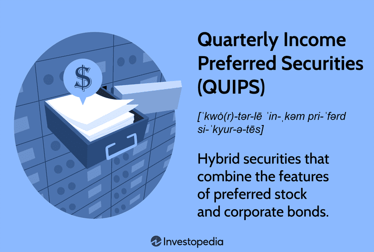

Fixed income investments are financial instruments known for providing regular income through interest payments over time and returning the principal amount upon maturity. These investments are fundamental components of financial markets, offering stability and predictability to investors. Debt securities, a primary form of fixed income investment, include instruments such as government and corporate bonds, which play a crucial role in generating a steady income stream. Their predictable nature makes them appealing to risk-averse investors seeking reliable financial returns.

Among the diverse landscape of fixed income investments, Quality Income Debt Securities (QUIDS) emerge as optimal choices for conservative investors. QUIDS are characterized by high credit quality and are issued by reputable entities, ensuring lower default risk and consistent income. These qualities make QUIDS particularly attractive to those who aim for capital preservation while receiving a steady income.



In contrast, the advent of algorithmic trading, commonly known as algo trading, has revolutionized the investment world. This approach employs complex algorithms and high-speed computer programs to execute trades at an incredible pace, offering enhanced efficiency and precision. Algo trading has drastically changed traditional methods by enabling the analysis of large datasets in real-time, thus identifying profitable investment opportunities quickly and accurately.

Combining the stability and reliability of QUIDS with the speed and data-driven nature of algorithmic trading presents a compelling opportunity to enhance returns in fixed income investment strategies. By leveraging technology to optimize portfolio management, investors can achieve superior outcomes, thereby maximizing the benefits of fixed income investments. This synergy between QUIDS and algo trading represents a significant advancement in the pursuit of financial goals, particularly for those who value both security and innovation in their investment strategy.

## Table of Contents

## What are Fixed Income Investments?

Fixed income investments are a category of financial assets that provide investors with returns in the form of periodic interest payments and the eventual return of principal upon maturity. Unlike equities, which offer ownership stakes in companies with dividends that fluctuate with profit, fixed income investments offer predictability and stability. These assets are particularly appealing to conservative investors seeking steady income and capital preservation.

Key characteristics of fixed income investments include fixed interest payments that are typically paid semi-annually or annually, and the return of the investment's face value at maturity. The most common types are bonds, which are essentially loans made by investors to borrowers (such as corporations or governments). In exchange, borrowers commit to pay interest at specified intervals and return the principal amount at the end of the bond's term.

When contrasting fixed income with other asset classes like equities and real estate, the primary distinction lies in risk and return profiles. Equities offer variable dividends and potential for capital appreciation but come with higher [volatility](/wiki/volatility-trading-strategies) and risk of loss. Real estate can provide income through rent and potential appreciation, yet it requires active management and bears market risk.

Investors choose fixed income for several potential benefits:

1. **Regular Income**: Fixed income products provide a reliable stream of cash flow, making them suitable for individuals looking to supplement income, such as retirees.

2. **Capital Preservation**: These investments are generally less volatile than equities, thus helping in preserving the initial capital invested.

3. **Diversification**: As different asset classes often perform differently in varying economic conditions, having fixed income securities in a portfolio can reduce overall risk.

Common fixed income investments include:

- **Government Bonds**: Issued by national governments, these are considered low-risk and are often used as benchmarks for the interest rate structure in an economy. The U.S. Treasury bonds are a classic example.

- **Corporate Bonds**: These are issued by companies seeking to raise capital. They tend to offer higher yields than government bonds to compensate for the increased risk of default.

- **Municipal Bonds**: Offered by states or local municipalities, these bonds often carry tax advantages. Interest earned on municipal bonds may be tax-exempt at the federal level and sometimes at the state level if issued within the investor's state of residence.

Each type of fixed income securities presents unique risk and return profiles, and choosing appropriate instruments depends on the investor's objectives, risk tolerance, and investment horizon. 작业력을 조금 덜 사용하기 위해 투자 방향을 맞추는 요소들을 금융 시장의 다양한 조건에서 고려하는 것이 중요하다.

Investors should weigh these factors carefully when incorporating fixed income investments into their portfolios, especially in light of changing interest rates, credit risk, and the economic climate.

## Understanding QUIDS: Quality Income Debt Securities

Quality Income Debt Securities (QUIDS) represent a category of fixed income investments that focus on providing a steady and reliable income stream while maintaining a lower risk profile. These securities are predominantly characterized by high credit quality, a strong reputation of the issuer, and competitive yield potential. Designed for more risk-averse investors, QUIDS aim to balance the need for income with the preservation of capital.

### Distinct Features of QUIDS

QUIDS typically possess several distinctive features that make them attractive to certain investors. Primarily, these include:

- **High Credit Quality**: QUIDS often entail securities issued by entities with high credit ratings, which indicates a lower likelihood of default. This high credit quality is crucial for investors seeking stability and reliability in their income streams.

- **Issuer Reputation**: The reputation of the issuer is a significant factor in the selection of QUIDS. Issuers with strong track records of financial performance and compliance are preferred, as they tend to offer more security regarding timely interest payments and principal repayment at maturity.

- **Yield Potential**: Despite the focus on safety, QUIDS also strive to offer competitive yields, meaning the interest rates provided by these securities are attractive compared to other similarly-rated fixed income products.

### Advantages of Investing in QUIDS

Investing in QUIDS offers several benefits, making them an attractive choice for conservative investors:

- **Income Reliability**: One of the primary advantages of QUIDS is the predictability of income. The fixed interest payments provide a steady cash flow, which is particularly appealing for individuals who rely on investment income.

- **Lower Default Risk**: Due to the high credit quality and strong issuer reputation associated with QUIDS, these securities come with a reduced risk of default. This adds a layer of security for investors concerned about capital preservation.

### Potential Drawbacks and Considerations

While QUIDS are beneficial, they also come with certain drawbacks and considerations:

- **Interest Rate Risk**: Like all fixed income securities, QUIDS are subject to interest rate risk. If interest rates rise, the market value of existing QUIDS may decrease since newer issues might offer higher yields. This could impact investors looking to sell before maturity.

- **Limited Capital Appreciation**: QUIDS are designed to offer stability and income rather than capital growth. As such, they may not provide the same opportunity for price appreciation as more volatile investments like equities.

In summary, QUIDS offer a blend of stable income and reduced risk through high credit quality and reputable issuers, making them suitable for investors focused on income security and capital preservation. However, potential investors should consider the implications of [interest rate](/wiki/interest-rate-trading-strategies) movements and the lack of growth potential when adding these securities to their portfolios.

## The Role of Algorithmic Trading in Fixed Income Investments

Algorithmic trading, often referred to as algo trading, involves using computer algorithms to automate the process of trading financial instruments, including fixed income securities. The application of [algorithmic trading](/wiki/algorithmic-trading) in fixed income markets leverages automated processes to facilitate trade execution with enhanced efficiency and precision. This method is particularly valuable in environments where large volumes of trades need to be executed rapidly, thus minimizing the potential for human error and emotional bias.

One of the primary benefits of algorithmic trading is its ability to execute trades with remarkable speed. Algorithms can process and execute trades in milliseconds, allowing investors to capitalize on even the smallest market movements. This speed is crucial in fixed income markets, where price changes can occur rapidly in response to economic news or shifts in supply and demand dynamics.

Moreover, algorithmic trading enhances precision in trading activities. Algorithms can be programmed to follow exact parameters, ensuring that trades are executed according to predefined strategies without deviation. This precision contributes to achieving consistent trading outcomes, which is particularly advantageous when managing large, complex portfolios of fixed income securities.

The use of algorithms allows for real-time data analysis, a significant advantage in identifying investment opportunities. By processing vast amounts of market and economic data almost instantaneously, algorithms can detect patterns and trends that may not be immediately apparent to human traders. This capability enables investors to exploit [arbitrage](/wiki/arbitrage) opportunities and optimize their investment strategies in real-time.

Despite these advantages, algorithmic trading also presents challenges and risks, especially in fixed income markets. One notable challenge is the potential for technical glitches, which can disrupt trading activities and result in financial losses. These glitches may arise from programming errors or system malfunctions, necessitating robust testing and monitoring of algorithmic systems to mitigate such risks.

Market volatility poses another challenge for algorithmic trading. In volatile markets, rapid price fluctuations can lead to unexpected trading outcomes. Although algorithms are designed to operate under various market conditions, extreme volatility can strain these systems, potentially leading to unexpected behavior or unintended consequences in trading decisions.

In summary, algorithmic trading offers substantial benefits to fixed income markets through increased efficiency, precision, and the ability to analyze large datasets in real-time. However, it is crucial for investors and traders to be aware of the associated challenges and risks, such as technical glitches and market volatility, to effectively integrate this powerful tool into their fixed income investment strategies.

## Integrating QUIDS and Algo Trading for Enhanced Investment Strategies

Combining Quality Income Debt Securities (QUIDS) with algorithmic trading can significantly enhance fixed income investment strategies by leveraging both quantitative data analysis and human insight. QUIDS are designed to offer reliable income with minimal default risk, making them ideal candidates for automated trading systems that require predictable input parameters.

**Synergy between Human Expertise and Automated Systems**

The integration of human expertise and automated systems in managing QUIDS portfolios represents a sophisticated approach to fixed income investments. Human experts possess the analytical skills necessary to assess qualitative factors, such as geopolitical events or regulatory changes, that might impact debt securities. Meanwhile, algorithmic trading systems excel at processing quantitative data and executing trades at high speeds. 

For example, while a human portfolio manager might recognize a potential interest rate hike based on economic indicators, algorithmic systems can dynamically adjust investment positions within milliseconds to mitigate risks or capitalize on potential gains. This combination allows for a more robust strategy that balances intuition with data-driven decisions, enhancing the overall performance and risk management of QUIDS portfolios.

**Case Studies and Examples**

Algo trading has already proven successful in enhancing returns for fixed income investors. For instance, BlackRock, one of the globe's leading asset management companies, utilizes algorithmic strategies in trading fixed income securities. These systems analyze vast datasets to predict price movements, enabling traders to make informed decisions that can boost returns while maintaining low risk levels. In addition, quantitative hedge funds like Two Sigma and Renaissance Technologies leverage [machine learning](/wiki/machine-learning) and [artificial intelligence](/wiki/ai-artificial-intelligence) to discover arbitrage opportunities in fixed income markets, further demonstrating the efficacy of algorithmic trading in this domain.

**Transformation through Technology and Data Analytics**

The landscape of fixed income investments is being transformed by advancements in technology and data analytics. With the rise of big data, machine learning, and improved computational power, investors can now analyze market trends, historical data, and real-time inputs with unprecedented accuracy. Algorithmic trading platforms process this information to identify actionable insights that would be difficult or impossible for human traders to discern alone.

For instance, the application of natural language processing (NLP) allows algorithms to analyze news articles, earnings calls, and other unstructured data to gauge market sentiment, which can be correlated with the performance of QUIDS. Additionally, predictive analytics models can forecast interest rate changes, assess the impact of macroeconomic variables, and simulate various market scenarios to optimize portfolio performance.

```python
# Example of a simple moving average crossover trading strategy in Python
# This is a basic example applied to a hypothetical dataset

import pandas as pd
import numpy as np

# Load hypothetical dataset
data = pd.read_csv('fixed_income_data.csv')

# Calculate 10-day and 30-day moving averages
data['10_SMA'] = data['close'].rolling(window=10).mean()
data['30_SMA'] = data['close'].rolling(window=30).mean()

# Define a simple moving average crossover strategy
data['Signal'] = 0
data['Signal'][10:] = np.where(data['10_SMA'][10:] > data['30_SMA'][10:], 1, -1)

# Generate trading signals
data['Positions'] = data['Signal'].diff()

# Output the signals to a file or console
print(data[['close', '10_SMA', '30_SMA', 'Signal', 'Positions']].tail())

```

By merging the strengths of QUIDS and algorithmic trading, investors can develop a more sophisticated approach to fixed income investments, where both human judgment and technological precision play pivotal roles. This synergy not only enhances returns but also provides a diversified risk management framework adaptable to changing market conditions.

## Tips for Investors: Maximizing Returns in Fixed Income with QUIDS and Algo Trading

Incorporating algorithmic trading into fixed income strategies requires a thoughtful approach, combining technology with the principles of selecting high-quality debt instruments, like Quality Income Debt Securities (QUIDS). Here are some practical steps to consider:

1. **Incorporating Algo Trading into Fixed Income Strategies**:  
   Algorithmic trading can optimize fixed income investments by automating the trading process, reducing human error, and allowing for rapid order execution. Investors can begin by using trading platforms that support fixed income securities. These platforms often provide customizable algorithms, enabling investors to tailor their strategy to specific goals such as maximizing yield or minimizing risk. Python libraries such as `QuantConnect` or `[Interactive Brokers](/wiki/interactive-brokers-api) API` can be useful for developing robust trading strategies catered toward fixed income markets.

2. **Selecting QUIDS Carefully**:  
   When selecting Quality Income Debt Securities, several key considerations should guide an investor’s decision:

   - **Credit Ratings**: Prioritize securities with high credit ratings, as these usually signify lower default risk. Agencies like Moody’s, Standard & Poor’s, and Fitch offer credit ratings that assess an issuer's creditworthiness.

   - **Diversification**: To mitigate risk, diversify investments across different sectors, geographies, and credit grades. This reduces vulnerability to sector-specific or issuer-specific downturns.

   - **Risk Tolerance**: Tailor the portfolio according to your risk tolerance. More conservative investors might prefer government securities or AAA-rated corporate bonds, while those with a higher risk appetite might explore lower-rated options with higher yields.

3. **Choosing the Right Algorithmic Trading Platforms and Software**:  
   Selecting an appropriate platform is crucial. Opt for platforms that specialize in fixed income markets and offer robust [backtesting](/wiki/backtesting) capabilities to evaluate the historical performance of trading algorithms. Ensure that the platform supports integration with financial data feeds for real-time market analysis. Python-based platforms often allow greater flexibility and customization.

4. **Staying Informed on Market Conditions and Technological Advancements**:  
   Remaining updated about the latest market trends and technological innovations can significantly impact fixed income investments. Subscribe to financial news outlets, attend webinars on investment technology, and participate in online forums such as Stack Exchange or Quora to exchange ideas and learn from peers. Monitoring central bank policies and macroeconomic indicators can also provide insights into possible interest rate movements, impacting fixed income investments.

By carefully selecting QUIDS and leveraging algorithmic trading, investors can enhance their fixed income strategies, overcoming traditional challenges in this asset class. As financial markets continue to evolve, integrating cutting-edge technology with disciplined investment strategies offers a promising path forward for maximizing returns in fixed income markets.

## Conclusion

Quality Income Debt Securities (QUIDS) and algorithmic trading represent a powerful combination for investors aiming to optimize their fixed income strategies. QUIDS, with their emphasis on high credit quality and consistent income generation, offer a reliable option for risk-averse investors seeking stable returns. The integration of algorithmic trading into this equation enhances the efficiency and precision of portfolio management, allowing for real-time data analysis and swift execution of trades. Together, they offer a pathway to improved investment outcomes, providing both stability and enhanced returns.

The dynamic nature of financial markets underscores the necessity for investors to remain educated and adaptable. Technological advancements continuously reshape the investment landscape, presenting both opportunities and challenges. Staying informed about these technological and market developments is critical for maintaining a competitive edge.

Investors are encouraged to integrate technology with traditional investment approaches. By combining QUIDS with algorithmic trading systems, investors can leverage the strengths of both qualitative and quantitative analysis toolsets. This blend can potentially lead to a more refined and effective investment strategy, tailored to meet specific financial goals and risk profiles.

As a call to action, investors should explore the array of fixed income investment opportunities available through QUIDS and harness the capabilities of algo trading systems. Engaging with these innovative solutions not only enhances the potential for achieving desired financial outcomes but also solidifies a proactive approach to navigating the complexities of modern financial markets.

## References & Further Reading

[1]: ["Fixed Income Securities: Tools for Today's Markets"](https://www.amazon.com/Fixed-Income-Securities-Markets-Finance/dp/1119835550) by Bruce Tuckman and Angel Serrat

[2]: ["Advances in Financial Machine Learning"](https://www.amazon.com/Advances-Financial-Machine-Learning-Marcos/dp/1119482089) by Marcos Lopez de Prado

[3]: ["Algorithmic Trading: Winning Strategies and Their Rationale"](https://www.wiley.com/en-us/Algorithmic+Trading%3A+Winning+Strategies+and+Their+Rationale-p-9781118460146) by Ernest P. Chan

[4]: ["Quantitative Trading: How to Build Your Own Algorithmic Trading Business"](https://www.amazon.com/Quantitative-Trading-Build-Algorithmic-Business/dp/1119800064) by Ernest P. Chan

[5]: ["The Handbook of Fixed Income Securities, Eighth Edition"](https://www.amazon.com/Handbook-Fixed-Income-Securities-Eighth/dp/0071768467) edited by Frank J. Fabozzi

[6]: ["Fixed Income Analytics"](https://www.msci.com/our-solutions/analytics/fixed-income-analytics) by David Bouchey, Michael Shulman, and Lionel Martellini

[7]: Jarrow, Robert A. (2010). ["The Role of ABS in the Financial Crisis."](https://papers.ssrn.com/sol3/papers.cfm?abstract_id=3443043) The Review of Financial Studies, 24(7), 2129-2135.

