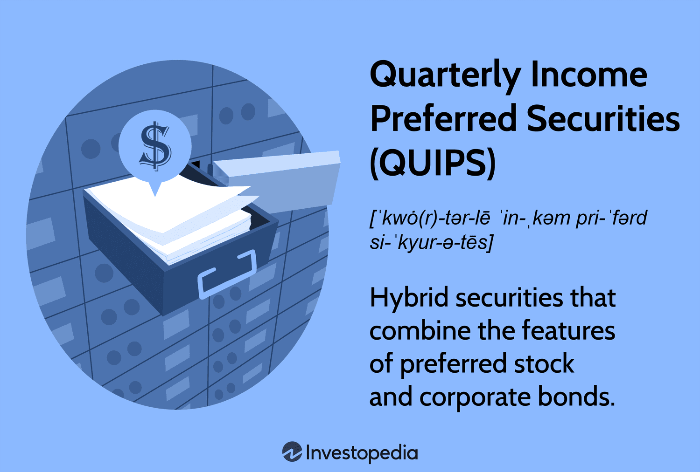

In the complex world of financial securities and investment strategies, Quarterly Income Preferred Securities (QUIPS) have emerged as a sophisticated financial instrument. Combining features of both bonds and preferred stocks, QUIPS provide unique financial benefits for companies and investors alike.

This article examines the intricate nature of QUIPS, exploring how they function, their benefits, potential risks, and the emerging role of algorithmic trading in enhancing their market performance. By combining the characteristics of fixed income through scheduled interest payments and equity through the preferred stock framework, QUIPS present a hybrid investment avenue offering quarterly distributions, which can be particularly appealing in today's volatile economic environment.



We'll also explore how algorithmic trading strategies can optimize investment in QUIPS, ensuring both stability and profitability for traders. By using sophisticated algorithms, traders can execute strategies that leverage the predictability and regularity of QUIPS' income streams while mitigating the inherent risks associated with market fluctuations.

Understanding these hybrid securities is immensely beneficial for corporate financiers and individual investors looking to diversify their portfolios and maximize returns. By providing a predictable income stream and potential tax advantages, QUIPS can serve as a cornerstone in a diversified investment strategy.

As we navigate through this discussion, we will also touch upon the relevance of QUIPS in the broader spectrum of automated investing and algorithmic trading techniques. These techniques, powered by advances in financial technology, have the potential to reshape how investors approach QUIPS, offering enhanced precision and efficiency in trading. Ultimately, QUIPS stand as a testament to the evolving landscape of investment instruments, promising an intriguing mix of stability and growth potential in well-balanced portfolios.

## Table of Contents

## What Are Quarterly Income Preferred Securities (QUIPS)?

Quarterly Income Preferred Securities (QUIPS) are sophisticated financial instruments that blend the characteristics of preferred stock and corporate bonds. Their primary design serves to deliver consistent quarterly income to investors seeking regular returns. QUIPS are essentially interests in a limited partnership or company, which are specifically established to issue such securities. The proceeds generated from the issuance are then loaned to the parent company, creating a structured flow of capital.

QUIPS are traded on major stock exchanges such as the New York Stock Exchange (NYSE). These instruments typically come with a par value of $25, and they feature long maturity periods ranging from 30 to 50 years. Such an extended maturity profile imparts a certain resilience and stability to the investment, appealing particularly to those who have a long-term investment horizon or require periodic income distributions.

The securities guarantee cumulative quarterly distributions, making them particularly attractive to income-focused investors. This cumulative aspect ensures that any missed payments accumulate and must be paid out before any dividends can be distributed to common shareholders. Consequently, QUIPS are regarded as a reliable income source.

From a corporate perspective, QUIPS offer significant tax advantages. When proceeds from these securities are loaned back to the parent company, the interest payments on the loans qualify as tax-deductible expenses. This feature enables companies to raise capital effectively without significantly altering their debt-to-equity ratios. This ability to maintain stable financial ratios while accessing cost-efficient capital makes QUIPS a strategic tool for corporate finance. 

In summary, Quarterly Income Preferred Securities provide an efficient mechanism for companies to manage their financial structure while offering investors a product that combines the benefits of credit-based and equity-based financial instruments.

## Understanding the Structure and Function of QUIPS

Quarterly Income Preferred Securities (QUIPS) were pioneered by Goldman, Sachs & Co. as innovative financial products for raising capital, offering distinct advantages to both issuers and investors. QUIPS are issued by special-purpose entities like limited liability companies (LLCs) or limited partnerships (LPs), which serve as subsidiaries of larger corporations. These entities are set up primarily to issue QUIPS and channel the raised capital to the parent company through loans. 

The structure of QUIPS involves the parent company paying interest on these loans, which is then passed on to QUIPS holders as dividends. This arrangement allows for dividends to be delivered without incurring corporate taxes, typically associated with stock dividends, thus providing a tax-efficient income stream to investors. 

From the perspective of the issuing company, the mechanism of QUIPS results in significant financial benefits. The foremost advantage is the cash flow benefit. By converting what would traditionally be considered equity finance into a form of debt, companies can capitalize on the cash infusion without affecting their debt-to-equity ratios significantly. Moreover, because the interest payments on the loans are tax-deductible, parent companies can reduce their taxable income, thus leading to further financial efficiency. 

For investors, QUIPS promise potentially attractive returns. Since dividends are paid from pre-tax dollars, the net return on investment can be higher compared to traditional preferred stocks. This makes QUIPS appealing to those seeking regular income while planning for tax efficiencies. However, the exact nature of returns may vary based on specific terms of issuance, including interest rates and market conditions.

In summary, the unique structuring of QUIPS as financial instruments provides dual benefits of tax advantages for the issuer and potentially higher returns for investors. This dual structure supports efficient capital management for corporations while delivering consistent income streams to investors, making QUIPS a notable component of hybrid security offerings in modern financial markets.

## Algorithmic Trading and Its Impact on QUIPS

Algorithmic trading employs computer algorithms to execute trades automatically, based on predefined criteria such as timing, price, or [volume](/wiki/volume-trading-strategy). The application of these algorithms in trading Quarterly Income Preferred Securities (QUIPS) introduces significant benefits, enhancing both the efficiency and profitability of transactions in this financial niche.

Investors utilizing [algorithmic trading](/wiki/algorithmic-trading) for QUIPS can leverage advanced data analytics and predictive modeling to maximize returns while managing inherent risks. Algorithms can analyze vast datasets to predict market movements, allowing investors to position their QUIPS portfolios strategically. This process uses statistical and [machine learning](/wiki/machine-learning) models to assess potential future price movements, optimizing entry and [exit](/wiki/exit-strategy) points for trades.

A key advantage of algorithmic trading in the QUIPS market is its ability to offer precise timing of trades. By analyzing real-time market data, algorithms determine the optimal moments to execute transactions, reducing transaction costs and improving price efficiency. For instance, an algorithm might be set to buy QUIPS when prices fall below a certain threshold or to sell once a specified profit margin is reached.

Additionally, algorithmic strategies facilitate optimal pricing strategies for QUIPS investors. By incorporating comprehensive risk assessments, these algorithms can evaluate the impact of market [volatility](/wiki/volatility-trading-strategies) on QUIPS valuations. In high-volatility environments, algorithmic trading systems might implement hedging strategies to protect portfolio value, thereby ensuring consistent income streams.

Another benefit is the ability of algorithmic trading to respond swiftly to market changes, leveraging real-time data inputs. This responsiveness is crucial for QUIPS investors in navigating fluctuating market conditions, as it allows them to adjust their positions systematically and promptly. For example, if an unforeseen market shift occurs, algorithms can be programmed to re-balance the portfolio, aligning it with the new market dynamics.

The integration of algorithmic trading techniques into QUIPS investing can significantly optimize portfolio performance. Traders and investors are increasingly looking to Python and other programming languages to design custom algorithms that capitalize on specific patterns in the QUIPS market. Below is a simple Python example illustrating how one might set up a basic algorithmic trading strategy for QUIPS:

```python
import pandas as pd
from sklearn.ensemble import RandomForestClassifier
from sklearn.model_selection import train_test_split
from sklearn.metrics import accuracy_score

# Load historical QUIPS data
data = pd.read_csv('quips_data.csv')

# Feature engineering
data['PriceChange'] = data['Close'].pct_change()
data['Volatility'] = data['High'] - data['Low']

# Prepare target and features
X = data[['PriceChange', 'Volatility']].fillna(0)
y = (data['Close'].shift(-1) > data['Close']).astype(int)

# Split into training and testing datasets
X_train, X_test, y_train, y_test = train_test_split(X, y, test_size=0.2)

# Initialize Random Forest model
model = RandomForestClassifier(n_estimators=100)

# Train model
model.fit(X_train, y_train)

# Make predictions
predictions = model.predict(X_test)

# Calculate model accuracy
accuracy = accuracy_score(y_test, predictions)
print(f'Model Accuracy: {accuracy:.2f}')
```

This example demonstrates a machine learning approach using a Random Forest classifier to predict QUIPS price trends based on historical data. Investors could integrate more sophisticated models and strategies to align their trading approaches with desired financial outcomes, further solidifying the role of algorithmic trading in enhancing the QUIPS market landscape.

## Risks and Considerations in QUIPS Investments

Quarterly Income Preferred Securities (QUIPS) present an attractive investment opportunity with their promise of steady income and favorable tax treatment. However, they come with specific risks that investors must carefully consider to make informed decisions.

One critical risk associated with QUIPS is the potential for deferred dividends. As cumulative preferred securities, QUIPS can defer dividend payments without defaulting, provided they fulfill payments later. While this provides flexibility for the issuer, it can disrupt income streams for investors relying on regular distributions. The uncertainty of when deferred payments will resume heightens the risk profile of these securities.

Another significant risk stems from their position as subordinated debt. In the event of an issuer's bankruptcy or liquidation, QUIPS holders are lower in the hierarchy of claims compared to traditional debt holders. This means they are at higher risk of losing their investment if the issuer cannot meet all its obligations, particularly during financial distress or unfavorable market conditions.

Market volatility also plays a pivotal role in the valuation of QUIPS. These securities, while offering fixed returns, are subject to price fluctuations in secondary markets, influenced by overarching economic trends and [interest rate](/wiki/interest-rate-trading-strategies) movements. For instance, an increase in prevailing interest rates can erode the relative attractiveness of QUIPS, potentially leading to a decrease in their market price. This volatility can result in capital losses for investors who may need to liquidate their holdings under unfavorable conditions.

Investors should approach QUIPS with a comprehensive assessment of these risks. Diversifying their investment portfolios can help mitigate the potential impact of deferred dividends and the consequences of market fluctuations. Moreover, understanding the nuanced structure and financial characteristics of QUIPS is crucial for optimizing returns while minimizing exposure to inherent financial risks. An investor's ability to evaluate the issuer's creditworthiness, market conditions, and interest rate outlook will be instrumental in navigating these risks effectively and ensuring that QUIPS contribute positively to their investment strategy.

## Conclusion

Quarterly Income Preferred Securities (QUIPS) provide a strategic avenue for corporations seeking effective capital generation while offering investors a reliable stream of income. These hybrid securities blend the features of bonds and preferred stocks, bringing tax efficiencies and structured return potentials that are appealing to various market participants. However, the inherent risks associated with QUIPS necessitate a prudent approach to managing investments.

The use of algorithmic trading in QUIPS can significantly refine investment strategies, providing stability and maximizing potential returns. Algorithmic trading allows investors to leverage technology for optimal entry and exit points, precise risk management, and the ability to swiftly capitalize on market inefficiencies. By employing advanced data analytics and real-time market tracking, investors can align their QUIPS investments with broader financial objectives, ensuring they are adaptable to shifts in market dynamics.

Despite their advantages, QUIPS require thorough research and a nuanced understanding to effectively integrate into an investment portfolio. Investors are encouraged to conduct comprehensive analyses, possibly with the support of financial advisors, to ascertain how QUIPS fit within their individual investment strategies and risk tolerance. Understanding the specific terms and conditions, such as call provisions and dividend deferrals, is essential for making informed investment decisions.

As financial markets continue to evolve with technological advancements, QUIPS represent a viable component for diversified investment portfolios. By understanding their characteristics and leveraging modern trading tools, investors can harness the benefits of QUIPS while mitigating potential risks. This approach not only enhances portfolio diversity but also aligns with strategic financial planning in an increasingly automated trading environment.

## References & Further Reading

[1]: ["Advances in Financial Machine Learning"](https://www.amazon.com/Advances-Financial-Machine-Learning-Marcos/dp/1119482089) by Marcos Lopez de Prado

[2]: ["Machine Learning for Algorithmic Trading"](https://github.com/stefan-jansen/machine-learning-for-trading) by Stefan Jansen

[3]: Borak, S., Härdle, W. K., & Truck, S. (2007). ["Statistical tools for finance and insurance."](https://www.semanticscholar.org/paper/Stable-Distributions-Borak-H%C3%A4rdle/e431ec5a36a08364e0df8d5540bccdde8305a629) Springer Science & Business Media.

[4]: ["The Intelligent Investor: The Definitive Book on Value Investing."](https://www.amazon.com/Intelligent-Investor-Definitive-Investing-Essentials/dp/0060555661) by Benjamin Graham

[5]: Fabozzi, F. J. (2007). ["Fixed Income Analysis."](https://www.amazon.com/Fixed-Income-Analysis-Frank-Fabozzi/dp/047005221X) John Wiley & Sons.

[6]: ["Quantitative Trading: How to Build Your Own Algorithmic Trading Business"](https://www.amazon.com/Quantitative-Trading-Build-Algorithmic-Business/dp/1119800064) by Ernest P. Chan

[7]: Hull, J. C. (2012). ["Options, Futures, and Other Derivatives."](https://www.semanticscholar.org/paper/Options%2C-Futures%2C-and-Other-Derivatives-Hull/89bdee500c8623864fc9eb7a471546aa713acc44) Pearson Education.