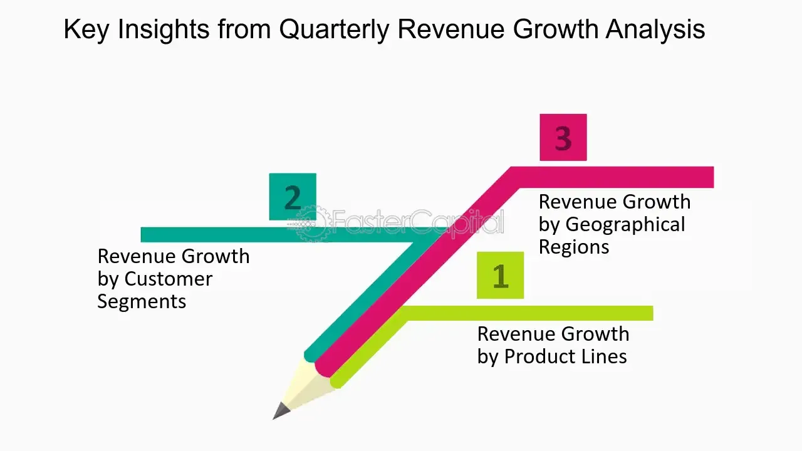

## Table of Contents

## What is quarterly revenue growth?

Quarterly revenue growth is how much a company's money from sales goes up over three months compared to the same three months in the year before. It shows if a company is doing better or worse at making money. If the number is positive, it means the company made more money than last year. If it's negative, the company made less money.

This number is important for people who want to know how well a company is doing. Investors, or people who put money into companies, look at this to decide if they should buy or sell the company's stocks. It also helps the company's leaders see if their plans are working or if they need to change something to make more money.

## How is quarterly revenue growth calculated?

To find out the quarterly revenue growth, you start by taking the revenue from the current quarter and subtracting the revenue from the same quarter of the last year. Then, you divide that number by the revenue from the last year's quarter. After that, you multiply the result by 100 to turn it into a percentage. This percentage tells you how much the revenue grew or shrank compared to the year before.

For example, if a company made $100,000 this quarter and $80,000 in the same quarter last year, you would subtract $80,000 from $100,000 to get $20,000. Then, divide $20,000 by $80,000 to get 0.25. Multiply 0.25 by 100 to find the growth rate, which is 25%. This means the company's revenue grew by 25% from last year to this year for that quarter.

## Why is it important to analyze quarterly revenue growth?

Analyzing quarterly revenue growth is important because it shows how well a company is doing over time. By looking at the growth, people can see if the company is making more money than it did before. This helps everyone understand if the company's plans are working and if it's getting better at selling its products or services. If the growth is good, it means the company is doing well and might be a good place to invest money or work at.

It's also useful for making decisions. For investors, knowing the quarterly revenue growth helps them decide if they should buy, sell, or keep the company's stocks. If the growth is high, it might be a good time to buy stocks because the company is doing well. For the people running the company, looking at this growth helps them see if they need to change their plans or keep doing what they're doing. It's like a report card that shows if the company is moving in the right direction.

## What are common factors that influence quarterly revenue growth?

Quarterly revenue growth can be influenced by many things. One big thing is how much people want to buy what the company is selling. If more people want the product or service, the company can sell more and make more money. Another thing is how much the company spends on ads or marketing. If they spend more money to tell people about their products, more people might buy them, which can help the revenue grow. Also, the economy can play a role. If the economy is doing well, people might have more money to spend, which can help the company's revenue grow.

Sometimes, things outside the company can affect its revenue too. For example, if there are new laws or rules that make it harder for the company to sell its products, this can hurt revenue growth. Competition from other companies can also be a [factor](/wiki/factor-investing). If another company starts selling something similar for less money, people might choose to buy from them instead, which can lower the company's revenue. Lastly, changes inside the company, like new products or changes in how they do business, can also make a big difference in quarterly revenue growth.

## How can a company improve its quarterly revenue growth?

A company can improve its quarterly revenue growth by focusing on making its products or services better. If the company listens to what customers want and makes changes to meet those needs, more people might buy from them. This could mean adding new features to a product or making the service easier to use. Also, the company can try to reach more people by selling in new places or using the internet to sell to people all over the world. By doing these things, the company can sell more and make more money.

Another way to boost revenue growth is by spending more on ads and marketing. If the company tells more people about what they're selling, more people might want to buy it. This could mean running ads on TV, on the internet, or even on social media. The company can also offer special deals or discounts to get people to buy more. It's important to make sure these ads reach the right people who are likely to be interested in the product or service. By doing this, the company can attract more customers and increase its revenue.

Lastly, the company can look at its prices and see if they can be changed to help growth. Sometimes, lowering prices a little can make more people want to buy, which can lead to more sales overall. On the other hand, if the company's product is really good and people want it a lot, they might be able to raise prices a bit without losing customers. It's all about finding the right balance to make sure the company is making as much money as possible each quarter.

## What are the limitations of using quarterly revenue growth as a performance metric?

Using quarterly revenue growth as a way to measure how well a company is doing can have some problems. One big issue is that it only looks at how much money the company makes, not how much it spends. So, a company might show a big jump in revenue, but if it spent a lot of money to get that growth, it might not be making as much profit as it seems. Also, quarterly revenue growth can go up and down a lot because of things like the time of year or special events. For example, a toy company might make a lot more money around the holidays, but that doesn't mean it's doing better overall.

Another limitation is that quarterly revenue growth doesn't tell the whole story about a company's health. It doesn't show if the company is making money in a way that can keep going in the future. Sometimes, a company might grow its revenue by selling things at a loss just to get more customers, but that's not a good plan for the long run. Also, this measure can be affected by things outside the company's control, like changes in the economy or new laws. So, while quarterly revenue growth is helpful, it's important to look at other things too, like profits, costs, and how happy customers are, to really understand how well a company is doing.

## How does quarterly revenue growth compare to annual revenue growth?

Quarterly revenue growth and annual revenue growth both look at how much more money a company makes over time, but they do it in different ways. Quarterly revenue growth checks how much the company's money from sales went up in one three-month period compared to the same three months in the year before. This can show quick changes in how well the company is doing. For example, if a company makes more money in the first three months of this year than it did in the first three months of last year, its quarterly revenue growth for that period is positive.

Annual revenue growth, on the other hand, looks at the whole year. It compares the total money made in one year to the total money made in the year before. This gives a bigger picture of the company's performance over a longer time. While quarterly growth can show short-term changes, annual growth can tell if those changes lasted or if they were just a one-time thing. Both are important, but they give different information about how a company is doing over time.

## What are the industry benchmarks for quarterly revenue growth?

Industry benchmarks for quarterly revenue growth can be different depending on the type of business. For example, fast-growing tech companies might aim for a quarterly revenue growth of 20% or more because they are always coming up with new things and trying to grow quickly. On the other hand, more established industries like utilities or consumer goods might see a quarterly revenue growth of 2% to 5% as good because they grow more slowly and steadily.

These benchmarks help companies see how they are doing compared to others in their field. If a tech company is only growing at 5% a quarter, it might need to look at what it's doing and see if it can do better. But if a utility company is growing at 10% a quarter, that might be seen as very good because it's higher than what is normal for their industry. So, knowing these benchmarks helps companies set goals and make plans to keep up or do better than others in their industry.

## How can external economic conditions impact quarterly revenue growth?

External economic conditions can have a big effect on a company's quarterly revenue growth. When the economy is doing well, people have more money to spend, so they might buy more things from the company. This can make the company's revenue grow. But if the economy is not doing well, like during a recession, people might not have as much money to spend. They might choose to save their money instead of buying things they don't need, which can make the company's revenue go down.

Also, things like interest rates and inflation can change how much people spend. If interest rates go up, it can cost more for people to borrow money, so they might spend less. If inflation is high, the prices of everything go up, and people might not buy as much because their money doesn't go as far. These economic conditions can make it harder for a company to grow its revenue each quarter, even if it's doing everything right.

## What advanced statistical methods can be used to forecast quarterly revenue growth?

To forecast quarterly revenue growth, companies can use a method called time series analysis. This method looks at past data to find patterns and trends. For example, it can show if a company's revenue goes up every year around the same time, like during the holiday season. By understanding these patterns, the company can make a good guess about how much its revenue might grow in the next quarter. Time series analysis can also use something called ARIMA models, which stand for AutoRegressive Integrated Moving Average. These models help predict future values based on past data by considering how past values and errors affect future growth.

Another advanced method is regression analysis. This method looks at how different things, like the economy or marketing spend, affect revenue growth. For example, if a company spends more on ads, regression analysis can help figure out how much that might increase revenue. It uses a lot of data to find the relationship between these factors and revenue growth. By understanding these relationships, the company can make better plans to grow its revenue. Both time series and regression analysis help companies make smarter decisions about the future by using data from the past.

## How do different accounting practices affect the reported quarterly revenue growth?

Different accounting practices can change how a company's quarterly revenue growth looks on paper. For example, some companies use a method called cash accounting, where they only count money when it actually comes in. Other companies use accrual accounting, where they count money when they earn it, even if they haven't gotten it yet. If a company switches from cash to accrual accounting, it might show a big jump in revenue growth because it's counting money it hasn't received yet. This can make the company look like it's doing better than it really is.

Another way accounting practices can affect reported revenue growth is through how a company recognizes revenue. Some companies might recognize all the revenue from a big sale in one quarter, even if the product or service is delivered over time. This can make that quarter's revenue growth look really high, but it might not be a true picture of how the company is doing over time. It's important for people looking at a company's numbers to understand these practices so they can see the real story behind the revenue growth numbers.

## What case studies illustrate successful strategies for maximizing quarterly revenue growth?

One example of a company that successfully maximized its quarterly revenue growth is Netflix. They did this by spending a lot of money on making their own TV shows and movies. This helped them stand out from other companies that just showed other people's content. By making shows like "Stranger Things" and "The Crown," they got a lot more people to sign up and keep their subscriptions. This made their revenue grow a lot each quarter. They also used data to see what people liked and made more of those kinds of shows, which helped them keep growing.

Another case study is Amazon. They grew their revenue by expanding into new areas like groceries and cloud computing. Amazon started selling more than just [books](/wiki/algo-trading-books) and electronics; they began offering fresh food through Amazon Fresh and Whole Foods. They also grew their cloud service, Amazon Web Services (AWS), which became a big part of their business. By doing this, they were able to make more money from different sources, which helped their quarterly revenue growth. Amazon also used special deals and fast shipping to get more people to buy from them, which kept their revenue growing.

## What is Understanding Quarterly Revenue Growth?

Quarterly revenue growth is a critical measure for assessing a company’s economic health and future prospects. This metric involves the systematic analysis of sales data over a sequence of quarters, enabling stakeholders to identify patterns and trends in a company's revenue generation capabilities. By comparing sales figures of the current quarter with those of preceding periods, analysts can gain insight into the company's market demand and adaptability in the competitive landscape.

Key metrics used in evaluating quarterly revenue growth include sequential growth and year-over-year comparisons. Sequential growth measures the percentage change in revenue from one quarter to the next. This metric is crucial for understanding short-term trends and immediate impacts of operational decisions or market conditions. The formula for sequential growth is:

$$
\text{Sequential Growth} = \left(\frac{\text{Revenue in Current Quarter} - \text{Revenue in Previous Quarter}}{\text{Revenue in Previous Quarter}}\right) \times 100
$$

Year-over-year (YoY) growth, on the other hand, compares the current quarter's revenue to the same quarter in the previous year. This metric facilitates the evaluation of performance over a longer time horizon and helps to assess growth beyond seasonal and cyclical fluctuations. The formula for year-over-year growth is:

$$
\text{YoY Growth} = \left(\frac{\text{Revenue in Current Quarter} - \text{Revenue in Same Quarter Last Year}}{\text{Revenue in Same Quarter Last Year}}\right) \times 100
$$

Investors and analysts utilize these growth measurements to forecast a company’s future performance and inform strategic decisions regarding investments. By understanding revenue growth trends, they can estimate a company's potential for sustained profitability and its competitive position in the market. This assessment is vital for identifying whether a company can maintain or enhance its market share and achieve long-term viability.

Analyzing quarterly revenue growth allows for an informed evaluation of a company’s operational success and strategic direction. It aids in discerning the effectiveness of business strategies, marketing approaches, and product offerings. Recognizing growth patterns also enables investors to identify industries and companies with robust growth prospects and minimize risks associated with investing in less sustainable ventures.

## References & Further Reading

[1]: Bergstra, J., Bardenet, R., Bengio, Y., & Kégl, B. (2011). ["Algorithms for Hyper-Parameter Optimization"](https://papers.nips.cc/paper/4443-algorithms-for-hyper-parameter-optimization). Advances in Neural Information Processing Systems 24.

[2]: ["Advances in Financial Machine Learning"](https://www.amazon.com/Advances-Financial-Machine-Learning-Marcos/dp/1119482089) by Marcos Lopez de Prado.

[3]: ["Evidence-Based Technical Analysis: Applying the Scientific Method and Statistical Inference to Trading Signals"](https://www.amazon.com/Evidence-Based-Technical-Analysis-Scientific-Statistical/dp/0470008741) by David Aronson.

[4]: ["Machine Learning for Algorithmic Trading"](https://github.com/stefan-jansen/machine-learning-for-trading) by Stefan Jansen.

[5]: ["Quantitative Trading: How to Build Your Own Algorithmic Trading Business"](https://www.amazon.com/Quantitative-Trading-Build-Algorithmic-Business/dp/1119800064) by Ernest P. Chan.