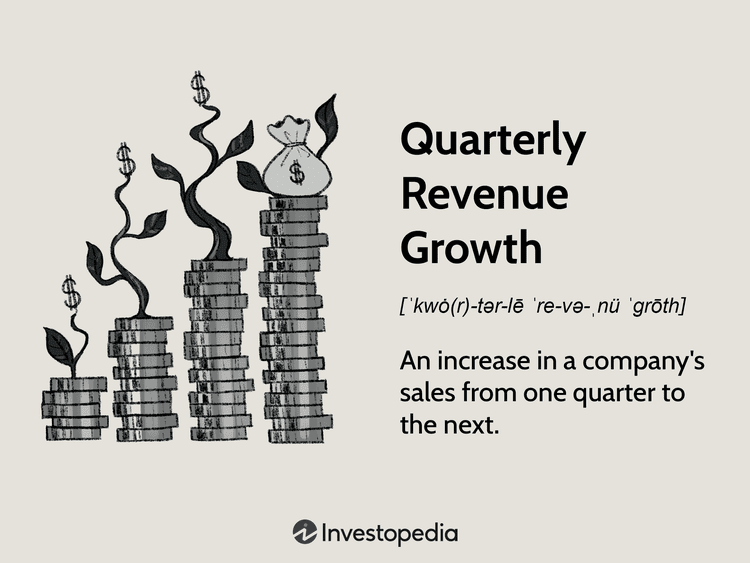

In the fast-paced world of finance, staying ahead relies heavily on understanding financial data. Quarterly revenue financial analysis is crucial for both investors and companies striving to make informed decisions. This analysis offers insights into a company's performance and market position by examining the fluctuations in sales figures over consecutive quarters.

The importance of understanding quarterly revenue growth cannot be overstated, as it provides a snapshot of the company's operational health and market demand for its products or services. By comparing revenue figures from various quarters, analysts can ascertain growth trajectories, assess market conditions, and predict future performance. This is particularly vital for investors, who use this data to determine investment strategies and make decisions based on a company's potential for long-term profitability.



With the growing influence of AI and algorithmic trading, the analysis of financial metrics such as revenue growth has become more complex and integral to industry success. Algorithmic trading utilizes revenue data to make rapid, informed trading decisions at scale, often outperforming traditional methods. This technological advancement has empowered traders and investors to optimize their strategies, enhancing the potential for financial success.

In understanding how financial strategies are shaped and investment decisions are driven by quarterly revenue growth analysis, one must consider the substantial role played by advanced analytics and algorithmic solutions. As these technologies become increasingly embedded in the financial sector, the ability to interpret and act on financial data is more critical than ever for maintaining a competitive edge.

## Table of Contents

## Understanding Quarterly Revenue Growth

Quarterly revenue growth is a critical measure for assessing a company’s economic health and future prospects. This metric involves the systematic analysis of sales data over a sequence of quarters, enabling stakeholders to identify patterns and trends in a company's revenue generation capabilities. By comparing sales figures of the current quarter with those of preceding periods, analysts can gain insight into the company's market demand and adaptability in the competitive landscape.

Key metrics used in evaluating quarterly revenue growth include sequential growth and year-over-year comparisons. Sequential growth measures the percentage change in revenue from one quarter to the next. This metric is crucial for understanding short-term trends and immediate impacts of operational decisions or market conditions. The formula for sequential growth is:

$$
\text{Sequential Growth} = \left(\frac{\text{Revenue in Current Quarter} - \text{Revenue in Previous Quarter}}{\text{Revenue in Previous Quarter}}\right) \times 100
$$

Year-over-year (YoY) growth, on the other hand, compares the current quarter's revenue to the same quarter in the previous year. This metric facilitates the evaluation of performance over a longer time horizon and helps to assess growth beyond seasonal and cyclical fluctuations. The formula for year-over-year growth is:

$$
\text{YoY Growth} = \left(\frac{\text{Revenue in Current Quarter} - \text{Revenue in Same Quarter Last Year}}{\text{Revenue in Same Quarter Last Year}}\right) \times 100
$$

Investors and analysts utilize these growth measurements to forecast a company’s future performance and inform strategic decisions regarding investments. By understanding revenue growth trends, they can estimate a company's potential for sustained profitability and its competitive position in the market. This assessment is vital for identifying whether a company can maintain or enhance its market share and achieve long-term viability.

Analyzing quarterly revenue growth allows for an informed evaluation of a company’s operational success and strategic direction. It aids in discerning the effectiveness of business strategies, marketing approaches, and product offerings. Recognizing growth patterns also enables investors to identify industries and companies with robust growth prospects and minimize risks associated with investing in less sustainable ventures.

## Financial Analysis of Revenue Growth

The financial analysis of revenue growth is a critical component in understanding a company's operational health and future prospects. This analysis involves several methodologies and tools to dissect and interpret sales data, offering insights into various dimensions of a company's performance.

Analysts frequently examine key metrics such as net income, earnings per share (EPS), profit margins, and forward guidance to assess revenue growth accurately. These components are vital in determining how effectively a company is converting sales into profit, thus indicating its operational efficiency and market potential. For instance, if a company shows strong revenue growth but declining profit margins, it might suggest increasing costs or inefficiencies that need addressing.

Historical data analysis plays a significant role in financial assessments. Reviewing past performance helps contextualize current revenue figures and identify trends that could forecast future growth. By comparing a company's performance against industry benchmarks, analysts can determine how well a company is doing relative to its peers. This comparative approach provides valuable insights into competitive standing and growth potential.

Economic conditions should also be considered in this analysis. Macroeconomic factors, such as inflation rates, consumer confidence, and currency fluctuations, can significantly impact revenue growth. Understanding the broader economic environment can help adjust revenue projections and strategies accordingly.

There are, however, limitations to the financial analysis of revenue growth. A primary concern is the emphasis on short-term data, which can obscure long-term strategic insights. Quarterly revenue figures, while useful for assessing the immediate past, may not always be indicative of sustainable growth trends. This limitation underscores the importance of integrating long-term strategic planning with short-term financial analysis.

By effectively analyzing these components, investors and analysts can make informed predictions about a company's future performance and strategic decision-making, aiding in the evaluation of its long-term viability and market position.

## The Role of Algorithmic Trading in Revenue Growth Analysis

Algorithmic trading, a cornerstone of modern financial markets, utilizes advanced algorithms to automate and optimize trading decisions by processing vast amounts of data at unprecedented speeds. One of the critical components it leverages is quarterly revenue growth metrics, which are essential for making informed and rapid decisions in financial markets.

AI algorithms play a central role in processing and analyzing financial data such as earnings reports. These algorithms can swiftly parse and interpret these reports to gain insights into a company's performance and its potential impact on stock prices. By using statistical methods and [machine learning](/wiki/machine-learning) models, these algorithms predict stock price movements and identify trading opportunities, allowing traders to capitalize on favorable market conditions efficiently.

Machine learning models, in particular, are adept at analyzing trends and historical data. For instance, by examining historical patterns of revenue announcements and corresponding stock price movements, these models can anticipate how future market behavior might unfold. This anticipatory capability enables traders to position their portfolios strategically in advance of earnings announcements, thereby potentially maximizing gains or minimizing losses.

The integration of [alternative data](/wiki/best-alternative-data) sources further enhances the predictive accuracy of [algorithmic trading](/wiki/algorithmic-trading) systems. Data such as social media sentiment, website traffic, or industry-specific indicators provide a more comprehensive view of a company's potential performance. Incorporating such data offers nuanced insights that can refine trading strategies and responses to market [volatility](/wiki/volatility-trading-strategies). For example, a sudden spike in webpage visits to an e-commerce site ahead of its earnings release might suggest stronger-than-expected sales, thereby informing a more favorable trading position.

Despite its advantages, algorithmic trading faces significant challenges, particularly concerning data accuracy and market reactions to sudden releases or earnings surprises. To mitigate these risks, traders must employ robust data validation processes to ensure the integrity of the data being used. Furthermore, models must be continuously refined to adapt to changing market conditions and new data patterns. Swift and unpredictable market reactions to earnings reports require algorithms that not only process data quickly but also adapt to emergent anomalies, preventing erroneous trades that could arise from misinterpretation.

In conclusion, algorithmic trading's use of revenue growth analysis represents a sophisticated intersection of finance and technology. Through AI, machine learning, and alternative data, it unlocks opportunities for more precise and effective trading strategies. However, mastering this requires a relentless focus on data quality and model accuracy, ensuring that decision-making is both rapid and reliable amidst the ever-changing dynamics of financial markets.

## Case Study: Implementing Algorithmic Strategies Based on Revenue Data

In recent years, companies have increasingly turned to algorithmic strategies to leverage revenue data for enhancing their financial performance. This approach involves utilizing advanced technologies such as [artificial intelligence](/wiki/ai-artificial-intelligence) (AI) and machine learning to better predict market movements, optimize trading decisions, and drive stock value growth. This section presents a case study of Company A, which has successfully implemented such strategies to surpass earnings expectations and achieve significant stock appreciation.

### Case Studies in Revenue-Based Algorithmic Strategies

#### Company A’s Success with AI-Driven Algorithms

Company A, a leader in the tech industry, implemented AI-driven algorithms to enhance its investment strategy based on quarterly revenue data. By employing machine learning models, the company was able to accurately forecast market conditions, leading to informed and timely trading decisions. These algorithms processed vast quantities of financial data, including earnings reports and alternative data sources, to predict stock price movements and identify undervalued opportunities. The application of such AI-based strategies enabled Company A to outperform market expectations and achieve consistent revenue growth. 

Algorithmic models integrated were particularly adept at processing real-time financial data and adapting to market volatility. Python implementations, using libraries such as TensorFlow and Pandas, allowed for sophisticated data analysis and visualization. For instance:

```python
import pandas as pd
import numpy as np
from sklearn.linear_model import LinearRegression
from sklearn.model_selection import train_test_split

# Sample dataset representing quarterly revenue
data = {
    'Quarter': ['Q1', 'Q2', 'Q3', 'Q4'],
    'Revenue': [500, 600, 700, 800]
}

# Converting dataset into a DataFrame
df = pd.DataFrame(data)

# Feature and Target variable
X = np.arange(len(df))
y = df['Revenue'].values

# Splitting dataset
X_train, X_test, y_train, y_test = train_test_split(X, y, test_size=0.2, shuffle=False)

# Reshape for regression
X_train = X_train.reshape(-1, 1)
X_test = X_test.reshape(-1, 1)

# Linear Regression model
model = LinearRegression().fit(X_train, y_train)

# Predicting future revenue
future_quarter = np.array([[4]])  # Predicting next quarter
predicted_revenue = model.predict(future_quarter)

print(f"Predicted Revenue for next quarter: {predicted_revenue[0]}")
```

### Evaluating Market Conditions and Decision Making

In using algorithmic strategies, Company A's approach heavily relied on continuous assessment of market conditions. The algorithms not only analyzed historical revenue data but also adjusted for current economic indicators and industry trends. By doing so, they maintained revenue estimates that closely aligned with actual performance. This ability to dynamically react to changes provided a competitive edge, enabling data-driven investment decisions that consistently improved returns. 

### Technological Advancements and Adaptability

The success of Company A highlights the broader significance of technological advancements in refining trading algorithms. The incorporation of AI methods allows for the analysis of complex data sets with increasing accuracy, enhancing the predictive power and reliability of investment strategies. Importantly, these strategies are not restricted to the tech sector alone; they are adaptable across various market sectors, including finance, healthcare, and consumer goods. The portability and scalability of such algorithmic solutions mean other companies can replicate and tailor them to sector-specific challenges and opportunities.

### Results and Lessons Learned

Company A's experience provides several key insights. The primary lesson is the importance of continued investment in technology and data analytics capabilities. Moreover, the adaptability of algorithmic trading strategies underscores their potential for broader application. These strategies emphasize the importance of integrating financial data analysis with real-time market assessment, ultimately driving strategic advantage. Thus, companies looking to implement similar strategies should focus on building robust data infrastructure and investing in AI-driven technologies to support their financial analysis endeavors. 

Adopting revenue-based algorithmic strategies offers valuable potential for achieving enhanced financial outcomes, whether in terms of outperforming market expectations, like Company A, or discovering novel investment opportunities in various industry sectors.

## Future Trends in Revenue Analysis and Algo Trading

The future of revenue analysis and algorithmic trading is set to witness transformative advancements, driven predominantly by the integration of sophisticated artificial intelligence (AI) technologies. As AI continues to evolve, its role in enhancing financial strategies becomes increasingly significant, with several key trends emerging.

One of the most salient trends is the advancement in real-time data processing and behavioral analytics. These technologies are designed to capture market sentiment shifts with greater precision, enabling traders and investors to make more informed decisions. By analyzing vast streams of data in real-time, AI systems can identify patterns and anomalies that human analysts might miss, providing a competitive edge in predicting market movements.

In addition to real-time analytics, there is a growing reliance on alternative data sources to enrich traditional financial metrics. Alternative data, which can include social media activities, satellite images, and even weather patterns, offers a new dimension for financial analysis. By integrating these diverse data sets, AI algorithms can construct a more comprehensive view of market conditions, leading to more accurate predictions and strategic decisions.

As AI technology advances, its capacity to refine financial strategies is expected to increase significantly. Machine learning models, in particular, demonstrate an ability to adapt to changing market dynamics, learning from historical data to improve future performance. These models can optimize trading algorithms by continuously updating their parameters based on new data inputs, thereby enhancing their predictive accuracy and effectiveness in rapidly changing environments.

For traders and investors, staying informed about these technological trends is crucial to maintaining a competitive edge. The financial markets are becoming ever more data-driven, and those who can leverage AI and alternative data effectively stand to benefit the most. Continuous education and adaptation to new tools and technologies will be essential for success in this dynamic landscape.

To summarize, the future of revenue analysis and algorithmic trading is closely tied to advancements in AI, particularly in real-time processing, behavioral analytics, and the utilization of alternative data sources. As these technologies evolve, they promise to reshape financial strategies, offering enhanced capabilities for those able to harness their potential.

## Conclusion

Quarterly revenue growth analysis is a vital element in the financial markets, serving as an indispensable tool for both investors and companies aiming to make informed strategic decisions. Algorithmic trading, powered by AI and advanced analytics, is at the cutting edge of exploiting this data for enhanced trading strategies and maximizing returns. By using AI and algorithms, traders can process large volumes of financial data rapidly, identify patterns, and execute trades with precision, often in fractions of a second.

Understanding and interpreting key financial metrics remains crucial in the ever-evolving landscape of financial decision-making. Metrics such as net income, earnings per share, and profit margins are cornerstones that provide insights into a company's financial health and potential for growth. These metrics help investors evaluate companies' operational efficiency and market potential, forming the basis for robust investment strategies.

As financial landscapes continue to change, staying informed and adaptable is more important than ever for seizing new opportunities. The financial markets are characterized by volatility and constant evolution, demanding that traders and investors remain vigilant to shifts in market dynamics and technological advancements.

By integrating advancements in revenue growth analysis, investors can equip themselves with the tools necessary to enhance their strategies and secure financial success in the future. Embracing technologies such as AI and machine learning, along with understanding and interpretation of revenue data, positions investors to leverage insights effectively and maintain a competitive edge in the marketplace. As the integration of sophisticated algorithms and real-time data analysis becomes more prevalent, those who adapt to these advancements will likely succeed in navigating and thriving within the complex financial environments of tomorrow.

## References & Further Reading

[1]: Bergstra, J., Bardenet, R., Bengio, Y., & Kégl, B. (2011). ["Algorithms for Hyper-Parameter Optimization"](https://papers.nips.cc/paper/4443-algorithms-for-hyper-parameter-optimization). Advances in Neural Information Processing Systems 24.

[2]: ["Advances in Financial Machine Learning"](https://www.amazon.com/Advances-Financial-Machine-Learning-Marcos/dp/1119482089) by Marcos Lopez de Prado.

[3]: ["Evidence-Based Technical Analysis: Applying the Scientific Method and Statistical Inference to Trading Signals"](https://www.amazon.com/Evidence-Based-Technical-Analysis-Scientific-Statistical/dp/0470008741) by David Aronson.

[4]: ["Machine Learning for Algorithmic Trading"](https://github.com/stefan-jansen/machine-learning-for-trading) by Stefan Jansen.

[5]: ["Quantitative Trading: How to Build Your Own Algorithmic Trading Business"](https://www.amazon.com/Quantitative-Trading-Build-Algorithmic-Business/dp/1119800064) by Ernest P. Chan.