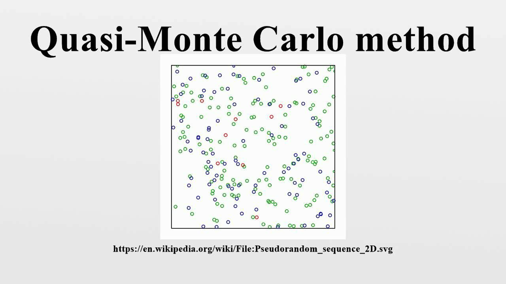

The Quasi-Monte Carlo (QMC) method is a numerical integration technique often utilized in computational finance and particularly in algorithmic trading. Unlike its counterpart, the Monte Carlo method, which relies on random sampling, QMC employs low-discrepancy sequences to cover the integration domain more uniformly. This characteristic of QMC methods is crucial for enhancing the accuracy of numerical solutions, particularly in high-dimensional spaces commonly encountered in financial computations.

In algorithmic trading, precise risk assessment and pricing of complex derivatives are essential. These instruments require accurate simulations to evaluate risk profiles and potential financial outcomes reliably. Traditional Monte Carlo methods, while popular, often demand a high number of sample points to reduce error, which can be computationally expensive. QMC methods contribute to these processes by providing more accurate computational results with fewer simulations. The deterministic nature of low-discrepancy sequences in QMC, such as Sobol' or Halton sequences, allows for an even distribution of points across the integration space, significantly improving the convergence rate of the method.



This article explores the functionality, benefits, and implementation of QMC methods in algorithmic trading, emphasizing their role in achieving enhanced precision in financial modeling. The discussion will include the generation and application of low-discrepancy sequences, the advantages they offer over traditional techniques, and considerations for their incorporation into existing trading infrastructures. Through this analysis, the article aims to highlight the significance of QMC methods in providing robust tools for traders and financial analysts, ultimately supporting more informed decision-making in an ever-evolving financial landscape.

## Table of Contents

## Understanding Quasi-Monte Carlo (QMC) Method

Quasi-Monte Carlo (QMC) methods are designed to approximate the integration of functions across multi-dimensional spaces with greater accuracy and efficiency than traditional Monte Carlo simulations. The fundamental difference between QMC and its Monte Carlo counterpart lies in the deterministic, low-discrepancy nature of QMC's sample points, which stand in contrast to the randomized samples used in Monte Carlo methods.

Low-discrepancy sequences aim to distribute sample points more uniformly across the integration domain. This uniform distribution helps cover the domain more effectively, thereby minimizing gaps and clusters that could lead to inaccurate results. One common measure of uniform distribution in QMC is *discrepancy*, which quantifies how far a sequence deviates from the perfectly uniform distribution. The lower the discrepancy, the closer the sequence is to being uniformly distributed.

QMC methods benefit from faster convergence rates, often described as having a convergence rate of $O(1/n)$, where $n$ is the number of sample points. In contrast, traditional Monte Carlo methods typically exhibit a convergence rate of $O(1/\sqrt{n})$. This increased rate is due to the systematic nature of low-discrepancy sequences, such as the Sobol or Halton sequences, which reduce variance and improve precision in the estimates of multidimensional integrals.

By using low-discrepancy sequences, QMC methods manage to effectively cover the high-dimensional spaces common in financial computations, yielding more accurate outcomes with fewer sample points. This makes them particularly advantageous for problems involving complex financial models and simulations, where computational resources and time are limited. Consequently, the implementation of QMC methods in fields such as computational finance and [algorithmic trading](/wiki/algorithmic-trading) has become highly valued for its ability to provide reliable results under resource constraints.

## Key Concepts of QMC in Algo Trading

Quasi-Monte Carlo (QMC) methods play a pivotal role in algorithmic trading by aiding in the simulation of various market scenarios and the assessment of risk. Unlike traditional Monte Carlo methods, which employ random sampling, QMC methods leverage low-discrepancy sequences to generate sample points that are more uniformly distributed across the integration domain. This fundamental difference allows QMC techniques to provide enhanced accuracy and efficiency, which are crucial in the calculation and pricing of complex financial derivatives.

The precision offered by QMC methods is particularly advantageous in pricing derivatives and managing portfolio risks. Derivatives, which are complex financial instruments whose value depends on the value of underlying assets, require precise calculations for effective pricing. QMC techniques help achieve this precision by reducing the variance commonly associated with traditional Monte Carlo simulations. This reduction in variance results in more reliable outcomes, thereby enabling traders to price derivatives more accurately.

In the realm of portfolio risk management, QMC methods facilitate stress testing – a critical process for evaluating how a portfolio might perform under various hypothetical adverse market conditions. By employing low-discrepancy sequences, QMC methods significantly enhance the efficiency of such stress tests, providing more accurate risk assessments for portfolios.

The primary benefit of QMC methods is their ability to increase precision while simultaneously reducing variance. This improvement allows traders to make more informed decisions, as the reduced uncertainty in QMC outputs translates to greater confidence in the resulting analyses. Ultimately, the use of QMC methods in algorithmic trading not only bolsters the accuracy of financial models but also enhances the reliability of risk management strategies.

## Advantages of Quasi-Monte Carlo in Algorithmic Trading

The use of Quasi-Monte Carlo (QMC) methods in algorithmic trading offers significant advantages over traditional Monte Carlo simulations, primarily due to their ability to generate more accurate and reliable results with a reduced number of simulations. This efficiency not only saves time but also optimizes computational resources, a crucial [factor](/wiki/factor-investing) in the fast-paced environment of financial markets.

The principal strength of QMC methods lies in their utilization of low-discrepancy sequences. These sequences are designed to cover integration domains more uniformly than random sampling methods, thereby reducing the error associated with high-dimensional financial problems. When addressing problems involving a large number of variables, such as the pricing of complex derivatives or assessing portfolio risk, QMC methods outperform traditional methods by minimizing variance and enhancing accuracy. This is achieved through the deterministic nature of low-discrepancy sequences, which leads to faster convergence rates.

In algorithmic trading, dealing with the curse of dimensionality is a persistent challenge, especially when constructing models for risk assessment and derivatives pricing. QMC methods provide a robust solution to this problem. The curse of dimensionality refers to the exponential increase in computational complexity as the number of dimensions grows. Since QMC sequences maintain their efficiency even in high-dimensional spaces, they offer a practical method for integrating functions over these domains without the drastic increase in computational cost faced by conventional Monte Carlo techniques.

Furthermore, the increased precision achieved by QMC methods empowers traders to make more informed decisions. By reducing variance and increasing the accuracy of simulated outcomes, traders gain deeper insights into potential market scenarios and risk factors. This precision is particularly beneficial during volatile market conditions, where the ability to quickly and accurately assess risk and pricing can significantly influence trading performance.

Overall, the advantages offered by QMC methods in algorithmic trading make them an invaluable tool for improving the precision and efficiency of financial models. These methods help traders effectively manage complex financial instruments, ultimately enhancing decision-making in a competitive trading environment.

## Implementing Quasi-Monte Carlo Methods

Implementation of Quasi-Monte Carlo (QMC) methods in algorithmic trading is centered around the generation and utilization of low-discrepancy sequences, such as Sobol or Halton sequences. These sequences are crucial for achieving a uniform coverage of the input space, which significantly enhances the approximation of integrals in financial models.

### Generating Low-Discrepancy Sequences

Low-discrepancy sequences are deterministic sequences that aim to uniformly cover a multi-dimensional space. In contrast to purely random sequences, these sequences are explicitly designed to minimize gaps and clusters, thus providing a more even distribution. Sobol sequences are particularly popular because of their ability to effectively handle high-dimensional spaces, making them suitable for complex financial models. Halton sequences, while effective in lower dimensions, can be less suitable as dimensionality increases due to correlation issues.

### Software Implementation

To implement these sequences within an algorithmic trading system, software solutions capable of generating and integrating these sequences are essential. Python is a prevalent choice for such implementations due to its extensive library support and ease of use. Below is a basic example of how to generate Sobol sequences using the Python library `scipy.stats.qmc`:

```python
from scipy.stats import qmc

# Define the dimension
dimension = 10

# Create a Sobol sequence generator
sobol_sampler = qmc.Sobol(d=d)

# Generate sample points
sample_points = sobol_sampler.random_base2(m=10)  # m = number of points generated is 2^m

# Print the generated points
print(sample_points)
```

This example demonstrates generating Sobol sequence sample points in a 10-dimensional space. The method `random_base2(m=10)` generates $2^{10}$ Sobol sequence points.

### Integration in Trading Systems

Incorporating QMC methods into algorithmic trading systems involves more than just generating sequences; it requires efficient computation that integrates these sequences into financial models. Trading algorithms often involve complex mathematical formulas for risk management, pricing of derivatives, and portfolio optimization. The integration of low-discrepancy sequences enhances these computations by reducing variance and increasing precision.

To further streamline implementation, many trading systems leverage specialized software and libraries that support QMC methods. These tools are designed to work alongside existing trading infrastructures, thus ensuring seamless data flow and computation efficiency.

In conclusion, the implementation of QMC methods is marked by the adoption of low-discrepancy sequences like Sobol, facilitated by modern computational tools. This implementation enhances the accuracy and efficiency of algorithmic trading models, making them more reliable and robust in complex financial scenarios.

## Challenges and Considerations

Applying Quasi-Monte Carlo (QMC) methods in algorithmic trading presents several challenges and considerations that require careful attention. One of the primary challenges is understanding and generating low-discrepancy sequences. These sequences, such as Sobol and Halton sequences, are fundamental to QMC methods because they ensure that computations are conducted over uniformly covered input spaces. The mathematical integrity of these sequences is crucial, and any deviation can significantly affect the accuracy of the financial models that traders rely on.

Despite their potential for greater accuracy, the adoption of QMC methods necessitates an initial investment in learning and system setup. Financial professionals and algorithm developers need to familiarize themselves with the mathematical concepts behind QMC, as well as the practical aspects of implementing them effectively. This learning curve can be steep, particularly for those accustomed to traditional Monte Carlo methods.

Moreover, integration of QMC methods into existing trading infrastructures requires careful planning. The trading systems need to be compatible with the computational demands of QMC processes. This includes ensuring that the hardware is equipped to handle the complexity of low-discrepancy sequence calculations. Additionally, software must be developed or modified to incorporate QMC algorithms, which might entail rewriting parts of the existing codebase in languages like Python or C++.

To address these challenges, organizations may need to invest in training and development sessions that focus on both theoretical and practical aspects of QMC. Collaboration with computational finance experts can also expedite the transition, ensuring that the integration is both efficient and effective.

In conclusion, while QMC methods offer substantial benefits in terms of accuracy and efficiency, their implementation is not without hurdles. A comprehensive approach to education, infrastructure compatibility, and algorithm integration is vital for unlocking the full potential of QMC in algorithmic trading.

## Conclusion

Quasi-Monte Carlo (QMC) methods offer substantial benefits for algorithmic trading by enhancing accuracy in financial valuations and risk assessments. These methods, with their use of low-discrepancy sequences, provide more uniform coverage of integration domains compared to traditional Monte Carlo methods, which translates to more reliable outcomes. The higher precision obtained through QMC can significantly impact the valuation of complex derivatives and the management of portfolio risks, crucial elements in algorithmic trading.

Despite the potential challenges associated with implementing QMC methods—such as the need for specialized knowledge in generating low-discrepancy sequences and the necessity for compatible computational infrastructure—the long-term benefits are substantial. The increased efficiency and reduced variance in calculations make QMC methods invaluable for financial professionals seeking to optimize their computational resources and improve decision-making processes.

Future advancements in computational technology and algorithms may further amplify the advantages of QMC methods. Enhancements in software capabilities and hardware performance could streamline the adoption of QMC techniques, making them more accessible and effective for a broader range of financial applications. As computational finance continues to evolve, QMC methods are poised to play an increasingly pivotal role in the sophisticated landscape of algorithmic trading.

## References & Further Reading

[1]: Caflisch, R. E. (1998). ["Monte Carlo and Quasi-Monte Carlo Methods."](https://www.semanticscholar.org/paper/Monte-Carlo-and-quasi-Monte-Carlo-methods-Caflisch/85b597939f26a4f7a149887e00e83e2f5ba35c8f) Acta Numerica, 7, 1-49.

[2]: Glasserman, P. (2003). ["Monte Carlo Methods in Financial Engineering."](https://link.springer.com/book/10.1007/978-0-387-21617-1) Springer.

[3]: Owen, A. B. (1998). ["Monte Carlo variance of scrambled net quadrature."](https://www.jstor.org/stable/pdf/2952022.pdf) SIAM Journal on Numerical Analysis, 36(5), 1501-1526.

[4]: Niederreiter, H. (1992). ["Random Number Generation and Quasi-Monte Carlo Methods."](https://epubs.siam.org/doi/book/10.1137/1.9781611970081) SIAM.

[5]: Joe, S., & Kuo, F. Y. (2008). ["Constructing Sobol sequences with better two-dimensional projections."](https://epubs.siam.org/doi/10.1137/070709359) SIAM Journal on Scientific Computing, 30(5), 2635-2654.

[6]: ["An Introduction to Algorithmic Trading: Basic to Advanced Strategies"](https://archive.org/details/introductiontoal0000lesh) by Edward Leshik and Jane Cralle

[7]: Sobol, I. M. (1967). ["On the Distribution of Points in a Cube and the Approximate Evaluation of Integrals."](https://www.sciencedirect.com/science/article/pii/0041555367901449) Zh. Vychisl. Mat. Mat. Fiz., 7(4), 784-802.