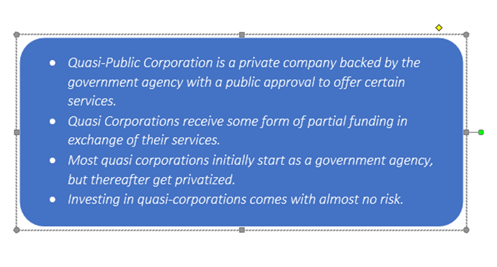

## Table of Contents

## What is a quasi-public corporation?

A quasi-public corporation is a type of business that is owned by the government but also operates like a private company. These organizations are usually set up to provide important services that the public needs, like utilities or transportation. Even though they are controlled by the government, they have more freedom to make their own business decisions compared to fully public agencies.

These corporations often get special benefits from the government, like tax breaks or the ability to borrow money more easily. This helps them to do their jobs better and serve the public more effectively. Examples of quasi-public corporations include public transit systems, water and sewer services, and some types of banks that focus on helping the community.

## How do quasi-public corporations differ from private companies?

Quasi-public corporations are different from private companies mainly because they are owned or controlled by the government. This means they have to follow government rules and their main goal is often to serve the public, not just to make money. For example, a quasi-public corporation might run a city's bus system, focusing on making sure people can get around easily, even if it doesn't make a big profit.

On the other hand, private companies are owned by individuals or groups of investors and their main goal is usually to make money for their owners. They have more freedom to make business decisions without government control. For instance, a private company might decide to stop selling a product if it's not making enough money, even if people really need it.

In summary, quasi-public corporations blend government oversight with some business freedom, while private companies focus more on profit and have less government control. This difference affects how each type of company makes decisions and what they prioritize.

## What are some examples of quasi-public corporations?

Some examples of quasi-public corporations are public transit systems and utility companies. A public transit system, like a city's bus or subway service, is often run by a quasi-public corporation. This means it's owned by the government but has some freedom to make its own decisions. The main goal of these transit systems is to help people get around the city easily, not just to make money.

Another example is utility companies that provide services like water, electricity, or gas. These companies are usually set up to make sure everyone in a community has access to these important services. Even though they are owned by the government, they can act a bit like private companies in how they run their business.

A third example is some types of banks, like community development banks. These banks focus on helping local areas grow and improve. They get special help from the government, like tax breaks, to make it easier for them to do their job of supporting the community.

## What is the role of government in quasi-public corporations?

The government plays a big role in quasi-public corporations. It owns or controls these companies, which means it can set rules and make sure they are doing what they are supposed to do. The main job of the government is to make sure these corporations are serving the public well. This could mean making sure buses run on time or that everyone has water and electricity.

Even though the government is in charge, it gives these corporations some freedom to make their own business decisions. This helps them work better and serve people more effectively. The government might also give them special benefits, like tax breaks or easier ways to borrow money. This helps the corporations do their jobs without worrying too much about making a big profit.

## How are quasi-public corporations funded?

Quasi-public corporations are funded in a few different ways. One way is through money they make from their services, like fares from buses or fees for water and electricity. This money helps them pay for their day-to-day costs. But since their main goal is to serve the public, not just make money, they often don't make enough to cover everything they need.

That's where the government comes in. The government can give them money directly from taxes or through special funds. Sometimes, the government helps them by giving them tax breaks or making it easier for them to borrow money. This extra help makes sure these corporations can keep providing important services to the public, even if they don't make a big profit.

## What are the benefits of quasi-public corporations to the public?

Quasi-public corporations help the public by making sure important services are available to everyone. They run things like buses, trains, and utilities like water and electricity. Since they are owned by the government, they focus on what people need, not just on making money. This means they can keep prices fair and make sure everyone can use their services, even if some people can't pay a lot.

Another benefit is that these corporations can work more efficiently than fully public agencies. They get some freedom to make their own business decisions, which helps them run better and serve people more effectively. They also get special help from the government, like tax breaks or easier loans, which lets them focus on serving the community without worrying too much about making a big profit.

## What are the challenges faced by quasi-public corporations?

Quasi-public corporations face some challenges because they have to balance serving the public and running like a business. They need to make sure everyone can use their services, but they also need money to keep going. Sometimes, they don't make enough money from fares or fees to cover all their costs. This can make it hard for them to keep their services running smoothly and to pay for things like new buses or fixing old pipes.

Another challenge is that they have to follow government rules, which can limit what they can do. Even though they get some freedom to make their own decisions, they still have to answer to the government. This can slow them down and make it harder to try new things or change quickly when they need to. Balancing these rules with the need to serve the public well can be tricky and can lead to problems if not handled carefully.

## How do quasi-public corporations contribute to economic development?

Quasi-public corporations help with economic development by providing important services that people and businesses need. They run things like buses and trains, which help people get to work and move around the city easily. This makes it easier for businesses to find workers and for workers to find jobs. They also provide utilities like water and electricity, which are essential for homes and businesses to operate. Without these services, it would be hard for a community to grow and attract new businesses.

These corporations also get special help from the government, like tax breaks or easier loans, which lets them focus on serving the community without worrying too much about making a big profit. This means they can keep prices fair and make sure everyone can use their services, even if some people can't pay a lot. By doing this, they help create a stable and supportive environment for economic growth. When people and businesses have access to reliable services, they are more likely to invest in the community, start new businesses, and help the local economy grow.

## What is the governance structure of a quasi-public corporation?

The governance structure of a quasi-public corporation is a mix of government control and business freedom. The government owns or controls these corporations, so it sets rules and makes sure they serve the public well. This means there is a board of directors or a similar group that the government appoints. This board helps make big decisions and keeps an eye on how the corporation is doing. They make sure the corporation is following the government's goals and serving the public's needs.

Even though the government is in charge, quasi-public corporations get some freedom to run like a business. This means they can make their own day-to-day decisions about things like how to spend their money or what services to offer. They have managers and staff who work to keep the services running smoothly. This mix of government oversight and business freedom helps these corporations work well and serve the community effectively.

## How do quasi-public corporations balance public interest with operational efficiency?

Quasi-public corporations have to balance serving the public and running efficiently. They do this by focusing on what people need, like good bus service or clean water, while also trying to keep costs down and work well. Since the government owns them, they have to make sure everyone can use their services, even if some people can't pay a lot. This means they might not make as much money as a private company, but they can still keep prices fair and make sure everyone is served.

To run efficiently, these corporations get some freedom to make their own business decisions. This helps them find ways to save money and do their jobs better. They can choose how to spend their money or what new services to offer. The government also helps by giving them tax breaks or making it easier to borrow money. This way, they can focus on serving the public without worrying too much about making a big profit. Balancing these two goals can be tricky, but it helps them provide important services while still running smoothly.

## What are the regulatory frameworks that govern quasi-public corporations?

Quasi-public corporations have to follow rules set by the government. These rules are there to make sure the corporations serve the public well and don't just focus on making money. The government can make laws and rules about how these corporations should run, what services they should offer, and how much they can charge. They also have to report to government agencies, which check to make sure they are doing what they are supposed to do.

These corporations also have their own boards of directors, which the government appoints. The board helps make big decisions and makes sure the corporation follows the government's goals. Even though they get some freedom to run like a business, they still have to follow the government's rules. This mix of government control and business freedom helps them serve the public while still working efficiently.

## How does the performance of quasi-public corporations impact national policy?

The way quasi-public corporations work can affect what the government decides to do. If these corporations do a good job, like running buses on time or keeping water clean, the government might decide to give them more money or help them in other ways. This can lead to new laws or policies that support these services even more. For example, if a bus system is helping people get to work easily, the government might make new rules to help it grow and serve more people.

On the other hand, if quasi-public corporations are not doing well, like if they are losing money or not serving people properly, the government might change its policies. They might make new rules to fix the problems or even decide to change how these corporations are run. For instance, if a water company is not keeping the water clean, the government might make stricter rules about water quality or give the company less money until it improves. So, the performance of quasi-public corporations can lead to big changes in how the government works and what it focuses on.

## References & Further Reading

[1]: Grimsey, D., & Lewis, M. K. (2004). ["Public Private Partnerships: The Worldwide Revolution in Infrastructure Provision and Project Finance."](https://www.researchgate.net/publication/264158128_Public_private_partnerships_The_worldwide_revolution_in_infrastructure_provision_and_project_finance) Edward Elgar Publishing.

[2]: Estrin, S., & Pelletier, A. (2018). ["Privatization in Developing Countries: What Are the Lessons of Recent Experience?"](https://eprints.lse.ac.uk/87348/1/Estrin_Privatization%20in%20developing%20countries.pdf) Oxford Economic Papers, 70(4), 923-951.

[3]: Brealey, R. A., Cooper, I. A., & Habib, M. A. (1996). ["Using Project Finance to Fund Infrastructure Investments."](https://onlinelibrary.wiley.com/doi/abs/10.1111/j.1745-6622.1996.tb00296.x) Economic Review, 96(4), 19-36.

[4]: Finnerty, J. D. (2013). ["Project Financing: Asset-Based Financial Engineering."](https://books.google.com/books/about/Project_Financing.html?id=-kgmZAyJtagC) John Wiley & Sons.

[5]: Kraakman, R. et al. (2017). ["The Anatomy of Corporate Law: A Comparative and Functional Approach."](https://academic.oup.com/book/3465) Oxford University Press.