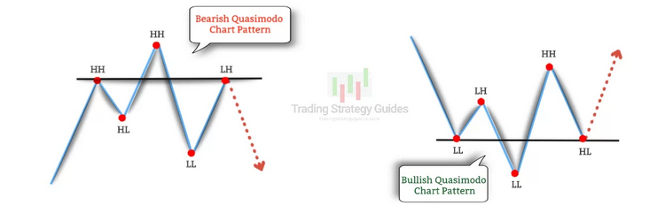

In algorithmic trading, understanding chart patterns can provide invaluable insights for anticipating market movements. Algorithmic trading, characterized by the use of computer programs to automate trading strategies, often relies on technical analysis to inform decision-making processes. Among the plethora of patterns that traders employ, the Quasimodo pattern stands out as a unique tool for identifying potential trend reversals. This pattern, also known colloquially as the "Over and Under" or QM pattern, is a lesser-known chart formation that holds great promise for spotting reversals, helping traders capitalize on changes in market direction before they become broadly apparent.

Despite being less popular than some classic patterns like Head and Shoulders or Double Tops and Bottoms, the Quasimodo pattern is gaining attention for its reliability in providing early signals of potential market shifts. As traders look for more sophisticated means of interpreting market data, the ability of the Quasimodo pattern to signal a change in trend direction makes it increasingly appealing. Its distinctive formation and the principles behind its use provide traders with a tactical edge that is not always apparent with more mainstream patterns.

This article explores what the Quasimodo pattern is, how it functions in algorithmic trading, and its practical applications. By understanding the nuances and strategies associated with this pattern, traders can integrate it effectively into their trading systems, potentially leading to improved trading outcomes. Whether employed in manual trading or considered for incorporation into a more automated framework, mastery of the Quasimodo pattern offers the potential for enhanced trading precision and profitability.

## Table of Contents

## What is the Quasimodo Trading Strategy?

The Quasimodo pattern is recognized in the financial markets as a reversal chart pattern, primarily signifying a potential change in trend direction. Its formation typically marks the end of an established uptrend or downtrend, indicating a forthcoming shift to the opposite trend. This pattern is characterized by a sequence of swing highs and lows, which disrupt the existing trend structure. Unlike some more familiar patterns, the Quasimodo can signal either a bullish or bearish reversal, providing traders with versatile opportunities to anticipate changes in market direction.

In essence, the pattern comprises a discontinuity in the prevailing trend, manifested through a series of price movements that break previous swing points. To illustrate, consider a bullish Quasimodo pattern. Here, the pattern starts with a large downtrend, followed by a significant swing high, which is then interrupted by a swing low surpassing the previous low. This low is trailed by a higher swing high, which fails to reach the preceding swing high, and ends with another swing low, bringing the price slightly lower than the previous swing low.

Contrary to the oft-confused Head and Shoulders pattern, the Quasimodo varies in the formation of the second swing low or high, which is more pronounced in the Quasimodo setup. This distinction is crucial in differentiating between the two, as it affects the strategy traders might employ. In the Head and Shoulders pattern, the focus often lies on a breakout entry, whereas the Quasimodo centers around reversal indications offered by specific swing formations. Understanding these nuances can enhance a trader’s ability to spot and act on potential trend reversals effectively.

## Types of Quasimodo Patterns

The Quasimodo pattern, a key tool in technical analysis for identifying potential reversals, can be categorized into two main types based on the trend in which they emerge: Bearish Quasimodo and Bullish Quasimodo. Understanding the subtle differences in their formations is critical for traders aiming to leverage these patterns effectively.

The Bearish Quasimodo pattern is typically found at the end of an uptrend, indicating a potential shift towards a downtrend. This pattern is characterized by a unique sequence of price swings. Initially, the price forms a higher high (HH) than the previous peak, suggesting that the uptrend might still be in play. However, the subsequent formation of a lower low (LL) indicates weakness in the existing trend. The pattern is completed when another lower high (LH) forms, confirming the likelihood of a reversal. This sequence of HH, LL, and LH disrupts the upward [momentum](/wiki/momentum) and suggests that sellers are gaining control, making it a prime point for considering short positions.

Conversely, the Bullish Quasimodo pattern appears at the tail end of a downtrend, signaling an impending upward reversal. Here, the formation begins with a lower low (LL), reinforcing the downtrend's current dominance. The crucial shift occurs when the price achieves a higher high (HH), suggesting buyers are stepping in. This move is followed by a higher low (HL), which further strengthens the case for a reversal. The emergence of this HH and HL sequence disrupts the downtrend’s momentum and indicates that buyers are increasingly influencing the market, presenting an opportunity for strategic long entries.

Each type of Quasimodo pattern offers strategic entry points based on its specific swing structures. Traders utilize these formations by looking for confirmation through additional technical indicators or reversal candlestick patterns, thus enhancing the efficacy of their trades. Understanding these patterns and their characteristics can enable traders to make informed decisions, minimizing risk and maximizing potential returns.

## How the Quasimodo Chart Pattern Works

The Quasimodo chart pattern acts as an indicator of trend reversal by disrupting the existing market price structure. This pattern effectively reveals when a prevailing market trend is likely to change direction, which aids traders in anticipating potential profit opportunities. 

For a bearish Quasimodo pattern, traders typically observe the current uptrend for signs of a lower swing high followed by a lower swing low. Such movements suggest the potential for a bearish reversal. The sequence involves an initial peak, a subsequent descent, a second peak that fails to surpass the first, and a further decline that dips below the initial descent low. This pattern indicates waning bullish momentum and the possible emergence of bearish forces, encouraging traders to consider short positions.

In contrast, a bullish Quasimodo pattern is identified within a downtrend. Here, the trader looks for a higher swing low and a higher swing high, which suggests a possible shift toward a bullish reversal. The progression involves a trough, a rise, a lower trough, and a climb that exceeds the previous peak, thereby indicating diminishing bearish momentum and the resurgence of bullish influence. This setup often prompts traders to take long positions.

Tools like trendlines and Fibonacci retracements can significantly enhance the identification of Quasimodo patterns. Trendlines help delineate the general direction of the market trend and identify deviations indicative of potential reversals. For example, a downward trendline can highlight a break that may signal a bullish Quasimodo setup. Incorporating Fibonacci retracements can further enhance understanding, as these levels often correspond to key points in the swing structure, such as peaks and troughs, thereby refining entry and [exit](/wiki/exit-strategy) points.

The use of such analytical tools in combination with the Quasimodo pattern provides traders with greater precision in identifying possible trend reversals, enabling more informed decision-making in their trading strategies.

## Comparison with Head and Shoulders Pattern

The Quasimodo and Head and Shoulders patterns share similarities in that both are used to identify potential trend reversals; however, they have distinct characteristics that differentiate them. A primary distinction is the structure of the second swing low/high in each pattern. In the Quasimodo pattern, this swing is more pronounced, offering a unique configuration that can be visually distinguished from that of a Head and Shoulders pattern. 

The Head and Shoulders pattern typically features three peaks: a higher central peak (the head) flanked by two lower peaks (the shoulders). It suggests a market reversal when prices break below the neckline formed by connecting the two troughs following the shoulders. This pattern is widely recognized for its [breakout](/wiki/breakout-trading) entry technique, where traders often enter positions when the price breaks and closes beyond the neckline, signaling a reversal.

In contrast, entry strategies for the Quasimodo pattern emphasize reversal candlestick patterns rather than relying solely on a breakout. This approach focuses on identifying specific candlestick formations that suggest a change in market sentiment, allowing traders to anticipate a reversal earlier compared to the breakout approach used in the Head and Shoulders pattern.

The application of these differing entry techniques underscores the importance of understanding the underlying market structure and trader sentiment associated with each pattern. While both patterns serve to signal potential reversals, their unique setups and corresponding entry strategies provide diverse tools for traders analyzing market trends.

## Trading the Quasimodo Pattern

Trading the Quasimodo pattern requires keen observation and strategic decision-making to capitalize on potential trend reversals effectively. Once a trader identifies the Quasimodo pattern, whether bullish or bearish, the next steps involve placing trades that align with the anticipated price movement, alongside employing rigorous risk management strategies.

In a bearish Quasimodo setup, the market typically signals the possibility of a trend reversal from an uptrend to a downtrend. Traders, therefore, consider short positions to capitalize on the expected price decrease. Understanding the structure of the bearish Quasimodo is essential, where a lower swing high followed by a lower swing low indicates the weakening of the upward trend. Short positions should be considered when the second low, below the first higher low, successfully forms. Once this point is established, traders can initiate short trades to leverage the market's anticipated downward trajectory. A practical approach is to set a stop-loss order slightly above the most recent swing high to mitigate potential losses in case the market does not conform to the anticipated movement and instead resumes the uptrend.

Conversely, a bullish Quasimodo pattern arises at the end of a downtrend and heralds a shift to an upward market direction. To maximize gains in this scenario, traders focus on establishing long positions. Acknowledging the characteristics of a bullish Quasimodo is crucial here, as it features the emergence of a higher swing high and a higher swing low during a weakening downtrend. Once this configuration is observed and confirmed, traders should prepare to enter long positions, ideally when the price forms a higher high. Implementing a protective stop-loss beneath the recent swing low can protect against unforeseen market movements that might return to a downward trend.

Risk management remains a pivotal aspect of trading the Quasimodo pattern. Beyond strategically placed stop-loss orders, traders should also define clear profit targets to secure gains as the market moves favorably. This involves regularly monitoring the market and adjusting strategies to lock in profits as price levels achieve pre-defined thresholds. Moreover, applying effective risk/reward ratios in trade setups can enhance the overall trading strategy by ensuring that the potential reward justifies any risk incurred. A recommended practice is to maintain a minimum risk-to-reward ratio of 1:2, ensuring that profits outpace potential losses satisfactorily.

In summary, executing trades based on the Quasimodo pattern revolves around accurate pattern identification and strategic trade management, underpinned by sound risk management practices. Whether anticipating a bearish or bullish reversal, traders can optimize their market entry and exit points to effectively manage and capitalize on the potential reversals signaled by the Quasimodo pattern.

## Pros and Cons of the Quasimodo Pattern

The Quasimodo chart pattern offers distinct advantages and disadvantages when applied to trading strategies. 

Among its advantages, the Quasimodo pattern is renowned for its ability to provide early entry signals, which can be pivotal in maximizing potential profits while minimizing risks. The pattern is identifiable by its unique structure of a swing high followed by a lower swing low, another higher swing high, and finishing with a final lower swing low in a bearish setup (and the reverse for a bullish setup). This distinct formation allows traders to recognize pivotal points in the market, offering a favorable risk/reward ratio. Early recognition of these pivot points enables traders to position themselves optimally ahead of a trend reversal.

Another benefit of the Quasimodo pattern is its visual ease of identification, which can be advantageous for traders once they become accustomed to its specific characteristics. The pattern's geometry becomes intuitive over repeated exposure, decreasing the likelihood of human error in its identification.

On the downside, the Quasimodo pattern is frequently traded manually. This requirement may not align well with traders who prefer or rely on automated trading systems. The manual nature of identifying and acting upon this pattern means that it demands constant market observation, making it potentially less suitable for traders who favor algorithmic strategies that capitalize on high-frequency or numerous simultaneous trades.

Moreover, the complexity of the Quasimodo pattern can pose challenges when integrating it into algorithmic models. The nuanced nature of its formation necessitates sophisticated pattern recognition capabilities, which can be difficult to code accurately. Designing algorithms that not only recognize the pattern but also make intelligent trading decisions based on it requires advanced computational resources and expertise in [quantitative trading](/wiki/quantitative-trading).

Overall, while the Quasimodo pattern boasts significant potential in providing early market signals and a robust risk/reward structure, its implementation may be best suited to traders who prioritize manual analysis over automated processes. Advanced recognition systems and algorithmic strategies would need to address its complexity for it to be effectively used within automated trading models.

## Conclusion

The Quasimodo pattern has proven itself to be a valuable instrument for traders aiming to pinpoint potential reversal points in financial markets. Its distinctive structure offers early signals that can be crucial for making informed trading decisions. This pattern's reliance on the breaking and reforming of specific market structures enables traders to anticipate trend reversals with greater accuracy.

Traders favor the Quasimodo pattern due to its unique ability to provide early warning of market shifts, which can lead to advantageous entry positions with an appealing risk/reward ratio. This characteristic makes it particularly attractive to traders who are adept at manually identifying and acting upon such patterns.

Nevertheless, integrating the Quasimodo pattern into [algorithmic trading](/wiki/algorithmic-trading) systems presents certain challenges. The complexity of the pattern's structure can be difficult to encode into algorithms, and the need for nuanced visual identification may not align seamlessly with automated trading strategies. Despite these hurdles, mastering the Quasimodo pattern can be immensely rewarding for those who commit to understanding its intricacies and incorporating it into their trading toolkit. The ability to identify and act on reversal signals provided by this pattern can lead to enhanced trading performance and potentially greater profitability.

## References & Further Reading

[1]: ["Advances in Financial Machine Learning"](https://www.amazon.com/Advances-Financial-Machine-Learning-Marcos/dp/1119482089) by Marcos Lopez de Prado

[2]: ["Evidence-Based Technical Analysis: Applying the Scientific Method and Statistical Inference to Trading Signals"](https://www.amazon.com/Evidence-Based-Technical-Analysis-Scientific-Statistical/dp/0470008741) by David Aronson

[3]: ["Machine Learning for Algorithmic Trading"](https://github.com/stefan-jansen/machine-learning-for-trading) by Stefan Jansen

[4]: ["Quantitative Trading: How to Build Your Own Algorithmic Trading Business"](https://www.amazon.com/Quantitative-Trading-Build-Algorithmic-Business/dp/1119800064) by Ernest P. Chan

[5]: Bulkowski, T. J. (2005). ["Encyclopedia of Chart Patterns"](https://books.google.com/books/about/Encyclopedia_of_Chart_Patterns.html?id=tIwlEAAAQBAJ). John Wiley & Sons.

[6]: Lo, A. W., Mamaysky, H., & Wang, J. (2000). ["Foundations of Technical Analysis: Computational Algorithms, Statistical Inference, and Empirical Implementation."](https://www.cis.upenn.edu/~mkearns/teaching/cis700/lo.pdf) The Journal of Finance, 55(4), 1705-1765.