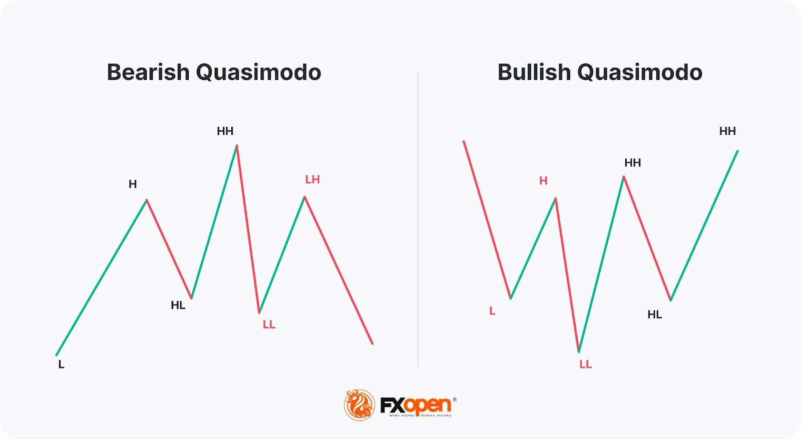

## Table of Contents

## What is the Quasimodo Trading Strategy?

The Quasimodo Trading Strategy is a way to trade in financial markets by looking at specific patterns on price charts. It helps traders find good times to buy or sell by spotting what are called "Quasimodo patterns." These patterns show up when the price of something, like a stock or a currency, moves in a certain way that forms a shape on the chart. Traders use these shapes to predict where the price might go next.

The key to the Quasimodo pattern is that it often looks like a head with two shoulders. This is similar to another pattern called the "head and shoulders," but the Quasimodo pattern can appear in different ways. When traders see this pattern, they look for signs that the price is about to change direction. If the pattern suggests the price will go up, traders might buy. If it suggests the price will go down, they might sell. By using this strategy, traders try to make money by getting in and out of the market at the right times.

## How does the Quasimodo pattern form on a price chart?

The Quasimodo pattern forms on a price chart when the price of a stock, currency, or another financial asset makes a certain shape. This shape looks a bit like a person's head with two shoulders. It starts when the price goes up to a high point, then drops down a bit, and goes up again to another high point that's usually a little lower than the first high. After reaching this second high, the price falls again, creating a dip. Then, the price rises one more time, but not as high as the first two highs, forming what looks like the other shoulder. The key part of the pattern is the middle high point, which is called the "head."

Once the Quasimodo pattern is complete, traders watch to see if the price breaks through the neckline, which is a line drawn across the lowest points of the two dips. If the price breaks below this neckline, it might mean the price will keep going down, and traders might decide to sell. If the price breaks above the neckline, it could mean the price will go up, and traders might choose to buy. The Quasimodo pattern helps traders guess where the price might go next, but it's not perfect and should be used with other tools to make better trading decisions.

## What are the key components of the Quasimodo pattern?

The Quasimodo pattern has a few main parts that traders look for on a price chart. The first part is the left shoulder, which forms when the price goes up to a high point and then drops a bit. Next comes the head, which is the highest point of the pattern. The price goes up again, usually higher than the left shoulder, to form this head. After the head, the price drops down to make a dip, and then it rises again but not as high as the head. This second rise forms the right shoulder, which is usually about as high as the left shoulder.

Once the pattern is complete, traders pay attention to the neckline. The neckline is a line drawn across the lowest points of the dips between the shoulders and the head. If the price breaks below this neckline, it might mean that the price will keep going down, and traders might decide to sell. If the price breaks above the neckline, it could mean the price will go up, and traders might choose to buy. The Quasimodo pattern helps traders guess where the price might go next, but it's not perfect and should be used with other tools to make better trading decisions.

## How can a beginner identify a Quasimodo pattern?

A beginner can identify a Quasimodo pattern by looking at a price chart and finding a shape that looks like a person's head with two shoulders. Start by finding a high point on the chart, which is the left shoulder. After the left shoulder, the price will go down a bit and then go up again to make the head, which is the highest point of the pattern. After the head, the price drops again and then rises one more time to form the right shoulder, which is usually about as high as the left shoulder. This creates the full Quasimodo pattern on the chart.

Once the pattern is complete, beginners should look for the neckline, which is a straight line drawn across the lowest points between the shoulders and the head. If the price breaks below this neckline, it might mean the price will keep going down, and it could be a good time to sell. If the price breaks above the neckline, it might mean the price will go up, and it could be a good time to buy. Remember, the Quasimodo pattern is just one tool and works best when used with other trading strategies and tools to make better decisions.

## What are the entry and exit points when using the Quasimodo strategy?

When using the Quasimodo strategy, the entry point for a trade is when the price breaks through the neckline of the pattern. If the price breaks below the neckline, it's a signal to enter a sell trade because it might mean the price will keep going down. On the other hand, if the price breaks above the neckline, it's a signal to enter a buy trade because it might mean the price will go up. The neckline is a line drawn across the lowest points between the shoulders and the head of the Quasimodo pattern.

The exit point for a trade depends on how the price moves after entering the trade. If you entered a sell trade because the price broke below the neckline, you might exit the trade when the price reaches a certain level that you think is low enough, or when the price starts to go back up. If you entered a buy trade because the price broke above the neckline, you might exit when the price reaches a certain high level, or when the price starts to go back down. It's important to set clear goals for when to exit a trade to make sure you don't lose too much money if the price doesn't move the way you expected.

## What are the common mistakes to avoid when trading with the Quasimodo pattern?

One common mistake when trading with the Quasimodo pattern is not waiting for the price to break the neckline before entering a trade. Some traders get excited when they see the pattern forming and jump in too early, before the price actually breaks the neckline. This can lead to losses if the price doesn't move the way they expected. It's important to be patient and wait for the clear signal that the price has broken the neckline before making a move.

Another mistake is not using other tools to help with trading decisions. The Quasimodo pattern can give good hints about where the price might go, but it's not perfect. Using other tools like support and resistance levels, trend lines, and indicators can help make better trading choices. Relying only on the Quasimodo pattern without checking other signs can lead to mistakes and lost money. It's best to use the Quasimodo pattern as one part of a bigger trading plan.

## How does the Quasimodo strategy differ from other trading patterns?

The Quasimodo strategy is different from other trading patterns because it focuses on a specific shape that looks like a head with two shoulders. This shape helps traders guess where the price might go next. Other patterns, like the head and shoulders or double tops and bottoms, also look at shapes on the chart, but the Quasimodo pattern has its own special way of forming. For example, the Quasimodo pattern's head is usually the highest point, and the shoulders are about the same height, which is not always the case with other patterns.

Another way the Quasimodo strategy differs is in how traders use it to enter and exit trades. With the Quasimodo pattern, traders wait for the price to break through the neckline before they decide to buy or sell. This is different from some other patterns where traders might enter a trade based on other signals, like a certain price level or a trend line. The Quasimodo strategy also encourages traders to use other tools along with the pattern to make better decisions, which is a good practice but not always emphasized in other trading strategies.

## Can the Quasimodo pattern be used in conjunction with other technical indicators?

Yes, the Quasimodo pattern can be used along with other technical indicators to make better trading choices. When you see a Quasimodo pattern on the chart, you can check other tools like moving averages, the Relative Strength Index (RSI), or the Moving Average Convergence Divergence (MACD) to see if they also suggest the same thing. For example, if the Quasimodo pattern says the price might go down and the RSI is also showing that the price might be too high, it can give you more confidence in your trading decision.

Using other indicators with the Quasimodo pattern helps because no single tool is perfect. The Quasimodo pattern gives you a good hint about where the price might go next, but by looking at other signs too, you can make smarter trades. It's like getting a second opinion before making a big decision. This way, you can feel more sure about when to buy or sell, and hopefully make more money while losing less.

## What are the best time frames for trading using the Quasimodo pattern?

The Quasimodo pattern can be used on different time frames, but it works best on longer time frames like the daily or weekly charts. These longer time frames give you a clearer picture of the overall trend and help you see the pattern more easily. When you look at a daily chart, you can see how the price moves over days, which is good for spotting the Quasimodo pattern and making trading decisions based on it.

For people who like to trade more often, shorter time frames like the 4-hour or 1-hour charts can also work. But remember, the shorter the time frame, the more noise you might see on the chart, which can make it harder to spot the Quasimodo pattern correctly. If you use shorter time frames, it's a good idea to check the pattern on a longer time frame too, to make sure your trading decision is based on a strong signal.

## How can risk management be applied when using the Quasimodo strategy?

When using the Quasimodo strategy, risk management is important to protect your money. One way to do this is by setting a stop-loss order. A stop-loss order is like a safety net that automatically sells your trade if the price goes against you by a certain amount. For example, if you enter a trade when the price breaks the neckline of the Quasimodo pattern, you can set a stop-loss just above or below the neckline, depending on whether you're buying or selling. This way, if the price moves the wrong way, you won't lose too much money.

Another way to manage risk is by deciding how much money you're willing to risk on each trade. This is called position sizing. Before you enter a trade, think about how much of your money you want to use. A common rule is to risk only a small part of your total money, like 1% or 2%, on any single trade. By doing this, even if you lose on a trade, you won't lose a lot of your money at once. Using these risk management techniques with the Quasimodo strategy can help you trade more safely and keep your money safe over time.

## What are some real-life examples of successful trades using the Quasimodo pattern?

One real-life example of a successful trade using the Quasimodo pattern happened with a trader named Sarah who was watching the daily chart of a popular stock. She noticed the price making a clear Quasimodo pattern, with the left shoulder, head, and right shoulder all in place. When the price broke below the neckline, Sarah entered a sell trade. She set her stop-loss just above the neckline to protect her money. The price kept going down just like the pattern suggested, so Sarah was able to sell at a good price and make a profit.

Another example is with a trader named Mike, who was trading a currency pair on a 4-hour chart. He saw a Quasimodo pattern forming and waited patiently for the price to break above the neckline. Once it did, Mike entered a buy trade and set his stop-loss just below the neckline. The price went up as the pattern predicted, and Mike was able to buy low and sell high, making a nice profit. Both Sarah and Mike used the Quasimodo pattern along with good risk management to make successful trades.

## How can an expert trader optimize the Quasimodo strategy for different market conditions?

An expert trader can optimize the Quasimodo strategy by adjusting it to fit different market conditions. In a strong trending market, the trader might focus on using the Quasimodo pattern to enter trades in the direction of the trend. For example, if the market is in a strong uptrend, the trader would look for Quasimodo patterns that suggest the price will keep going up and enter buy trades when the price breaks above the neckline. In a downtrend, the trader would do the opposite, looking for patterns that suggest the price will keep going down and entering sell trades when the price breaks below the neckline. By aligning the Quasimodo pattern with the overall trend, the trader can increase the chances of making successful trades.

In a sideways or choppy market, an expert trader might use the Quasimodo pattern more carefully. They might wait for other signs, like a breakout from a range or a change in market sentiment, before entering a trade based on the Quasimodo pattern. The trader could also use shorter time frames to spot smaller Quasimodo patterns that might work better in a choppy market. By combining the Quasimodo pattern with other technical indicators like the Relative Strength Index (RSI) or Moving Average Convergence Divergence (MACD), the trader can get a better sense of when to enter and exit trades, even in tricky market conditions.

## References & Further Reading

[1]: ["Advances in Financial Machine Learning"](https://www.amazon.com/Advances-Financial-Machine-Learning-Marcos/dp/1119482089) by Marcos Lopez de Prado

[2]: ["Evidence-Based Technical Analysis: Applying the Scientific Method and Statistical Inference to Trading Signals"](https://www.amazon.com/Evidence-Based-Technical-Analysis-Scientific-Statistical/dp/0470008741) by David Aronson

[3]: ["Machine Learning for Algorithmic Trading"](https://github.com/stefan-jansen/machine-learning-for-trading) by Stefan Jansen

[4]: ["Quantitative Trading: How to Build Your Own Algorithmic Trading Business"](https://www.amazon.com/Quantitative-Trading-Build-Algorithmic-Business/dp/1119800064) by Ernest P. Chan

[5]: Bulkowski, T. J. (2005). ["Encyclopedia of Chart Patterns"](https://books.google.com/books/about/Encyclopedia_of_Chart_Patterns.html?id=tIwlEAAAQBAJ). John Wiley & Sons.

[6]: Lo, A. W., Mamaysky, H., & Wang, J. (2000). ["Foundations of Technical Analysis: Computational Algorithms, Statistical Inference, and Empirical Implementation."](https://www.cis.upenn.edu/~mkearns/teaching/cis700/lo.pdf) The Journal of Finance, 55(4), 1705-1765.