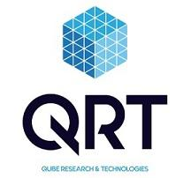

## Table of Contents

## What is Qube Research & Technologies?

Qube Research & Technologies, often called Qube, is a company that focuses on using technology and data to help people make better decisions in finance. They use computers and special math formulas to look at lots of information and find patterns that can help predict what might happen in the stock market or other financial areas. This helps their clients, who are usually big investors or financial institutions, make smarter choices about where to put their money.

The company was started in 2009 and has grown a lot since then. They have offices in different parts of the world, like London, New York, and Singapore. Qube is known for hiring smart people who are good at math, science, and technology. They work together to create new ways to analyze data and improve their financial predictions. This makes Qube a leader in what is called quantitative research, where numbers and data drive decisions.

## When was Qube Research & Technologies founded?

Qube Research & Technologies was founded in 2009. This company uses computers and math to look at a lot of information and find patterns. These patterns help people make better choices about money, like where to invest.

Qube helps big investors and financial groups. They have offices in places like London, New York, and Singapore. The company hires smart people who are good at math, science, and technology to work on new ways to understand data and make predictions.

## Who are the founders of Qube Research & Technologies?

Qube Research & Technologies was started by two people named David Gorton and Ian Harding. They wanted to use computers and math to help people make better choices with their money. David and Ian saw that by looking at a lot of information, they could find patterns that would help predict what might happen in the stock market or other financial areas.

David Gorton and Ian Harding began Qube in 2009. They believed that using technology and data could make a big difference in finance. Their idea was to help big investors and financial groups make smarter decisions about where to put their money. Since then, Qube has grown a lot and now has offices in places like London, New York, and Singapore.

## What types of investment strategies does Qube Research & Technologies employ?

Qube Research & Technologies uses different ways to help people invest their money smartly. They use computers and math to look at a lot of information and find patterns. This helps them make predictions about what might happen in the stock market or other financial areas. Qube focuses on something called quantitative research, where they use numbers and data to make decisions. This means they look at things like how stocks have moved in the past, what the economy is doing, and other information to guess what might happen next.

Their strategies include looking at lots of different investments at the same time. This is called diversification, which means they spread the money across different things to lower the risk. Qube also uses something called algorithmic trading, where computers automatically buy and sell investments based on the patterns they find. This can happen very quickly and can help take advantage of small changes in the market. By using these methods, Qube tries to help their clients make more money while also trying to keep their investments safe.

## How does Qube Research & Technologies use quantitative analysis in its investment approach?

Qube Research & Technologies uses quantitative analysis to help people make smart choices about their money. They look at a lot of numbers and data to find patterns. This helps them guess what might happen in the stock market or other financial areas. By using computers and math, they can see how stocks have moved in the past and what the economy is doing now. This information helps them make predictions about the future.

Their approach involves looking at many different investments at the same time. This is called diversification, which helps spread the risk. Qube also uses computers to buy and sell investments automatically. This is called algorithmic trading, and it lets them take advantage of small changes in the market quickly. By using these methods, Qube tries to help their clients make more money while also trying to keep their investments safe.

## What are the main sectors or markets that Qube Research & Technologies focuses on?

Qube Research & Technologies looks at many different areas where people can invest their money. They focus on stocks, which are parts of companies that people can buy and sell. They also look at bonds, which are like loans that people give to companies or governments. Qube pays attention to how these investments are doing in different parts of the world, like in the United States, Europe, and Asia. This helps them understand what's happening in different markets and make better predictions.

Besides stocks and bonds, Qube also looks at other kinds of investments. They study things like commodities, which are things you can touch, like gold or oil. They also look at currencies, which is the money used in different countries. By looking at all these different areas, Qube can help their clients spread their money around and lower the risk of losing it all in one place. This way, they can try to make more money while keeping the investments safe.

## What is the organizational structure of Qube Research & Technologies?

Qube Research & Technologies has a clear way of organizing its team. At the top, there are leaders like the CEO and other top managers who make big decisions for the company. They guide the overall direction and make sure everything is working well. Below them, there are different teams that focus on specific jobs. Some teams work on finding new ways to use data, while others handle the day-to-day trading and investing. This structure helps everyone know what they need to do and work together smoothly.

The company also has groups that focus on different parts of the world. For example, there are teams in London, New York, and Singapore. Each of these teams looks at the markets in their area and works with local clients. This helps Qube understand what's happening in different places and make better decisions for their clients. By having this kind of structure, Qube can use the skills of many different people and make sure they are helping their clients in the best way possible.

## How does Qube Research & Technologies manage risk in its investment portfolios?

Qube Research & Technologies uses different ways to keep the money safe in their investment portfolios. They spread the money across many different investments, which is called diversification. This means if one investment does badly, it won't hurt the whole portfolio too much because other investments might do well. They also use computers to watch the markets all the time and make quick changes if something risky happens. This helps them avoid big losses.

Another way Qube manages risk is by using math and data to understand how risky an investment might be. They look at past data to see how investments have acted before and use this to guess what might happen next. They also set rules for how much risk they are willing to take. By following these rules, they can keep the investments safe and try to make money at the same time.

## What technologies and tools does Qube Research & Technologies use to support its quantitative research?

Qube Research & Technologies uses computers and special math formulas to look at a lot of information. They use big computers that can handle a lot of data quickly. These computers help them find patterns in numbers that can predict what might happen in the stock market or other financial areas. Qube also uses software that helps them organize and understand all the data they collect. This software makes it easier for them to see what's important and make smart decisions.

Another important tool they use is something called machine learning. This is a kind of computer program that can learn from the data it sees and get better over time. Qube uses machine learning to find new patterns that might be hard for people to see. They also use something called algorithmic trading, where computers automatically buy and sell investments based on the patterns they find. This helps them take advantage of small changes in the market very quickly. By using these technologies and tools, Qube can make better predictions and help their clients make more money while keeping their investments safe.

## Can you provide examples of successful investments made by Qube Research & Technologies?

Qube Research & Technologies has made many good investments over the years. One example is when they invested in technology companies that were growing fast. They used their computers and math to see that these companies were doing well and would likely keep growing. By putting money into these companies early, Qube helped their clients make a lot of money as the companies got bigger and more successful.

Another successful investment was in the energy sector. Qube used their data and patterns to see that the price of oil was going to go up. They bought shares in oil companies before the price went up, and when it did, the value of those shares increased a lot. This helped their clients earn more money because Qube's predictions were right. By using their technology and smart strategies, Qube was able to find good investments and help their clients do well.

## How does Qube Research & Technologies stay competitive in the rapidly evolving field of quantitative investing?

Qube Research & Technologies stays competitive by always looking for new ways to use technology and data. They have smart people who are good at math, science, and computers working together to find new patterns and make better predictions. They use big computers and special software to handle a lot of information quickly. This helps them see things in the market that others might miss. They also use machine learning, which is a way for computers to learn and get better over time. By using these tools, Qube can keep up with changes in the market and find good investments for their clients.

Another way Qube stays competitive is by spreading their work across different parts of the world. They have offices in places like London, New York, and Singapore, so they can understand what's happening in different markets. This helps them make better decisions for their clients no matter where they are. Qube also keeps learning and trying new things. They are always looking for new technology and ideas to stay ahead. By doing all these things, Qube can keep up with the fast changes in quantitative investing and help their clients make more money while keeping their investments safe.

## What are the future plans or strategic directions for Qube Research & Technologies?

Qube Research & Technologies wants to keep growing and getting better at using technology and data to help people make smart choices with their money. They plan to keep hiring smart people who are good at math, science, and computers. This will help them find new ways to look at data and make better predictions about the stock market and other financial areas. They also want to keep using big computers and special software to handle a lot of information quickly. This will help them stay ahead of changes in the market and find good investments for their clients.

Another important part of their future plans is to keep working in different parts of the world. They have offices in places like London, New York, and Singapore, and they want to keep understanding what's happening in different markets. This will help them make better decisions for their clients no matter where they are. Qube also wants to keep learning and trying new things. They will look for new technology and ideas to stay ahead in the fast-changing world of quantitative investing. By doing all these things, Qube hopes to keep helping their clients make more money while keeping their investments safe.

## References & Further Reading

[1]: Bergstra, J., Bardenet, R., Bengio, Y., & Kégl, B. (2011). ["Algorithms for Hyper-Parameter Optimization."](https://papers.nips.cc/paper/4443-algorithms-for-hyper-parameter-optimization) Advances in Neural Information Processing Systems 24.

[2]: ["Advances in Financial Machine Learning"](https://www.amazon.com/Advances-Financial-Machine-Learning-Marcos/dp/1119482089) by Marcos Lopez de Prado

[3]: ["Evidence-Based Technical Analysis: Applying the Scientific Method and Statistical Inference to Trading Signals"](https://www.amazon.com/Evidence-Based-Technical-Analysis-Scientific-Statistical/dp/0470008741) by David Aronson

[4]: ["Machine Learning for Algorithmic Trading"](https://github.com/stefan-jansen/machine-learning-for-trading) by Stefan Jansen

[5]: ["Quantitative Trading: How to Build Your Own Algorithmic Trading Business"](https://books.google.com/books/about/Quantitative_Trading.html?id=j70yEAAAQBAJ) by Ernest P. Chan