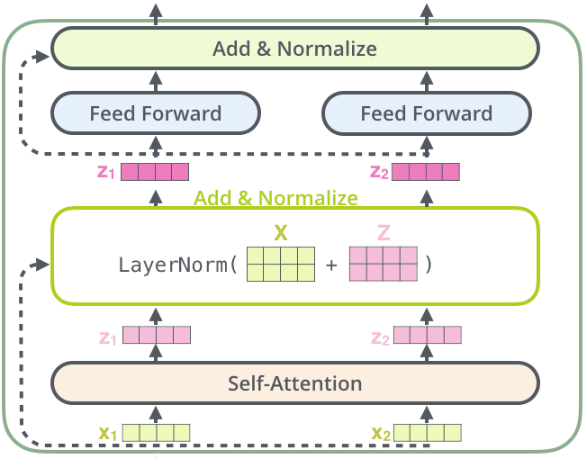

## Table of Contents

## What is a Question Answering Model?

A Question Answering Model is a type of artificial intelligence system that can understand and respond to questions asked in natural language. These models are designed to read a given text or document and then answer questions based on the information they find in that text. For example, if you give the model a passage about animals and ask it a question like "What do lions eat?", the model will search the passage for information about lions' diet and provide an answer.

These models work by using techniques from natural language processing and machine learning. They break down the question and the text into smaller parts, and then use algorithms to find the most relevant information to form an answer. Some models are trained on large datasets to improve their accuracy and ability to handle a wide range of questions. This makes them useful for tasks like customer service, where they can quickly provide answers to common questions, or in educational settings, where they can help students learn by answering their questions on the spot.

## How do Question Answering Models work?

Question Answering Models work by understanding both the question and a related piece of text. When you ask a question, the model breaks it down into smaller parts to understand what you're asking. At the same time, it looks at the given text and tries to find information that matches your question. For example, if you ask about what lions eat, the model will search the text for anything about lions' diet. It uses special algorithms to figure out which parts of the text are most relevant to your question.

Once the model finds the relevant information, it puts together an answer using the text it found. This process involves matching the question's keywords with the text's content and then generating a response that makes sense. The model might be trained on lots of different texts and questions to get better at this. Over time, it learns to give more accurate and helpful answers. This makes it useful for things like helping students with homework or answering customer questions quickly.

## What are the main types of Question Answering Models?

There are mainly two types of Question Answering Models: extractive and abstractive. Extractive models find the answer directly from the given text. They look for the exact words or phrases in the text that answer the question. For example, if you ask what lions eat, an extractive model will search the text and pull out the sentence or phrase that says lions eat meat. This type of model is simpler and works well when the answer is clearly stated in the text.

On the other hand, abstractive models create answers by understanding the text and then generating a new response. They don't just copy parts of the text; instead, they might use different words or even combine information from different parts of the text to answer the question. For example, if you ask about lions' diet, an abstractive model might read about lions eating meat and then say something like "Lions are carnivores and their diet mainly consists of meat." This type of model is more complex and can give more natural-sounding answers, but it's also harder to make sure the answers are always correct.

## What is the difference between extractive and abstractive Question Answering?

Extractive Question Answering models find answers by pulling out exact words or phrases from the given text. They look for the part of the text that directly answers the question. For example, if you ask what lions eat, an extractive model will search the text and might pull out the sentence "Lions eat meat." This method is simpler because it doesn't need to change or combine information; it just needs to find the right part of the text.

Abstractive Question Answering models, on the other hand, understand the text and then create a new answer. They don't just copy parts of the text; instead, they might use different words or combine information from different parts to answer the question. For instance, if you ask about lions' diet, an abstractive model might read about lions eating meat and then say something like "Lions are carnivores and their diet mainly consists of meat." This type of model is more complex because it needs to understand and generate new sentences, which can lead to more natural-sounding answers but also makes it harder to ensure the answers are always correct.

## Can you explain the architecture of a typical Question Answering Model?

A typical Question Answering Model uses a [neural network](/wiki/neural-network) to understand both the question and the text. It starts by turning the words in the question and the text into numbers that the computer can work with. This is called embedding. The model then uses these embeddings to figure out which parts of the text are important for answering the question. It does this by looking at how the words in the question relate to the words in the text. This is often done using a technique called attention, which helps the model focus on the right parts of the text.

Once the model knows which parts of the text to focus on, it can start to build an answer. For extractive models, this means finding the exact words or phrases from the text that answer the question. For abstractive models, the model might use what it learned to create a new sentence that answers the question. Both types of models use layers of neural networks to process the information and come up with the best answer. The model is trained on lots of examples so it can get better at understanding questions and finding or creating answers.

## What datasets are commonly used to train Question Answering Models?

Question Answering Models are often trained on datasets like SQuAD (Stanford Question Answering Dataset), which has questions and answers based on Wikipedia articles. Another common dataset is TriviaQA, which includes trivia questions and answers from the web. These datasets help the models learn how to find and understand information to answer different kinds of questions.

Other popular datasets include CoQA (Conversational Question Answering) and HotpotQA. CoQA is made up of conversations where people ask questions about a text, helping models learn to handle follow-up questions. HotpotQA, on the other hand, requires models to use information from multiple documents to answer questions, making it good for training models to combine information from different sources.

## How does Macaw differ from other Question Answering Models?

Macaw, or the "Multi-task learning for Question Answering" model, is different from other Question Answering Models because it can handle many different types of questions and tasks all at once. Most other models are trained to do one specific thing, like finding answers in a text or creating new answers. But Macaw can do things like answering questions, filling in the blanks, and even understanding if a statement is true or false. This makes Macaw more flexible and useful in many situations.

Another way Macaw stands out is how it was trained. It uses a special method called multi-task learning. This means Macaw learns from lots of different kinds of tasks at the same time, which helps it get better at understanding language and answering questions. Other models might be trained on just one type of task, so they might not be as good at handling different kinds of questions. Macaw's way of learning makes it more adaptable and able to give better answers to a wider range of questions.

## What are the specific applications of TransferQA in the field of Question Answering?

TransferQA is a model designed to improve question answering by using knowledge from one domain to help answer questions in another. This is especially helpful when you have a lot of information in one area, like medical texts, but not much in another area, like rare diseases. By using TransferQA, the model can take what it knows from the medical texts and use it to answer questions about rare diseases more accurately. This makes it a powerful tool for fields where data might be limited but related information is plentiful.

In practical terms, TransferQA can be used in educational settings to help students learn about different subjects. For example, if a student is studying history but the model has more data on literature, TransferQA can use its literature knowledge to help answer history questions better. This can also be useful in customer service, where the model can use information from one product to help answer questions about a similar product with less data available. By transferring knowledge, TransferQA helps make question answering more effective across different domains.

## How does EMQAP improve upon traditional Question Answering techniques?

EMQAP, or Enhanced Multi-task Question Answering with Pre-training, improves on traditional Question Answering techniques by using a special way of learning called multi-task learning. This means EMQAP can work on many different kinds of tasks at the same time, like answering questions, filling in the blanks, and understanding if a statement is true or false. By doing this, EMQAP gets better at understanding language and can give more accurate answers to a wide range of questions. Traditional models might only focus on one task, so they might not be as good at handling different types of questions.

Another way EMQAP improves on traditional methods is through its pre-training process. Before it starts answering questions, EMQAP is trained on a lot of different texts to learn about language. This helps it understand the context and meaning of words better. Traditional models might not have this pre-training step, so they might not be as good at understanding the full meaning of questions and texts. With its multi-task learning and pre-training, EMQAP can give more helpful and accurate answers than traditional Question Answering models.

## What are the current challenges faced by Question Answering Models?

One of the biggest challenges for Question Answering Models is understanding and handling different types of questions. Some questions are simple and can be answered directly from the text, but others might need the model to think and combine information in new ways. For example, if someone asks a model about what lions eat, it's easy if the text says "Lions eat meat." But if the question is more complex, like "How do lions hunt their prey?" the model might struggle to put together the right information to give a full answer. This makes it hard for models to always give accurate and helpful answers to all kinds of questions.

Another challenge is dealing with different languages and contexts. Many Question Answering Models are trained on English texts, so they might not work as well with other languages or with texts that use different styles or slang. This can make it hard for the models to understand questions and texts from different parts of the world. Also, models can sometimes give wrong answers if the text they are reading has mistakes or if the question is not clear. This means that even with a lot of training, Question Answering Models still need to improve to handle all the different ways people ask questions and the many different kinds of texts they might read.

## How can one evaluate the performance of a Question Answering Model?

To evaluate the performance of a Question Answering Model, you can use different ways to check how well it answers questions. One common way is to use a metric called exact match, which sees if the model's answer matches the correct answer exactly. Another metric is F1 score, which looks at how many of the important words in the correct answer are also in the model's answer. These metrics help you see if the model is giving the right answers and how close it is when it doesn't get it exactly right.

Another way to evaluate the model is by using human judges. People can read the model's answers and decide if they are helpful and correct. This can be more accurate than just using numbers because humans can understand if an answer makes sense even if it's not word-for-word perfect. By combining these methods, you can get a good idea of how well the model is doing and where it might need to improve.

## What are the latest advancements in Question Answering research and where is the field heading?

Recent advancements in Question Answering research have focused on improving models' ability to handle complex and multi-step questions. One notable development is the use of large language models like BERT and its successors, which have shown significant improvements in understanding context and generating more accurate answers. These models are pre-trained on vast amounts of text data, allowing them to better comprehend the nuances of language. Another advancement is the integration of multi-modal data, where models can now process not just text but also images and videos to answer questions more effectively. This is particularly useful in fields like healthcare and education, where visual information can be crucial for understanding and answering questions.

The field of Question Answering is heading towards more personalized and interactive systems. Researchers are working on models that can engage in conversational question answering, where the model can ask follow-up questions or clarify ambiguities, making the interaction more natural and helpful. Additionally, there is a growing emphasis on domain-specific QA systems, where models are tailored to particular fields like medicine, law, or engineering, to provide more accurate and relevant answers. The future of QA research is likely to see further improvements in handling multi-lingual and multi-cultural contexts, ensuring that models can serve a global audience effectively.

## References & Further Reading

[1]: Rajpurkar, P., Zhang, J., Lopyrev, K., & Liang, P. (2016). ["SQuAD: 100,000+ Questions for Machine Comprehension of Text."](https://aclanthology.org/D16-1264/) arXiv preprint arXiv:1606.05250.

[2]: Trischler, A., Wang, T., Ge, T., Yu, M., & He, X. (2017). ["NewsQA: A Machine Comprehension Dataset."](https://arxiv.org/abs/1611.09830) arXiv preprint arXiv:1611.09830.

[3]: Kwiatkowski, T., Palomaki, J., Redfield, O., Collins, M., Parikh, A., Alberti, C., ... & Petrov, S. (2019). ["Natural Questions: A Benchmark for Question Answering Research."](https://aclanthology.org/Q19-1026/) Transactions of the Association for Computational Linguistics.

[4]: Yang, Z., Yih, W. T., & Meek, C. (2015). ["WikiQA: A Challenge Dataset for Open-Domain Question Answering."](https://aclanthology.org/D15-1237/) In Proceedings of the 2015 Conference on Empirical Methods in Natural Language Processing.

[5]: Devlin, J., Chang, M. W., Lee, K., & Toutanova, K. (2019). ["BERT: Pre-training of Deep Bidirectional Transformers for Language Understanding."](https://arxiv.org/abs/1810.04805) arXiv preprint arXiv:1810.04805.

[6]: "Natural Language Processing with Transformers" by Lewis Tunstall, Leandro von Werra, and Thomas Wolf (O'Reilly Media, 2022).

[7]: Yatskar, M., & Zettlemoyer, L. (2018). ["MultiQA: An Empirical Investigation of Generalization and Transfer in Question Answering."](https://a11y2.apps.allenai.org/paper?id=636904d91d9dd1a641a595d9578ba7640f35aa74) Transactions of the Association for Computational Linguistics.

[8]: Ruder, S. (2019). ["Neural Transfer Learning for Natural Language Processing."](https://researchrepository.universityofgalway.ie/bitstream/handle/10379/15463/neural_transfer_learning_for_nlp.pdf) PhD Thesis, National University of Ireland.