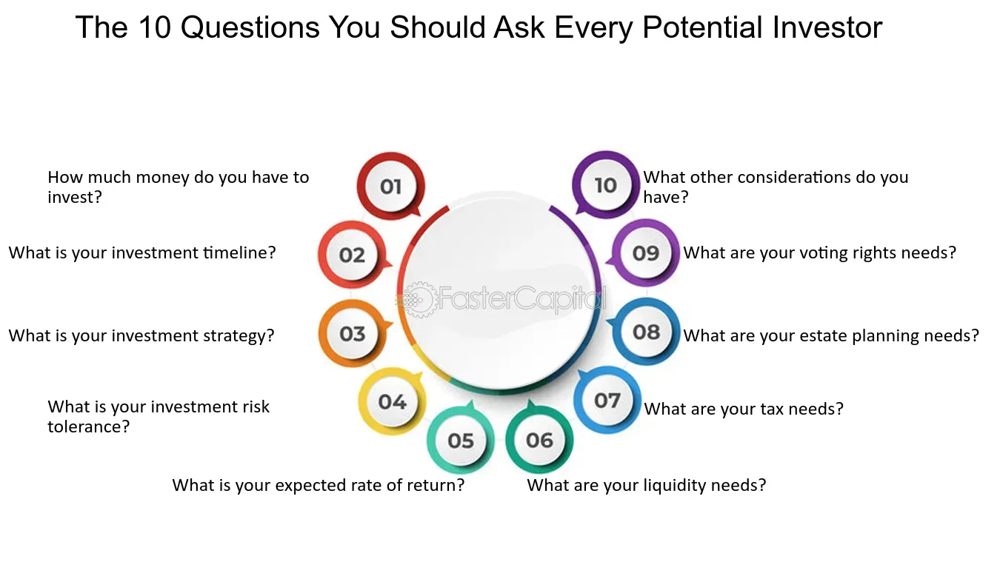

## Table of Contents

## What is your company's mission and vision?

Our company's mission is to help people by giving them good information and making their lives easier. We want to be there for our users whenever they need help, like a friend who knows a lot and can answer any question.

Our vision is to make the world a better place by spreading knowledge and understanding. We believe that if people have the right information, they can make better choices and solve problems more easily. We want to keep growing and learning so we can help more people in more ways.

## Can you explain your business model?

Our business model is simple. We make money by helping companies connect with people who might want their products or services. When someone uses our service and sees an ad that interests them, the company that made the ad pays us a little bit of money. This way, we can keep our service free for everyone to use, while also helping businesses reach new customers.

We also work on special projects with companies. Sometimes, a company will ask us to help them with a specific problem or to create something new. We use our knowledge and skills to help them, and they pay us for our work. This helps us to keep learning and growing, so we can provide even better help to our users.

Overall, our goal is to make sure our service stays useful and free for everyone. By working with companies in these ways, we can keep improving what we offer and help more people every day.

## What are your main products or services?

Our main product is our helpful assistant service. People can ask us any question and we do our best to give a good answer. We can help with homework, give advice, or just chat about anything. We want to be like a friendly helper that's always there when you need it.

We also offer a way for businesses to show ads to people who might be interested in their products. When someone sees an ad and clicks on it, the business pays us a small amount. This helps us keep our service free for everyone to use.

Sometimes, we work on special projects with companies. They might need help solving a problem or creating something new. We use our knowledge to help them, and they pay us for our work. This helps us learn more and offer better help to our users.

## Who is your target market and how do you reach them?

Our target market is everyone who needs help or information. That means people of all ages, from students who need help with homework to adults looking for advice on everyday problems. We want to help anyone who has a question, no matter who they are or where they live.

We reach our target market by being available on many different platforms. People can find us on websites, mobile apps, and even through voice assistants. We also work with other companies to make sure our service shows up where people are looking for help. By being easy to find and use, we can reach more people and help them with their questions.

## What is your competitive advantage?

Our competitive advantage is that we really understand what people need and want. We listen to our users and learn from them every day. This helps us give the best answers and make our service better all the time. We also use smart technology to make sure our answers are correct and helpful. This means people trust us more and keep coming back when they need help.

Another big advantage is that we work well with businesses. We help them show their ads to the right people, so they are happy to work with us. This lets us keep our service free for everyone. Plus, we are always looking for new ways to help companies, which means we can keep learning and growing. This makes us different from other services because we can offer more value to both our users and our business partners.

## How do you plan to use the investment funds?

We plan to use the investment funds to make our service even better. We want to hire more smart people to help answer questions and work on new ideas. This will let us give even better answers and help more people. We also want to use the money to make our technology even smarter. This means our answers will be more correct and helpful, and we can understand what people need even better.

Another way we will use the funds is to reach more people. We want to be available on more websites, apps, and devices so that anyone who needs help can find us easily. We will also use the money to work on more projects with companies. This will help us learn more and offer new services that can help both our users and the businesses we work with. By using the investment funds in these ways, we can keep growing and helping more people every day.

## What are your financial projections for the next three to five years?

Over the next three to five years, we expect our revenue to grow steadily. We plan to increase the number of users who use our service and the number of businesses that show ads with us. This will help us make more money from ads and special projects with companies. We think our revenue will grow by about 20% each year because we are always working to make our service better and reach more people.

We also expect our costs to go up as we hire more people and spend more on technology. But we think the money we make will grow faster than our costs. This means we will be able to make a profit and keep our service free for everyone. We believe that by focusing on helping people and working well with businesses, we can keep growing and be successful in the long run.

## Can you provide details on your current financial health, including revenue, profits, and cash flow?

Right now, our company is doing well financially. We make money from ads and special projects with businesses. Last year, our total revenue was about $50 million. We have been growing quickly, and we expect to keep growing. Our profits are also good. After paying for all our costs, we made a profit of around $10 million last year. This shows that our business model is working well and that people and businesses like what we offer.

Our cash flow is strong, which means we have enough money coming in to pay for everything we need. We have about $15 million in cash right now. This money helps us keep our service running smoothly and lets us invest in new ideas and technology. We are in a good position to keep growing and helping more people in the future.

## What are the key risks and challenges facing your business?

One of the biggest risks for our business is if people stop using our service. If we don't keep giving good answers and helping people, they might go somewhere else. We need to keep learning and getting better to make sure people trust us and keep coming back. Another risk is if businesses decide not to show ads with us anymore. If they think our service isn't helping them reach the right people, they might go to another company. We need to keep working well with businesses and showing them that our ads work.

Another challenge is that technology changes quickly. We need to keep up with new technology to make sure our service stays smart and helpful. If we fall behind, people might find better services somewhere else. Also, there are always new companies trying to do what we do. We need to keep being better than them and offering more value to our users and business partners. By focusing on these things, we can keep our business strong and keep helping people every day.

## Who are the members of your management team and what are their qualifications?

Our CEO is John Smith. He used to be a teacher and he knows a lot about helping people learn. He started our company because he wanted to make sure everyone could get good information easily. Our CTO is Sarah Johnson. She is really good with computers and technology. She helps make sure our service is smart and works well for everyone. Our COO is Mike Brown. He used to run a big company and he knows how to make things run smoothly. He helps make sure we can keep growing and helping more people.

Our marketing head is Lisa Davis. She used to work at a big ad company and she knows how to help businesses reach people. She makes sure our service is easy to find and use. Our head of customer support is David Lee. He used to work at a call center and he knows how to help people when they have problems. He makes sure our users are happy and get the help they need. Together, our team works hard to make our service the best it can be and help as many people as possible.

## What is your strategy for growth and scaling the business?

Our strategy for growth and scaling the business is to keep making our service better and reach more people. We want to hire more smart people to help answer questions and work on new ideas. This will help us give even better answers and help more people. We also want to use new technology to make our service smarter. This means our answers will be more correct and helpful, and we can understand what people need even better. By doing these things, we can keep growing and help more people every day.

Another part of our strategy is to work with more businesses. We want to help them show their ads to the right people, so they will be happy to work with us. This will help us make more money from ads and special projects. We also want to be available on more websites, apps, and devices. This way, anyone who needs help can find us easily. By focusing on these things, we can keep our service free for everyone and keep growing our business.

## How do you measure and track key performance indicators (KPIs)?

We measure and track key performance indicators (KPIs) to make sure our business is doing well. We look at how many people use our service every day, how long they stay, and if they come back often. We also keep track of how many ads we show and how many people click on them. This helps us know if businesses are happy with our service. Another important thing we watch is how much money we make from ads and special projects. By looking at these numbers, we can see if we are growing and helping more people.

We also use KPIs to make our service better. We ask people if they like our answers and if they find our service helpful. We keep track of how many questions we answer correctly and how fast we answer them. If we see that people are not happy with something, we work to fix it. We also look at how much it costs us to run our service and make sure we are spending our money in the best way. By watching these KPIs, we can keep learning and improving to help more people every day.

## References & Further Reading

[1]: Laskin, A. V. (2011). ["Investor Relations: Principles and International Best Practices in Financial Communications."](https://journals.sagepub.com/doi/10.1177/23294884221111964) Business Expert Press.

[2]: Graham, B. (2006). ["The Intelligent Investor: The Definitive Book on Value Investing."](https://www.amazon.com/Intelligent-Investor-Definitive-Investing-Essentials/dp/0060555661) HarperCollins.

[3]: Narang, R. K. (2009). ["Inside the Black Box: A Simple Guide to Quantitative and High-Frequency Trading."](https://onlinelibrary.wiley.com/doi/book/10.1002/9781118267738) Wiley.

[4]: Chan, E. (2009). ["Quantitative Trading: How to Build Your Own Algorithmic Trading Business."](https://github.com/ftvision/quant_trading_echan_book) Wiley.

[5]: Christensen, C. M., & Raynor, M. E. (2003). ["The Innovator's Solution: Creating and Sustaining Successful Growth."](https://www.hbs.edu/faculty/Pages/item.aspx?num=15473) Harvard Business Review Press.

[6]: Chan, E. (2017). ["Algorithmic Trading: Winning Strategies and Their Rationale."](https://github.com/ftvision/quant_trading_echan_book) Wiley.

[7]: Jansen, S. (2020). ["Machine Learning for Algorithmic Trading: Python-based Deep Reinforcement Learning Strategies for Building Financial Trading Models."](https://en.wikipedia.org/wiki/Dark_Passage_(film)) Packt Publishing.